<!-- markdownlint-disable-file -->
# Task Checklist: TeamBot Implementation

## Overview

Implement TeamBot, a CLI wrapper for GitHub Copilot CLI that enables autonomous, collaborative AI agent teams for software development through multi-agent orchestration, cross-platform window management, and history-based context sharing.

## Objectives

* Implement parent orchestrator with Python multiprocessing queues for agent coordination
* Create cross-platform window spawning module (Windows/Linux/macOS)
* Build history file management with YAML frontmatter parsing and context compaction
* Implement console visualization with Rich library for colored progress tracking
* Create JSON configuration system for agent personas and workflows
* Integrate test framework and achieve 80% coverage target

## Research Summary

### Project Files
* `src/app.py` - Current entrypoint (to be extended)
* `src/load_env.py` - Environment loading utility
* `pyproject.toml` - Project configuration, Python ≥3.10, ruff linting, uv package manager

### External References
* `.agent-tracking/research/20260122-teambot-research.md` - Comprehensive technical research
* `.agent-tracking/test-strategies/20260122-teambot-test-strategy.md` - Test approach per component
* `docs/feature-specs/teambot.md` - Feature specification with 23 functional requirements

### Standards References
* `AGENTS.md` - Project conventions (pytest, uv run, code-first with TDD where appropriate)
* `pyproject.toml` - Linting standards (ruff, line-length 100)

## Task Dependency Graph

```mermaid
graph TD
    subgraph Phase1[Phase 1: Project Setup]
        T1.1[Task 1.1: Update pyproject.toml]
        T1.2[Task 1.2: Create package structure]
        T1.3[Task 1.3: Setup test infrastructure]
    end
    
    subgraph Phase2[Phase 2: Core Messaging - TDD]
        T2.1[Task 2.1: Message protocol tests]
        T2.2[Task 2.2: Message protocol impl]
        T2.3[Task 2.3: Router tests]
        T2.4[Task 2.4: Router impl]
    end
    
    subgraph Phase3[Phase 3: Orchestrator - TDD]
        T3.1[Task 3.1: Orchestrator tests]
        T3.2[Task 3.2: Orchestrator impl]
    end
    
    subgraph Phase4[Phase 4: History Management - TDD]
        T4.1[Task 4.1: Frontmatter tests]
        T4.2[Task 4.2: Frontmatter impl]
        T4.3[Task 4.3: History manager tests]
        T4.4[Task 4.4: History manager impl]
        T4.5[Task 4.5: Compactor tests]
        T4.6[Task 4.6: Compactor impl]
    end
    
    subgraph Phase5[Phase 5: Configuration - TDD]
        T5.1[Task 5.1: Config loader tests]
        T5.2[Task 5.2: Config loader impl]
        T5.3[Task 5.3: JSON schema]
    end
    
    subgraph Phase6[Phase 6: Window Manager - Code-First]
        T6.1[Task 6.1: Window manager impl]
        T6.2[Task 6.2: Window manager tests]
    end
    
    subgraph Phase7[Phase 7: Visualization - Code-First]
        T7.1[Task 7.1: Console visualization impl]
        T7.2[Task 7.2: Console visualization tests]
    end
    
    subgraph Phase8[Phase 8: Agent Runner - Code-First]
        T8.1[Task 8.1: Agent runner impl]
        T8.2[Task 8.2: Agent runner tests]
    end
    
    subgraph Phase9[Phase 9: CLI Entry Point]
        T9.1[Task 9.1: CLI implementation]
        T9.2[Task 9.2: End-to-end tests]
    end
    
    subgraph Phase10[Phase 10: Integration & Coverage]
        T10.1[Task 10.1: Integration tests]
        T10.2[Task 10.2: Coverage validation]
    end
    
    T1.1 --> T1.2
    T1.2 --> T1.3
    T1.3 --> T2.1
    
    T2.1 --> T2.2
    T2.2 --> T2.3
    T2.3 --> T2.4
    T2.4 --> T3.1
    
    T3.1 --> T3.2
    T3.2 --> T4.1
    
    T4.1 --> T4.2
    T4.2 --> T4.3
    T4.3 --> T4.4
    T4.4 --> T4.5
    T4.5 --> T4.6
    T4.6 --> T5.1
    
    T5.1 --> T5.2
    T5.2 --> T5.3
    T5.3 --> T6.1
    
    T6.1 --> T6.2
    T6.2 --> T7.1
    
    T7.1 --> T7.2
    T7.2 --> T8.1
    
    T8.1 --> T8.2
    T8.2 --> T9.1
    
    T9.1 --> T9.2
    T9.2 --> T10.1
    
    T10.1 --> T10.2
    
    %% Critical Path highlighted
    style T1.1 fill:#ff9999
    style T2.1 fill:#ff9999
    style T3.1 fill:#ff9999
    style T6.1 fill:#ff9999
    style T9.1 fill:#ff9999
```

**Critical Path**: T1.1 → T1.2 → T1.3 → T2.1 → T2.2 → T3.1 → T3.2 → T6.1 → T9.1 → T10.2
**Estimated Total Effort**: 16-24 hours
**Parallel Opportunities**: Phase 4 (History) and Phase 5 (Config) can run in parallel after Phase 3

## Implementation Checklist

### [ ] Phase 1: Project Setup

**Phase Objective**: Establish project structure, dependencies, and test infrastructure

#### Phase Gate: Phase 1 Complete When
- [ ] All Phase 1 tasks marked complete
- [ ] `uv sync` runs successfully
- [ ] `uv run pytest` runs (even with 0 tests)
- [ ] Package imports work: `from teambot import __version__`

**Cannot Proceed If**: Dependencies fail to install or package structure is invalid

* [ ] Task 1.1: Update pyproject.toml with dependencies
  * Details: .agent-tracking/details/20260122-teambot-details.md (Lines 15-45)
  * Dependencies: None
  * Priority: CRITICAL
  * Effort: 15 min

* [ ] Task 1.2: Create TeamBot package structure
  * Details: .agent-tracking/details/20260122-teambot-details.md (Lines 47-95)
  * Dependencies: Task 1.1
  * Priority: CRITICAL
  * Effort: 20 min

* [ ] Task 1.3: Setup test infrastructure
  * Details: .agent-tracking/details/20260122-teambot-details.md (Lines 97-140)
  * Dependencies: Task 1.2
  * Priority: CRITICAL
  * Effort: 15 min

---

### [ ] Phase 2: Core Messaging (TDD)

**Phase Objective**: Implement message protocol and routing with tests first

**Test Strategy**: TDD - Write tests BEFORE implementation
**Coverage Target**: 95% for protocol, 85% for router

#### Phase Gate: Phase 2 Complete When
- [ ] All Phase 2 tasks marked complete
- [ ] `uv run pytest tests/test_messaging/` passes
- [ ] Coverage: messaging/ ≥ 90%

* [ ] Task 2.1: Write message protocol tests
  * Details: .agent-tracking/details/20260122-teambot-details.md (Lines 145-190)
  * Test Approach: TDD (tests first)
  * Dependencies: Phase 1
  * Priority: CRITICAL
  * Effort: 30 min

* [ ] Task 2.2: Implement message protocol
  * Details: .agent-tracking/details/20260122-teambot-details.md (Lines 192-240)
  * Dependencies: Task 2.1 (tests must exist)
  * Priority: CRITICAL
  * Effort: 30 min

* [ ] Task 2.3: Write message router tests
  * Details: .agent-tracking/details/20260122-teambot-details.md (Lines 242-285)
  * Test Approach: TDD (tests first)
  * Dependencies: Task 2.2
  * Priority: HIGH
  * Effort: 25 min

* [ ] Task 2.4: Implement message router
  * Details: .agent-tracking/details/20260122-teambot-details.md (Lines 287-330)
  * Dependencies: Task 2.3 (tests must exist)
  * Priority: HIGH
  * Effort: 25 min

---

### [ ] Phase 3: Orchestrator (TDD)

**Phase Objective**: Implement parent orchestrator for agent management

**Test Strategy**: TDD - Write tests BEFORE implementation
**Coverage Target**: 90%

#### Phase Gate: Phase 3 Complete When
- [ ] All Phase 3 tasks marked complete
- [ ] `uv run pytest tests/test_orchestrator.py` passes
- [ ] Coverage: orchestrator.py ≥ 90%

* [ ] Task 3.1: Write orchestrator tests
  * Details: .agent-tracking/details/20260122-teambot-details.md (Lines 335-400)
  * Test Approach: TDD (tests first)
  * Coverage Target: 90%
  * Dependencies: Phase 2
  * Priority: CRITICAL
  * Effort: 45 min

* [ ] Task 3.2: Implement orchestrator
  * Details: .agent-tracking/details/20260122-teambot-details.md (Lines 402-480)
  * Dependencies: Task 3.1 (tests must exist)
  * Priority: CRITICAL
  * Effort: 60 min

---

### [ ] Phase 4: History Management (TDD)

**Phase Objective**: Implement history file management with frontmatter parsing

**Test Strategy**: TDD - Write tests BEFORE implementation
**Coverage Target**: 90% for manager, 95% for frontmatter

#### Phase Gate: Phase 4 Complete When
- [ ] All Phase 4 tasks marked complete
- [ ] `uv run pytest tests/test_history/` passes
- [ ] Coverage: history/ ≥ 90%

* [ ] Task 4.1: Write frontmatter parsing tests
  * Details: .agent-tracking/details/20260122-teambot-details.md (Lines 485-530)
  * Test Approach: TDD (tests first)
  * Dependencies: Phase 1
  * Priority: HIGH
  * Effort: 25 min

* [ ] Task 4.2: Implement frontmatter parsing
  * Details: .agent-tracking/details/20260122-teambot-details.md (Lines 532-580)
  * Dependencies: Task 4.1 (tests must exist)
  * Priority: HIGH
  * Effort: 30 min

* [ ] Task 4.3: Write history manager tests
  * Details: .agent-tracking/details/20260122-teambot-details.md (Lines 582-640)
  * Test Approach: TDD (tests first)
  * Dependencies: Task 4.2
  * Priority: HIGH
  * Effort: 30 min

* [ ] Task 4.4: Implement history manager
  * Details: .agent-tracking/details/20260122-teambot-details.md (Lines 642-710)
  * Dependencies: Task 4.3 (tests must exist)
  * Priority: HIGH
  * Effort: 40 min

* [ ] Task 4.5: Write context compactor tests
  * Details: .agent-tracking/details/20260122-teambot-details.md (Lines 712-760)
  * Test Approach: TDD (tests first)
  * Dependencies: Task 4.4
  * Priority: HIGH
  * Effort: 25 min

* [ ] Task 4.6: Implement context compactor
  * Details: .agent-tracking/details/20260122-teambot-details.md (Lines 762-820)
  * Dependencies: Task 4.5 (tests must exist)
  * Priority: HIGH
  * Effort: 35 min

---

### [ ] Phase 5: Configuration System (TDD)

**Phase Objective**: Implement JSON configuration loading and validation

**Test Strategy**: TDD - Write tests BEFORE implementation
**Coverage Target**: 85%

#### Phase Gate: Phase 5 Complete When
- [ ] All Phase 5 tasks marked complete
- [ ] `uv run pytest tests/test_config/` passes
- [ ] Coverage: config/ ≥ 85%

* [ ] Task 5.1: Write config loader tests
  * Details: .agent-tracking/details/20260122-teambot-details.md (Lines 825-870)
  * Test Approach: TDD (tests first)
  * Dependencies: Phase 1
  * Priority: HIGH
  * Effort: 25 min

* [ ] Task 5.2: Implement config loader
  * Details: .agent-tracking/details/20260122-teambot-details.md (Lines 872-930)
  * Dependencies: Task 5.1 (tests must exist)
  * Priority: HIGH
  * Effort: 35 min

* [ ] Task 5.3: Create JSON schema and default config
  * Details: .agent-tracking/details/20260122-teambot-details.md (Lines 932-1000)
  * Dependencies: Task 5.2
  * Priority: MEDIUM
  * Effort: 20 min

---

### [ ] Phase 6: Window Manager (Code-First)

**Phase Objective**: Implement cross-platform window spawning

**Test Strategy**: Code-First - Implement then test
**Coverage Target**: 70%

#### Phase Gate: Phase 6 Complete When
- [ ] All Phase 6 tasks marked complete
- [ ] Manual verification on current OS works
- [ ] `uv run pytest tests/test_window_manager.py` passes
- [ ] Coverage: window_manager.py ≥ 70%

* [ ] Task 6.1: Implement window manager
  * Details: .agent-tracking/details/20260122-teambot-details.md (Lines 1005-1080)
  * Test Approach: Code-First (implement then test)
  * Dependencies: Phase 3
  * Priority: HIGH
  * Effort: 45 min

* [ ] Task 6.2: Add window manager tests
  * Details: .agent-tracking/details/20260122-teambot-details.md (Lines 1082-1130)
  * Coverage Target: 70%
  * Dependencies: Task 6.1
  * Priority: HIGH
  * Effort: 30 min

---

### [ ] Phase 7: Console Visualization (Code-First)

**Phase Objective**: Implement Rich-based console output with colors and progress

**Test Strategy**: Code-First - Implement then test
**Coverage Target**: 60%

#### Phase Gate: Phase 7 Complete When
- [ ] All Phase 7 tasks marked complete
- [ ] Visual verification of console output works
- [ ] `uv run pytest tests/test_visualization/` passes

* [ ] Task 7.1: Implement console visualization
  * Details: .agent-tracking/details/20260122-teambot-details.md (Lines 1135-1200)
  * Test Approach: Code-First (implement then test)
  * Dependencies: Phase 1
  * Priority: MEDIUM
  * Effort: 40 min

* [ ] Task 7.2: Add visualization tests
  * Details: .agent-tracking/details/20260122-teambot-details.md (Lines 1202-1245)
  * Coverage Target: 60%
  * Dependencies: Task 7.1
  * Priority: MEDIUM
  * Effort: 25 min

---

### [ ] Phase 8: Agent Runner (Code-First)

**Phase Objective**: Implement agent process entry point with Copilot CLI integration

**Test Strategy**: Code-First - Implement then test
**Coverage Target**: 70%

#### Phase Gate: Phase 8 Complete When
- [ ] All Phase 8 tasks marked complete
- [ ] Agent can receive and process messages
- [ ] `uv run pytest tests/test_agent_runner.py` passes

* [ ] Task 8.1: Implement agent runner
  * Details: .agent-tracking/details/20260122-teambot-details.md (Lines 1250-1330)
  * Test Approach: Code-First (implement then test)
  * Dependencies: Phase 3, Phase 4
  * Priority: HIGH
  * Effort: 50 min

* [ ] Task 8.2: Add agent runner tests
  * Details: .agent-tracking/details/20260122-teambot-details.md (Lines 1332-1380)
  * Coverage Target: 70%
  * Dependencies: Task 8.1
  * Priority: HIGH
  * Effort: 30 min

---

### [ ] Phase 9: CLI Entry Point

**Phase Objective**: Create main CLI interface and end-to-end workflow

**Test Strategy**: Code-First
**Coverage Target**: 75%

#### Phase Gate: Phase 9 Complete When
- [ ] All Phase 9 tasks marked complete
- [ ] `uv run teambot --help` works
- [ ] Basic workflow executes without errors

* [ ] Task 9.1: Implement CLI entry point
  * Details: .agent-tracking/details/20260122-teambot-details.md (Lines 1385-1450)
  * Dependencies: All previous phases
  * Priority: CRITICAL
  * Effort: 40 min

* [ ] Task 9.2: Add end-to-end tests
  * Details: .agent-tracking/details/20260122-teambot-details.md (Lines 1452-1500)
  * Dependencies: Task 9.1
  * Priority: HIGH
  * Effort: 35 min

---

### [ ] Phase 10: Integration & Coverage Validation

**Phase Objective**: Ensure all components work together and coverage targets met

#### Phase Gate: Phase 10 Complete When
- [ ] All Phase 10 tasks marked complete
- [ ] All tests pass: `uv run pytest`
- [ ] Coverage ≥ 80% overall
- [ ] No ruff linting errors

* [ ] Task 10.1: Integration tests
  * Details: .agent-tracking/details/20260122-teambot-details.md (Lines 1505-1560)
  * Dependencies: Phase 9
  * Priority: HIGH
  * Effort: 45 min

* [ ] Task 10.2: Coverage validation and gap filling
  * Details: .agent-tracking/details/20260122-teambot-details.md (Lines 1562-1600)
  * Success: Coverage ≥ 80%, all tests pass
  * Dependencies: Task 10.1
  * Priority: CRITICAL
  * Effort: 30 min

---

## Effort Summary

| Phase | Tasks | Estimated Effort | Approach |
|-------|-------|-----------------|----------|
| Phase 1: Setup | 3 | 50 min | N/A |
| Phase 2: Messaging | 4 | 110 min | TDD |
| Phase 3: Orchestrator | 2 | 105 min | TDD |
| Phase 4: History | 6 | 185 min | TDD |
| Phase 5: Configuration | 3 | 80 min | TDD |
| Phase 6: Window Manager | 2 | 75 min | Code-First |
| Phase 7: Visualization | 2 | 65 min | Code-First |
| Phase 8: Agent Runner | 2 | 80 min | Code-First |
| Phase 9: CLI | 2 | 75 min | Code-First |
| Phase 10: Integration | 2 | 75 min | N/A |
| **TOTAL** | **28** | **~15 hours** | **Hybrid** |

## Dependencies

* Python 3.10+ (per pyproject.toml)
* uv package manager (installed)
* pytest 7.4.0+
* pytest-cov 4.1.0+
* pytest-mock 3.12.0+
* python-frontmatter 1.0.0+
* rich 13.0.0+

## Success Criteria

* All 28 tasks completed and checked off
* All tests pass: `uv run pytest`
* Coverage ≥ 80% overall
* No ruff linting errors: `uv run ruff check .`
* CLI works: `uv run teambot --help`
* Agent spawning works on current OS
* History files created with valid frontmatter
* Console visualization displays colored output
