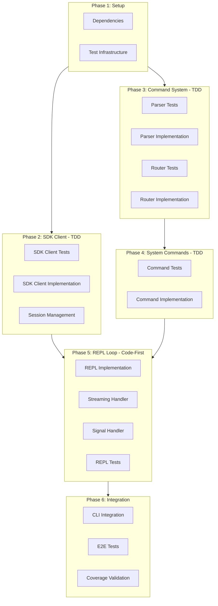

# Implementation Plan: Interactive Mode (MVP)

## Overview

| Metric | Value |
|--------|-------|
| Total Phases | 6 |
| Total Tasks | 18 |
| Estimated Effort | 10-12 hours |
| Test Strategy | Hybrid (TDD + Code-First) |
| Target Coverage | 80% |

---

## Phase Dependency Graph



---

## Phase 1: Project Setup

**Objective:** Add dependencies and test infrastructure for async testing

**Test Strategy:** N/A (Setup)

### Tasks

#### [ ] Task 1.1: Add SDK and Test Dependencies
- **File:** `pyproject.toml`
- **Changes:**
  - Add `github-copilot-sdk>=0.1.0` to dependencies
  - Add `pytest-asyncio>=0.23.0` to dev dependencies
- **Verification:** `uv sync` completes successfully
- **Effort:** 10 min

#### [ ] Task 1.2: Configure Async Test Infrastructure
- **File:** `pyproject.toml`, `tests/conftest.py`
- **Changes:**
  - Add `asyncio_mode = "auto"` to pytest config
  - Add async fixtures for SDK mocking
- **Verification:** `uv run pytest` runs without warnings
- **Effort:** 15 min

---

## Phase 2: Copilot SDK Client (TDD)

**Objective:** Create SDK-based client wrapper with session management

**Test Strategy:** TDD - Write tests first

**Coverage Target:** 90%

### Tasks

#### [ ] Task 2.1: Write SDK Client Tests
- **File:** `tests/test_copilot/test_sdk_client.py`
- **Test Cases:**
  - `test_client_start_calls_sdk_start`
  - `test_client_stop_calls_sdk_stop`
  - `test_create_session_for_agent`
  - `test_session_reuse_same_agent`
  - `test_execute_sends_prompt`
  - `test_execute_returns_response`
  - `test_stop_destroys_all_sessions`
  - `test_client_not_started_raises`
- **Verification:** Tests fail (no implementation)
- **Effort:** 30 min

#### [ ] Task 2.2: Implement SDK Client
- **File:** `src/teambot/copilot/sdk_client.py`
- **Classes:**
  - `CopilotSDKClient` - Main wrapper class
- **Methods:**
  - `async start()` - Start SDK client
  - `async stop()` - Stop and cleanup
  - `async get_or_create_session(agent_id)` - Session management
  - `async execute(agent_id, prompt)` - Execute task
- **Verification:** All Task 2.1 tests pass
- **Effort:** 45 min

#### [ ] Task 2.3: Add Session Persistence Support
- **File:** `src/teambot/copilot/sdk_client.py`
- **Changes:**
  - Use custom session IDs (`teambot-{agent_id}`)
  - Add `resume_session()` method
  - Add `list_sessions()` method
- **Tests:** Add to `test_sdk_client.py`
- **Verification:** Session persistence tests pass
- **Effort:** 20 min

---

## Phase 3: Command Parsing System (TDD)

**Objective:** Parse user input into agent and system commands

**Test Strategy:** TDD - Write tests first

**Coverage Target:** 95%

### Tasks

#### [ ] Task 3.1: Write Command Parser Tests
- **File:** `tests/test_repl/test_parser.py`
- **Test Cases:**
  - `test_parse_agent_command`
  - `test_parse_agent_command_with_dashes`
  - `test_parse_system_command`
  - `test_parse_system_command_with_args`
  - `test_parse_empty_input`
  - `test_parse_whitespace_only`
  - `test_parse_unknown_command`
  - `test_parse_at_symbol_only`
  - `test_parse_slash_only`
- **Verification:** Tests fail (no implementation)
- **Effort:** 20 min

#### [ ] Task 3.2: Implement Command Parser
- **File:** `src/teambot/repl/parser.py`
- **Functions:**
  - `parse(input: str) -> ParsedCommand`
- **Dataclass:**
  - `ParsedCommand(type, target, content)`
- **Verification:** All Task 3.1 tests pass
- **Effort:** 25 min

#### [ ] Task 3.3: Write Agent Router Tests
- **File:** `tests/test_repl/test_router.py`
- **Test Cases:**
  - `test_is_valid_agent_known`
  - `test_is_valid_agent_unknown`
  - `test_get_persona_for_agent`
  - `test_get_display_name_for_agent`
  - `test_route_to_agent_executes`
  - `test_route_to_invalid_agent_raises`
- **Verification:** Tests fail (no implementation)
- **Effort:** 20 min

#### [ ] Task 3.4: Implement Agent Router
- **File:** `src/teambot/repl/router.py`
- **Classes:**
  - `AgentRouter` - Routes commands to agents
- **Methods:**
  - `is_valid_agent(agent_id)` - Validate agent ID
  - `get_persona(agent_id)` - Get agent persona
  - `async route(agent_id, task)` - Execute task on agent
- **Verification:** All Task 3.3 tests pass
- **Effort:** 25 min

---

## Phase 4: System Commands (TDD)

**Objective:** Implement /help, /status, /history, /quit commands

**Test Strategy:** TDD - Write tests first

**Coverage Target:** 90%

### Tasks

#### [ ] Task 4.1: Write System Command Tests
- **File:** `tests/test_repl/test_commands.py`
- **Test Cases:**
  - `test_help_returns_command_list`
  - `test_help_includes_agent_syntax`
  - `test_status_shows_agent_table`
  - `test_history_lists_all_files`
  - `test_history_filters_by_agent`
  - `test_history_empty_returns_message`
  - `test_quit_returns_exit_signal`
  - `test_unknown_command_returns_error`
- **Verification:** Tests fail (no implementation)
- **Effort:** 25 min

#### [ ] Task 4.2: Implement System Commands
- **File:** `src/teambot/repl/commands.py`
- **Functions:**
  - `cmd_help() -> str`
  - `cmd_status(display) -> None`
  - `cmd_history(agent_id, history_manager) -> list`
  - `cmd_quit() -> CommandResult`
- **Dataclass:**
  - `CommandResult(output, should_exit)`
- **Verification:** All Task 4.1 tests pass
- **Effort:** 35 min

---

## Phase 5: REPL Loop (Code-First)

**Objective:** Interactive command loop with streaming output

**Test Strategy:** Code-First - Implement then test

**Coverage Target:** 75%

### Tasks

#### [ ] Task 5.1: Implement REPL Loop
- **File:** `src/teambot/repl/loop.py`
- **Functions:**
  - `async repl_loop(client, display, config)` - Main loop
  - `async handle_input(input, client, display)` - Dispatch input
- **Features:**
  - Async input handling
  - Command dispatch to parser
  - Agent command execution
  - System command execution
  - Error handling
- **Verification:** Manual testing works
- **Effort:** 45 min

#### [ ] Task 5.2: Implement Streaming Handler
- **File:** `src/teambot/repl/streaming.py`
- **Classes:**
  - `StreamingHandler` - Handles SDK events
- **Methods:**
  - `handle(event)` - Process event
  - `setup(session)` - Attach to session
- **Events Handled:**
  - `ASSISTANT_MESSAGE_DELTA` - Print chunk
  - `SESSION_IDLE` - Print newline
- **Verification:** Streaming output visible
- **Effort:** 25 min

#### [ ] Task 5.3: Implement Signal Handler
- **File:** `src/teambot/repl/signals.py`
- **Functions:**
  - `setup_signal_handlers(cleanup_fn)` - Register handlers
- **Signals:**
  - `SIGINT` (Ctrl+C) - Graceful exit
  - `SIGTERM` - Graceful exit
- **Verification:** Ctrl+C exits cleanly
- **Effort:** 15 min

#### [ ] Task 5.4: Write REPL Tests
- **File:** `tests/test_repl/test_loop.py`
- **Test Cases:**
  - `test_repl_processes_agent_command`
  - `test_repl_processes_system_command`
  - `test_repl_handles_quit`
  - `test_repl_handles_eof`
  - `test_repl_handles_invalid_command`
  - `test_repl_shows_prompt`
- **Verification:** Tests pass
- **Effort:** 30 min

---

## Phase 6: CLI Integration

**Objective:** Connect REPL to CLI and validate end-to-end

**Test Strategy:** Integration testing

**Coverage Target:** 80% overall

### Tasks

#### [ ] Task 6.1: Integrate REPL with CLI
- **File:** `src/teambot/cli.py`
- **Changes:**
  - Update `cmd_run()` to call `async_run()`
  - Add `async_run()` function
  - Initialize SDK client
  - Load objective if provided
  - Enter REPL loop
  - Handle graceful shutdown
- **Verification:** `teambot run` enters interactive mode
- **Effort:** 30 min

#### [ ] Task 6.2: Write End-to-End Tests
- **File:** `tests/integration/test_interactive_e2e.py`
- **Test Cases:**
  - `test_interactive_mode_starts`
  - `test_agent_command_executes`
  - `test_system_commands_work`
  - `test_quit_exits_cleanly`
  - `test_objective_file_loads`
- **Verification:** E2E tests pass
- **Effort:** 30 min

#### [ ] Task 6.3: Coverage Validation
- **Command:** `uv run pytest --cov=src/teambot --cov-report=term-missing`
- **Targets:**
  - Overall: ≥80%
  - SDK Client: ≥90%
  - Parser: ≥95%
  - Router: ≥90%
  - Commands: ≥90%
  - REPL: ≥75%
- **Verification:** Coverage report meets targets
- **Effort:** 15 min

---

## File Structure (New Files)

```
src/teambot/
├── copilot/
│   ├── __init__.py          # Update exports
│   ├── client.py            # Existing (keep as fallback)
│   └── sdk_client.py        # NEW - SDK wrapper
└── repl/
    ├── __init__.py          # NEW - Package init
    ├── parser.py            # NEW - Command parsing
    ├── router.py            # NEW - Agent routing
    ├── commands.py          # NEW - System commands
    ├── loop.py              # NEW - REPL loop
    ├── streaming.py         # NEW - Event handling
    └── signals.py           # NEW - Signal handling

tests/
├── test_repl/
│   ├── __init__.py          # NEW
│   ├── test_parser.py       # NEW
│   ├── test_router.py       # NEW
│   ├── test_commands.py     # NEW
│   └── test_loop.py         # NEW
├── test_copilot/
│   └── test_sdk_client.py   # NEW
└── integration/
    └── test_interactive_e2e.py  # NEW
```

---

## Summary

| Phase | Tasks | Effort | Strategy |
|-------|-------|--------|----------|
| 1. Setup | 2 | 25 min | N/A |
| 2. SDK Client | 3 | 95 min | TDD |
| 3. Command System | 4 | 90 min | TDD |
| 4. System Commands | 2 | 60 min | TDD |
| 5. REPL Loop | 4 | 115 min | Code-First |
| 6. Integration | 3 | 75 min | Integration |
| **Total** | **18** | **~9.5 hrs** | Hybrid |

---

## Phase Gates

### Phase 1 Complete When:
- [ ] `uv sync` succeeds with new dependencies
- [ ] `uv run pytest` runs with async support

### Phase 2 Complete When:
- [ ] All SDK client tests pass
- [ ] SDK client coverage ≥90%

### Phase 3 Complete When:
- [ ] All parser tests pass
- [ ] All router tests pass
- [ ] Parser coverage ≥95%

### Phase 4 Complete When:
- [ ] All command tests pass
- [ ] `/help`, `/status`, `/history`, `/quit` work

### Phase 5 Complete When:
- [ ] REPL loop runs interactively
- [ ] Streaming output works
- [ ] Ctrl+C exits cleanly

### Phase 6 Complete When:
- [ ] `teambot run` enters interactive mode
- [ ] E2E tests pass
- [ ] Overall coverage ≥80%

---

## Risk Mitigations

| Risk | Mitigation |
|------|------------|
| SDK not available | Keep existing `CopilotClient` as fallback |
| Async complexity | Use `pytest-asyncio` auto mode |
| Input mocking | Use `monkeypatch` for `input()` |
| Signal testing | Manual verification + basic unit test |

---

## Definition of Done

- [ ] All 18 tasks complete
- [ ] 40+ new tests passing
- [ ] Coverage ≥80%
- [ ] `teambot run` works interactively
- [ ] `/help`, `/status`, `/history`, `/quit` work
- [ ] `@agent <task>` executes via SDK
- [ ] Ctrl+C exits gracefully
- [ ] No ruff lint errors
