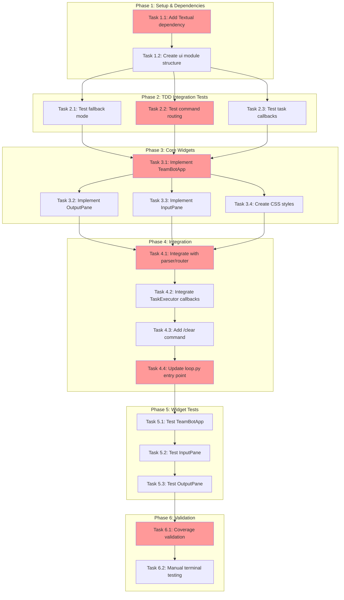

<!-- markdownlint-disable-file -->
# Task Checklist: Split-Pane Terminal Interface

## Overview

Implement a split-pane terminal interface for TeamBot that separates user input (left pane) from agent output (right pane) using the Textual framework, enabling stable input and async output display.

## Objectives

* Create split-pane layout with left input pane (30%) and right output pane (70%)
* Implement InputPane widget with command history navigation
* Implement OutputPane widget with async message display and auto-scroll
* Integrate Textual app with existing TaskExecutor callbacks
* Add graceful fallback for terminals < 80 columns
* Deprecate `&` background task syntax (all tasks inherently async)
* Add `/clear` command for output pane

## Research Summary

### Project Files
* `src/teambot/repl/loop.py` - Current REPL implementation to be replaced/wrapped
* `src/teambot/repl/parser.py` - Command parsing logic (preserved)
* `src/teambot/repl/router.py` - Command routing (preserved)
* `src/teambot/tasks/executor.py` - TaskExecutor with callbacks (integrate)
* `src/teambot/visualization/overlay.py` - Current overlay (superseded)

### External References
* .agent-tracking/research/20260128-split-pane-interface-research.md - Technical approach and examples
* .agent-tracking/test-strategies/20260128-split-pane-interface-test-strategy.md - Test approach per component
* https://textual.textualize.io/guide/widgets/ - Textual widget documentation
* https://textual.textualize.io/guide/testing/ - Textual pilot test framework

### Standards References
* `pyproject.toml` - Project dependencies and pytest configuration
* `tests/conftest.py` - Existing test fixtures pattern

## Task Dependency Graph

**Critical Path**: T1.1 → T1.2 → T2.2 → T3.1 → T4.1 → T4.4 → T6.1
**Parallel Opportunities**: T2.1/T2.2/T2.3 can run in parallel; T3.2/T3.3/T3.4 can run in parallel; T5.1/T5.2/T5.3 can run in parallel

## Implementation Checklist

### [ ] Phase 1: Setup & Dependencies

**Phase Objective**: Project configured with Textual dependency and ui module structure created

* [ ] Task 1.1: Add Textual dependency to pyproject.toml
  * Details: .agent-tracking/details/20260128-split-pane-interface-details.md (Lines 15-35)
  * Dependencies: None
  * Priority: CRITICAL
  * Effort: 10 min

* [ ] Task 1.2: Create ui module directory structure
  * Details: .agent-tracking/details/20260128-split-pane-interface-details.md (Lines 37-65)
  * Dependencies: Task 1.1
  * Priority: CRITICAL
  * Effort: 15 min

### Phase Gate: Phase 1 Complete When
- [ ] `uv sync` completes without error
- [ ] `src/teambot/ui/` directory exists with `__init__.py`
- [ ] `tests/test_ui/` directory exists with `conftest.py`
- [ ] Validation: `uv run python -c "import textual"` succeeds

**Cannot Proceed If**: Textual import fails or directory structure incomplete

---

### [ ] Phase 2: TDD Integration Tests (Write Tests First)

**Phase Objective**: Integration tests written for critical paths (TDD approach per test strategy)

**Test Strategy**: TDD - Tests written BEFORE implementation

* [ ] Task 2.1: Write fallback mode tests
  * Details: .agent-tracking/details/20260128-split-pane-interface-details.md (Lines 67-105)
  * Test Approach: TDD (per test strategy)
  * Coverage Target: 95%
  * Dependencies: Phase 1 completion
  * Priority: HIGH
  * Effort: 30 min

* [ ] Task 2.2: Write command routing integration tests
  * Details: .agent-tracking/details/20260128-split-pane-interface-details.md (Lines 107-145)
  * Test Approach: TDD (per test strategy)
  * Coverage Target: 90%
  * Dependencies: Phase 1 completion
  * Priority: CRITICAL
  * Effort: 45 min

* [ ] Task 2.3: Write task callback integration tests
  * Details: .agent-tracking/details/20260128-split-pane-interface-details.md (Lines 147-185)
  * Test Approach: TDD (per test strategy)
  * Coverage Target: 90%
  * Dependencies: Phase 1 completion
  * Priority: CRITICAL
  * Effort: 30 min

### Phase Gate: Phase 2 Complete When
- [ ] All TDD tests written (will fail until implementation)
- [ ] Test file structure matches `tests/test_ui/` pattern
- [ ] Tests are isolated and independent
- [ ] Validation: `uv run pytest tests/test_ui/ --collect-only` shows all tests

**Cannot Proceed If**: Tests cannot be collected or have syntax errors

---

### [ ] Phase 3: Core Widget Implementation (Code-First)

**Phase Objective**: Textual widgets implemented with basic functionality

**Test Strategy**: Code-First - Implement then test (per test strategy for widgets)

* [ ] Task 3.1: Implement TeamBotApp main application class
  * Details: .agent-tracking/details/20260128-split-pane-interface-details.md (Lines 187-245)
  * Dependencies: Phase 2 tests written
  * Priority: CRITICAL
  * Effort: 1 hour

* [ ] Task 3.2: Implement OutputPane widget
  * Details: .agent-tracking/details/20260128-split-pane-interface-details.md (Lines 247-295)
  * Dependencies: Task 3.1
  * Priority: HIGH
  * Effort: 45 min

* [ ] Task 3.3: Implement InputPane widget with command history
  * Details: .agent-tracking/details/20260128-split-pane-interface-details.md (Lines 297-350)
  * Dependencies: Task 3.1
  * Priority: HIGH
  * Effort: 45 min

* [ ] Task 3.4: Create CSS stylesheet for layout
  * Details: .agent-tracking/details/20260128-split-pane-interface-details.md (Lines 352-385)
  * Dependencies: Task 3.1
  * Priority: HIGH
  * Effort: 20 min

### Phase Gate: Phase 3 Complete When
- [ ] TeamBotApp can be instantiated without error
- [ ] Manual test: `uv run python -c "from teambot.ui.app import TeamBotApp"` works
- [ ] Both panes visible when app runs
- [ ] Validation: Widgets render in test terminal

**Cannot Proceed If**: App crashes on startup or widgets don't render

---

### [ ] Phase 4: Integration with Existing REPL

**Phase Objective**: Textual app integrated with existing parser, router, and TaskExecutor

* [ ] Task 4.1: Integrate with command parser and router
  * Details: .agent-tracking/details/20260128-split-pane-interface-details.md (Lines 387-430)
  * Dependencies: Phase 3 completion
  * Priority: CRITICAL
  * Effort: 45 min

* [ ] Task 4.2: Integrate TaskExecutor callbacks with OutputPane
  * Details: .agent-tracking/details/20260128-split-pane-interface-details.md (Lines 432-475)
  * Dependencies: Task 4.1
  * Priority: CRITICAL
  * Effort: 30 min

* [ ] Task 4.3: Add /clear command for output pane
  * Details: .agent-tracking/details/20260128-split-pane-interface-details.md (Lines 477-505)
  * Dependencies: Task 4.1
  * Priority: MEDIUM
  * Effort: 20 min

* [ ] Task 4.4: Update loop.py entry point with fallback logic
  * Details: .agent-tracking/details/20260128-split-pane-interface-details.md (Lines 507-555)
  * Dependencies: Tasks 4.1, 4.2, 4.3
  * Priority: CRITICAL
  * Effort: 30 min

### Phase Gate: Phase 4 Complete When
- [ ] TDD tests from Phase 2 now pass
- [ ] Commands route correctly to agents
- [ ] Task completion appears in output pane
- [ ] `/clear` clears output pane
- [ ] Fallback mode works for narrow terminals
- [ ] Validation: `uv run pytest tests/test_ui/test_integration.py` passes

**Cannot Proceed If**: Integration tests fail or command routing broken

---

### [ ] Phase 5: Widget Tests (Code-First Test Phase)

**Phase Objective**: Widget-level tests added after implementation (Code-First approach per test strategy)

**Test Strategy**: Code-First - Tests written AFTER implementation for widgets

* [ ] Task 5.1: Add TeamBotApp pilot tests
  * Details: .agent-tracking/details/20260128-split-pane-interface-details.md (Lines 557-600)
  * Test Approach: Code-First (per test strategy)
  * Coverage Target: 85%
  * Dependencies: Phase 4 completion
  * Priority: HIGH
  * Effort: 30 min

* [ ] Task 5.2: Add InputPane pilot tests
  * Details: .agent-tracking/details/20260128-split-pane-interface-details.md (Lines 602-640)
  * Test Approach: Code-First (per test strategy)
  * Coverage Target: 80%
  * Dependencies: Task 5.1
  * Priority: HIGH
  * Effort: 30 min

* [ ] Task 5.3: Add OutputPane pilot tests
  * Details: .agent-tracking/details/20260128-split-pane-interface-details.md (Lines 642-680)
  * Test Approach: Code-First (per test strategy)
  * Coverage Target: 80%
  * Dependencies: Task 5.1
  * Priority: HIGH
  * Effort: 30 min

### Phase Gate: Phase 5 Complete When
- [ ] All widget tests pass
- [ ] Test coverage meets targets per component
- [ ] Tests are isolated (no inter-test dependencies)
- [ ] Validation: `uv run pytest tests/test_ui/ -v` all pass

**Cannot Proceed If**: Tests fail or coverage below targets

---

### [ ] Phase 6: Validation & Cleanup

**Phase Objective**: Feature complete, tested, and validated

* [ ] Task 6.1: Validate test coverage meets targets
  * Details: .agent-tracking/details/20260128-split-pane-interface-details.md (Lines 682-710)
  * Success: Coverage meets 85% unit, 90% integration
  * Dependencies: Phase 5 completion
  * Priority: HIGH
  * Effort: 15 min

* [ ] Task 6.2: Manual terminal testing
  * Details: .agent-tracking/details/20260128-split-pane-interface-details.md (Lines 712-745)
  * Dependencies: Task 6.1
  * Priority: HIGH
  * Effort: 30 min

### Phase Gate: Phase 6 Complete When
- [ ] Coverage report shows targets met
- [ ] Manual testing on VS Code terminal passes
- [ ] Fallback mode verified on narrow terminal
- [ ] All automated tests pass
- [ ] Validation: `uv run pytest --cov=src/teambot/ui --cov-report=term-missing`

**Cannot Proceed If**: Coverage below targets or manual tests reveal issues

---

## Dependencies

* Python >= 3.10
* Textual >= 0.47.0 (new dependency)
* Rich >= 13.0.0 (existing)
* pytest >= 7.4.0 with pytest-asyncio (existing)
* textual[dev] for pilot testing (new dev dependency)

## Success Criteria

* Split-pane interface displays correctly in VS Code terminal
* Input pane remains stable during output updates
* Commands route to correct agents via existing parser/router
* Task completion callbacks write to output pane
* `/clear` command clears output pane
* Fallback mode activates for terminals < 80 columns
* Test coverage: 85% unit, 90% integration
* All existing tests continue to pass

## Effort Estimation

| Task | Estimated Effort | Complexity | Risk |
|------|-----------------|------------|------|
| Phase 1: Setup | 25 min | LOW | LOW |
| Phase 2: TDD Tests | 1.75 hours | MEDIUM | LOW |
| Phase 3: Widgets | 2.75 hours | HIGH | MEDIUM |
| Phase 4: Integration | 2 hours | HIGH | MEDIUM |
| Phase 5: Widget Tests | 1.5 hours | MEDIUM | LOW |
| Phase 6: Validation | 45 min | LOW | LOW |
| **Total** | **~9 hours** | - | - |
