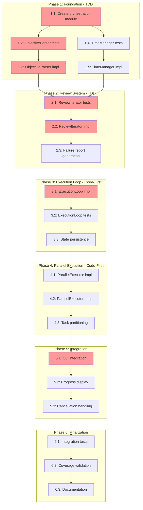

<!-- markdownlint-disable-file -->
# Implementation Plan: File-Based Orchestration

## Overview

Implement the autonomous execution loop that drives TeamBot's 6-agent team through the 13-stage workflow based on objective files, with review iteration, parallel execution, and state persistence.

## Objectives

1. Parse markdown objective files into structured data
2. Implement main execution loop driving workflow stages
3. Implement review iteration system (max 4 iterations with failure handling)
4. Enable parallel execution for builder-1 and builder-2
5. Add time limit enforcement (8-hour default)
6. Support cancellation with state persistence
7. Integrate progress display with existing UI

## References

- **Feature Specification**: `docs/feature-specs/file-based-orchestration.md`
- **Research Document**: `.agent-tracking/research/20260129-file-based-orchestration-research.md`
- **Test Strategy**: `.agent-tracking/test-strategies/20260129-file-based-orchestration-test-strategy.md`
- **Implementation Details**: `.agent-tracking/details/20260129-file-based-orchestration-details.md`

## Task Dependency Graph

**Critical Path**: T1.1 → T1.2 → T1.3 → T2.1 → T2.2 → T3.1 → T5.1
**Parallel Opportunities**: T1.4/T1.5 can run parallel to T1.2/T1.3

## Implementation Checklist

### Phase 1: Foundation (TDD)
> Details: Lines 25-120 in details file

- [ ] **Task 1.1**: Create orchestration module structure
  - Create `src/teambot/orchestration/__init__.py`
  - Create `tests/test_orchestration/__init__.py`
  - Export public interfaces
  
- [ ] **Task 1.2**: Write ObjectiveParser tests (TDD)
  - Test title extraction from H1
  - Test goals list extraction
  - Test success criteria parsing with checkbox state
  - Test constraints extraction
  - Test optional context handling
  - Test error cases (missing file, malformed markdown)

- [ ] **Task 1.3**: Implement ObjectiveParser
  - Create `src/teambot/orchestration/objective_parser.py`
  - Implement `ParsedObjective` dataclass
  - Implement `SuccessCriterion` dataclass
  - Implement `parse_objective_file()` function
  - All tests from 1.2 must pass

- [ ] **Task 1.4**: Write TimeManager tests (TDD)
  - Test start/stop timing
  - Test elapsed_seconds calculation
  - Test is_expired at boundary
  - Test resume from prior elapsed
  - Test remaining time formatting

- [ ] **Task 1.5**: Implement TimeManager
  - Create `src/teambot/orchestration/time_manager.py`
  - Implement start(), elapsed_seconds, is_expired()
  - Implement resume(prior_elapsed)
  - Implement format_remaining()
  - All tests from 1.4 must pass

### Phase Gate: Phase 1 Complete When
- [ ] All Phase 1 tasks marked complete
- [ ] `uv run pytest tests/test_orchestration/test_objective_parser.py` passes
- [ ] `uv run pytest tests/test_orchestration/test_time_manager.py` passes
- [ ] Coverage: ObjectiveParser ≥95%, TimeManager ≥100%
- **Artifacts**: objective_parser.py, time_manager.py, test files
- **Cannot Proceed If**: Any parser test fails, time boundary tests fail

---

### Phase 2: Review Iteration System (TDD)
> Details: Lines 122-200 in details file

- [ ] **Task 2.1**: Write ReviewIterator tests (TDD)
  - Test approval on first iteration
  - Test approval on iterations 2, 3, 4
  - Test failure after 4 iterations
  - Test failure summary generation
  - Test feedback incorporation between iterations
  - Test async cancellation handling

- [ ] **Task 2.2**: Implement ReviewIterator
  - Create `src/teambot/orchestration/review_iterator.py`
  - Implement `IterationResult` dataclass
  - Implement `ReviewResult` dataclass
  - Implement `ReviewIterator.execute()` async method
  - Implement iteration loop with max limit
  - All tests from 2.1 must pass

- [ ] **Task 2.3**: Implement failure report generation
  - Implement `_generate_failure_result()` method
  - Implement `_summarize_failures()` helper
  - Implement `_extract_suggestions()` helper
  - Implement `_save_failure_report()` to `.teambot/failures/`
  - Add tests for failure report content

### Phase Gate: Phase 2 Complete When
- [ ] All Phase 2 tasks marked complete
- [ ] `uv run pytest tests/test_orchestration/test_review_iterator.py` passes
- [ ] Coverage: ReviewIterator ≥95%
- **Artifacts**: review_iterator.py, failure reports in .teambot/failures/
- **Cannot Proceed If**: Iteration counter logic incorrect, failure report missing

---

### Phase 3: Execution Loop (Code-First)
> Details: Lines 202-280 in details file

- [ ] **Task 3.1**: Implement ExecutionLoop core
  - Create `src/teambot/orchestration/execution_loop.py`
  - Implement `ExecutionResult` enum
  - Implement `ExecutionLoop.__init__()` with objective, config, teambot_dir
  - Implement `run()` async method with main loop
  - Implement stage routing logic
  - Implement review stage delegation to ReviewIterator

- [ ] **Task 3.2**: Write ExecutionLoop tests
  - Test complete workflow execution (mock agents)
  - Test cancellation mid-execution
  - Test timeout enforcement
  - Test review stage delegation
  - Test stage transition validation

- [ ] **Task 3.3**: Implement state persistence
  - Extend workflow state with orchestration fields
  - Implement save after each stage completion
  - Implement save on cancellation
  - Implement resume from saved state
  - Add tests for state persistence

### Phase Gate: Phase 3 Complete When
- [ ] All Phase 3 tasks marked complete
- [ ] `uv run pytest tests/test_orchestration/test_execution_loop.py` passes
- [ ] Coverage: ExecutionLoop ≥85%
- **Artifacts**: execution_loop.py, extended workflow_state.json schema
- **Cannot Proceed If**: Loop doesn't progress through stages, state not saved

---

### Phase 4: Parallel Execution (Code-First)
> Details: Lines 282-340 in details file

- [ ] **Task 4.1**: Implement ParallelExecutor
  - Create `src/teambot/orchestration/parallel_executor.py`
  - Implement `AgentTask` dataclass
  - Implement `TaskResult` dataclass
  - Implement `execute_parallel()` with asyncio.gather
  - Implement concurrency control with semaphore

- [ ] **Task 4.2**: Write ParallelExecutor tests
  - Test 2 concurrent tasks complete
  - Test partial failure (one fails, one succeeds)
  - Test concurrency limit respected
  - Test cancellation of parallel tasks
  - Test empty task list handling

- [ ] **Task 4.3**: Implement task partitioning
  - Implement `partition_tasks()` for builder assignment
  - Strategy: Odd tasks → builder-1, Even → builder-2
  - Alternative: File-based partitioning
  - Add tests for partitioning logic

### Phase Gate: Phase 4 Complete When
- [ ] All Phase 4 tasks marked complete
- [ ] `uv run pytest tests/test_orchestration/test_parallel_executor.py` passes
- [ ] Coverage: ParallelExecutor ≥85%
- **Artifacts**: parallel_executor.py, task partitioning logic
- **Cannot Proceed If**: Tasks don't run concurrently, race conditions present

---

### Phase 5: Integration (Code-First)
> Details: Lines 342-420 in details file

- [ ] **Task 5.1**: CLI integration
  - Modify `src/teambot/cli.py` cmd_run()
  - Replace "not implemented" warning with ExecutionLoop
  - Add `--resume` flag for interrupted runs
  - Add `--max-hours` flag (default 8)
  - Add signal handler for Ctrl+C

- [ ] **Task 5.2**: Progress display integration
  - Create progress callback factory
  - Wire to existing AgentStatusManager
  - Add stage display to StatusPanel (or new widget)
  - Add elapsed/remaining time display
  - Add activity log display

- [ ] **Task 5.3**: Cancellation handling
  - Implement Ctrl+C signal handler
  - Set `loop.cancelled = True`
  - Cancel in-progress SDK requests
  - Save state before exit
  - Display cancellation message with resume instructions

### Phase Gate: Phase 5 Complete When
- [ ] All Phase 5 tasks marked complete
- [ ] `teambot run objectives/test.md` starts execution
- [ ] Ctrl+C saves state and exits cleanly
- [ ] Progress visible during execution
- **Artifacts**: Updated cli.py, progress callbacks
- **Cannot Proceed If**: CLI doesn't start execution, cancellation loses state

---

### Phase 6: Finalization
> Details: Lines 422-480 in details file

- [ ] **Task 6.1**: Integration tests
  - Create `tests/test_orchestration/test_integration.py`
  - Test full workflow with mocked agents
  - Test resume after cancellation
  - Test parallel builder execution
  - Test review iteration with mock feedback

- [ ] **Task 6.2**: Coverage validation
  - Run `uv run pytest --cov=src/teambot/orchestration --cov-report=term-missing`
  - Verify overall ≥85% coverage
  - Verify critical components ≥95%
  - Add tests for uncovered paths

- [ ] **Task 6.3**: Documentation
  - Update README with orchestration usage
  - Document objective file format
  - Document CLI flags (`--resume`, `--max-hours`)
  - Update feature spec status to Complete

### Phase Gate: Phase 6 Complete When
- [ ] All Phase 6 tasks marked complete
- [ ] Full test suite passes: `uv run pytest`
- [ ] Coverage meets targets
- [ ] Documentation updated
- **Artifacts**: Integration tests, updated docs
- **Cannot Proceed If**: Coverage below targets, docs incomplete

---

## Effort Estimation

| Task | Estimated Effort | Complexity | Risk |
|------|------------------|------------|------|
| 1.1: Module structure | 15 min | LOW | LOW |
| 1.2: Parser tests | 45 min | MEDIUM | LOW |
| 1.3: Parser impl | 30 min | MEDIUM | LOW |
| 1.4: TimeManager tests | 30 min | LOW | LOW |
| 1.5: TimeManager impl | 20 min | LOW | LOW |
| 2.1: ReviewIterator tests | 1 hour | HIGH | MEDIUM |
| 2.2: ReviewIterator impl | 1.5 hours | HIGH | MEDIUM |
| 2.3: Failure reports | 45 min | MEDIUM | LOW |
| 3.1: ExecutionLoop impl | 2 hours | HIGH | HIGH |
| 3.2: ExecutionLoop tests | 1 hour | MEDIUM | MEDIUM |
| 3.3: State persistence | 45 min | MEDIUM | MEDIUM |
| 4.1: ParallelExecutor impl | 1 hour | MEDIUM | MEDIUM |
| 4.2: ParallelExecutor tests | 45 min | MEDIUM | LOW |
| 4.3: Task partitioning | 30 min | LOW | LOW |
| 5.1: CLI integration | 1 hour | MEDIUM | LOW |
| 5.2: Progress display | 1.5 hours | MEDIUM | MEDIUM |
| 5.3: Cancellation | 45 min | MEDIUM | MEDIUM |
| 6.1: Integration tests | 1.5 hours | MEDIUM | LOW |
| 6.2: Coverage validation | 30 min | LOW | LOW |
| 6.3: Documentation | 45 min | LOW | LOW |

**Total Estimated Effort**: ~16-18 hours

## Success Criteria

- [ ] `teambot run objectives/test.md` executes autonomously
- [ ] Review stages iterate max 4 times with failure handling
- [ ] builder-1 and builder-2 execute in parallel during IMPLEMENTATION
- [ ] Ctrl+C saves state and allows resume
- [ ] 8-hour time limit enforced by default
- [ ] Progress visible during execution
- [ ] All tests pass with ≥85% coverage
- [ ] Feature spec marked Complete

## Dependencies

- **Existing Infrastructure**: Orchestrator, AgentRunner, WorkflowStateMachine, CopilotSDKClient
- **Libraries**: asyncio, python-frontmatter (existing), pytest-asyncio
- **External**: Copilot CLI must be available for actual agent execution
