<!-- markdownlint-disable-file -->
# Task Checklist: Shared Context Reference Syntax (`$agent`)

## Overview

Implement `$agent` syntax to allow referencing another agent's most recent output, enabling intuitive dependency-based workflows where agents can wait for and consume other agents' results.

## Objectives

* Enable easy-to-use `$pm`, `$ba`, `$builder-1` syntax to reference agent output
* Implement waiting behavior when referenced agent has a running task
* Display accurate agent status (waiting/executing/idle) in overlay
* Document both `$ref` and `->` syntax with comparison in README.md

## Research Summary

### Project Files
* `src/teambot/repl/parser.py` - Command parsing with regex patterns
* `src/teambot/repl/loop.py` - REPL routing logic for advanced commands
* `src/teambot/tasks/executor.py` - Task execution and dependency handling
* `src/teambot/tasks/manager.py` - Task lifecycle and result storage
* `src/teambot/tasks/models.py` - TaskStatus enum and Task model
* `src/teambot/visualization/overlay.py` - Status display rendering

### External References
* `.agent-tracking/research/20260203-shared-context-research.md` - Complete technical analysis
* `.agent-tracking/test-strategies/20260203-shared-context-test-strategy.md` - Hybrid TDD/Code-First approach

## Task Dependency Graph

```mermaid
graph TD
    subgraph Phase1[Phase 1: Parser & Models]
        T1.1[Task 1.1: WAITING status]
        T1.2[Task 1.2: Command.references field]
        T1.3[Task 1.3: REFERENCE_PATTERN regex]
        T1.4[Task 1.4: Parse references]
    end
    
    subgraph Phase2[Phase 2: Tests - Parser TDD]
        T2.1[Task 2.1: Parser reference tests]
        T2.2[Task 2.2: Command field tests]
    end
    
    subgraph Phase3[Phase 3: TaskManager]
        T3.1[Task 3.1: Agent results dict]
        T3.2[Task 3.2: get_agent_result]
        T3.3[Task 3.3: get_running_task_for_agent]
    end
    
    subgraph Phase4[Phase 4: Tests - Manager TDD]
        T4.1[Task 4.1: Agent result storage tests]
        T4.2[Task 4.2: Running task lookup tests]
    end
    
    subgraph Phase5[Phase 5: TaskExecutor]
        T5.1[Task 5.1: _wait_for_references]
        T5.2[Task 5.2: _inject_references]
        T5.3[Task 5.3: Update _execute_simple]
    end
    
    subgraph Phase6[Phase 6: Tests - Executor TDD]
        T6.1[Task 6.1: Reference injection tests]
        T6.2[Task 6.2: Waiting tests]
        T6.3[Task 6.3: No output tests]
    end
    
    subgraph Phase7[Phase 7: REPL & Overlay]
        T7.1[Task 7.1: Update routing condition]
        T7.2[Task 7.2: Add waiting_count to OverlayState]
        T7.3[Task 7.3: Update overlay display]
    end
    
    subgraph Phase8[Phase 8: Documentation]
        T8.1[Task 8.1: README syntax section]
        T8.2[Task 8.2: Syntax comparison table]
    end
    
    subgraph Phase9[Phase 9: Integration & Validation]
        T9.1[Task 9.1: Integration tests]
        T9.2[Task 9.2: Coverage validation]
    end
    
    T1.1 --> T1.2
    T1.2 --> T1.3
    T1.3 --> T1.4
    T1.4 --> T2.1
    T2.1 --> T2.2
    T2.2 --> T3.1
    T3.1 --> T3.2
    T3.2 --> T3.3
    T3.3 --> T4.1
    T4.1 --> T4.2
    T4.2 --> T5.1
    T5.1 --> T5.2
    T5.2 --> T5.3
    T5.3 --> T6.1
    T6.1 --> T6.2
    T6.2 --> T6.3
    T6.3 --> T7.1
    T7.1 --> T7.2
    T7.2 --> T7.3
    T7.3 --> T8.1
    T8.1 --> T8.2
    T8.2 --> T9.1
    T9.1 --> T9.2
    
    %% Critical Path highlighted
    style T1.4 fill:#ff9999
    style T3.1 fill:#ff9999
    style T5.3 fill:#ff9999
    style T7.1 fill:#ff9999
```

**Critical Path**: Parser → Manager Storage → Executor Handling → REPL Routing
**Parallel Opportunities**: Tests can be written alongside implementation (Hybrid approach)

## Implementation Checklist

### [x] Phase 1: Parser & Model Extensions

**Phase Objective**: Enable parsing of `$agent` references in command content

**Test Strategy**: TDD - Write tests before implementation for parser components

* [x] Task 1.1: Add WAITING status to TaskStatus enum
  * Details: .agent-tracking/details/20260203-shared-context-reference-details.md (Lines 15-35)
  * Dependencies: None
  * Priority: HIGH

* [x] Task 1.2: Add `references` field to Command dataclass
  * Details: .agent-tracking/details/20260203-shared-context-reference-details.md (Lines 37-55)
  * Dependencies: None
  * Priority: CRITICAL

* [x] Task 1.3: Add REFERENCE_PATTERN regex constant
  * Details: .agent-tracking/details/20260203-shared-context-reference-details.md (Lines 57-75)
  * Dependencies: None
  * Priority: CRITICAL

* [x] Task 1.4: Implement reference detection in `_parse_agent_command()`
  * Details: .agent-tracking/details/20260203-shared-context-reference-details.md (Lines 77-105)
  * Dependencies: Task 1.2, Task 1.3
  * Priority: CRITICAL

### Phase Gate: Phase 1 Complete When
- [x] All Phase 1 tasks marked complete
- [x] `TaskStatus.WAITING` exists in enum
- [x] `Command.references` field available
- [x] `parse_command("@pm task $ba")` returns `references=["ba"]`
- [x] Validation: `uv run pytest tests/test_repl/test_parser.py -v`

**Cannot Proceed If**: Parser cannot detect `$agent` patterns in content

---

### [x] Phase 2: Parser Tests (TDD)

**Phase Objective**: Ensure parser reference detection is fully tested

**Test Strategy**: TDD - Tests for parser reference detection

* [x] Task 2.1: Create tests for reference parsing
  * Details: .agent-tracking/details/20260203-shared-context-reference-details.md (Lines 110-145)
  * Test Approach: TDD
  * Coverage Target: 95%
  * Test Framework: pytest
  * Dependencies: Phase 1 completion

* [x] Task 2.2: Create tests for Command.references field
  * Details: .agent-tracking/details/20260203-shared-context-reference-details.md (Lines 147-165)
  * Test Approach: TDD
  * Coverage Target: 100%
  * Dependencies: Task 2.1

### Phase Gate: Phase 2 Complete When
- [x] All parser reference tests pass
- [x] Coverage for parser.py reference logic ≥95%
- [x] Edge cases tested (multiple refs, hyphenated, duplicates)
- [x] Validation: `uv run pytest tests/test_repl/test_parser.py::TestParseReferences -v`

---

### [x] Phase 3: TaskManager Agent Result Storage

**Phase Objective**: Store and retrieve agent results for `$ref` lookup

**Test Strategy**: TDD - Tests for result storage and retrieval

* [x] Task 3.1: Add `_agent_results` dictionary
  * Details: .agent-tracking/details/20260203-shared-context-reference-details.md (Lines 170-190)
  * Dependencies: None
  * Priority: CRITICAL

* [x] Task 3.2: Implement `get_agent_result()` method
  * Details: .agent-tracking/details/20260203-shared-context-reference-details.md (Lines 192-210)
  * Dependencies: Task 3.1
  * Priority: CRITICAL

* [x] Task 3.3: Implement `get_running_task_for_agent()` method
  * Details: .agent-tracking/details/20260203-shared-context-reference-details.md (Lines 212-235)
  * Dependencies: Task 3.1
  * Priority: HIGH

### Phase Gate: Phase 3 Complete When
- [x] `_agent_results` populated on task completion
- [x] `get_agent_result("ba")` returns latest result
- [x] `get_running_task_for_agent("ba")` finds running task
- [x] Validation: `uv run pytest tests/test_tasks/test_manager.py -v -k agent`

---

### [x] Phase 4: TaskManager Tests (TDD)

**Phase Objective**: Ensure agent result storage/retrieval is fully tested

* [x] Task 4.1: Create tests for agent result storage
  * Details: .agent-tracking/details/20260203-shared-context-reference-details.md (Lines 240-270)
  * Test Approach: TDD
  * Coverage Target: 90%
  * Dependencies: Phase 3 completion

* [x] Task 4.2: Create tests for running task lookup
  * Details: .agent-tracking/details/20260203-shared-context-reference-details.md (Lines 272-295)
  * Test Approach: TDD
  * Coverage Target: 90%
  * Dependencies: Task 4.1

### Phase Gate: Phase 4 Complete When
- [x] All manager agent result tests pass
- [x] Latest result overwrites previous correctly
- [x] None returned when no result exists
- [x] Validation: `uv run pytest tests/test_tasks/test_manager.py -v`

---

### [x] Phase 5: TaskExecutor Reference Handling

**Phase Objective**: Implement waiting and output injection for references

**Test Strategy**: TDD - Tests for async waiting and injection

* [x] Task 5.1: Implement `_wait_for_references()` async method
  * Details: .agent-tracking/details/20260203-shared-context-reference-details.md (Lines 300-330)
  * Dependencies: Phase 3, Phase 4
  * Priority: CRITICAL

* [x] Task 5.2: Implement `_inject_references()` method
  * Details: .agent-tracking/details/20260203-shared-context-reference-details.md (Lines 332-365)
  * Dependencies: Task 5.1
  * Priority: CRITICAL

* [x] Task 5.3: Update `_execute_simple()` to handle references
  * Details: .agent-tracking/details/20260203-shared-context-reference-details.md (Lines 367-400)
  * Dependencies: Task 5.1, Task 5.2
  * Priority: CRITICAL

### Phase Gate: Phase 5 Complete When
- [x] Commands with `$ref` wait for running tasks
- [x] Referenced output is injected into prompt
- [x] Placeholder used when no output available
- [x] Validation: `uv run pytest tests/test_tasks/test_executor.py -v -k reference`

---

### [x] Phase 6: TaskExecutor Tests (TDD)

**Phase Objective**: Ensure reference handling is fully tested

* [x] Task 6.1: Create tests for reference output injection
  * Details: .agent-tracking/details/20260203-shared-context-reference-details.md (Lines 405-440)
  * Test Approach: TDD
  * Coverage Target: 85%
  * Dependencies: Phase 5 completion

* [x] Task 6.2: Create tests for waiting on running tasks
  * Details: .agent-tracking/details/20260203-shared-context-reference-details.md (Lines 442-480)
  * Test Approach: TDD
  * Dependencies: Task 6.1

* [x] Task 6.3: Create tests for no output available scenario
  * Details: .agent-tracking/details/20260203-shared-context-reference-details.md (Lines 482-505)
  * Test Approach: TDD
  * Dependencies: Task 6.2

### Phase Gate: Phase 6 Complete When
- [x] All executor reference tests pass
- [x] Async waiting behavior verified
- [x] Placeholder injection tested
- [x] Validation: `uv run pytest tests/test_tasks/test_executor.py -v`

---

### [x] Phase 7: REPL Routing & Overlay Updates

**Phase Objective**: Route referenced commands and display waiting status

**Test Strategy**: Code-First - Implement then test

* [x] Task 7.1: Update REPL routing condition for references
  * Details: .agent-tracking/details/20260203-shared-context-reference-details.md (Lines 510-535)
  * Dependencies: Phase 5, Phase 6
  * Priority: CRITICAL

* [x] Task 7.2: Add waiting fields to OverlayState
  * Details: .agent-tracking/details/20260203-shared-context-reference-details.md (Lines 537-560)
  * Dependencies: Task 7.1
  * Priority: HIGH

* [x] Task 7.3: Update overlay display for waiting state
  * Details: .agent-tracking/details/20260203-shared-context-reference-details.md (Lines 562-595)
  * Dependencies: Task 7.2
  * Priority: HIGH

### Phase Gate: Phase 7 Complete When
- [x] `@pm task $ba` routes through TaskExecutor
- [x] Waiting count displayed in overlay
- [x] Waiting relationship shown (e.g., "@pm→@ba")
- [ ] Validation: Manual REPL testing

---

### [x] Phase 8: Documentation

**Phase Objective**: Document syntax with comparison to pipeline syntax

* [x] Task 8.1: Add "Shared Context References" section to README
  * Details: .agent-tracking/details/20260203-shared-context-reference-details.md (Lines 600-640)
  * Dependencies: Phase 7
  * Priority: HIGH

* [x] Task 8.2: Add syntax comparison table
  * Details: .agent-tracking/details/20260203-shared-context-reference-details.md (Lines 642-680)
  * Dependencies: Task 8.1
  * Priority: HIGH

### Phase Gate: Phase 8 Complete When
- [x] README includes `$agent` syntax documentation
- [x] Comparison table explains `$ref` vs `->` differences
- [x] Usage examples provided
- [x] Validation: README review

---

### [x] Phase 9: Integration & Validation

**Phase Objective**: End-to-end validation of complete feature

* [x] Task 9.1: Create integration tests
  * Details: .agent-tracking/details/20260203-shared-context-reference-details.md (Lines 685-720)
  * Test Approach: Code-First
  * Dependencies: Phase 7, Phase 8

* [x] Task 9.2: Validate coverage targets
  * Details: .agent-tracking/details/20260203-shared-context-reference-details.md (Lines 722-745)
  * Success: Overall coverage ≥80% (achieved: 80%)
  * Dependencies: Task 9.1

### Phase Gate: Phase 9 Complete When
- [x] Full workflow test passes (BA → PM refs BA → Builder refs PM)
- [x] Coverage targets met per component
- [x] All existing tests still pass (776 tests)
- [x] Validation: `uv run pytest --cov=src/teambot --cov-report=term-missing`

**Cannot Proceed If**: Integration tests fail or coverage drops below target

---

## Effort Estimation

| Task | Estimated Effort | Complexity | Risk |
|------|-----------------|------------|------|
| Phase 1 (Parser/Models) | 1 hour | LOW | LOW |
| Phase 2 (Parser Tests) | 30 min | LOW | LOW |
| Phase 3 (TaskManager) | 1.5 hours | MEDIUM | MEDIUM |
| Phase 4 (Manager Tests) | 30 min | LOW | LOW |
| Phase 5 (Executor) | 2 hours | HIGH | MEDIUM |
| Phase 6 (Executor Tests) | 1 hour | MEDIUM | LOW |
| Phase 7 (REPL/Overlay) | 1 hour | LOW | LOW |
| Phase 8 (Documentation) | 30 min | LOW | LOW |
| Phase 9 (Integration) | 1 hour | MEDIUM | LOW |

**Total Estimated Effort**: ~9 hours

## Dependencies

* pytest (existing)
* pytest-asyncio (existing)
* pytest-cov (existing)
* unittest.mock (AsyncMock, MagicMock)

## Success Criteria

* `@pm task $ba` syntax works and injects BA's latest output
* Referencing agent waits for running task to complete
* Agent status accurately shows waiting/executing/idle
* README.md documents both syntaxes with clear comparison
* All existing tests pass
* Coverage targets met per test strategy
