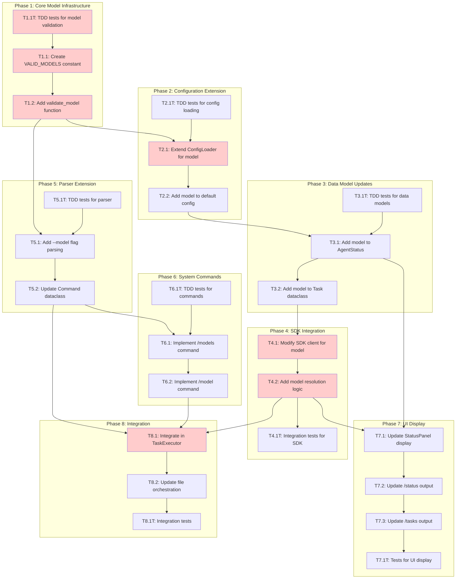

<!-- markdownlint-disable-file -->
# Implementation Plan: Model Selection Support

**Date**: 2026-02-04  
**Feature**: Model Selection for TeamBot Agents  
**Research**: `.teambot/model-select/artifacts/research.md`  
**Test Strategy**: `.teambot/model-select/artifacts/test_strategy.md`  
**Feature Spec**: `.teambot/model-select/artifacts/feature_spec.md`

---

## Overview

Enable TeamBot agents to use configurable AI models with visibility in the terminal UI, support for per-agent defaults in configuration, runtime model override via inline flags and session commands, and clear validation/error handling.

## Objectives

1. Add `VALID_MODELS` constant and `validate_model()` function
2. Extend configuration schema to support per-agent `model` and global `default_model`
3. Propagate model to SDK client session creation
4. Display model in terminal UI, `/status`, and `/tasks` output
5. Parse `--model` flag in agent directives
6. Implement `/models` and `/model` system commands
7. Integrate model resolution in task execution pipeline

## Research Summary

- **Copilot CLI**: Supports `--model` flag with 14 valid models (Lines 86-109 of research.md)
- **CopilotConfig**: Already has `model` field but unused (Lines 115-132)
- **CopilotSDKClient**: Does NOT pass model to session creation - gap identified (Lines 136-149)
- **Configuration**: No `model` field in agent config currently (Lines 152-172)
- **UI Components**: AgentStatus, StatusPanel, ConsoleDisplay need model field (Lines 199-253)
- **Task Model**: Needs `model` field for tracking (Lines 255-277)

---

## Task Dependency Graph

**Critical Path**: T1.1T → T1.1 → T1.2 → T2.1 → T3.1 → T4.1 → T4.2 → T8.1 → T8.2
**Parallel Opportunities**: Phase 5 (Parser) can run parallel to Phase 3-4; Phase 6 can run after Phase 5

---

## Implementation Checklist

### Phase 1: Core Model Infrastructure (TDD)
**Approach**: TDD - Clear requirements, pure functions

- [x] **T1.1T**: Write TDD tests for model validation (Details: Lines 30-65)
- [x] **T1.1**: Create `VALID_MODELS` constant in `config/schema.py` (Details: Lines 67-95)
- [x] **T1.2**: Implement `validate_model()` function (Details: Lines 97-125)

### Phase Gate: Phase 1 Complete When
- [x] All Phase 1 tasks marked complete
- [x] `uv run pytest tests/test_config/test_schema.py -v` passes
- [x] Validation: `validate_model("gpt-5")` returns `True`
- [x] Artifacts: `config/schema.py` with VALID_MODELS and validate_model()

**Cannot Proceed If**: validate_model() does not correctly identify valid/invalid models

---

### Phase 2: Configuration Extension (TDD)
**Approach**: TDD - Config validation has clear error scenarios

- [x] **T2.1T**: Write TDD tests for config model loading (Details: Lines 130-175)
- [x] **T2.1**: Extend `ConfigLoader._validate_agent()` for model field (Details: Lines 177-220)
- [x] **T2.2**: Add `model` field to `create_default_config()` agents (Details: Lines 222-250)

### Phase Gate: Phase 2 Complete When
- [x] All Phase 2 tasks marked complete
- [x] `uv run pytest tests/test_config/test_loader.py -v` passes
- [x] Validation: Invalid model in config raises `ConfigError`
- [x] Artifacts: Updated `config/loader.py` with model validation

**Cannot Proceed If**: Config loader doesn't validate model field

---

### Phase 3: Data Model Updates (TDD)
**Approach**: TDD - Simple dataclass field additions

- [x] **T3.1T**: Write TDD tests for AgentStatus.model field (Details: Lines 255-295)
- [x] **T3.1**: Add `model` field to `AgentStatus` dataclass (Details: Lines 297-335)
- [x] **T3.2**: Add `model` field to `Task` dataclass (Details: Lines 337-375)

### Phase Gate: Phase 3 Complete When
- [x] All Phase 3 tasks marked complete
- [x] `uv run pytest tests/test_ui/test_agent_state.py tests/test_tasks/test_models.py -v` passes
- [x] Validation: `AgentStatus(agent_id="pm", model="gpt-5")` creates successfully
- [x] Artifacts: Updated `agent_state.py` and `models.py`

**Cannot Proceed If**: Data classes don't have model fields

---

### Phase 4: SDK Integration (Code-First)
**Approach**: Code-First - SDK mocking is complex

- [x] **T4.1**: Modify `CopilotSDKClient.get_or_create_session()` for model (Details: Lines 380-430)
- [x] **T4.2**: Implement model resolution logic (inline > session > config > default) (Details: Lines 432-485)
- [x] **T4.1T**: Write integration tests for SDK model passing (Details: Lines 487-530)

### Phase Gate: Phase 4 Complete When
- [x] All Phase 4 tasks marked complete
- [x] `uv run pytest tests/test_copilot/test_sdk_client.py -v` passes
- [x] Validation: Session config dict contains "model" key
- [x] Artifacts: Updated `sdk_client.py` with model support

**Cannot Proceed If**: Model not passed to SDK session creation

---

### Phase 5: Parser Extension (TDD)
**Approach**: TDD - Well-defined grammar

- [x] **T5.1T**: Write TDD tests for `--model` flag parsing (Details: Lines 535-585)
- [x] **T5.1**: Add `--model`/`-m` flag parsing to `parse_command()` (Details: Lines 587-640)
- [x] **T5.2**: Add `model` field to `Command` dataclass (Details: Lines 642-670)

### Phase Gate: Phase 5 Complete When
- [x] All Phase 5 tasks marked complete
- [x] `uv run pytest tests/test_repl/test_parser.py -v` passes
- [x] Validation: `@pm --model gpt-5 task` parses with `result.model == "gpt-5"`
- [x] Artifacts: Updated `parser.py` with model flag support

**Cannot Proceed If**: Parser doesn't extract model from command

---

### Phase 6: System Commands (TDD)
**Approach**: TDD - Clear I/O contracts

- [x] **T6.1T**: Write TDD tests for `/models` command (Details: Lines 675-715)
- [x] **T6.1**: Implement `handle_models()` function (Details: Lines 717-760)
- [x] **T6.2**: Implement `handle_model()` for session override (Details: Lines 762-820)

### Phase Gate: Phase 6 Complete When
- [x] All Phase 6 tasks marked complete
- [x] `uv run pytest tests/test_repl/test_commands.py -v` passes
- [x] Validation: `/models` lists all 14 valid models
- [x] Artifacts: Updated `commands.py` with /models and /model handlers

**Cannot Proceed If**: Commands don't respond correctly

---

### Phase 7: UI Display (Code-First)
**Approach**: Code-First - Visual verification needed

- [x] **T7.1**: Update `StatusPanel._format_status()` to display model (Details: Lines 825-870)
- [x] **T7.2**: Update `/status` command output format (Details: Lines 872-910)
- [x] **T7.3**: Update `/tasks` command to show model per task (Details: Lines 912-950)
- [x] **T7.1T**: Write tests for UI display format (Details: Lines 952-995)

### Phase Gate: Phase 7 Complete When
- [x] All Phase 7 tasks marked complete
- [x] `uv run pytest tests/test_ui/ tests/test_visualization/ -v` passes
- [x] Validation: Visual inspection shows model in status panel
- [x] Artifacts: Updated `status_panel.py`, `console.py`, command output

**Cannot Proceed If**: Model not visible in any UI element

---

### Phase 8: Integration (Code-First)
**Approach**: Code-First - Integration layer

- [x] **T8.1**: Integrate model resolution in `TaskExecutor` (Details: Lines 1000-1055)
- [x] **T8.2**: Update file-based orchestration to use agent models (Details: Lines 1057-1110)
- [x] **T8.1T**: Write end-to-end integration tests (Details: Lines 1112-1160)

### Phase Gate: Phase 8 Complete When
- [x] All Phase 8 tasks marked complete
- [x] Full test suite passes: `uv run pytest --cov=src/teambot`
- [x] Validation: Manual test with `@pm --model claude-opus-4.5 task`
- [x] Artifacts: Updated `executor.py`, `execution_loop.py`

**Cannot Proceed If**: Model not propagated through task execution

---

## Effort Estimation

| Task | Estimated Effort | Complexity | Risk |
|------|-----------------|------------|------|
| Phase 1: Model Validation | 30 min | LOW | LOW |
| Phase 2: Config Extension | 45 min | MEDIUM | LOW |
| Phase 3: Data Models | 30 min | LOW | LOW |
| Phase 4: SDK Integration | 1.5 hours | HIGH | MEDIUM |
| Phase 5: Parser Extension | 45 min | MEDIUM | LOW |
| Phase 6: System Commands | 45 min | MEDIUM | LOW |
| Phase 7: UI Display | 1 hour | MEDIUM | LOW |
| Phase 8: Integration | 1 hour | MEDIUM | MEDIUM |

**Total Estimated Effort**: ~6.5 hours

---

## Dependencies

| Dependency | Type | Status |
|------------|------|--------|
| Python 3.12+ | Runtime | ✅ Verified |
| pytest, pytest-cov | Dev | ✅ Installed |
| ruff | Dev | ✅ Installed |
| github-copilot-sdk | Runtime | ✅ Installed |

## Success Criteria

1. ✅ Model visible in terminal UI for all agents
2. ✅ Model visible in `/status` command output
3. ✅ Agent and model visible in `/tasks` command
4. ✅ `@pm --model gpt-5 task` selects specific model for task
5. ✅ `@pm --model gpt-5` (no task) sets session default
6. ✅ Per-agent `model` field in `teambot.json` works
7. ✅ Global `default_model` works as fallback
8. ✅ Invalid model shows descriptive error
9. ✅ `/models` lists all available models
10. ✅ File-based orchestration uses agent default models

---

## Files to Modify

| File | Changes | Phase |
|------|---------|-------|
| `src/teambot/config/schema.py` | Add VALID_MODELS, validate_model() | 1 |
| `src/teambot/config/loader.py` | Validate model in agent config | 2 |
| `src/teambot/ui/agent_state.py` | Add model field to AgentStatus | 3 |
| `src/teambot/tasks/models.py` | Add model field to Task | 3 |
| `src/teambot/copilot/sdk_client.py` | Pass model to session creation | 4 |
| `src/teambot/repl/parser.py` | Parse --model flag | 5 |
| `src/teambot/repl/commands.py` | Add /models, /model handlers | 6 |
| `src/teambot/ui/widgets/status_panel.py` | Display model in panel | 7 |
| `src/teambot/visualization/console.py` | Add Model column to table | 7 |
| `src/teambot/tasks/executor.py` | Integrate model resolution | 8 |
| `src/teambot/orchestration/execution_loop.py` | Use agent default models | 8 |

## Test Files to Create/Modify

| File | Purpose | Approach |
|------|---------|----------|
| `tests/test_config/test_schema.py` | Test model validation | TDD |
| `tests/test_config/test_loader.py` | Test config model loading | TDD |
| `tests/test_ui/test_agent_state.py` | Test AgentStatus.model | TDD |
| `tests/test_tasks/test_models.py` | Test Task.model | TDD |
| `tests/test_repl/test_parser.py` | Test --model parsing | TDD |
| `tests/test_repl/test_commands.py` | Test /models, /model | TDD |
| `tests/test_copilot/test_sdk_client.py` | Test SDK model passing | Code-First |
| `tests/test_ui/test_status_panel.py` | Test model in display | Code-First |

---

## References

| Document | Location | Purpose |
|----------|----------|---------|
| Research | `.teambot/model-select/artifacts/research.md` | Technical findings |
| Test Strategy | `.teambot/model-select/artifacts/test_strategy.md` | Testing approach |
| Feature Spec | `.teambot/model-select/artifacts/feature_spec.md` | Requirements |
| Problem Statement | `.teambot/model-select/artifacts/problem_statement.md` | Context |
