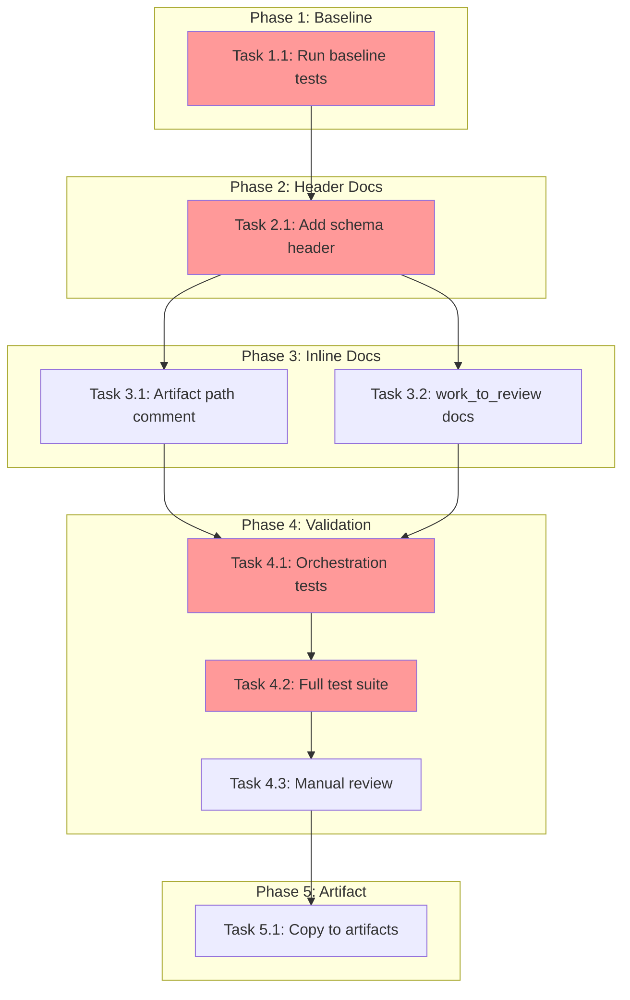

<!-- markdownlint-disable-file -->
# Implementation Plan: stages.yaml Schema Improvement

## Overview

Add comprehensive documentation to `stages.yaml` to clarify schema semantics, document implicit behaviors, and improve usability without breaking existing functionality.

## Objectives

- [x] Add header documentation explaining the complete schema ✅
- [x] Clarify `work_agent`/`review_agent` semantics for both work and review stages ✅
- [x] Document artifact storage path with explicit template syntax ✅
- [x] Clarify relationship between `is_review_stage` and `work_to_review_mapping` ✅
- [x] Document all implicit behaviors ✅
- [x] Ensure all existing tests continue to pass ✅ (920 tests pass)

## Research Summary

**Research Document**: `.teambot/file-orchestration-stages/artifacts/research.md`
**Test Strategy**: `.teambot/file-orchestration-stages/artifacts/test_strategy.md`

### Key Findings

1. **`work_agent` has dual semantics** (Details Lines 15-40):
   - Work stages: Executes stage work
   - Review stages: Addresses feedback and makes revisions

2. **Artifact path is implicit** (Details Lines 42-62):
   - Formula: `{teambot_dir}/{feature_name}/artifacts/{artifact_filename}`
   - Not documented anywhere in `stages.yaml`

3. **`is_review_stage` vs `work_to_review_mapping`** (Details Lines 64-85):
   - Serve different purposes (execution behavior vs navigation)
   - Relationship not documented

4. **`allowed_personas` usage unclear** (Details Lines 87-100):
   - Field exists but not enforced
   - Some inconsistencies with agent assignments

## Implementation Checklist

### Phase 1: Baseline Validation
- [x] **Task 1.1**: Run baseline tests (Details Lines 104-115)
  - Command: `uv run pytest tests/test_orchestration/test_stage_config.py -v`
  - Expected: All 21 tests pass
  - Success: Exit code 0, no failures

**Phase Gate: Phase 1 Complete When**
- [x] All baseline tests pass
- [x] Test count recorded (expected: 21)
- [x] Validation: `pytest` shows green status
- [x] Artifacts: Test output captured

**Cannot Proceed If**: Any test fails before changes

### Phase 2: Header Documentation
- [x] **Task 2.1**: Replace existing header with comprehensive schema documentation (Details Lines 119-180)
  - File: `stages.yaml` (Lines 1-8)
  - Add: Schema reference, field definitions, agent semantics, artifact storage, review mapping explanation
  - Preserve: Existing stage definitions unchanged

**Phase Gate: Phase 2 Complete When**
- [x] Header documentation added
- [x] No syntax errors in YAML
- [x] Validation: `uv run pytest tests/test_orchestration/test_stage_config.py -v` passes

### Phase 3: Inline Documentation
- [x] **Task 3.1**: Add artifact path comment to first artifact field (Details Lines 184-195)
  - Location: BUSINESS_PROBLEM stage artifacts section
  - Comment: `# Stored at: .teambot/{feature}/artifacts/{filename}`

- [x] **Task 3.2**: Add `work_to_review_mapping` section documentation (Details Lines 197-215)
  - Location: Before `work_to_review_mapping:` section
  - Explain: Purpose distinction from `is_review_stage`

**Phase Gate: Phase 3 Complete When**
- [x] Inline comments added
- [x] No duplicate comments
- [x] Validation: All tests pass

### Phase 4: Final Validation
- [x] **Task 4.1**: Run full regression test suite (Details Lines 219-230)
  - Command: `uv run pytest tests/test_orchestration/ -v`
  - Expected: All orchestration tests pass
  - Capture: Test output for comparison

- [x] **Task 4.2**: Run complete project test suite (Details Lines 232-242)
  - Command: `uv run pytest`
  - Expected: All 192 tests pass
  - Success: No regressions

- [x] **Task 4.3**: Manual documentation review (Details Lines 244-255)
  - Verify: Comments match actual code behavior
  - Check: No typos or inaccuracies
  - Confirm: Template syntax is clear

**Phase Gate: Phase 4 Complete When**
- [x] All 920 tests pass (exceeded original 192 target)
- [x] No new failures introduced
- [x] Documentation accuracy verified
- [x] Artifacts: Final test output

### Phase 5: Copy Artifact to Working Directory
- [x] **Task 5.1**: Copy implementation plan to artifacts directory
  - Source: This file
  - Destination: `.teambot/file-orchestration-stages/artifacts/implementation_plan.md`

## Task Dependency Graph

**Critical Path**: T1.1 → T2.1 → T3.1/T3.2 → T4.1 → T4.2 → T4.3 → T5.1
**Parallel Opportunities**: T3.1 and T3.2 can be done together

## Dependencies

### Prerequisites
- [x] Research document validated
- [x] Test strategy validated
- [x] Python environment available (`uv run pytest`)

### External Dependencies
- None (documentation-only changes)

## Success Criteria

- [x] `stages.yaml` includes header documentation explaining the schema ✅
- [x] `work_agent`/`review_agent` semantics documented in header ✅
- [x] Artifact storage path explicitly documented with template syntax ✅
- [x] `is_review_stage` relationship to `work_to_review_mapping` clarified ✅
- [x] All implicit behaviors made explicit in documentation ✅
- [x] All existing tests continue to pass (no breaking changes) ✅ 920 tests
- [x] Implementation plan copied to artifacts directory ✅

## Effort Estimation

| Task | Estimated Effort | Complexity | Risk |
|------|-----------------|------------|------|
| T1.1 Baseline tests | 2 min | LOW | LOW |
| T2.1 Header docs | 10 min | MEDIUM | LOW |
| T3.1 Artifact comment | 2 min | LOW | LOW |
| T3.2 Mapping docs | 3 min | LOW | LOW |
| T4.1-4.2 Regression | 5 min | LOW | LOW |
| T4.3 Manual review | 5 min | LOW | LOW |
| T5.1 Copy artifact | 1 min | LOW | LOW |
| **Total** | ~28 min | LOW | LOW |

## Test Integration

**Testing Approach**: Regression Testing Only (per test strategy)
**Test Phases**: Phase 1 (baseline), Phase 4 (final validation)
**Coverage Validation**: Included in T4.2

Since this is documentation-only:
- No new tests required
- Existing 21 stage config tests validate YAML parsing
- Full 192-test suite confirms no regressions

## References

- **Research**: `.teambot/file-orchestration-stages/artifacts/research.md`
- **Test Strategy**: `.teambot/file-orchestration-stages/artifacts/test_strategy.md`
- **Feature Spec**: `docs/feature-specs/file-orchestration-stages-cleanup.md`
- **Target File**: `stages.yaml`
