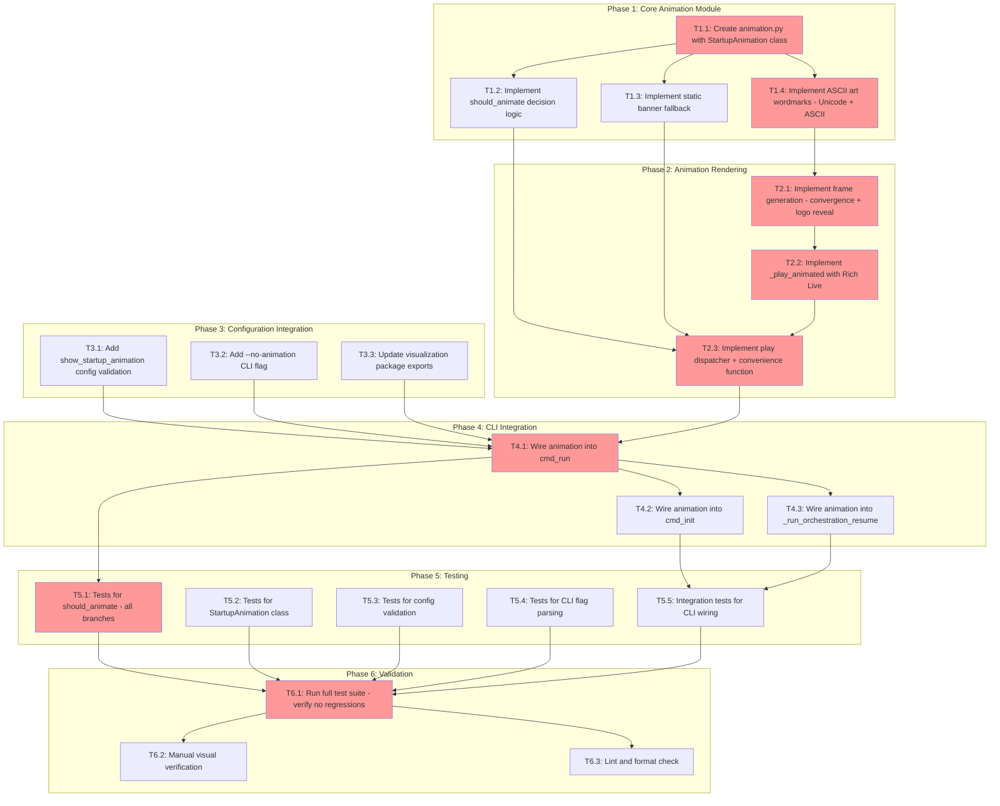

<!-- markdownlint-disable-file -->
# Implementation Plan: Startup Animation

**Overview:** Create a branded ASCII/Unicode startup animation for TeamBot that visually represents agents converging as a team, using the existing Rich library and agent color palette, with full configuration controls and graceful degradation.

**Research Reference:** `.agent-tracking/research/20260209-startup-animation-research.md`
**Test Strategy Reference:** `.agent-tracking/test-strategies/20260209-startup-animation-test-strategy.md`

---

## Objectives

1. Create a new `animation.py` module in `src/teambot/visualization/` with the `StartupAnimation` class
2. Implement a 3–4 second animated startup sequence using Rich `Live` display
3. Add `--no-animation` CLI flag and `show_startup_animation` config setting
4. Integrate animation into all CLI entry points (`run`, `init`, `resume`)
5. Ensure graceful degradation (non-TTY, dumb terminal, narrow terminal, no Unicode)
6. Achieve 90%+ test coverage on decision logic; 80%+ on animation module overall

---

## Research Summary

- **Current startup**: Simple `display.print_header("TeamBot Starting")` via Rich `Panel` — no animation (Research Lines 61-68)
- **Agent colors available**: 6 agents × 6 colors in `AGENT_COLORS` dict (Research Lines 71-82)
- **Rich `Live` API**: `transient=True` cleans frames on exit; verified in Rich 14.2.0 (Research Lines 260-275)
- **TTY detection pattern**: Existing in `overlay.py` — `sys.stdout.isatty()`, `TERM=dumb`, terminal size checks (Research Lines 452-468)
- **Config validation pattern**: Existing `_validate_overlay()` in `loader.py` Lines 198-213 (Research Lines 472-480)
- **CLI flag pattern**: Existing `--verbose`, `--force` flags in `create_parser()` (Research Lines 484-492)
- **Test pattern**: Direct instantiation, no Rich output mocking; mock TTY/env (Research Lines 496-514)

---

## Task Dependency Graph

**Critical Path**: T1.1 → T1.4 → T2.1 → T2.2 → T2.3 → T4.1 → T5.1 → T6.1
**Parallel Opportunities**: T1.2/T1.3/T1.4 can be developed concurrently within T1.1; T3.x tasks can run parallel to Phase 2; T5.1–T5.4 can run in parallel

---

## Effort Estimation

| Task | Estimated Effort | Complexity | Risk |
|------|-----------------|------------|------|
| T1.1: Module scaffold | 15 min | LOW | LOW |
| T1.2: should_animate logic | 20 min | LOW | LOW |
| T1.3: Static banner | 15 min | LOW | LOW |
| T1.4: ASCII art wordmarks | 30 min | MEDIUM | LOW |
| T2.1: Frame generation | 45 min | HIGH | MEDIUM |
| T2.2: Rich Live rendering | 30 min | MEDIUM | MEDIUM |
| T2.3: Play dispatcher | 10 min | LOW | LOW |
| T3.1: Config validation | 15 min | LOW | LOW |
| T3.2: CLI flag | 10 min | LOW | LOW |
| T3.3: Package exports | 5 min | LOW | LOW |
| T4.1–4.3: CLI wiring | 20 min | LOW | LOW |
| T5.1–5.5: All tests | 60 min | MEDIUM | LOW |
| T6.1–6.3: Validation | 20 min | LOW | LOW |

---

## Implementation Checklist

### Phase 1: Core Animation Module

- [x] **T1.1**: Create `src/teambot/visualization/animation.py` with `StartupAnimation` class scaffold
  - Create module with imports, class definition, `__init__(console, version)` method
  - Import `AGENT_COLORS`, `AGENT_ICONS` from `console.py`
  - Define `AGENT_ORDER` list for consistent iteration
  - Details: Lines 12-27

- [x] **T1.2**: Implement `should_animate()` decision logic
  - Check `no_animation_flag` parameter (CLI `--no-animation`)
  - Check `config.get("show_startup_animation", True)` (config file)
  - Check `sys.stdout.isatty()` (TTY detection)
  - Check `os.environ.get("TERM") == "dumb"` (dumb terminal)
  - Check `os.environ.get("TEAMBOT_NO_ANIMATION")` (env var override)
  - Check terminal size >= 60 cols and >= 10 rows via `shutil.get_terminal_size()`
  - Return `True` only if all checks pass
  - Details: Lines 31-53

- [x] **T1.3**: Implement `_show_static_banner()` and `_final_banner()` methods
  - `_final_banner()`: Return Rich `Panel` with TeamBot wordmark, version, tagline
  - `_show_static_banner()`: Call `console.print(_final_banner())`
  - Use agent colors for each letter section of the wordmark
  - Handle `console.color_system is None` → unstyled text
  - Handle non-UTF-8 encoding → ASCII fallback
  - Handle narrow terminal (<60 cols) → compact banner (no art, just text)
  - Details: Lines 57-81

- [x] **T1.4**: Define ASCII art wordmarks
  - `TEAMBOT_LOGO`: Unicode box-drawing character wordmark (~6 lines, <65 cols wide)
  - `TEAMBOT_LOGO_ASCII`: ASCII-only fallback wordmark (~4 lines)
  - Color map: T→blue, E→cyan, A→magenta, M→green, B→yellow, O→red, T→blue
  - Details: Lines 85-128

### Phase Gate: Phase 1 Complete When
- [ ] `animation.py` exists with `StartupAnimation` class and all Phase 1 methods
- [ ] `should_animate()` covers all 6 disable conditions
- [ ] Static banner renders without errors in a basic test
- [ ] Both Unicode and ASCII wordmarks defined
- **Cannot Proceed If**: Module import fails or `should_animate()` logic is incomplete

---

### Phase 2: Animation Rendering

- [x] **T2.1**: Implement frame generation methods
  - `_generate_convergence_frames()`: 20 frames (~2s) — agent dots moving toward center
  - `_generate_logo_frames()`: 10 frames (~1s) — progressive logo reveal
  - Each frame is a Rich renderable (`Text` or `Group`)
  - Use agent colors from `AGENT_COLORS` for dot/icon coloring
  - Use braille characters (`⠁⠂⠄⡀⢀⠠⠐⠈`) for smooth dot movement
  - Use block characters (`█▀▄`) for logo reveal effect
  - Apply ease-out deceleration: `t * (2 - t)` for convergence
  - Details: Lines 130-164

- [x] **T2.2**: Implement `_play_animated()` method
  - Use Rich `Live(console=self.console, transient=True, refresh_per_second=15)`
  - Iterate convergence frames + logo frames with `time.sleep()` per frame
  - After `Live` context exit, print `_final_banner()` for persistent output
  - Total duration: ~3.5 seconds
  - Details: Lines 168-195

- [x] **T2.3**: Implement `play()` dispatcher and `play_startup_animation()` convenience function
  - `play(config, no_animation_flag)`: Three-way dispatch per research §4.7 degradation matrix:
    1. If explicitly disabled (flag, config, env var) → skip entirely, no output
    2. If environment limitation (non-TTY, dumb, narrow) → show static banner
    3. Otherwise → play animated sequence
  - `play_startup_animation(console, config, no_animation_flag, version)`: Module-level convenience wrapper
  - Details: Lines 199-232

### Phase Gate: Phase 2 Complete When
- [ ] Frame generation produces non-empty list of renderables
- [ ] `_play_animated()` completes without error in a TTY environment
- [ ] `play()` correctly dispatches based on `should_animate()` result
- [ ] Animation total duration is ~3-4 seconds
- **Cannot Proceed If**: Frame generation crashes or `Live` context fails

---

### Phase 3: Configuration Integration

- [x] **T3.1**: Add `show_startup_animation` config validation and defaults
  - In `src/teambot/config/loader.py` `_validate()`: validate `show_startup_animation` is bool if present
  - In `_apply_defaults()`: set `show_startup_animation: True` if missing
  - Follow exact pattern from `_validate_overlay()` (Lines 198-213)
  - Details: Lines 234-257

- [x] **T3.2**: Add `--no-animation` CLI flag
  - In `src/teambot/cli.py` `create_parser()`: add `--no-animation` to main parser after `--verbose` (Line 37)
  - `action="store_true"`, `help="Disable startup animation"`
  - Details: Lines 261-278

- [x] **T3.3**: Update visualization package exports
  - In `src/teambot/visualization/__init__.py`: add `StartupAnimation` and `play_startup_animation` imports and exports
  - Details: Lines 282-305

### Phase Gate: Phase 3 Complete When
- [ ] Config with `show_startup_animation: false` validates without error
- [ ] Config with `show_startup_animation: "yes"` raises `ConfigError`
- [ ] Missing `show_startup_animation` gets default `True`
- [ ] `--no-animation` is accepted by parser and defaults to `False`
- [ ] `from teambot.visualization import StartupAnimation` works
- **Cannot Proceed If**: Config validation rejects valid values or CLI parser errors

---

### Phase 4: CLI Integration

- [x] **T4.1**: Wire animation into `cmd_run()`
  - Replace `display.print_header("TeamBot Starting")` at `cli.py` Line 131
  - Call `play_startup_animation(display.console, config, args.no_animation, __version__)`
  - Pass loaded config dict and `args.no_animation` flag
  - Details: Lines 307-335

- [x] **T4.2**: Wire animation into `cmd_init()`
  - Replace `display.print_header("Configured Agents")` at `cli.py` Line 90
  - Call `play_startup_animation(display.console, None, args.no_animation, __version__)`
  - Config may not yet exist during init, pass `None`
  - Details: Lines 339-361

- [x] **T4.3**: Wire animation into `_run_orchestration_resume()`
  - Replace `display.print_header("TeamBot Resuming")` at `cli.py` Line 305
  - Call `play_startup_animation(display.console, config, args.no_animation, __version__)`
  - Details: Lines 365-388

### Phase Gate: Phase 4 Complete When
- [ ] `teambot run` shows animation (or static banner if conditions not met)
- [ ] `teambot init` shows animation before agent list
- [ ] `teambot run --resume` shows animation before resume output
- [ ] `teambot run --no-animation` skips animation entirely
- [ ] Validation: `uv run teambot run --no-animation objectives/test.md` shows no animation
- **Cannot Proceed If**: CLI integration breaks existing command flow or argument parsing

---

### Phase 5: Testing (Code-First Approach)

- [x] **T5.1**: Write `should_animate()` tests — `tests/test_visualization/test_animation.py`
  - `TestShouldAnimate` class with 8 test cases:
    - `test_returns_true_when_tty_and_enabled`
    - `test_returns_false_when_no_animation_flag`
    - `test_returns_false_when_config_disabled`
    - `test_returns_false_when_not_tty`
    - `test_returns_false_when_term_is_dumb`
    - `test_returns_false_when_terminal_too_small`
    - `test_returns_true_when_config_is_none`
    - `test_returns_false_when_env_var_set`
  - Target: 100% branch coverage on `should_animate()`
  - Details: Lines 390-418

- [x] **T5.2**: Write `StartupAnimation` class tests
  - `TestStartupAnimation` class with 6 test cases:
    - `test_play_calls_animated_when_should_animate_true`
    - `test_play_calls_static_when_should_animate_false`
    - `test_static_banner_contains_version`
    - `test_static_banner_contains_teambot_text`
    - `test_frame_generation_returns_nonempty_list`
    - `test_ascii_fallback_uses_no_unicode_box_drawing`
  - Mock `should_animate` for dispatch tests; test data structures, not Rich output
  - Details: Lines 422-439

- [x] **T5.3**: Write config validation tests
  - `TestAnimationConfig` class with 3 test cases:
    - `test_show_startup_animation_default_true`
    - `test_show_startup_animation_validates_bool`
    - `test_invalid_show_startup_animation_raises_error`
  - Follow existing `TestOverlayConfig` pattern from `tests/test_config/test_loader.py`
  - Details: Lines 443-459

- [x] **T5.4**: Write CLI flag parsing tests
  - `TestNoAnimationFlag` class with 2 test cases:
    - `test_parser_accepts_no_animation_flag`
    - `test_no_animation_flag_defaults_false`
  - Follow existing `TestCLIParser` pattern from `tests/test_cli.py`
  - Details: Lines 463-474

- [x] **T5.5**: Write CLI integration tests
  - `TestAnimationCLIIntegration` class with 3 test cases:
    - `test_cmd_run_calls_animation`
    - `test_cmd_init_calls_animation`
    - `test_no_animation_flag_suppresses_animation`
  - Mock `play_startup_animation` to verify it is called with correct args
  - Details: Lines 478-498

### Phase Gate: Phase 5 Complete When
- [ ] All 22 new tests pass
- [ ] `should_animate()` has 100% branch coverage
- [ ] Config validation tests cover valid, invalid, and default cases
- [ ] CLI flag tests verify parsing and propagation
- [ ] Validation: `uv run pytest tests/test_visualization/test_animation.py -v` passes
- **Cannot Proceed If**: Any test fails or coverage target not met for `should_animate()`

---

### Phase 6: Validation & Cleanup

- [x] **T6.1**: Run full test suite — verify no regressions
  - `uv run pytest` — all ~920+ existing tests must pass
  - `uv run pytest --cov=src/teambot/visualization/animation --cov-report=term-missing` — verify animation module coverage
  - Details: Lines 500-512

- [x] **T6.2**: Manual visual verification
  - Run `uv run teambot run objectives/test.md` in TTY terminal → animation plays
  - Run `uv run teambot run --no-animation objectives/test.md` → no animation
  - Run `echo "" | uv run teambot run objectives/test.md` → static banner (piped stdin)
  - Run `TERM=dumb uv run teambot run objectives/test.md` → static banner
  - Details: Lines 516-528

- [x] **T6.3**: Lint and format check
  - `uv run ruff check src/teambot/visualization/animation.py`
  - `uv run ruff format --check src/teambot/visualization/animation.py`
  - `uv run ruff check tests/test_visualization/test_animation.py`
  - Details: Lines 532-544

### Phase Gate: Phase 6 Complete When
- [ ] Full test suite passes with no regressions
- [ ] Animation module coverage ≥ 80%
- [ ] `should_animate()` coverage = 100%
- [ ] Visual verification confirms animation works in TTY and degrades in non-TTY
- [ ] Linting passes with no errors
- [ ] Artifacts: All files listed below exist and are correct
- **Cannot Proceed If**: Test regressions, coverage below target, or lint errors

---

## Dependencies

| Dependency | Type | Status |
|------------|------|--------|
| Rich >= 13.0.0 | Library | ✅ Already installed (14.2.0) |
| `AGENT_COLORS` dict | Internal | ✅ Exists in `console.py` Lines 44-52 |
| `AGENT_ICONS` dict | Internal | ✅ Exists in `console.py` Lines 170-177 |
| `ConfigLoader` | Internal | ✅ Exists in `loader.py` |
| `argparse` parser | Internal | ✅ Exists in `cli.py` Lines 30-63 |
| pytest + pytest-cov | Dev dependency | ✅ Already installed |
| ruff | Dev dependency | ✅ Already installed |

---

## Success Criteria

| # | Criterion | Verification Method |
|---|-----------|-------------------|
| SC-01 | Branded animation plays on `teambot run` and `teambot init` | Manual run in TTY terminal |
| SC-02 | Animation represents agents forming a team (convergence motif) | Visual inspection — colored dots converge to logo |
| SC-03 | Uses existing agent color palette | Code review — imports `AGENT_COLORS` |
| SC-04 | Duration 3–4 seconds, feels snappy | Timed manual run |
| SC-05 | `--no-animation` CLI flag disables animation | `teambot run --no-animation` shows no animation |
| SC-06 | `show_startup_animation: false` config disables animation | Modify config, verify static banner |
| SC-07 | Graceful degradation to static banner | Test with `TERM=dumb`, piped output, narrow terminal |
| SC-08 | No delay when disabled | Time comparison: `--no-animation` vs default |
| SC-09 | No corruption of subsequent output | Run full workflow after animation, verify clean output |
| SC-10 | Existing tests pass; new tests cover animation | `uv run pytest` passes; coverage report shows ≥80% |

---

## Files Modified/Created

| File | Action | Purpose |
|------|--------|---------|
| `src/teambot/visualization/animation.py` | CREATE | New animation module |
| `src/teambot/visualization/__init__.py` | MODIFY | Add exports |
| `src/teambot/config/loader.py` | MODIFY | Add validation + defaults |
| `src/teambot/cli.py` | MODIFY | Add flag + wire animation |
| `tests/test_visualization/test_animation.py` | CREATE | Animation tests |
| `tests/test_config/test_loader.py` | MODIFY | Config validation tests |
| `tests/test_cli.py` | MODIFY | CLI flag tests |
