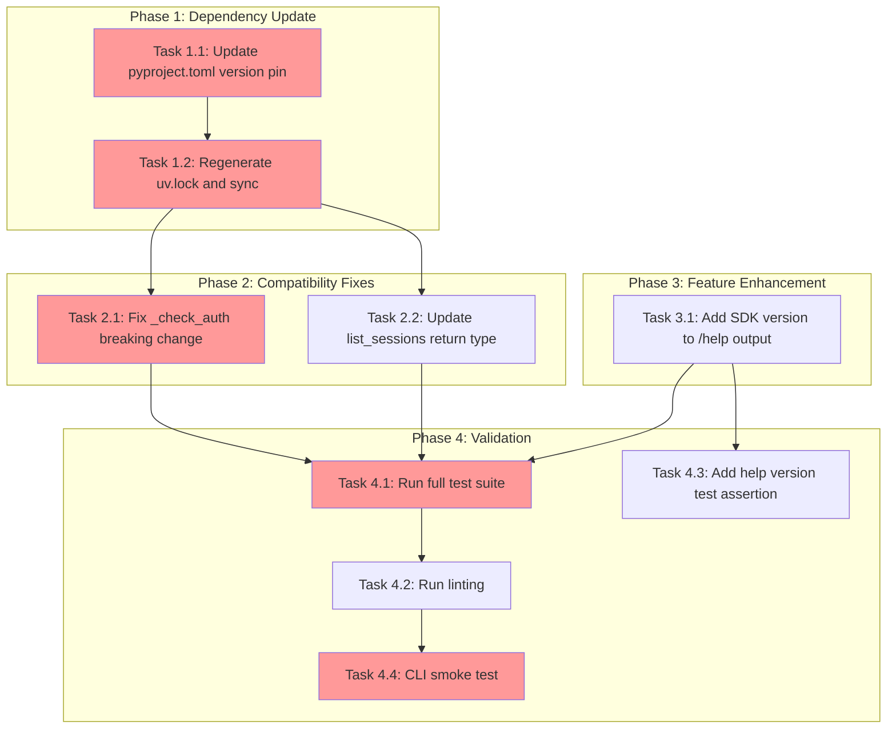

<!-- markdownlint-disable-file -->

# Implementation Plan: GitHub Copilot SDK Upgrade (0.1.16 → 0.1.23)

## Overview

Upgrade the pinned `github-copilot-sdk` dependency from `==0.1.16` to `==0.1.23`, adapt TeamBot source code to the one known breaking API change (`GetAuthStatusResponse` became a dataclass), and display the installed SDK version in the `/help` command output.

## Objectives

1. Update the dependency version pin in `pyproject.toml` and regenerate `uv.lock`
2. Fix the `_check_auth()` breaking change in `sdk_client.py`
3. Update the `list_sessions()` return type annotation for accuracy
4. Add SDK version display to the `/help` command output
5. Verify all existing tests pass and linting is clean

## Research Summary

- **Research**: `.agent-tracking/research/20260210-copilot-sdk-upgrade-research.md` (Lines 1-314)
- **Test Strategy**: `.agent-tracking/test-strategies/20260210-copilot-sdk-upgrade-test-strategy.md` (Lines 1-271)
- **Testing Approach**: Code-First (low complexity, low risk, mechanical changes)
- **Breaking Changes**: 1 identified — `GetAuthStatusResponse` changed from TypedDict to dataclass (Lines 90-115 of research)

## Task Dependency Graph

**Critical Path**: T1.1 → T1.2 → T2.1 → T4.1 → T4.2 → T4.4
**Parallel Opportunities**: T2.1 and T2.2 can run in parallel after T1.2; T3.1 can run in parallel with Phase 2

## Dependencies

- `uv` package manager (verified: v0.9.27)
- `github-copilot-sdk==0.1.23` available on PyPI
- Python ≥3.10 (verified: 3.12.12)
- Existing test suite (~1084 tests)

---

## Phase 1: Dependency Update

### Task 1.1: Update `pyproject.toml` version pin
- [ ] Edit `pyproject.toml` line 11: change `"github-copilot-sdk==0.1.16"` to `"github-copilot-sdk==0.1.23"`
- **Details**: Lines 8-25 of details file
- **File**: `pyproject.toml`

### Task 1.2: Regenerate lock file and sync
- [ ] Run `uv lock` to regenerate `uv.lock`
- [ ] Run `uv sync` to install the new SDK version
- [ ] Verify installed version: `uv run python -c "import importlib.metadata; print(importlib.metadata.version('github-copilot-sdk'))"`
- **Details**: Lines 27-44 of details file

### Phase Gate: Phase 1 Complete When
- [ ] `pyproject.toml` shows `github-copilot-sdk==0.1.23`
- [ ] `uv.lock` regenerated without errors
- [ ] `uv sync` completes without errors
- [ ] SDK version verified as `0.1.23` in the environment
- **Cannot Proceed If**: `uv lock` fails (dependency resolution error) or `uv sync` fails (download/install error)

---

## Phase 2: Compatibility Fixes

### Task 2.1: Fix `_check_auth()` breaking change
- [ ] Edit `src/teambot/copilot/sdk_client.py` line 125: change `status.get("isAuthenticated", False)` to `getattr(status, "isAuthenticated", False)`
- **Details**: Lines 46-80 of details file
- **File**: `src/teambot/copilot/sdk_client.py`

### Task 2.2: Update `list_sessions()` return type annotation
- [ ] Edit `src/teambot/copilot/sdk_client.py` line 477: change return type from `list[dict[str, Any]]` to `list[Any]`
- **Details**: Lines 82-104 of details file
- **File**: `src/teambot/copilot/sdk_client.py`

### Phase Gate: Phase 2 Complete When
- [ ] `_check_auth()` uses `getattr()` instead of `.get()`
- [ ] `list_sessions()` return type is `list[Any]`
- [ ] No syntax errors in `sdk_client.py`
- **Validation**: `uv run python -c "from teambot.copilot.sdk_client import CopilotSDKClient; print('import OK')"`
- **Cannot Proceed If**: Import errors after changes

---

## Phase 3: Feature Enhancement

### Task 3.1: Add SDK version to `/help` command output
- [ ] Add `import importlib.metadata` at top of `src/teambot/repl/commands.py`
- [ ] Modify `handle_help()` general help return (line 83-115): inject SDK version into the first line `"TeamBot Interactive Mode"` → `"TeamBot Interactive Mode (Copilot SDK: X.X.XX)"`
- [ ] Wrap version retrieval in try/except `PackageNotFoundError` with fallback to `"unknown"`
- **Details**: Lines 106-157 of details file
- **File**: `src/teambot/repl/commands.py`

### Phase Gate: Phase 3 Complete When
- [ ] `handle_help([])` output contains `"Copilot SDK:"`
- [ ] Version retrieval handles `PackageNotFoundError` gracefully
- **Validation**: `uv run python -c "from teambot.repl.commands import handle_help; r = handle_help([]); assert 'Copilot SDK:' in r.output; print('OK')"`
- **Cannot Proceed If**: Import errors or missing version in help output

---

## Phase 4: Validation

### Task 4.1: Run full test suite
- [ ] Run `uv run pytest` — expect all ~1084 tests to pass
- [ ] Verify 0 failures, 0 errors
- **Details**: Lines 159-180 of details file

### Task 4.2: Run linting
- [ ] Run `uv run ruff check .` — expect clean (exit code 0)
- [ ] Run `uv run ruff format --check .` — verify no formatting issues
- **Details**: Lines 182-195 of details file

### Task 4.3: Add help version test assertion
- [ ] Add new test in `tests/test_repl/test_commands.py` class `TestHelpCommand`: `test_help_shows_sdk_version` asserting `"Copilot SDK:" in result.output`
- [ ] Run test to verify it passes
- **Details**: Lines 197-224 of details file
- **File**: `tests/test_repl/test_commands.py`

### Task 4.4: CLI smoke test
- [ ] Run `uv run teambot --help` — verify no import errors
- [ ] Verify help text renders correctly
- **Details**: Lines 226-239 of details file

### Phase Gate: Phase 4 Complete When
- [ ] All tests pass (0 failures, 0 errors)
- [ ] Linting clean
- [ ] New help test passes
- [ ] CLI starts without errors
- **Cannot Proceed If**: Any test failure or lint error

---

## Effort Estimation

| Task | Estimated Effort | Complexity | Risk |
|------|-----------------|------------|------|
| T1.1: Update pyproject.toml | 2 min | LOW | LOW |
| T1.2: Regenerate lock/sync | 5 min | LOW | LOW |
| T2.1: Fix _check_auth() | 2 min | LOW | LOW |
| T2.2: Update list_sessions type | 2 min | LOW | LOW |
| T3.1: Add SDK version to help | 10 min | LOW | LOW |
| T4.1: Run test suite | 5 min | LOW | MEDIUM |
| T4.2: Run linting | 2 min | LOW | LOW |
| T4.3: Add help test | 5 min | LOW | LOW |
| T4.4: CLI smoke test | 2 min | LOW | LOW |

**Total Estimated Effort**: ~35 minutes

## Success Criteria

- [ ] `pyproject.toml` updated to depend on `github-copilot-sdk==0.1.23`
- [ ] `uv.lock` regenerated to reflect the new dependency version
- [ ] All existing tests pass (`uv run pytest`) with no regressions
- [ ] Linting passes (`uv run ruff check .`)
- [ ] Breaking API change adapted in `_check_auth()` (getattr)
- [ ] TeamBot CLI starts successfully (`uv run teambot --help`)
- [ ] `/help` command output includes installed `github-copilot-sdk` version
- [ ] New test assertion verifies SDK version in help output
