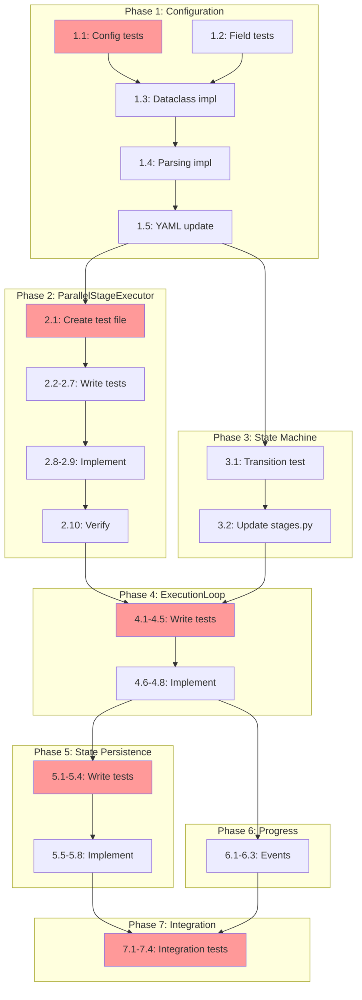

<!-- markdownlint-disable-file -->
# Implementation Plan: Parallel Stage Groups

## Overview

Implement parallel stage group execution for file-based orchestration, enabling `RESEARCH` and `TEST_STRATEGY` to execute concurrently after `SPEC_REVIEW` completes, with configurable groups in `stages.yaml` and proper state tracking for resume functionality.

## Objectives

1. Create a new `ParallelStageExecutor` class for concurrent stage execution
2. Add `parallel_groups` configuration schema to `stages.yaml`
3. Integrate parallel group detection and execution into `ExecutionLoop`
4. Update state persistence to track per-stage completion within parallel groups
5. Ensure backward compatibility with existing state files
6. Update state machine transitions for parallel fan-out
7. Add comprehensive test coverage per TDD approach

## Research Summary

- **Research Document**: `.agent-tracking/research/20260210-parallel-stage-groups-research.md` (Lines 1-855)
- **Test Strategy**: `.agent-tracking/test-strategies/20260210-parallel-stage-groups-test-strategy.md` (Lines 1-593)
- **Testing Approach**: TDD for core components, Code-First for config/progress events

## Dependencies

- Python 3.12+
- asyncio (standard library)
- pytest, pytest-asyncio, pytest-mock, pytest-cov (dev)
- Existing modules: `execution_loop.py`, `stage_config.py`, `stages.py`, `parallel_executor.py`

---

## Implementation Checklist

### Phase 1: Configuration Schema (TDD)
*Prerequisite: None*

- [x] **1.1** Write tests for `ParallelGroupConfig` dataclass parsing (Details: Lines 28-52)
- [x] **1.2** Write tests for `parallel_groups` field in `StagesConfiguration` (Details: Lines 53-68)
- [x] **1.3** Implement `ParallelGroupConfig` dataclass in `stage_config.py` (Details: Lines 69-95)
- [x] **1.4** Add `parallel_groups` parsing in `_parse_configuration()` (Details: Lines 96-125)
- [x] **1.5** Add `parallel_groups` section to `stages.yaml` (Details: Lines 126-145)

**Phase Gate: Phase 1 Complete When**
- [x] All config parsing tests pass
- [x] `uv run pytest tests/test_orchestration/test_stage_config.py -v` passes
- [x] `stages.yaml` parses without error
- [x] Validation: `uv run python -c "from teambot.orchestration.stage_config import load_stages_config; c = load_stages_config(); print(c.parallel_groups)"`

### Phase 2: ParallelStageExecutor (TDD)
*Prerequisite: Phase 1 complete*

- [x] **2.1** Create test file `tests/test_orchestration/test_parallel_stage_executor.py` (Details: Lines 148-180)
- [x] **2.2** Write test: `test_execute_parallel_empty_stages` (Details: Lines 181-195)
- [x] **2.3** Write test: `test_execute_parallel_single_stage` (Details: Lines 196-215)
- [x] **2.4** Write test: `test_execute_parallel_multiple_stages` (Details: Lines 216-240)
- [x] **2.5** Write test: `test_execute_parallel_partial_failure` (Details: Lines 241-270)
- [x] **2.6** Write test: `test_execute_parallel_respects_concurrency` (Details: Lines 271-295)
- [x] **2.7** Write test: `test_execute_parallel_progress_callbacks` (Details: Lines 296-320)
- [x] **2.8** Implement `StageResult` dataclass (Details: Lines 321-340)
- [x] **2.9** Implement `ParallelStageExecutor` class (Details: Lines 341-420)
- [x] **2.10** Verify all executor tests pass (Details: Lines 421-430)

**Phase Gate: Phase 2 Complete When**
- [x] All `test_parallel_stage_executor.py` tests pass
- [x] Coverage > 95% for `parallel_stage_executor.py`
- [x] Validation: `uv run pytest tests/test_orchestration/test_parallel_stage_executor.py --cov=src/teambot/orchestration/parallel_stage_executor --cov-report=term-missing`

### Phase 3: State Machine Updates (TDD)
*Prerequisite: Phase 1 complete (can run parallel with Phase 2)*

- [x] **3.1** Write test: `test_spec_review_next_stages_includes_both` (Details: Lines 433-450)
- [x] **3.2** Update `SPEC_REVIEW.next_stages` in `stages.py` to include both `RESEARCH` and `TEST_STRATEGY` (Details: Lines 451-470)
- [x] **3.3** Verify `RESEARCH` and `TEST_STRATEGY` both have `PLAN` as next stage (Details: Lines 471-485)

**Phase Gate: Phase 3 Complete When**
- [x] State machine transition tests pass
- [x] `can_transition_to(SPEC_REVIEW, RESEARCH)` returns True
- [x] `can_transition_to(SPEC_REVIEW, TEST_STRATEGY)` returns True

### Phase 4: ExecutionLoop Integration (TDD)
*Prerequisite: Phase 2, Phase 3 complete*

- [x] **4.1** Write test: `test_get_parallel_group_for_stage_returns_group` (Details: Lines 488-510)
- [x] **4.2** Write test: `test_get_parallel_group_for_stage_returns_none` (Details: Lines 511-530)
- [x] **4.3** Write test: `test_execute_parallel_group_calls_executor` (Details: Lines 531-560)
- [x] **4.4** Write test: `test_run_executes_parallel_group` (Details: Lines 561-595)
- [x] **4.5** Write test: `test_run_sequential_stages_unchanged` (regression) (Details: Lines 596-620)
- [x] **4.6** Implement `_get_parallel_group_for_stage()` method (Details: Lines 621-645)
- [x] **4.7** Implement `_execute_parallel_group()` method (Details: Lines 646-700)
- [x] **4.8** Modify `run()` main loop to check for parallel groups (Details: Lines 701-740)

**Phase Gate: Phase 4 Complete When**
- [x] All execution loop integration tests pass
- [x] Sequential stage behavior unchanged (regression tests pass)
- [x] Parallel group executes when triggered

### Phase 5: State Persistence & Resume (TDD)
*Prerequisite: Phase 4 complete*

- [x] **5.1** Write test: `test_save_state_includes_parallel_group_status` (Details: Lines 743-765)
- [x] **5.2** Write test: `test_resume_loads_parallel_group_status` (Details: Lines 766-790)
- [x] **5.3** Write test: `test_resume_backward_compat_missing_parallel_status` (Details: Lines 791-815)
- [x] **5.4** Write test: `test_resume_mid_parallel_group_skips_completed` (Details: Lines 816-850)
- [x] **5.5** Add `parallel_group_status` field to `ExecutionLoop.__init__` (Details: Lines 851-865)
- [x] **5.6** Update `_save_state()` to include `parallel_group_status` (Details: Lines 866-890)
- [x] **5.7** Update `resume()` classmethod for backward compatibility (Details: Lines 891-930)
- [x] **5.8** Implement `_filter_incomplete_stages()` for resume (Details: Lines 931-955)

**Phase Gate: Phase 5 Complete When**
- [x] All state persistence tests pass
- [x] Old state files without `parallel_group_status` load correctly
- [x] Resume mid-parallel-group only re-runs incomplete stages

### Phase 6: Progress Events (Code-First)
*Prerequisite: Phase 4 complete*

- [x] **6.1** Add new progress event types to `_execute_parallel_group()` (Details: Lines 958-980)
- [x] **6.2** Update `progress.py` callback handling for new events (Details: Lines 981-1005)
- [x] **6.3** Write tests for new event types (Details: Lines 1006-1030)

**Phase Gate: Phase 6 Complete When**
- [x] Progress events fire correctly during parallel execution
- [x] Console output shows parallel stage status

### Phase 7: Integration Testing
*Prerequisite: All previous phases complete*

- [x] **7.1** Write integration test: full workflow with parallel groups (Details: Lines 1033-1070)
- [x] **7.2** Write integration test: resume mid-parallel-group (Details: Lines 1071-1105)
- [x] **7.3** Write integration test: partial failure handling (Details: Lines 1106-1140)
- [x] **7.4** Run full test suite to verify no regressions (Details: Lines 1141-1155)

**Phase Gate: Phase 7 Complete When**
- [x] All integration tests pass
- [x] Full test suite passes (`uv run pytest`)
- [x] Coverage >= 85% for new code

### Phase 8: Final Validation
*Prerequisite: Phase 7 complete*

- [x] **8.1** Run linting: `uv run ruff check . --fix` (Details: Lines 1158-1165)
- [x] **8.2** Run formatting: `uv run ruff format .` (Details: Lines 1166-1170)
- [x] **8.3** Run full test suite with coverage (Details: Lines 1171-1180)
- [ ] **8.4** Manual validation: run `teambot run` with test objective (Details: Lines 1181-1195)

---

## Task Dependency Graph

**Critical Path**: T1.1 → T1.3 → T1.4 → T2.1 → T2.8 → T4.1 → T4.6 → T5.1 → T5.5 → T7.1

**Parallel Opportunities**: 
- Phase 2 and Phase 3 can run in parallel after Phase 1
- Phase 6 can start after Phase 4 while Phase 5 is in progress

---

## Success Criteria

1. ✅ `RESEARCH` and `TEST_STRATEGY` execute concurrently after `SPEC_REVIEW`
2. ✅ Parallel groups configured in `stages.yaml`, not hardcoded
3. ✅ New `ParallelStageExecutor` separate from agent-level `ParallelExecutor`
4. ✅ State machine tracks individual stage status within parallel groups
5. ✅ Resume mid-parallel-group only re-executes incomplete stages
6. ✅ Backward compatibility with old state files
7. ✅ Console visualization shows concurrent stages
8. ✅ Partial failure allows other stages to complete
9. ✅ All existing tests pass (no regressions)
10. ✅ New tests cover parallel execution, failure, resume, config

---

## Effort Estimation

| Phase | Estimated Effort | Complexity | Risk |
|-------|-----------------|------------|------|
| Phase 1: Configuration | 1 hour | LOW | LOW |
| Phase 2: ParallelStageExecutor | 2 hours | HIGH | MEDIUM |
| Phase 3: State Machine | 30 min | LOW | LOW |
| Phase 4: ExecutionLoop | 2 hours | HIGH | HIGH |
| Phase 5: State Persistence | 1.5 hours | MEDIUM | MEDIUM |
| Phase 6: Progress Events | 30 min | LOW | LOW |
| Phase 7: Integration Tests | 1 hour | MEDIUM | LOW |
| Phase 8: Validation | 30 min | LOW | LOW |

**Total Estimated Effort**: ~9 hours

---

## References

- Research Document: `.agent-tracking/research/20260210-parallel-stage-groups-research.md`
- Test Strategy: `.agent-tracking/test-strategies/20260210-parallel-stage-groups-test-strategy.md`
- Objective: Parallel stage groups objective (user request)
