<!-- markdownlint-disable-file -->

# Implementation Plan: Real-Time Notification System

## Overview

Implement a real-time notification system for TeamBot that sends notifications via Telegram when workflow stages complete, agent tasks finish, or errors occur. The system is designed with a pluggable `NotificationChannel` protocol for future extensibility.

## Objectives

1. Create a `NotificationChannel` protocol with `send()`, `format()`, and `poll()` methods
2. Implement a lightweight `EventBus` for decoupled event routing
3. Build a `TelegramChannel` for outbound-only notifications
4. Extend configuration schema with environment variable substitution
5. Add optional notification setup to `teambot init`
6. Ensure graceful failure handling without blocking workflows
7. Bump version from `0.1.0` to `0.2.0`

## Research Summary

- **Research**: `.agent-tracking/research/20260211-realtime-notifications-research.md` (Lines 1-1022)
- **Test Strategy**: `.agent-tracking/test-strategies/20260211-realtime-notifications-test-strategy.md` (Lines 1-660)
- **Testing Approach**: Hybrid (TDD for core, Code-First for HTTP integration)
- **22 Event Types**: Identified in orchestration layer (Lines 119-167 of research)

## Task Dependency Graph

```mermaid
graph TD
    subgraph Phase1[Phase 1: Core Infrastructure]
        T1.1[Task 1.1: Create module structure]
        T1.2[Task 1.2: Implement NotificationEvent]
        T1.3[Task 1.3: Implement NotificationChannel protocol]
        T1.4[Task 1.4: Implement EventBus]
        T1.5[Task 1.5: Write EventBus tests]
    end

    subgraph Phase2[Phase 2: Telegram Channel]
        T2.1[Task 2.1: Add httpx dependency]
        T2.2[Task 2.2: Implement MessageTemplates]
        T2.3[Task 2.3: Implement TelegramChannel]
        T2.4[Task 2.4: Write TelegramChannel tests]
    end

    subgraph Phase3[Phase 3: Configuration]
        T3.1[Task 3.1: Implement env var resolver]
        T3.2[Task 3.2: Add notification config validation]
        T3.3[Task 3.3: Write config tests]
    end

    subgraph Phase4[Phase 4: Integration]
        T4.1[Task 4.1: Create EventBus factory]
        T4.2[Task 4.2: Integrate with on_progress]
        T4.3[Task 4.3: Add notification setup to init]
    end

    subgraph Phase5[Phase 5: Finalization]
        T5.1[Task 5.1: Bump version to 0.2.0]
        T5.2[Task 5.2: Run full test suite]
        T5.3[Task 5.3: Verify coverage targets]
    end

    T1.1 --> T1.2
    T1.2 --> T1.3
    T1.3 --> T1.4
    T1.4 --> T1.5
    T1.5 --> T2.1
    T2.1 --> T2.2
    T2.2 --> T2.3
    T2.3 --> T2.4
    T2.4 --> T3.1
    T3.1 --> T3.2
    T3.2 --> T3.3
    T3.3 --> T4.1
    T4.1 --> T4.2
    T4.2 --> T4.3
    T4.3 --> T5.1
    T5.1 --> T5.2
    T5.2 --> T5.3

    %% Critical Path
    style T1.4 fill:#ff9999
    style T2.3 fill:#ff9999
    style T4.2 fill:#ff9999
```

**Critical Path**: EventBus → TelegramChannel → Integration with on_progress

## Dependencies

- Python ≥3.10 (verified: 3.12.12)
- `httpx>=0.27.0` (to be added)
- Existing test suite (~1084 tests)
- `uv` package manager

---

## Phase 1: Core Infrastructure

### Task 1.1: Create module structure
- [x] Create `src/teambot/notifications/__init__.py`
- [x] Create `src/teambot/notifications/protocol.py`
- [x] Create `src/teambot/notifications/events.py`
- [x] Create `src/teambot/notifications/event_bus.py`
- [x] Create `src/teambot/notifications/templates.py`
- [x] Create `src/teambot/notifications/channels/__init__.py`
- **Details**: Lines 10-40 of details file
- **Testing**: TDD

### Task 1.2: Implement NotificationEvent dataclass
- [x] Define `NotificationEvent` in `events.py`
- [x] Add fields: `event_type`, `data`, `timestamp`, `stage`, `agent`, `feature_name`
- [x] Write tests for NotificationEvent
- **Details**: Lines 42-75 of details file
- **File**: `src/teambot/notifications/events.py`
- **Testing**: TDD

### Task 1.3: Implement NotificationChannel protocol
- [x] Define `NotificationChannel` Protocol in `protocol.py`
- [x] Add properties: `name`, `enabled`
- [x] Add methods: `send()`, `format()`, `supports_event()`, `poll()`
- [x] Write tests for protocol
- **Details**: Lines 77-130 of details file
- **File**: `src/teambot/notifications/protocol.py`
- **Testing**: TDD

### Task 1.4: Implement EventBus
- [x] Implement `EventBus` class with `subscribe()`, `unsubscribe()`, `emit()`
- [x] Add async fire-and-forget semantics
- [x] Add retry with exponential backoff for rate limits
- **Details**: Lines 132-210 of details file
- **File**: `src/teambot/notifications/event_bus.py`
- **Testing**: TDD

### Task 1.5: Write EventBus tests
- [x] Create `tests/test_notifications/__init__.py`
- [x] Create `tests/test_notifications/conftest.py`
- [x] Create `tests/test_notifications/test_event_bus.py`
- [x] Test subscribe/unsubscribe
- [x] Test emit to subscribed channels
- [x] Test skip disabled channels
- [x] Test retry on rate limit
- **Details**: Lines 212-280 of details file
- **Testing**: TDD

### Phase Gate: Phase 1 Complete When
- [x] Module structure created
- [x] NotificationEvent tests pass
- [x] NotificationChannel protocol tests pass
- [x] EventBus tests pass (95% coverage target)
- **Validation**: `uv run pytest tests/test_notifications/ -v`
- **Cannot Proceed If**: EventBus tests fail

---

## Phase 2: Telegram Channel

### Task 2.1: Add httpx dependency
- [x] Add `"httpx>=0.27.0"` to `pyproject.toml` dependencies
- [x] Run `uv lock && uv sync`
- [x] Verify import: `uv run python -c "import httpx; print(httpx.__version__)"`
- **Details**: Lines 282-305 of details file
- **File**: `pyproject.toml`

### Task 2.2: Implement MessageTemplates
- [x] Create template strings for each event type
- [x] Implement `render()` method with substitution
- [x] Support emoji status indicators
- [x] Handle missing template keys gracefully
- [x] Write tests for templates
- **Details**: Lines 307-380 of details file
- **File**: `src/teambot/notifications/templates.py`
- **Testing**: TDD

### Task 2.3: Implement TelegramChannel
- [x] Create `src/teambot/notifications/channels/telegram.py`
- [x] Implement `TelegramChannel` class
- [x] Add env var resolution for token/chat_id
- [x] Add `dry_run` mode
- [x] Implement retry with exponential backoff for 429
- **Details**: Lines 382-480 of details file
- **File**: `src/teambot/notifications/channels/telegram.py`
- **Testing**: Code-First

### Task 2.4: Write TelegramChannel tests
- [x] Create `tests/test_notifications/test_telegram.py`
- [x] Test successful send (mocked httpx)
- [x] Test dry_run mode
- [x] Test missing credentials
- [x] Test rate limit retry
- [x] Test error handling
- **Details**: Lines 482-550 of details file
- **Testing**: Code-First (mocked HTTP)

### Phase Gate: Phase 2 Complete When
- [x] httpx installed successfully
- [x] MessageTemplates tests pass (100% coverage)
- [x] TelegramChannel tests pass (90% coverage target)
- **Validation**: `uv run pytest tests/test_notifications/ -v`
- **Cannot Proceed If**: TelegramChannel send tests fail

---

## Phase 3: Configuration

### Task 3.1: Implement env var resolver
- [x] Create `src/teambot/notifications/config.py`
- [x] Implement `resolve_env_vars()` function
- [x] Implement `resolve_config_secrets()` for nested dicts
- [x] Write tests for env var resolution
- **Details**: Lines 552-610 of details file
- **File**: `src/teambot/notifications/config.py`
- **Testing**: TDD

### Task 3.2: Add notification config validation
- [ ] Add `_validate_notifications()` to `ConfigLoader`
- [ ] Validate channel types, required fields
- [ ] Update `_apply_defaults()` for notifications
- [ ] Add `NOTIFICATION_CHANNEL_TYPES` constant
- **Details**: Lines 612-690 of details file
- **File**: `src/teambot/config/loader.py`
- **Testing**: TDD

### Task 3.3: Write config validation tests
- [x] Add tests to `tests/test_notifications/test_config.py`
- [ ] Add tests to `tests/test_config/test_loader.py` for validation
- [x] Test valid notifications config
- [ ] Test invalid channel type
- [ ] Test missing required fields
- [x] Test dry_run validation
- **Details**: Lines 692-760 of details file
- **Testing**: TDD

### Phase Gate: Phase 3 Complete When
- [x] Env var resolver tests pass (100%)
- [x] Config validation tests pass (100%)
- [x] Existing config tests still pass
- **Validation**: `uv run pytest tests/test_config/ tests/test_notifications/ -v`
- **Cannot Proceed If**: Config validation breaks existing tests

---

## Phase 4: Integration

### Task 4.1: Create EventBus factory
- [x] Add `create_event_bus_from_config()` function
- [x] Load channels based on config type
- [x] Apply event filters from config
- **Details**: Lines 762-820 of details file
- **File**: `src/teambot/notifications/config.py`
- **Testing**: Code-First

### Task 4.2: Integrate EventBus with on_progress
- [x] Modify `_run_orchestration()` in `cli.py`
- [x] Create EventBus wrapper around on_progress callback
- [x] Ensure non-blocking dispatch
- **Details**: Lines 822-890 of details file
- **File**: `src/teambot/cli.py`
- **Testing**: Code-First

### Task 4.3: Add notification setup to cmd_init()
- [x] Add `_should_setup_notifications()` function
- [x] Add `_setup_telegram_notifications()` wizard
- [x] Update `cmd_init()` to call setup functions
- [x] Output env var instructions
- **Details**: Lines 892-980 of details file
- **File**: `src/teambot/cli.py`
- **Testing**: Code-First

### Phase Gate: Phase 4 Complete When
- [x] EventBus factory creates channels from config
- [x] on_progress integration doesn't break existing workflow
- [x] cmd_init notification wizard works
- **Validation**: `uv run pytest tests/test_cli.py -v`
- **Cannot Proceed If**: Existing CLI tests fail

---

## Phase 5: Finalization

### Task 5.1: Bump version to 0.2.0
- [x] Update `src/teambot/__init__.py` version to `"0.2.0"`
- **Details**: Lines 982-995 of details file
- **File**: `src/teambot/__init__.py`

### Task 5.2: Run full test suite
- [x] Run `uv run pytest` - all tests must pass
- [x] Run `uv run ruff check .` - no lint errors
- [x] Run `uv run ruff format --check .` - no format issues
- **Details**: Lines 997-1020 of details file

### Task 5.3: Verify coverage targets
- [x] Run `uv run pytest --cov=src/teambot/notifications --cov-report=term-missing`
- [x] Verify 90%+ overall coverage for notifications module
- [x] Verify EventBus 95%+, TelegramChannel 90%+
- **Details**: Lines 1022-1050 of details file

### Phase Gate: Phase 5 Complete When
- [x] Version is 0.2.0
- [x] All ~1100+ tests pass (1298 passed)
- [x] Linting clean
- [x] Coverage targets met (EventBus 100%, TelegramChannel 94%)
- **Validation**: Full test suite + coverage report

---

## Effort Estimation

| Task | Estimated Effort | Complexity | Risk |
|------|------------------|------------|------|
| T1.1: Module structure | 5 min | LOW | LOW |
| T1.2: NotificationEvent | 10 min | LOW | LOW |
| T1.3: Protocol | 15 min | MEDIUM | LOW |
| T1.4: EventBus | 30 min | MEDIUM | MEDIUM |
| T1.5: EventBus tests | 30 min | MEDIUM | LOW |
| T2.1: Add httpx | 5 min | LOW | LOW |
| T2.2: Templates | 25 min | MEDIUM | LOW |
| T2.3: TelegramChannel | 40 min | HIGH | MEDIUM |
| T2.4: Telegram tests | 30 min | MEDIUM | LOW |
| T3.1: Env resolver | 15 min | LOW | LOW |
| T3.2: Config validation | 25 min | MEDIUM | LOW |
| T3.3: Config tests | 20 min | LOW | LOW |
| T4.1: EventBus factory | 15 min | LOW | LOW |
| T4.2: on_progress integration | 30 min | MEDIUM | MEDIUM |
| T4.3: Init wizard | 25 min | MEDIUM | LOW |
| T5.1: Version bump | 2 min | LOW | LOW |
| T5.2: Test suite | 10 min | LOW | LOW |
| T5.3: Coverage | 10 min | LOW | LOW |

**Total Estimated Effort**: ~5-6 hours
**Critical Path Effort**: ~2.5 hours

---

## Risk Management

| Risk | Mitigation |
|------|------------|
| EventBus blocks workflow | Fire-and-forget with `asyncio.create_task()` |
| Rate limit handling | Exponential backoff with max 3 retries |
| Missing credentials | Graceful degradation, log warning |
| Breaking existing tests | Run full suite after each phase |
| httpx compatibility | Use stable version (0.27.0+) |

---

## Completion Criteria

Implementation is complete when:
- [ ] All 5 phases marked complete
- [ ] All ~1100+ tests pass
- [ ] Coverage targets met (90%+ for notifications module)
- [ ] Linting clean
- [ ] Version is 0.2.0
- [ ] Changes log includes Release Summary
