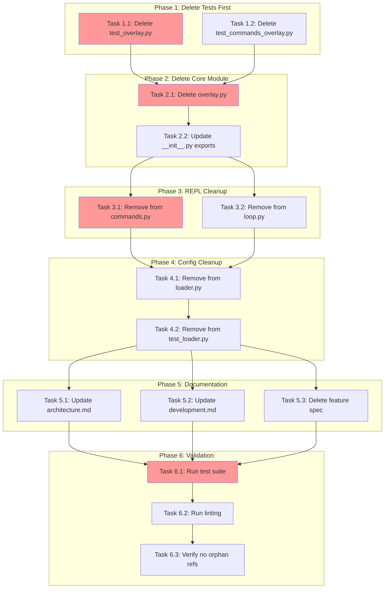

<!-- markdownlint-disable-file -->

# Remove Overlay Feature - Implementation Plan

**Date**: 2026-02-13
**Feature**: Remove Overlay
**Status**: Ready for Implementation
**Research**: `.teambot/remove-overlay/artifacts/research.md`
**Test Strategy**: `.teambot/remove-overlay/artifacts/test_strategy.md`

---

## Overview

Remove the unused persistent status overlay feature from TeamBot to reduce codebase complexity and maintenance burden. This involves deleting ~1,315 lines of code (603 source + 712 test) and cleaning up all integration points.

## Objectives

| ID | Objective | Metric |
|----|-----------|--------|
| O-001 | Delete all overlay source code | 0 lines of overlay code remaining |
| O-002 | Delete all overlay tests | 0 overlay-specific tests |
| O-003 | Clean up all integrations | No orphan imports |
| O-004 | Update documentation | No stale overlay references |
| O-005 | Maintain test coverage | 80%+ coverage maintained |

## Research Summary

- **Total Lines to Delete**: ~1,315 (603 source + 712 test)
- **Files to Delete**: 4 (overlay.py, 2 test files, feature spec)
- **Files to Modify**: 8 (init, commands, loop, loader, test_loader, 2 docs)
- **Approach**: Sequential deletion with incremental testing
- **Risk Level**: Low (well-isolated feature)

---

## Task Dependency Graph



**Critical Path**: T1.1 → T2.1 → T2.2 → T3.1 → T4.1 → T4.2 → T5.1 → T6.1 → T6.2 → T6.3
**Parallel Opportunities**: T1.1 + T1.2 | T3.1 + T3.2 | T5.1 + T5.2 + T5.3

---

## Implementation Checklist

### Phase 1: Delete Overlay Tests (Details Lines 1-45)

Delete test files first to avoid import errors during module deletion.

- [x] **Task 1.1**: Delete `tests/test_visualization/test_overlay.py` (571 lines)
- [x] **Task 1.2**: Delete `tests/test_repl/test_commands_overlay.py` (141 lines)
- [x] **Verify**: Run `uv run pytest tests/test_visualization/ tests/test_repl/` to confirm no import errors

### Phase Gate: Phase 1 Complete When
- [x] Both test files deleted
- [ ] No blocking dependencies for Phase 2
- [ ] Validation: `ls tests/test_visualization/test_overlay.py 2>&1 | grep -q "No such file"`
- [ ] Artifacts: 2 test files removed

**Cannot Proceed If**: Test files still exist

---

### Phase 2: Delete Core Overlay Module (Details Lines 47-95)

Delete the main overlay module and clean up visualization exports.

- [x] **Task 2.1**: Delete `src/teambot/visualization/overlay.py` (603 lines)
- [x] **Task 2.2**: Update `src/teambot/visualization/__init__.py` - remove overlay imports and exports
- [x] **Verify**: Run `uv run ruff check src/teambot/visualization/` - no import errors

### Phase Gate: Phase 2 Complete When
- [x] overlay.py deleted
- [x] __init__.py updated (no overlay references)
- [ ] Validation: `uv run ruff check src/teambot/visualization/`
- [ ] Artifacts: overlay.py removed, __init__.py modified

**Cannot Proceed If**: Import errors in visualization module

---

### Phase 3: REPL Integration Cleanup (Details Lines 97-170)

Remove overlay integration from REPL commands and loop.

- [x] **Task 3.1**: Update `src/teambot/repl/commands.py` - remove all overlay references
  - [x] Remove `/overlay` from module docstring
  - [x] Remove TYPE_CHECKING import of OverlayRenderer
  - [x] Remove `/overlay` from `/help` output
  - [x] Delete `handle_overlay()` function (lines 536-602)
  - [x] Remove `overlay` parameter from SystemCommands.__init__
  - [x] Remove `self._overlay` assignment
  - [x] Delete `set_overlay()` method
  - [x] Remove `"overlay"` from handlers dict
  - [x] Delete `overlay()` property method

- [x] **Task 3.2**: Update `src/teambot/repl/loop.py` - remove all overlay references
  - [x] Remove overlay import statement
  - [x] Remove "Persistent status overlay" from docstring
  - [x] Remove `enable_overlay` parameter
  - [x] Remove overlay configuration/initialization block
  - [x] Update `_on_task_complete()` to use console.print
  - [x] Update `_on_task_started()` to remove overlay call
  - [x] Remove `_on_stage_change()` and `_on_pipeline_complete()` overlay calls
  - [x] Update `_on_stage_output()` to use console.print
  - [x] Remove overlay startup/supported checks
  - [x] Remove overlay cleanup in `_cleanup()`

- [x] **Verify**: Run `uv run pytest tests/test_repl/` - REPL tests pass

### Phase Gate: Phase 3 Complete When
- [x] commands.py has no overlay references
- [x] loop.py has no overlay references
- [ ] Validation: `grep -c "overlay" src/teambot/repl/*.py` returns 0
- [ ] Artifacts: commands.py modified, loop.py modified

**Cannot Proceed If**: REPL tests fail

---

### Phase 4: Config Loader Cleanup (Details Lines 172-220)

Remove overlay configuration validation and tests.

- [x] **Task 4.1**: Update `src/teambot/config/loader.py` - remove overlay handling
  - [x] Delete `VALID_OVERLAY_POSITIONS` constant
  - [x] Remove overlay validation call from `_validate()`
  - [x] Delete `_validate_overlay()` method entirely
  - [x] Remove overlay defaults from `_apply_defaults()`

- [x] **Task 4.2**: Update `tests/test_config/test_loader.py` - remove overlay tests
  - [x] Delete entire `TestOverlayConfig` class (~80 lines)

- [x] **Verify**: Run `uv run pytest tests/test_config/` - config tests pass

### Phase Gate: Phase 4 Complete When
- [x] loader.py has no overlay validation
- [x] test_loader.py has no overlay tests
- [ ] Validation: `uv run pytest tests/test_config/`
- [ ] Artifacts: loader.py modified, test_loader.py modified

**Cannot Proceed If**: Config tests fail

---

### Phase 5: Documentation Cleanup (Details Lines 222-265)

Remove overlay references from documentation.

- [x] **Task 5.1**: Update `docs/guides/architecture.md`
  - [x] Remove "Status Overlay Updates" from diagram
  - [x] Remove overlay bullet point from Features list
  - [x] Delete "Status Overlay" section

- [x] **Task 5.2**: Update `docs/guides/development.md`
  - [x] Remove "status overlay" from visualization package description

- [x] **Task 5.3**: Delete `docs/feature-specs/persistent-status-overlay.md`

- [x] **Verify**: Run `grep -r "overlay" docs/` - no matches (or only intentional)

### Phase Gate: Phase 5 Complete When
- [x] architecture.md has no overlay references
- [x] development.md has no overlay references
- [x] Feature spec deleted
- [ ] Validation: `grep -ri "overlay" docs/`
- [ ] Artifacts: 2 docs modified, 1 doc deleted

**Cannot Proceed If**: Stale overlay references in docs

---

### Phase 6: Final Validation (Details Lines 267-310)

Run comprehensive validation to confirm clean removal.

- [x] **Task 6.1**: Run full test suite
  ```bash
  uv run pytest
  ```
  - [x] All tests pass (1391 passed)
  - [x] No import errors
  - [x] Coverage ≥ 80% (82% achieved)

- [x] **Task 6.2**: Run linting and formatting
  ```bash
  uv run ruff check .
  uv run ruff format -- .
  ```
  - [x] No lint errors
  - [x] Code properly formatted

- [x] **Task 6.3**: Verify no orphan overlay references
  ```bash
  grep -ri "overlay" src/teambot/ --include="*.py"
  grep -ri "overlay" tests/ --include="*.py"
  ```
  - [x] No matches in source code
  - [x] No matches in tests

### Phase Gate: Phase 6 Complete When
- [x] All tests pass (uv run pytest)
- [x] Linting passes (uv run ruff check .)
- [x] No orphan references (grep returns empty)
- [x] Validation: Exit code 0 for all commands
- [x] Artifacts: Clean codebase

**Cannot Proceed If**: Any validation fails

---

## Dependencies

| Dependency | Type | Status |
|------------|------|--------|
| Python 3.10+ | Tool | Available |
| uv | Tool | Available |
| pytest | Tool | Available |
| ruff | Tool | Available |
| Git | Tool | Available |

---

## Success Criteria

| Criterion | Verification | Status |
|-----------|-------------|--------|
| All overlay code deleted | `find . -name "overlay.py"` returns nothing | ⬜ |
| All overlay tests deleted | `find tests -name "*overlay*"` returns nothing | ⬜ |
| Feature spec deleted | `ls docs/feature-specs/persistent-status-overlay.md` fails | ⬜ |
| Full test suite passes | `uv run pytest` exits 0 | ⬜ |
| Linting passes | `uv run ruff check .` exits 0 | ⬜ |
| No orphan imports | `grep -ri "overlay" src/` empty | ⬜ |
| Documentation updated | `grep -ri "overlay" docs/guides/` empty | ⬜ |
| Coverage maintained | ≥ 80% coverage | ⬜ |

---

## Effort Estimation

| Task | Estimated Effort | Complexity | Risk |
|------|-----------------|------------|------|
| T1.1-1.2 | 10 min | LOW | LOW |
| T2.1-2.2 | 10 min | LOW | LOW |
| T3.1-3.2 | 30 min | MEDIUM | MEDIUM |
| T4.1-4.2 | 15 min | LOW | LOW |
| T5.1-5.3 | 15 min | LOW | LOW |
| T6.1-6.3 | 15 min | LOW | LOW |
| **Total** | **~1.5 hours** | - | - |

---

## Rollback Plan

If issues arise at any phase:
```bash
git checkout -- .
# or specific files
git checkout -- src/teambot/visualization/overlay.py
git checkout -- tests/test_visualization/test_overlay.py
```

---

## References

| Ref | Document | Path |
|-----|----------|------|
| Research | Research Document | `.teambot/remove-overlay/artifacts/research.md` |
| Test Strategy | Test Strategy | `.teambot/remove-overlay/artifacts/test_strategy.md` |
| Feature Spec | Specification | `.teambot/remove-overlay/artifacts/feature_spec.md` |
| Details | Implementation Details | `.agent-tracking/details/20260213-remove-overlay-details.md` |
