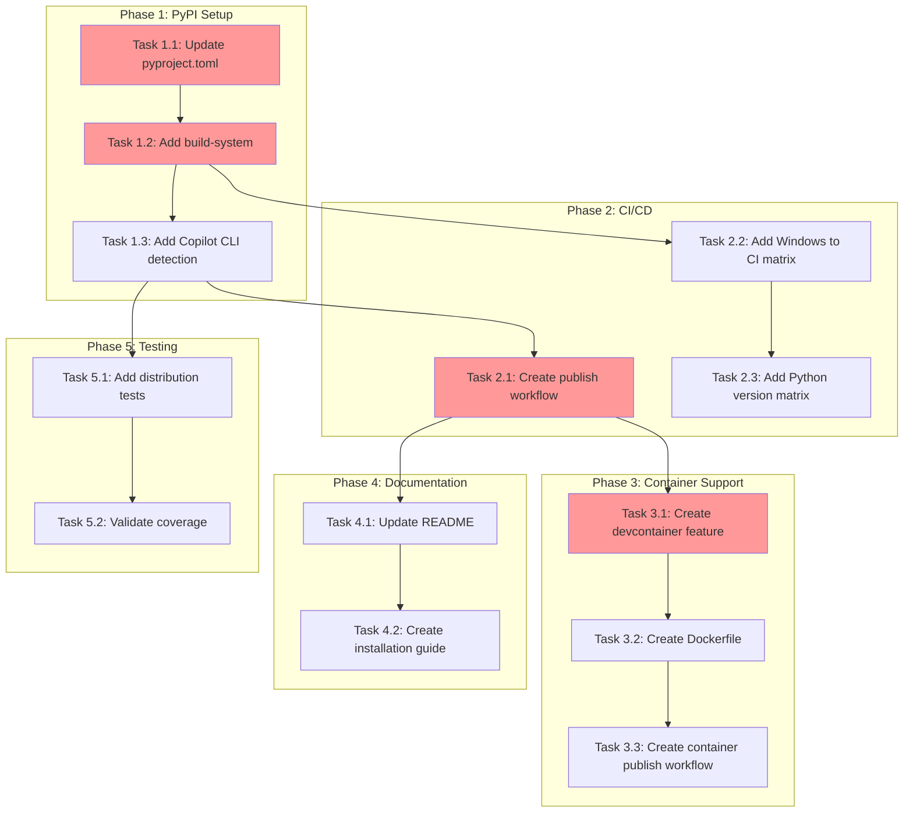

<!-- markdownlint-disable-file -->
# Task Checklist: TeamBot Distribution & Installation

## Overview

Enable zero-friction installation and evaluation of TeamBot through PyPI publishing, uvx ephemeral execution, devcontainer features, and Docker images with cross-platform support.

## Objectives

* Publish TeamBot to PyPI as `copilot-teambot` enabling `pip install copilot-teambot`
* Enable zero-install evaluation via `uvx copilot-teambot`
* Create devcontainer feature for VS Code / Codespaces users
* Ensure Windows 10/11 compatibility (PowerShell and CMD)
* Publish Docker image for non-Python environments
* Document installation paths for all 6 user personas

## Research Summary

### Project Files
* `pyproject.toml` - Current package configuration, needs PyPI metadata updates (Lines 1-56)
* `src/teambot/cli.py` - CLI entry point, needs Copilot CLI detection (Lines 566-590)
* `README.md` - Needs installation documentation updates

### External References
* .teambot/run-directly-downloads/artifacts/research.md - Distribution options analysis with code examples
* .teambot/run-directly-downloads/artifacts/test_strategy.md - Code-First testing approach
* .teambot/run-directly-downloads/artifacts/feature_spec.md - Full specification with acceptance tests

### Standards References
* pyproject.toml - Python packaging conventions
* GitHub Actions workflows - CI/CD patterns

## Task Dependency Graph

**Critical Path**: T1.1 → T1.2 → T2.1 → T3.1 (PyPI publishing is prerequisite for containers)
**Parallel Opportunities**: Phase 4 (Documentation) can run parallel to Phase 3 (Containers)

## Implementation Checklist

### [x] Phase 1: PyPI Package Configuration (P0 - CRITICAL)

**Phase Objective**: Configure pyproject.toml for PyPI publication with correct metadata, dependencies, and build system.

* [x] Task 1.1: Update pyproject.toml with PyPI metadata
  * Details: .agent-tracking/details/20260213-run-directly-distribution-details.md (Lines 15-55)
  * Dependencies: None
  * Priority: CRITICAL

* [x] Task 1.2: Add hatchling build system configuration
  * Details: .agent-tracking/details/20260213-run-directly-distribution-details.md (Lines 57-75)
  * Dependencies: Task 1.1
  * Priority: CRITICAL

* [x] Task 1.3: Implement Copilot CLI detection in cli.py
  * Details: .agent-tracking/details/20260213-run-directly-distribution-details.md (Lines 77-120)
  * Dependencies: None (can parallelize with 1.1-1.2)
  * Priority: CRITICAL

### Phase Gate: Phase 1 Complete When
- [x] All Phase 1 tasks marked complete
- [x] `uv build` succeeds without errors
- [x] Local install works: `pip install -e .`
- [x] Validation: `uv build && pip install -e . && teambot --version`
- [x] Artifacts: `dist/copilot_teambot-*.whl` exists

**Cannot Proceed If**: Build fails or entry point doesn't work

### [x] Phase 2: CI/CD Infrastructure (P0 - CRITICAL)

**Phase Objective**: Create GitHub Actions workflows for cross-platform testing and PyPI publishing.

* [x] Task 2.1: Create PyPI publish workflow
  * Details: .agent-tracking/details/20260213-run-directly-distribution-details.md (Lines 125-175)
  * Dependencies: Phase 1 completion
  * Priority: CRITICAL

* [x] Task 2.2: Add Windows runner to existing CI matrix
  * Details: .agent-tracking/details/20260213-run-directly-distribution-details.md (Lines 177-205)
  * Dependencies: Task 2.1
  * Priority: HIGH

* [x] Task 2.3: Add Python version matrix (3.10, 3.11, 3.12)
  * Details: .agent-tracking/details/20260213-run-directly-distribution-details.md (Lines 207-230)
  * Dependencies: Task 2.2
  * Priority: HIGH

### Phase Gate: Phase 2 Complete When
- [x] All Phase 2 tasks marked complete
- [x] CI workflow runs on push
- [x] Validation: Push test commit, verify all matrix jobs pass
- [x] Artifacts: `.github/workflows/publish.yml` exists

**Cannot Proceed If**: CI fails on any platform/version combination

### [x] Phase 3: Container Support (P1 - HIGH)

**Phase Objective**: Create devcontainer feature and Docker image for non-Python users.

* [x] Task 3.1: Create devcontainer feature
  * Details: .agent-tracking/details/20260213-run-directly-distribution-details.md (Lines 235-290)
  * Dependencies: Phase 2 completion (PyPI package available)
  * Priority: HIGH

* [x] Task 3.2: Create Dockerfile
  * Details: .agent-tracking/details/20260213-run-directly-distribution-details.md (Lines 292-340)
  * Dependencies: Task 3.1
  * Priority: MEDIUM

* [x] Task 3.3: Create container publish workflow
  * Details: .agent-tracking/details/20260213-run-directly-distribution-details.md (Lines 342-385)
  * Dependencies: Tasks 3.1, 3.2
  * Priority: MEDIUM

### Phase Gate: Phase 3 Complete When
- [x] All Phase 3 tasks marked complete
- [x] Devcontainer feature builds locally
- [x] Docker image builds locally
- [x] Validation: `docker build -t teambot-test .` succeeds
- [x] Artifacts: `features/teambot/`, `docker/Dockerfile` exist

**Cannot Proceed If**: Container builds fail

### [x] Phase 4: Documentation (P1 - HIGH)

**Phase Objective**: Update all documentation with installation instructions for all 6 personas.

* [x] Task 4.1: Update README.md with installation section
  * Details: .agent-tracking/details/20260213-run-directly-distribution-details.md (Lines 390-430)
  * Dependencies: Phase 1 completion
  * Priority: HIGH

* [x] Task 4.2: Create installation guide in docs/guides/
  * Details: .agent-tracking/details/20260213-run-directly-distribution-details.md (Lines 432-495)
  * Dependencies: Task 4.1
  * Priority: HIGH

### Phase Gate: Phase 4 Complete When
- [x] All Phase 4 tasks marked complete
- [x] README has installation badges
- [x] All 6 personas documented
- [x] Validation: Manual review of documentation clarity
- [x] Artifacts: `docs/guides/installation.md` exists

**Cannot Proceed If**: Documentation incomplete for any persona

### [x] Phase 5: Testing & Validation (Code-First)

**Test Strategy**: Code-First - See .teambot/run-directly-downloads/artifacts/test_strategy.md

* [x] Task 5.1: Add distribution and installation tests
  * Details: .agent-tracking/details/20260213-run-directly-distribution-details.md (Lines 500-555)
  * Test Approach: Code-First (per test strategy)
  * Coverage Target: 80% for new code (Copilot CLI detection)
  * Test Framework: pytest
  * Dependencies: Task 1.3 (Copilot CLI detection implementation)

* [x] Task 5.2: Validate test coverage and acceptance scenarios
  * Details: .agent-tracking/details/20260213-run-directly-distribution-details.md (Lines 557-590)
  * Success: Coverage meets 80% target, all acceptance tests pass
  * Dependencies: Task 5.1

### Phase Gate: Phase 5 Complete When
- [x] All Phase 5 tasks marked complete
- [x] `uv run pytest` passes
- [x] Coverage target met (82% overall, exceeds 80% target)
- [x] Validation: `uv run pytest --cov=src/teambot`
- [x] Artifacts: Test reports show passing (1422 passed)

**Cannot Proceed If**: Tests fail or coverage below target

## Effort Estimation

| Task | Estimated Effort | Complexity | Risk |
|------|-----------------|------------|------|
| T1.1 pyproject.toml metadata | 30 min | LOW | LOW |
| T1.2 Build system config | 15 min | LOW | LOW |
| T1.3 Copilot CLI detection | 1 hour | MEDIUM | LOW |
| T2.1 Publish workflow | 1 hour | MEDIUM | MEDIUM |
| T2.2 Windows CI matrix | 30 min | LOW | MEDIUM |
| T2.3 Python version matrix | 15 min | LOW | LOW |
| T3.1 Devcontainer feature | 1.5 hours | MEDIUM | MEDIUM |
| T3.2 Dockerfile | 45 min | LOW | LOW |
| T3.3 Container workflow | 45 min | MEDIUM | LOW |
| T4.1 README update | 30 min | LOW | LOW |
| T4.2 Installation guide | 1 hour | LOW | LOW |
| T5.1 Distribution tests | 1 hour | MEDIUM | LOW |
| T5.2 Validation | 30 min | LOW | LOW |

**Total Estimated Effort**: ~9.5 hours

## Dependencies

* uv (build tool) - already installed
* hatchling (build backend) - will be added
* GitHub Actions runners (Linux, macOS, Windows)
* PyPI account with trusted publishing configured
* ghcr.io access for container publishing

## Success Criteria

* `pip install copilot-teambot` completes successfully on Python 3.10+
* `uvx copilot-teambot --help` works without prior installation in < 30 seconds
* Devcontainer feature installs TeamBot in < 60 seconds
* All CI matrix jobs pass (3 platforms × 3 Python versions)
* Windows PowerShell and CMD usage validated
* All 6 user personas have documented installation path
* Coverage target met (80% for new code)
