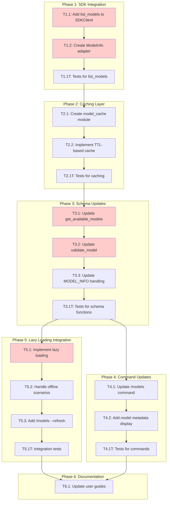

<!-- markdownlint-disable-file -->
# Implementation Plan: Dynamic Model Discovery

**Date**: 2026-02-16  
**Feature**: Dynamic Model Discovery via Copilot SDK  
**Problem**: Static `VALID_MODELS` list becomes outdated when new models are added to Copilot CLI

---

## Overview

Replace the static `VALID_MODELS` set in `config/schema.py` with dynamic model discovery using the Copilot SDK's `list_models()` API. This ensures TeamBot always has access to the latest available models without requiring code changes.

## Objectives

1. Add `list_models()` wrapper to `CopilotSDKClient`
2. Create a model cache with configurable TTL for offline/startup scenarios
3. Update `get_available_models()` to use dynamic discovery with static fallback
4. Update `validate_model()` to check against dynamically discovered models
5. Update `/models` command to display models from SDK
6. Preserve backward compatibility with static list as fallback

## Research Summary

### SDK API Discovery (from @reviewer)
- **CopilotClient.list_models()**: Async method returning `list[ModelInfo]`
- **ModelInfo dataclass fields**:
  - `id`: Model identifier (e.g., `"claude-opus-4.6"`)
  - `name`: Display name (e.g., `"Claude Opus 4.6"`)
  - `capabilities`: Model limits/features
  - `policy`: Policy state (optional)
  - `billing`: Billing info (optional)
- **SDK caching**: Results are cached after first successful call (internal to SDK)

### Current Implementation
- **Static list**: `src/teambot/config/schema.py` lines 15-33 (14 models, dated 2026-02-04)
- **Missing models**: `claude-opus-4.6`, `claude-opus-4.6-fast`, `gpt-5.3-codex`
- **SDK wrapper**: `src/teambot/copilot/sdk_client.py` - already uses `CopilotClient`
- **Model resolution**: `resolve_model()` in `sdk_client.py` handles priority chain

### Design Decision: Why SDK over CLI Parsing
| Approach | Pros | Cons |
|----------|------|------|
| **SDK `list_models()`** | Typed data, structured metadata, maintained by SDK team | Requires async, needs SDK available |
| **Parse `copilot --help`** | Works without SDK | Fragile, no metadata, slow |

**Decision**: Use SDK API with static fallback when SDK unavailable.

---

## Task Dependency Graph

**Critical Path**: T1.1 → T1.2 → T2.1 → T3.1 → T3.2 → T5.1

---

## Implementation Checklist

### Phase 1: SDK Integration (Code-First)
**Approach**: Code-First - SDK mocking is complex, need working code first
**Phase Objective**: `CopilotSDKClient.list_models()` returns model information from SDK

- [ ] **T1.1**: Add `list_models()` method to `CopilotSDKClient`
  * File: `src/teambot/copilot/sdk_client.py`
  * Call `await self._client.list_models()` 
  * Return list of model info objects
  * Handle SDK not available case (return empty list)
  * Dependencies: None
  * Priority: CRITICAL

- [ ] **T1.2**: Create `TeamBotModelInfo` dataclass adapter
  * File: `src/teambot/copilot/sdk_client.py` (or new `models.py`)
  * Fields: `id`, `name`, `category` (derived from capabilities or default "standard")
  * Map SDK `ModelInfo` to TeamBot format
  * **Category fallback logic**: `category = capabilities.get("tier") or "standard"`
  * Handle missing/partial SDK metadata gracefully
  * Dependencies: T1.1
  * Priority: HIGH

- [ ] **T1.1T**: Write tests for `list_models()` method
  * File: `tests/test_copilot/test_sdk_client.py`
  * Test SDK available case with mock
  * Test SDK unavailable case returns empty list
  * Test error handling
  * Dependencies: T1.2
  * Priority: HIGH

### Phase Gate: Phase 1 Complete When
- [ ] `CopilotSDKClient.list_models()` returns model info from SDK
- [ ] `uv run pytest tests/test_copilot/test_sdk_client.py -v -k list_models` passes
- [ ] Fallback to empty list when SDK unavailable

**Cannot Proceed If**: SDK list_models() wrapper not functional

---

### Phase 2: Caching Layer (TDD)
**Approach**: TDD - Clear caching requirements
**Phase Objective**: Model data cached locally with TTL for offline support

- [ ] **T2.1**: Create `src/teambot/config/model_cache.py` module
  * Cache file location: `.teambot/model_cache.json`
  * Store: model list, timestamp, SDK version
  * Dependencies: None
  * Priority: HIGH

- [ ] **T2.2**: Implement TTL-based cache with refresh logic
  * Default TTL: 24 hours (configurable via `TEAMBOT_MODEL_CACHE_TTL`)
  * `load_cache()`: Read from file if valid
  * `save_cache()`: Write model list with timestamp
  * `is_cache_valid()`: Check TTL expiration
  * Dependencies: T2.1
  * Priority: HIGH

- [ ] **T2.1T**: Write TDD tests for caching
  * File: `tests/test_config/test_model_cache.py`
  * Test cache save/load round-trip
  * Test TTL expiration
  * Test cache file missing scenario
  * Test corrupted cache file handling
  * Dependencies: T2.2
  * Priority: HIGH

### Phase Gate: Phase 2 Complete When
- [ ] Cache persists to `.teambot/model_cache.json`
- [ ] `uv run pytest tests/test_config/test_model_cache.py -v` passes
- [ ] Cache correctly expires after TTL

**Cannot Proceed If**: Cache not persisting or TTL not enforced

---

### Phase 3: Schema Updates (Code-First)
**Approach**: Code-First - Integration with existing functions
**Phase Objective**: `get_available_models()` and `validate_model()` use dynamic data

- [ ] **T3.1**: Update `get_available_models()` in `config/schema.py`
  * Try: Load from cache
  * Fallback: Use static `VALID_MODELS`
  * Return sorted list of model IDs
  * Keep synchronous API (cache is sync)
  * Dependencies: Phase 2 completion
  * Priority: CRITICAL

- [ ] **T3.2**: Update `validate_model()` to use dynamic list
  * Get models from `get_available_models()` instead of `VALID_MODELS`
  * Maintain same function signature
  * Dependencies: T3.1
  * Priority: CRITICAL

- [ ] **T3.3**: Update `get_model_info()` for dynamic metadata
  * Try: Get from cache (includes name, category)
  * Fallback: Use static `MODEL_INFO`
  * Dependencies: T3.1
  * Priority: MEDIUM

- [ ] **T3.1T**: Write tests for updated schema functions
  * File: `tests/test_config/test_schema.py`
  * Test with cache present
  * Test with cache missing (fallback)
  * Test new models validate correctly
  * Dependencies: T3.3
  * Priority: HIGH

### Phase Gate: Phase 3 Complete When
- [ ] `get_available_models()` returns cached models when available
- [ ] `validate_model("claude-opus-4.6")` returns True after cache refresh
- [ ] `uv run pytest tests/test_config/test_schema.py -v` passes
- [ ] Static fallback works when cache missing

**Cannot Proceed If**: validate_model() or get_available_models() broken

---

### Phase 4: Command Updates (Code-First)
**Approach**: Code-First - Visual verification needed
**Phase Objective**: `/models` command shows dynamic model list with metadata

- [ ] **T4.1**: Update `/models` command handler
  * File: `src/teambot/repl/commands.py`
  * **IMPORTANT**: Remove direct imports of `VALID_MODELS` and `MODEL_INFO` constants
  * Use `get_available_models()` and `get_model_info()` functions instead
  * Show category (standard/fast/premium) from `get_model_info()`
  * Indicate if showing cached vs fallback data
  * Dependencies: Phase 3 completion
  * Priority: MEDIUM

- [ ] **T4.2**: Add cache status to `/models` output
  * Show "Last updated: <timestamp>" if cached
  * Show "Using fallback list" if no cache
  * Add `/models --refresh` flag to force cache refresh
  * Dependencies: T4.1
  * Priority: LOW

- [ ] **T4.1T**: Write tests for `/models` command
  * File: `tests/test_repl/test_commands.py`
  * Test output format
  * Test with/without cache
  * Dependencies: T4.2
  * Priority: MEDIUM

### Phase Gate: Phase 4 Complete When
- [ ] `/models` shows all dynamically discovered models
- [ ] `uv run pytest tests/test_repl/test_commands.py -v -k models` passes
- [ ] Cache status visible in output

**Cannot Proceed If**: /models command shows incorrect data

---

### Phase 5: Lazy Loading Integration (Code-First)
**Approach**: Code-First - Integration layer
**Phase Objective**: Model cache refreshes lazily on first use (no startup overhead)

- [ ] **T5.1**: Implement lazy loading in `get_available_models()`
  * Trigger cache refresh on first call to `get_available_models()` or `validate_model()`
  * If cache is expired/missing AND SDK available: refresh synchronously
  * If SDK unavailable: use existing cache or static fallback
  * **No changes to startup path** - avoids adding startup overhead
  * Dependencies: Phases 1-3 completion
  * Priority: HIGH

- [ ] **T5.2**: Handle offline/degraded scenarios gracefully
  * SDK unavailable: Use cache or static fallback immediately
  * Network timeout: Use cache or static fallback (don't block)
  * Log warnings but don't fail
  * Consider background refresh after returning cached data (optional optimization)
  * Dependencies: T5.1
  * Priority: HIGH

- [ ] **T5.3**: Add `/models --refresh` for manual cache refresh
  * Force refresh cache when user explicitly requests
  * Show success/failure message
  * Dependencies: T5.1
  * Priority: LOW

- [ ] **T5.1T**: Write integration tests for lazy loading
  * Test first call triggers cache refresh
  * Test subsequent calls use cache (no re-fetch)
  * Test SDK unavailable uses cache/fallback
  * Test `/models --refresh` forces refresh
  * Dependencies: T5.3
  * Priority: HIGH

### Phase Gate: Phase 5 Complete When
- [ ] Full test suite passes: `uv run pytest --cov=src/teambot`
- [ ] Manual test: First `/models` call fetches from SDK
- [ ] Manual test: Offline mode gracefully falls back to cache/static
- [ ] Startup time unchanged (no model fetch on startup)

**Cannot Proceed If**: Lazy loading blocks or fails silently

---

### Phase 6: Documentation (Code-First)
**Approach**: Code-First - Update after implementation complete
**Phase Objective**: User-facing documentation reflects new behavior

- [ ] **T6.1**: Update user guides for model discovery
  * File: `docs/guides/model-selection.md` (or equivalent)
  * Document `TEAMBOT_MODEL_CACHE_TTL` environment variable
  * Document `/models --refresh` command
  * Explain cache location (`.teambot/model_cache.json`)
  * Describe fallback behavior (SDK → cache → static)
  * Dependencies: Phases 4-5 completion
  * Priority: MEDIUM

### Phase Gate: Phase 6 Complete When
- [ ] Documentation updated with new configuration options
- [ ] Cache TTL and refresh behavior documented

**Cannot Proceed If**: N/A (final phase)

---

## Effort Estimation

| Phase | Estimated Effort | Complexity | Risk |
|-------|-----------------|------------|------|
| Phase 1: SDK Integration | 1 hour | MEDIUM | LOW |
| Phase 2: Caching Layer | 1 hour | MEDIUM | LOW |
| Phase 3: Schema Updates | 45 min | LOW | MEDIUM |
| Phase 4: Command Updates | 30 min | LOW | LOW |
| Phase 5: Lazy Loading | 45 min | LOW | LOW |
| Phase 6: Documentation | 20 min | LOW | LOW |

**Total Estimated Effort**: ~4.5 hours

---

## Dependencies

| Dependency | Type | Status |
|------------|------|--------|
| Python 3.12+ | Runtime | ✅ Verified |
| github-copilot-sdk 0.1.23+ | Runtime | ✅ Installed |
| pytest, pytest-cov | Dev | ✅ Installed |
| ruff | Dev | ✅ Installed |

## Success Criteria

1. [ ] New models (e.g., `claude-opus-4.6`) available without code changes
2. [ ] `validate_model("claude-opus-4.6")` returns True after first model access
3. [ ] `/models` shows all SDK-discovered models with metadata
4. [ ] Offline mode works using cached or static models
5. [ ] Model cache persists across restarts
6. [ ] Cache refreshes lazily on first use (no startup overhead)
7. [ ] `/models --refresh` forces cache refresh
8. [ ] All existing model selection functionality preserved
9. [ ] Test coverage maintained at 80%+
10. [ ] `commands.py` no longer imports `VALID_MODELS` directly

---

## Files to Modify

| File | Changes | Phase |
|------|---------|-------|
| `src/teambot/copilot/sdk_client.py` | Add `list_models()` method, `TeamBotModelInfo` | 1 |
| `src/teambot/config/model_cache.py` | **NEW** - Cache management | 2 |
| `src/teambot/config/schema.py` | Update `get_available_models()`, `validate_model()`, add lazy loading | 3, 5 |
| `src/teambot/repl/commands.py` | Update `/models` handler, remove direct `VALID_MODELS` import | 4 |
| `docs/guides/model-selection.md` | Document cache TTL, `/models --refresh` | 6 |

## Test Files to Create/Modify

| File | Purpose | Approach |
|------|---------|----------|
| `tests/test_copilot/test_sdk_client.py` | Test `list_models()` | Code-First |
| `tests/test_config/test_model_cache.py` | **NEW** - Test caching | TDD |
| `tests/test_config/test_schema.py` | Test dynamic validation, lazy loading | Code-First |
| `tests/test_repl/test_commands.py` | Test `/models` updates, `--refresh` flag | Code-First |
| `tests/test_integration/test_model_discovery.py` | **NEW** - E2E lazy loading tests | Code-First |

---

## Fallback Strategy

If SDK `list_models()` is unavailable or fails:
1. **Primary**: Use cached model list (if valid TTL)
2. **Secondary**: Use static `VALID_MODELS` from `schema.py`
3. **Logging**: Warn user that model list may be outdated

This ensures TeamBot always works, even without network/SDK access.

---

## Notes

- **Static list preserved**: `VALID_MODELS` remains as ultimate fallback
- **No breaking changes**: All existing APIs maintain same signatures
- **Lazy loading**: No startup overhead; cache refreshed on first model access
- **SDK already caches internally**: Our cache provides offline persistence
- **Category fallback**: Uses `capabilities.get("tier") or "standard"` when SDK metadata incomplete

---

## Verification Checklist for Builder

Before submitting PR, verify:
- [ ] `commands.py` no longer imports `VALID_MODELS` directly
- [ ] `/models` shows SDK-discovered models including `claude-opus-4.6`
- [ ] Offline mode gracefully falls back to cache/static
- [ ] Startup time unchanged (no model fetch on startup)
- [ ] `uv run ruff check .` and `uv run ruff format .` pass
- [ ] Full test suite: `uv run pytest --cov=src/teambot`
