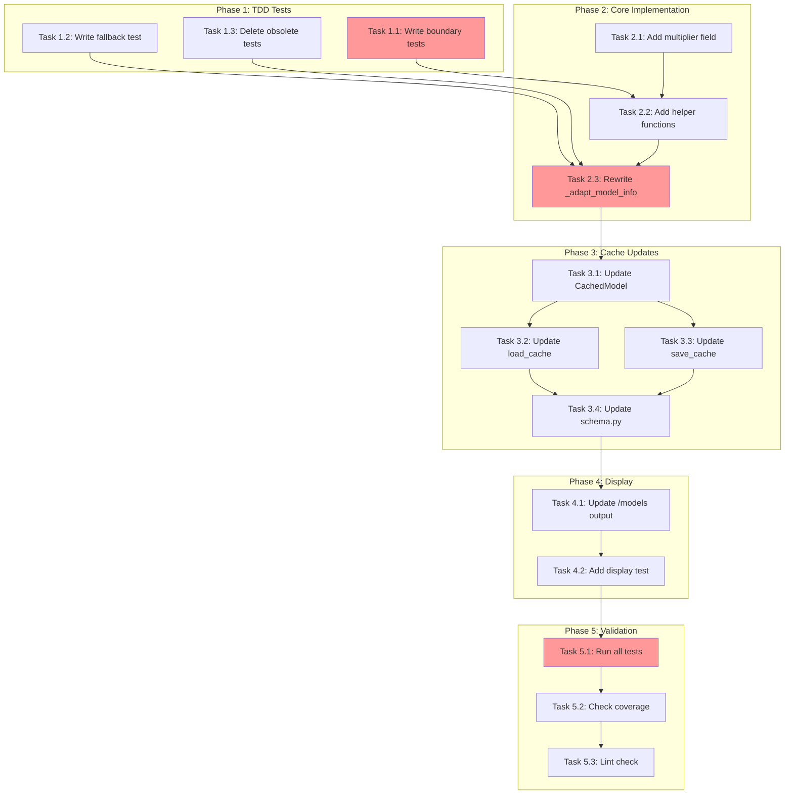

<!-- markdownlint-disable-file -->
# Implementation Plan: Model Tier Classification Fix

## Overview

Fix model tier classification to derive tier from `billing.multiplier` instead of the non-existent `capabilities.tier` attribute.

## Objectives

1. Extract tier category from `billing.multiplier` SDK attribute
2. Add `multiplier` field to `TeamBotModelInfo` and cache
3. Update `/models` command to display multiplier
4. Remove warning spam for "missing tier"
5. Achieve 100% test coverage for tier mapping logic

## Research Summary

- **Research Document**: `.teambot/model-tier-classification/artifacts/research.md`
- **Test Strategy**: `.teambot/model-tier-classification/artifacts/test_strategy.md`
- **Root Cause**: `capabilities.tier` does not exist in SDK; `billing.multiplier` is the correct source
- **Tier Mapping**: 0.0-0.5 → fast, 0.51-1.5 → standard, >1.5 → premium

## Task Dependency Graph

**Critical Path**: T1.1 → T2.2 → T2.3 → T3.4 → T4.1 → T5.1

## Implementation Checklist

### Phase 1: TDD Test Setup (Details Lines 28-112)

Write tests first per TDD strategy.

- [x] **Task 1.1**: Write boundary value tests for tier mapping (Lines 28-70)
  - Add parametrized test for boundaries: 0.0, 0.5, 0.51, 1.0, 1.5, 1.51, 5.0
  - Add test for negative multiplier → "standard"
  - Add test for None multiplier → "standard"

- [x] **Task 1.2**: Write silent fallback test (Lines 72-95)
  - Test missing billing attribute → no warning, "standard" tier
  - Test missing multiplier in billing → no warning, "standard" tier
  - Use `caplog` fixture to verify no WARNING level logs

- [x] **Task 1.3**: Delete obsolete warning tests (Lines 97-112)
  - Delete `test_adapt_model_info_logs_warning_for_missing_tier` (line 1145)
  - Delete `test_adapt_model_info_logs_warning_for_invalid_tier` (line 1163)

### Phase Gate: Phase 1 Complete When
- [x] All new tests written (will fail initially)
- [x] Obsolete tests deleted
- [x] Validation: `uv run pytest tests/test_copilot/test_sdk_client.py -v --collect-only`
- [x] Artifacts: New test methods visible in collection

**Cannot Proceed If**: New tests have syntax errors

---

### Phase 2: Core Implementation (Details Lines 114-195)

Implement the tier extraction logic.

- [x] **Task 2.1**: Add multiplier field to TeamBotModelInfo (Lines 114-133)
  - File: `src/teambot/copilot/sdk_client.py` (lines 13-26)
  - Add `multiplier: float | None = None` field
  - Update docstring

- [x] **Task 2.2**: Add helper functions (Lines 135-175)
  - Add `_extract_multiplier(sdk_model) -> float | None`
  - Add `_get_tier_from_multiplier(multiplier) -> str`
  - Place before `_adapt_model_info` method

- [x] **Task 2.3**: Rewrite _adapt_model_info method (Lines 177-195)
  - File: `src/teambot/copilot/sdk_client.py` (lines 551-581)
  - Use new helper functions
  - Remove capabilities.tier logic
  - Remove warning logs
  - Return multiplier in result

### Phase Gate: Phase 2 Complete When
- [x] All Phase 1 TDD tests pass
- [x] Validation: `uv run pytest tests/test_copilot/test_sdk_client.py::TestCopilotSDKClient -v`
- [x] Artifacts: `TeamBotModelInfo` has `multiplier` field

**Cannot Proceed If**: TDD boundary tests fail

---

### Phase 3: Cache Updates (Details Lines 197-260)

Propagate multiplier through cache layer.

- [x] **Task 3.1**: Update CachedModel dataclass (Lines 197-215)
  - File: `src/teambot/config/model_cache.py` (lines 25-37)
  - Add `multiplier: float | None = None` field
  - Update docstring

- [x] **Task 3.2**: Update load_cache function (Lines 217-235)
  - File: `src/teambot/config/model_cache.py` (lines 115-121)
  - Add `multiplier=m.get("multiplier")` to CachedModel constructor

- [x] **Task 3.3**: Update save_cache function (Lines 237-260)
  - File: `src/teambot/config/model_cache.py` (lines 156-171)
  - Add `"multiplier": getattr(m, "multiplier", None)` to dict
  - Add `"multiplier": m.get("multiplier")` for dict input

- [x] **Task 3.4**: Update schema.py cached models (Lines 262-280)
  - File: `src/teambot/config/schema.py` (lines 42, 49)
  - Add `"multiplier": getattr(m, "multiplier", None)` to dict comprehension

### Phase Gate: Phase 3 Complete When
- [x] Cache round-trip preserves multiplier
- [x] Validation: `uv run pytest tests/test_config/ -v -k cache`
- [x] Artifacts: Cache JSON includes `multiplier` field

**Cannot Proceed If**: Cache tests fail

---

### Phase 4: Display Updates (Details Lines 282-330)

Update /models command output.

- [x] **Task 4.1**: Update handle_models function (Lines 282-310)
  - File: `src/teambot/repl/commands.py` (lines 244-259)
  - Extract multiplier from model info
  - Update tuple to include multiplier
  - Format output: `{model_id:25} ({display_name}) [{multiplier}x]`
  - Handle None multiplier (omit or show without suffix)

- [x] **Task 4.2**: Add display integration test (Lines 312-330)
  - Test that `/models` output includes `[1.0x]` format
  - Test graceful handling of missing multiplier

### Phase Gate: Phase 4 Complete When
- [x] `/models` output shows multiplier suffix
- [x] Validation: Manual test or `uv run pytest -k "models" -v`
- [x] Artifacts: Updated output format visible

**Cannot Proceed If**: Display format breaks existing output

---

### Phase 5: Validation (Details Lines 332-370)

Final verification.

- [x] **Task 5.1**: Run full test suite
  - Command: `uv run pytest`
  - All tests must pass

- [x] **Task 5.2**: Verify coverage
  - Command: `uv run pytest --cov=src/teambot --cov-report=term-missing`
  - Core tier logic: 100% coverage
  - Overall: maintain 80%+

- [x] **Task 5.3**: Run linter
  - Command: `uv run ruff check . && uv run ruff format --check .`
  - No errors allowed

### Phase Gate: Phase 5 Complete When
- [x] All tests pass
- [x] Coverage targets met
- [x] No lint errors
- [x] Validation: CI-equivalent local checks pass

## Dependencies

- **Python**: 3.12+
- **pytest**: 7.4+
- **ruff**: 0.8+
- **uv**: Package manager

## Effort Estimation

| Task | Estimated Effort | Complexity | Risk |
|------|-----------------|------------|------|
| Phase 1: Tests | 30 min | LOW | LOW |
| Phase 2: Core | 45 min | MEDIUM | LOW |
| Phase 3: Cache | 20 min | LOW | LOW |
| Phase 4: Display | 15 min | LOW | LOW |
| Phase 5: Validation | 15 min | LOW | LOW |
| **Total** | ~2 hours | MEDIUM | LOW |

## Success Criteria

- [x] No "missing tier" warnings in logs
- [x] `claude-opus-4.5` shows as "premium" tier
- [x] `claude-haiku-4.5` shows as "fast" tier
- [x] `/models` displays `[{multiplier}x]` suffix
- [x] All tests pass
- [x] Coverage maintained at 80%+

## Rollback Plan

If issues arise:
1. Revert changes to all 4 files
2. Re-run tests to confirm original behavior
3. Files: `sdk_client.py`, `model_cache.py`, `schema.py`, `commands.py`
