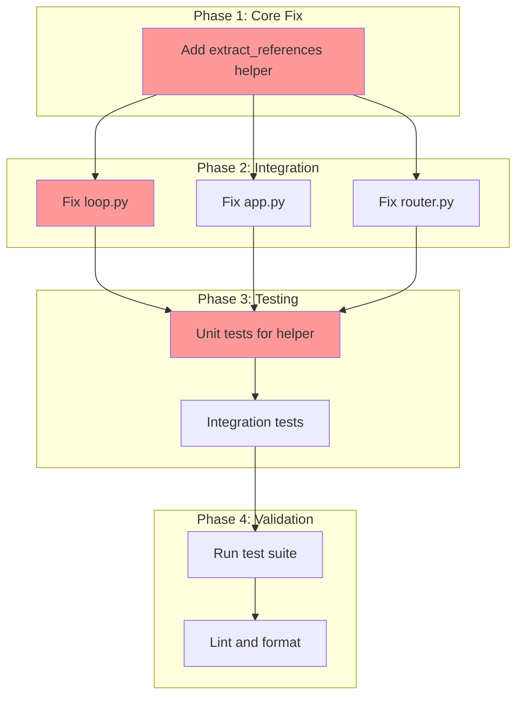

<!-- markdownlint-disable-file -->
# Implementation Plan: Default Agent Context Reference Extraction Bug Fix

## Overview

Fix bug where `$agent` context references (e.g., `$reviewer`, `$ba`) are not extracted when using default agent routing, preventing referenced agent outputs from being injected into prompts.

## Objectives

- [x] Extract `$agent` references from content when routing raw input to default agent
- [x] Maintain consistency across all three entry points (loop.py, app.py, router.py)
- [x] Reuse existing `REFERENCE_PATTERN` via new helper function
- [x] Add tests verifying the fix works end-to-end

## Research Summary

**Research Document**: `.agent-tracking/research/20260217-default-agent-context-research.md`

**Root Cause**: When raw input is converted to an `AGENT` command manually (bypassing `parse_command()`), the reference extraction step is skipped. The `Command.references` field remains empty, so `TaskExecutor._inject_references()` is never called.

**Fix**: Create `extract_references()` helper in `parser.py` and call it when manually constructing `Command` objects.

## Task Dependency Graph

**Critical Path**: T1.1 → T2.1 → T3.1 → T4.1

## Implementation Checklist

### Phase 1: Core Fix (Details Lines 15-45)

- [x] **Task 1.1**: Add `extract_references()` helper function to `parser.py`
  - Location: After `REFERENCE_PATTERN` definition (~line 93)
  - Export in module's public API

### Phase Gate: Phase 1 Complete When
- [ ] `extract_references()` function exists in `parser.py`
- [ ] Function handles: single refs, multiple refs, escaped refs, None/empty input
- [ ] Validation: `uv run python -c "from teambot.repl.parser import extract_references; print(extract_references('test $ba'))"`
- [ ] Artifacts: Modified `src/teambot/repl/parser.py`

**Cannot Proceed If**: Helper function doesn't exist or raises errors on basic input

---

### Phase 2: Integration (Details Lines 47-95)

- [x] **Task 2.1**: Fix `loop.py` default agent Command creation
  - Location: Lines 309-314
  - Add import for `extract_references`
  - Add `references=extract_references(command.content)` to Command

- [x] **Task 2.2**: Fix `app.py` default agent Command creation
  - Location: Lines 140-146
  - Add import for `extract_references`
  - Add `references=extract_references(command.content)` to Command

- [x] **Task 2.3**: Fix `router.py` default agent Command creation
  - Location: Lines 200-206
  - Add import for `extract_references`
  - Add `references=extract_references(command.content)` to Command

### Phase Gate: Phase 2 Complete When
- [ ] All 3 files import `extract_references`
- [ ] All 3 `Command()` constructors include `references=extract_references(...)`
- [ ] Validation: `uv run ruff check src/teambot/repl/loop.py src/teambot/ui/app.py src/teambot/repl/router.py`
- [ ] Artifacts: Modified `loop.py`, `app.py`, `router.py`

**Cannot Proceed If**: Import errors or lint failures

---

### Phase 3: Testing (Details Lines 97-145)

- [x] **Task 3.1**: Add unit tests for `extract_references()` helper
  - File: `tests/test_repl/test_parser.py`
  - Tests: single ref, multiple refs, escaped refs, None input, empty string

- [x] **Task 3.2**: Add integration test for default agent + references
  - File: `tests/test_integration/test_shared_context.py`
  - Test: Verify references extracted when using default agent routing

### Phase Gate: Phase 3 Complete When
- [ ] New tests exist in both files
- [ ] Tests follow existing patterns (pytest, pytest-mock)
- [ ] Validation: `uv run pytest tests/test_repl/test_parser.py -v -k extract`
- [ ] Artifacts: Modified test files

**Cannot Proceed If**: Tests fail or don't exist

---

### Phase 4: Validation (Details Lines 147-165)

- [x] **Task 4.1**: Run full test suite
  - Command: `uv run pytest`
  - Verify no regressions

- [x] **Task 4.2**: Lint and format
  - Commands: `uv run ruff check . --fix && uv run ruff format .`
  - Ensure clean code

### Phase Gate: Phase 4 Complete When
- [ ] All tests pass
- [ ] No lint errors
- [ ] Code formatted

**Cannot Proceed If**: Test failures or lint errors

---

## Dependencies

| Dependency | Type | Status |
|------------|------|--------|
| `REFERENCE_PATTERN` in parser.py | Code | ✅ Exists |
| pytest, pytest-mock | Tool | ✅ Installed |
| ruff | Tool | ✅ Installed |

## Success Criteria

- [ ] `Incorporate the feedback from $reviewer` (without `@pm` prefix) extracts `reviewer` reference
- [ ] Multiple references (`$reviewer and $ba`) all extracted
- [ ] Escaped references (`\$reviewer`) not extracted
- [ ] Pipeline inputs (`tell joke -> @notify`) continue working
- [ ] All existing tests pass
- [ ] New tests cover the bug fix scenario

## Effort Estimation

| Task | Estimated Effort | Complexity | Risk |
|------|-----------------|------------|------|
| T1.1 | 10 min | LOW | LOW |
| T2.1-2.3 | 15 min | LOW | LOW |
| T3.1-3.2 | 20 min | LOW | LOW |
| T4.1-4.2 | 10 min | LOW | LOW |
| **Total** | ~55 min | LOW | LOW |
