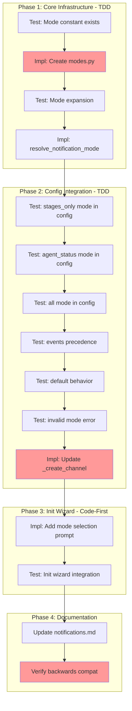

<!-- markdownlint-disable-file -->
# Implementation Plan: Notification Frequency Control

## Overview

Implement notification mode presets (`stages_only`, `agent_status`, `all`) that allow users to configure notification verbosity with a single setting, rather than manually specifying individual event names.

## Objectives

| Objective | Key Result | Priority |
|-----------|------------|----------|
| Define mode-to-events mapping | `NOTIFICATION_MODES` constant with 3 modes | P0 |
| Implement mode expansion | `notification_mode` expands to event set in `_create_channel()` | P0 |
| Add precedence logic | `events` array overrides `notification_mode` | P0 |
| Add validation | Invalid mode values produce clear errors | P0 |
| Extend init wizard | Mode selection step added to `teambot init` | P1 |
| Update documentation | Notifications guide updated | P1 |

## Research Summary

- **Research File**: `.teambot/notification-frequency-control/artifacts/research.md`
- **Test Strategy**: `.teambot/notification-frequency-control/artifacts/test_strategy.md`
- **Feature Spec**: `.teambot/notification-frequency-control/artifacts/feature_spec.md`

Key findings:
- Mode expansion happens in `_create_channel()` (Lines 109-138 of `src/teambot/notifications/config.py`)
- Existing `subscribed_events` parameter supports set filtering (no channel changes needed)
- Init wizard in `cli.py` (Lines 117-172)
- Testing approach: TDD for core logic, Code-First for init wizard

## Dependencies

- Python 3.10+
- Existing notification infrastructure (`EventBus`, `TelegramChannel`)
- pytest, pytest-mock for testing
- ruff for linting

## Task Dependency Graph



**Critical Path**: T1.1 → T1.2 → T1.4 → T2.7 → T3.1 → T4.2

---

## Implementation Checklist

### Phase 1: Core Infrastructure (TDD)
> **Approach**: Test-Driven Development — write tests before implementation
> **Details**: Lines 1-85 of details file

- [x] **Task 1.1**: Write test for `NOTIFICATION_MODES` constant existence and structure
  - Details: Lines 10-25 of details file
  - File: `tests/test_notifications/test_modes.py` (NEW)
  
- [x] **Task 1.2**: Create `modes.py` module with mode definitions
  - Details: Lines 27-55 of details file
  - File: `src/teambot/notifications/modes.py` (NEW)
  
- [x] **Task 1.3**: Write tests for `resolve_notification_mode()` function
  - Details: Lines 57-72 of details file
  - File: `tests/test_notifications/test_modes.py`
  
- [x] **Task 1.4**: Implement `resolve_notification_mode()` with validation
  - Details: Lines 74-85 of details file
  - File: `src/teambot/notifications/modes.py`

### Phase Gate: Phase 1 Complete When
- [x] All Phase 1 tasks marked complete
- [x] `uv run pytest tests/test_notifications/test_modes.py` passes
- [x] Validation: `uv run ruff check src/teambot/notifications/modes.py`
- [x] Artifacts: `modes.py` exists with `NOTIFICATION_MODES` and `resolve_notification_mode()`

**Cannot Proceed If**: Tests fail or mode definitions incomplete

---

### Phase 2: Config Integration (TDD)
> **Approach**: Test-Driven Development — write tests before modifying config.py
> **Details**: Lines 87-170 of details file

- [x] **Task 2.1**: Write test for `stages_only` mode config loading
  - Details: Lines 95-108 of details file
  - File: `tests/test_notifications/test_config.py`
  
- [x] **Task 2.2**: Write test for `agent_status` mode config loading
  - Details: Lines 110-118 of details file
  - File: `tests/test_notifications/test_config.py`
  
- [x] **Task 2.3**: Write test for `all` mode config loading
  - Details: Lines 120-128 of details file
  - File: `tests/test_notifications/test_config.py`
  
- [x] **Task 2.4**: Write test for `events` precedence over `notification_mode`
  - Details: Lines 130-143 of details file
  - File: `tests/test_notifications/test_config.py`
  
- [x] **Task 2.5**: Write test for default behavior (neither specified)
  - Details: Lines 145-153 of details file
  - File: `tests/test_notifications/test_config.py`
  
- [x] **Task 2.6**: Write test for invalid mode error message
  - Details: Lines 155-165 of details file
  - File: `tests/test_notifications/test_config.py`
  
- [x] **Task 2.7**: Implement mode expansion in `_create_channel()`
  - Details: Lines 167-200 of details file
  - File: `src/teambot/notifications/config.py`

### Phase Gate: Phase 2 Complete When
- [x] All Phase 2 tasks marked complete
- [x] `uv run pytest tests/test_notifications/test_config.py` passes
- [x] Validation: `uv run ruff check src/teambot/notifications/config.py`
- [x] Artifacts: `config.py` updated with mode expansion logic

**Cannot Proceed If**: Existing tests fail (backwards compatibility broken)

---

### Phase 3: Init Wizard (Code-First)
> **Approach**: Code-First — implement then add integration tests
> **Details**: Lines 202-260 of details file

- [x] **Task 3.1**: Add mode selection prompt to `_setup_telegram_notifications()`
  - Details: Lines 210-240 of details file
  - File: `src/teambot/cli.py`
  
- [x] **Task 3.2**: Add integration test for init wizard mode selection
  - Details: Lines 242-260 of details file
  - File: `tests/test_cli.py` or appropriate test file

### Phase Gate: Phase 3 Complete When
- [x] All Phase 3 tasks marked complete
- [x] Manual test: `teambot init` shows mode selection
- [x] Generated `teambot.json` includes `notification_mode`
- [x] Validation: `uv run ruff check src/teambot/cli.py`

**Cannot Proceed If**: Init wizard crashes or mode not written to config

---

### Phase 4: Documentation & Validation
> **Approach**: Documentation updates and final validation
> **Details**: Lines 262-300 of details file

- [x] **Task 4.1**: Update notifications documentation
  - Details: Lines 270-285 of details file
  - File: `docs/guides/notifications.md`
  
- [x] **Task 4.2**: Run full test suite for backwards compatibility
  - Details: Lines 287-300 of details file
  - Validation: `uv run pytest tests/test_notifications/`

### Phase Gate: Phase 4 Complete When
- [x] All Phase 4 tasks marked complete
- [x] Full notification test suite passes
- [x] Documentation updated with mode descriptions
- [x] `uv run ruff format . && uv run ruff check . --fix` passes

**Cannot Proceed If**: Any existing notification tests fail

---

## Effort Estimation

| Task | Estimated Effort | Complexity | Risk |
|------|-----------------|------------|------|
| Phase 1: Core Infrastructure | 45 min | LOW | LOW |
| Phase 2: Config Integration | 60 min | MEDIUM | MEDIUM |
| Phase 3: Init Wizard | 30 min | LOW | LOW |
| Phase 4: Documentation | 20 min | LOW | LOW |
| **Total** | ~2.5 hours | | |

## Success Criteria

- [x] `notification_mode` config option works with all three modes
- [x] `stages_only` sends exactly 3 event types
- [x] `agent_status` sends exactly 6 event types
- [x] `all` sends all events (no filtering)
- [x] `events` array takes precedence over `notification_mode`
- [x] Default behavior (neither specified) is `all` events
- [x] Invalid mode raises `ValueError` with helpful message
- [x] `teambot init` offers mode selection
- [x] Existing configurations continue to work unchanged
- [x] All tests pass: `uv run pytest tests/test_notifications/`
- [x] Documentation updated

## Validation Commands

```bash
# Run all notification tests
uv run pytest tests/test_notifications/ -v

# Run with coverage
uv run pytest tests/test_notifications/ --cov=src/teambot/notifications --cov-report=term-missing

# Lint check
uv run ruff check src/teambot/notifications/ src/teambot/cli.py

# Format check
uv run ruff format --check src/teambot/notifications/ src/teambot/cli.py
```
