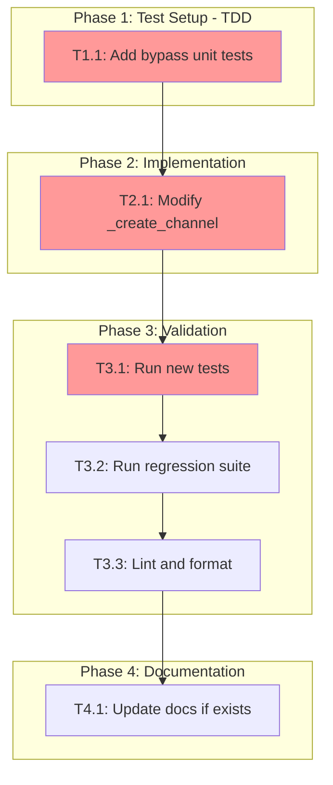

<!-- markdownlint-disable-file -->
# Implementation Plan: @notify Command Bypass Mode Filtering

## Overview

Modify notification filtering to ensure `@notify <msg>` commands always deliver when notifications are enabled and channels are configured, bypassing `notification_mode` filtering that currently blocks `custom_message` events.

## Objectives

- [x] `custom_message` events bypass mode-based filtering (`stages_only`, `agent_status`)
- [x] Explicit `events` arrays continue to take precedence (user can still exclude `custom_message`)
- [x] No regression in existing `notification_mode` filtering for automated events
- [x] 100% test coverage for new bypass logic

## Research Summary

**Research Document**: `.agent-tracking/research/20260218-notify-bypass-mode-filtering-research.md`
**Test Strategy**: `.teambot/notify-command/artifacts/test_strategy.md`

### Key Findings

| Finding | Reference |
|---------|-----------|
| `custom_message` not in any mode event set | Research Lines 143-163 |
| Fix location: `config.py:_create_channel()` Lines 128-138 | Research Lines 403-433 |
| TDD approach with 4-6 new tests | Test Strategy Lines 40-56 |
| Primary change: ~2-3 lines in `_create_channel()` | Research Lines 199-203 |

### Implementation Approach

Add `custom_message` to `subscribed` set after mode resolution in `_create_channel()`, ensuring explicit user notifications always pass filtering while respecting explicit `events` arrays.

## Task Dependency Graph

**Critical Path**: T1.1 → T2.1 → T3.1 (estimated: 30 min)

## Implementation Checklist

### Phase 1: Test Setup (TDD) - See Details Lines 1-80

- [x] **T1.1**: Add `TestCustomMessageBypassMode` test class to `tests/test_notifications/test_config.py`
  - Add test: `test_stages_only_mode_includes_custom_message` (Details Lines 20-35)
  - Add test: `test_agent_status_mode_includes_custom_message` (Details Lines 36-50)
  - Add test: `test_explicit_empty_events_no_custom_message` (Details Lines 51-65)
  - Add test: `test_all_mode_unchanged` (Details Lines 66-80)

### Phase Gate: Phase 1 Complete When
- [x] All 4 tests added to test file
- [x] Tests run and **fail** (TDD red phase)
- [x] Validation: `uv run pytest tests/test_notifications/test_config.py::TestCustomMessageBypassMode -v` shows 4 failures
- [x] Artifacts: Test class added to `test_config.py`

**Cannot Proceed If**: Tests pass before implementation (indicates wrong test logic)

---

### Phase 2: Implementation - See Details Lines 82-130

- [x] **T2.1**: Modify `_create_channel()` in `src/teambot/notifications/config.py`
  - Add `custom_message` to mode-based subscribed sets (Details Lines 95-115)
  - Location: After Line 138 (after mode resolution block)
  - Expected change: ~3 lines

### Phase Gate: Phase 2 Complete When
- [x] Code modification complete in `config.py`
- [x] No syntax errors: `python -c "from teambot.notifications.config import _create_channel"`
- [x] Artifacts: Modified `config.py`

**Cannot Proceed If**: Syntax errors present

---

### Phase 3: Validation - See Details Lines 132-180

- [x] **T3.1**: Run new bypass tests
  - Command: `uv run pytest tests/test_notifications/test_config.py::TestCustomMessageBypassMode -v`
  - Expected: All 4 tests pass (TDD green phase)

- [x] **T3.2**: Run full notification test suite for regression
  - Command: `uv run pytest tests/test_notifications/ -v`
  - Expected: All existing tests pass

- [x] **T3.3**: Lint and format code
  - Command: `uv run ruff format . && uv run ruff check . --fix`
  - Expected: No errors

### Phase Gate: Phase 3 Complete When
- [x] All new tests pass
- [x] All existing notification tests pass
- [x] Linting passes
- [x] Validation: `uv run pytest tests/test_notifications/ -v` shows 100% pass
- [x] Artifacts: Test results log

**Cannot Proceed If**: Any test failures or lint errors

---

### Phase 4: Documentation (Optional) - See Details Lines 182-210

- [x] **T4.1**: Update notification documentation if `docs/guides/notifications.md` exists
  - Add note that `@notify` bypasses `notification_mode` filtering
  - Only if documentation file exists

### Phase Gate: Phase 4 Complete When
- [x] Documentation updated OR confirmed not needed
- [x] Artifacts: Updated docs (if applicable)

## Dependencies

| Dependency | Status | Notes |
|------------|--------|-------|
| Research document | ✅ Verified | `.agent-tracking/research/20260218-notify-bypass-mode-filtering-research.md` |
| Test strategy | ✅ Verified | `.teambot/notify-command/artifacts/test_strategy.md` |
| pytest | ✅ Available | `uv run pytest` |
| ruff | ✅ Available | `uv run ruff` |

## Effort Estimation

| Task | Estimated Effort | Complexity | Risk |
|------|-----------------|------------|------|
| T1.1 | 15 min | LOW | LOW |
| T2.1 | 5 min | LOW | LOW |
| T3.1-T3.3 | 10 min | LOW | LOW |
| T4.1 | 5 min | LOW | LOW |
| **Total** | ~35 min | LOW | LOW |

## Success Criteria

- [x] `@notify` sends with `notification_mode: stages_only` configured
- [x] `@notify` sends with `notification_mode: agent_status` configured
- [x] `@notify` blocked when `events: []` explicitly set
- [x] `notification_mode` filtering unchanged for other event types
- [x] All notification tests pass (existing + new)
- [x] Code is linted and formatted

## Files to Create/Modify

| File | Operation | Purpose |
|------|-----------|---------|
| `tests/test_notifications/test_config.py` | MODIFY | Add `TestCustomMessageBypassMode` class |
| `src/teambot/notifications/config.py` | MODIFY | Add `custom_message` bypass logic |
| `docs/guides/notifications.md` | MODIFY (if exists) | Document bypass behavior |

## Rollback Plan

If issues arise:
1. Revert changes to `config.py` using: `git checkout src/teambot/notifications/config.py`
2. Remove new test class from `test_config.py`
3. Re-run tests to confirm baseline restored
