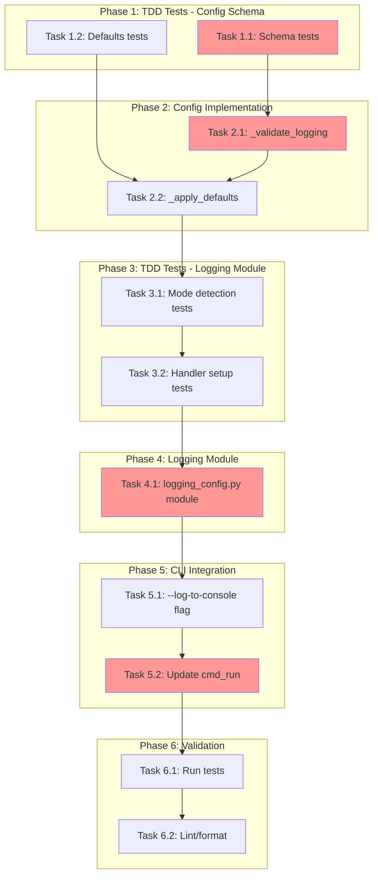

<!-- markdownlint-disable-file -->
# Task Checklist: Configurable Logging Output

## Overview

Implement configuration-based logging output control to prevent log messages from interfering with the Rich/Textual interactive terminal UI while preserving debugging capability via file logging.

## Objectives

* Eliminate log message interference with interactive UI (file-only logging default)
* Preserve debugging capability with file logging always available
* Enable console logging override via `--log-to-console` CLI flag
* Maintain 100% backwards compatibility with existing configurations

## Research Summary

### Project Files
* `src/teambot/cli.py` (Lines 244-250) - Current `setup_logging()` implementation using `basicConfig()`
* `src/teambot/config/loader.py` - Config validation patterns (`_validate_notifications()`, `_apply_defaults()`)
* `src/teambot/repl/loop.py` - Mode detection and `run_interactive_mode()` function

### External References
* .agent-tracking/research/20260220-configurable-logging-research.md - Implementation patterns, code examples, API schema

### Standards References
* AGENTS.md - Clean commits with `uv run ruff format` and `uv run ruff check`
* Python logging stdlib documentation - Handler patterns

## Task Dependency Graph

**Critical Path**: T1.1 → T2.1 → T2.2 → T3.1 → T3.2 → T4.1 → T5.1 → T5.2 → T6.1

## Implementation Checklist

### [ ] Phase 1: TDD Tests - Config Schema Validation

**Phase Objective**: Create failing tests for logging configuration schema validation

**Test Strategy**: TDD - Tests before implementation (per test strategy document)

* [x] Task 1.1: Write tests for logging schema validation
  * Details: .agent-tracking/details/20260220-configurable-logging-details.md (Lines 20-70)
  * Dependencies: None
  * Priority: CRITICAL
  * Coverage Target: 95%

* [x] Task 1.2: Write tests for logging defaults application
  * Details: .agent-tracking/details/20260220-configurable-logging-details.md (Lines 72-110)
  * Dependencies: Task 1.1
  * Priority: CRITICAL

### Phase Gate: Phase 1 Complete When
- [x] All Phase 1 tasks marked complete
- [x] Tests written and failing (Red phase of TDD)
- [x] Validation: `uv run pytest tests/test_config/test_loader.py -k logging -v` shows failing tests
- [x] Artifacts: New test class `TestLoggingConfigValidation` in `test_loader.py`

**Cannot Proceed If**: Tests pass (means implementation already exists or tests are wrong)

---

### [x] Phase 2: Config Schema Implementation

**Phase Objective**: Implement logging config validation to make Phase 1 tests pass

* [x] Task 2.1: Add `_validate_logging()` method to ConfigLoader
  * Details: .agent-tracking/details/20260220-configurable-logging-details.md (Lines 115-165)
  * Dependencies: Phase 1 completion
  * Priority: CRITICAL

* [x] Task 2.2: Update `_apply_defaults()` with logging defaults
  * Details: .agent-tracking/details/20260220-configurable-logging-details.md (Lines 167-200)
  * Dependencies: Task 2.1
  * Priority: CRITICAL

### Phase Gate: Phase 2 Complete When
- [x] All Phase 2 tasks marked complete
- [x] Phase 1 tests pass (Green phase of TDD)
- [x] Validation: `uv run pytest tests/test_config/test_loader.py -k logging -v` passes
- [x] Artifacts: `_validate_logging()` method, updated `_apply_defaults()`

**Cannot Proceed If**: Any Phase 1 tests still failing

---

### [x] Phase 3: TDD Tests - Logging Module

**Phase Objective**: Create failing tests for logging setup and mode detection

* [x] Task 3.1: Write tests for `is_interactive_mode()` function
  * Details: .agent-tracking/details/20260220-configurable-logging-details.md (Lines 205-240)
  * Dependencies: Phase 2 completion
  * Priority: HIGH

* [x] Task 3.2: Write tests for `setup_logging()` with mode routing
  * Details: .agent-tracking/details/20260220-configurable-logging-details.md (Lines 242-290)
  * Dependencies: Task 3.1
  * Priority: HIGH
  * Coverage Target: 90%

### Phase Gate: Phase 3 Complete When
- [x] All Phase 3 tasks marked complete
- [x] Tests written and failing (Red phase)
- [x] Validation: `uv run pytest tests/test_config/test_logging_config.py -v` shows failing tests
- [x] Artifacts: New test file `tests/test_config/test_logging_config.py`

**Cannot Proceed If**: Tests pass or module doesn't exist yet

---

### [x] Phase 4: Logging Module Implementation

**Phase Objective**: Create logging configuration module to make Phase 3 tests pass

* [x] Task 4.1: Create `src/teambot/config/logging_config.py`
  * Details: .agent-tracking/details/20260220-configurable-logging-details.md (Lines 295-380)
  * Dependencies: Phase 3 completion
  * Priority: CRITICAL

### Phase Gate: Phase 4 Complete When
- [x] All Phase 4 tasks marked complete
- [x] Phase 3 tests pass (Green phase)
- [x] Validation: `uv run pytest tests/test_config/test_logging_config.py -v` passes
- [x] Artifacts: `logging_config.py` with `is_interactive_mode()` and `setup_logging()`

**Cannot Proceed If**: Any Phase 3 tests still failing

---

### [x] Phase 5: CLI Integration

**Phase Objective**: Add CLI flag and integrate logging configuration

* [x] Task 5.1: Add `--log-to-console` flag to argument parser
  * Details: .agent-tracking/details/20260220-configurable-logging-details.md (Lines 385-410)
  * Dependencies: Phase 4 completion
  * Priority: HIGH

* [x] Task 5.2: Update `cmd_run()` to use new logging setup
  * Details: .agent-tracking/details/20260220-configurable-logging-details.md (Lines 412-450)
  * Dependencies: Task 5.1
  * Priority: CRITICAL

### Phase Gate: Phase 5 Complete When
- [x] All Phase 5 tasks marked complete
- [x] CLI flag recognized by parser
- [x] Validation: `uv run teambot run --help` shows `--log-to-console` flag
- [x] Artifacts: Updated `cli.py` with flag and mode-aware logging

**Cannot Proceed If**: Parser doesn't recognize flag or logging not configured correctly

---

### [x] Phase 6: Validation and Cleanup

**Phase Objective**: Ensure all tests pass, code is formatted, and feature works correctly

* [x] Task 6.1: Run full test suite
  * Details: .agent-tracking/details/20260220-configurable-logging-details.md (Lines 455-475)
  * Dependencies: Phase 5 completion
  * Priority: CRITICAL

* [x] Task 6.2: Format and lint code
  * Details: .agent-tracking/details/20260220-configurable-logging-details.md (Lines 477-495)
  * Dependencies: Task 6.1
  * Priority: CRITICAL

### Phase Gate: Phase 6 Complete When
- [x] All tests pass: `uv run pytest --cov=src/teambot`
- [x] Linting passes: `uv run ruff check .`
- [x] Formatting passes: `uv run ruff format --check .`
- [x] Coverage meets target (90%+ for new code)
- [x] Artifacts: Clean commit-ready code

**Cannot Proceed If**: Any tests, lint, or format checks fail

## Effort Estimation

| Task | Estimated Effort | Complexity | Risk |
|------|-----------------|------------|------|
| Phase 1 (TDD Tests - Schema) | 30 min | LOW | LOW |
| Phase 2 (Config Schema) | 30 min | LOW | LOW |
| Phase 3 (TDD Tests - Module) | 30 min | MEDIUM | LOW |
| Phase 4 (Logging Module) | 45 min | MEDIUM | MEDIUM |
| Phase 5 (CLI Integration) | 30 min | LOW | MEDIUM |
| Phase 6 (Validation) | 15 min | LOW | LOW |
| **Total** | **~3 hours** | MEDIUM | LOW |

## Dependencies

* Python `logging` standard library module
* pytest, pytest-cov, pytest-mock (dev dependencies)
* ruff for linting and formatting
* Existing `ConfigLoader` in `src/teambot/config/loader.py`

## Success Criteria

* All unit tests pass with 90%+ coverage for new code
* Interactive mode (`teambot run`) defaults to file-only logging
* File orchestration mode (`teambot run objective.md`) defaults to console + file logging
* `--log-to-console` flag enables console output in interactive mode
* Existing `teambot.json` files without `logging` section work unchanged
* No lint or format errors
