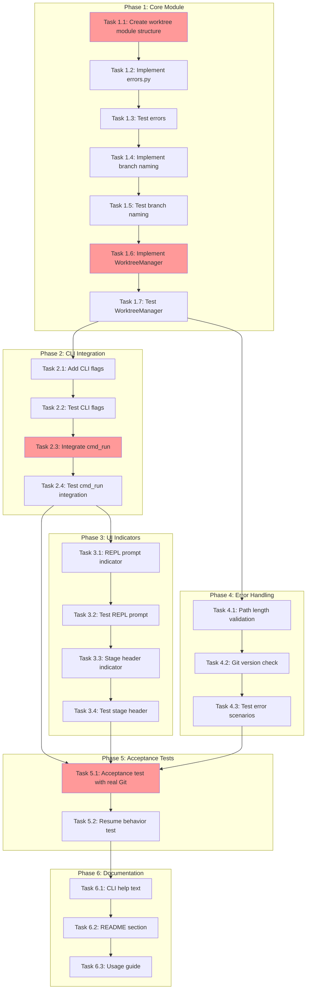

<!-- markdownlint-disable-file -->
# Task Checklist: TeamBot Worktree Isolation

## Overview

Add a `--worktree` flag to `teambot run` that automatically creates a Git worktree for the objective, runs the entire workflow within that worktree, and leaves the user's main working directory untouched.

## Objectives

* Enable parallel feature development with automatic Git worktree creation
* Isolate state files (`.teambot/`) per worktree to prevent cross-contamination
* Provide clear visual indicators (REPL prompt, stage headers) for worktree context
* Handle error cases (Git unavailable, branch conflicts, path limits) with actionable messages

## Research Summary

### Project Files
* `src/teambot/cli.py` - CLI entry point with argument parsing and `cmd_run()` function
* `src/teambot/orchestration/execution_loop.py` - ExecutionLoop with `teambot_dir` parameterization
* `src/teambot/repl/loop.py` - REPL prompt rendering in `_prompt_user()`
* `src/teambot/ui/widgets/status_panel.py` - Existing branch display (auto-works with worktrees)

### External References
* .agent-tracking/research/20260223-worktree-isolation-research.md - Complete technical research with code examples
* .agent-tracking/test-strategies/20260223-worktree-isolation-test-strategy.md - TDD approach for all components

### Standards References
* AGENTS.md - Project conventions, test patterns, clean commits workflow

## Task Dependency Graph

**Critical Path**: T1.1 → T1.6 → T2.3 → T5.1 (core functionality)
**Parallel Opportunities**: Phase 4 (error handling) can run parallel to Phase 3 (UI indicators)

## Implementation Checklist

### [x] Phase 1: Worktree Module Foundation (TDD)

**Phase Objective**: Create `src/teambot/worktree/` module with WorktreeManager class and complete test coverage

**Test Strategy**: TDD - Write tests BEFORE implementation (per test strategy document)

#### Sub-phase 1.A: Module Structure and Error Types

* [x] Task 1.1: Create worktree module directory structure
  * Details: .agent-tracking/details/20260223-worktree-isolation-details.md (Lines 20-40)
  * Dependencies: None
  * Priority: CRITICAL

* [x] Task 1.2: Implement error exception hierarchy
  * Details: .agent-tracking/details/20260223-worktree-isolation-details.md (Lines 42-65)
  * Dependencies: Task 1.1
  * Priority: CRITICAL

* [x] Task 1.3: Write tests for error classes
  * Details: .agent-tracking/details/20260223-worktree-isolation-details.md (Lines 67-85)
  * Dependencies: Task 1.2
  * Test Approach: TDD
  * Coverage Target: 100%

#### Sub-phase 1.B: Branch Name Derivation

* [x] Task 1.4: Implement `derive_branch_name()` function
  * Details: .agent-tracking/details/20260223-worktree-isolation-details.md (Lines 87-120)
  * Dependencies: Task 1.1
  * Priority: CRITICAL

* [x] Task 1.5: Write tests for branch name derivation
  * Details: .agent-tracking/details/20260223-worktree-isolation-details.md (Lines 122-160)
  * Dependencies: Task 1.4
  * Test Approach: TDD
  * Coverage Target: 100%

#### Sub-phase 1.C: WorktreeManager Core

* [x] Task 1.6: Implement WorktreeManager class
  * Details: .agent-tracking/details/20260223-worktree-isolation-details.md (Lines 162-250)
  * Dependencies: Task 1.2, Task 1.4
  * Priority: CRITICAL

* [x] Task 1.7: Write tests for WorktreeManager
  * Details: .agent-tracking/details/20260223-worktree-isolation-details.md (Lines 252-320)
  * Dependencies: Task 1.6
  * Test Approach: TDD
  * Coverage Target: 95%

### Phase Gate: Phase 1 Complete When
- [x] All Phase 1 tasks marked complete
- [x] `src/teambot/worktree/` module exists with `__init__.py`, `errors.py`, `manager.py`
- [x] Validation: `uv run pytest tests/test_worktree/ -v` passes
- [x] Artifacts: 95%+ coverage on worktree module

**Cannot Proceed If**: WorktreeManager.create_worktree() fails unit tests

---

### [x] Phase 2: CLI Integration (TDD)

**Phase Objective**: Add `--worktree` and `--branch` flags to CLI and integrate with `cmd_run()`

**Test Strategy**: TDD - Write argument parsing tests first

* [x] Task 2.1: Add `--worktree` and `--branch` CLI arguments
  * Details: .agent-tracking/details/20260223-worktree-isolation-details.md (Lines 322-360)
  * Dependencies: Phase 1 completion
  * Priority: CRITICAL

* [x] Task 2.2: Write tests for CLI argument parsing
  * Details: .agent-tracking/details/20260223-worktree-isolation-details.md (Lines 362-400)
  * Dependencies: Task 2.1
  * Test Approach: TDD
  * Coverage Target: 100%

* [x] Task 2.3: Integrate worktree creation into `cmd_run()`
  * Details: .agent-tracking/details/20260223-worktree-isolation-details.md (Lines 402-480)
  * Dependencies: Task 2.2, Phase 1 completion
  * Priority: CRITICAL

* [x] Task 2.4: Write tests for `cmd_run()` worktree integration
  * Details: .agent-tracking/details/20260223-worktree-isolation-details.md (Lines 482-540)
  * Dependencies: Task 2.3
  * Test Approach: TDD
  * Coverage Target: 90%

### Phase Gate: Phase 2 Complete When
- [x] All Phase 2 tasks marked complete
- [x] `teambot run obj.md --worktree` parses correctly
- [x] Validation: `uv run pytest tests/test_cli.py -k worktree -v` passes
- [x] Artifacts: CLI integration tests passing

**Cannot Proceed If**: `--worktree` flag not recognized by argument parser

---

### [x] Phase 3: UI Indicators (TDD)

**Phase Objective**: Add visual indicators to REPL prompt and stage headers for worktree context

**Test Strategy**: TDD - Write prompt/header tests first

* [x] Task 3.1: Modify REPL prompt to show worktree indicator
  * Details: .agent-tracking/details/20260223-worktree-isolation-details.md (Lines 542-590)
  * Dependencies: Phase 2 completion
  * Priority: HIGH

* [x] Task 3.2: Write tests for REPL prompt indicator
  * Details: .agent-tracking/details/20260223-worktree-isolation-details.md (Lines 592-620)
  * Dependencies: Task 3.1
  * Test Approach: TDD
  * Coverage Target: 90%

* [x] Task 3.3: Modify stage header output for worktree context
  * Details: .agent-tracking/details/20260223-worktree-isolation-details.md (Lines 622-665)
  * Dependencies: Task 3.2
  * Priority: HIGH

* [x] Task 3.4: Write tests for stage header indicator
  * Details: .agent-tracking/details/20260223-worktree-isolation-details.md (Lines 667-695)
  * Dependencies: Task 3.3
  * Test Approach: TDD
  * Coverage Target: 90%

### Phase Gate: Phase 3 Complete When
- [x] All Phase 3 tasks marked complete
- [x] REPL prompt shows `[wt:feat/branch]` when in worktree
- [x] Validation: `uv run pytest tests/test_repl/ -k worktree -v` passes
- [x] Artifacts: UI indicator tests passing

**Cannot Proceed If**: REPL prompt crashes when worktree_context is None

---

### [x] Phase 4: Error Handling Enhancement

**Phase Objective**: Add Windows path validation and Git version checking

**Test Strategy**: TDD - Write error scenario tests first

* [x] Task 4.1: Implement Windows path length validation
  * Details: .agent-tracking/details/20260223-worktree-isolation-details.md (Lines 697-735)
  * Dependencies: Phase 1 completion
  * Priority: P1

* [x] Task 4.2: Implement Git version check (2.5+ required)
  * Details: .agent-tracking/details/20260223-worktree-isolation-details.md (Lines 737-775)
  * Dependencies: Task 4.1
  * Priority: P1

* [x] Task 4.3: Write tests for error scenarios
  * Details: .agent-tracking/details/20260223-worktree-isolation-details.md (Lines 777-820)
  * Dependencies: Task 4.2
  * Test Approach: TDD
  * Coverage Target: 100%

### Phase Gate: Phase 4 Complete When
- [x] All Phase 4 tasks marked complete
- [x] Path validation catches 260+ char paths on Windows
- [x] Validation: `uv run pytest tests/test_worktree/test_validation.py -v` passes
- [x] Artifacts: Error handling tests passing

**Cannot Proceed If**: Error messages do not match FR-011, FR-012, FR-013 specifications

---

### [x] Phase 5: Acceptance Testing

**Phase Objective**: End-to-end validation with real Git operations

**Test Strategy**: Real Git operations in temporary repository

* [x] Task 5.1: Create acceptance test with real Git worktree operations
  * Details: .agent-tracking/details/20260223-worktree-isolation-details.md (Lines 822-880)
  * Dependencies: Phase 2, Phase 3, Phase 4 completion
  * Priority: P0
  * Test Framework: pytest with `@pytest.mark.acceptance`

* [x] Task 5.2: Test resume behavior within worktree context
  * Details: .agent-tracking/details/20260223-worktree-isolation-details.md (Lines 882-920)
  * Dependencies: Task 5.1
  * Priority: P1

### Phase Gate: Phase 5 Complete When
- [x] All Phase 5 tasks marked complete
- [x] Acceptance tests pass with real Git operations
- [x] Validation: `uv run pytest tests/test_worktree_acceptance.py -v -m acceptance` passes
- [x] Artifacts: Acceptance test report

**Cannot Proceed If**: Worktree not created at expected `.teambot-worktrees/<branch>/` path

---

### [x] Phase 6: Documentation

**Phase Objective**: Update CLI help, README, and create usage guide

* [x] Task 6.1: Update CLI help text for `--worktree` and `--branch`
  * Details: .agent-tracking/details/20260223-worktree-isolation-details.md (Lines 922-945)
  * Dependencies: Phase 5 completion
  * Priority: P1

* [x] Task 6.2: Add worktree section to README.md
  * Details: .agent-tracking/details/20260223-worktree-isolation-details.md (Lines 947-980)
  * Dependencies: Task 6.1
  * Priority: P1

* [x] Task 6.3: Create worktree usage guide
  * Details: .agent-tracking/details/20260223-worktree-isolation-details.md (Lines 982-1020)
  * Dependencies: Task 6.2
  * Priority: P2

### Phase Gate: Phase 6 Complete When
- [x] All Phase 6 tasks marked complete
- [x] CLI `--help` shows worktree flags with descriptions
- [x] Validation: `uv run teambot run --help | grep worktree` shows flag
- [x] Artifacts: docs/guides/worktree-isolation.md exists

**Cannot Proceed If**: Documentation inconsistent with implementation

---

## Effort Estimation

| Task | Estimated Effort | Complexity | Risk |
|------|-----------------|------------|------|
| Phase 1: Worktree Module | 3 hours | HIGH | MEDIUM |
| Phase 2: CLI Integration | 2 hours | MEDIUM | LOW |
| Phase 3: UI Indicators | 1.5 hours | LOW | LOW |
| Phase 4: Error Handling | 1.5 hours | MEDIUM | LOW |
| Phase 5: Acceptance Tests | 2 hours | MEDIUM | MEDIUM |
| Phase 6: Documentation | 1 hour | LOW | LOW |
| **Total** | **11 hours** | | |

## Dependencies

* Git CLI (version 2.5+) - External, user environment
* pytest, pytest-mock, pytest-cov - Dev dependencies (already installed)
* subprocess module - Python standard library

## Success Criteria

* `teambot run objectives/foo.md --worktree` creates worktree at `.teambot-worktrees/feat-foo/`
* Branch `feat/foo` exists after worktree creation
* Main directory's `.teambot/` unchanged after worktree execution
* All existing tests pass (backward compatibility)
* New worktree module has 90%+ test coverage
* REPL shows `[wt:feat/foo]` when in worktree mode
* Stage headers show `[worktree: feat/foo]` in file-based mode
* Clear error messages for Git unavailable, branch conflicts, path limits
