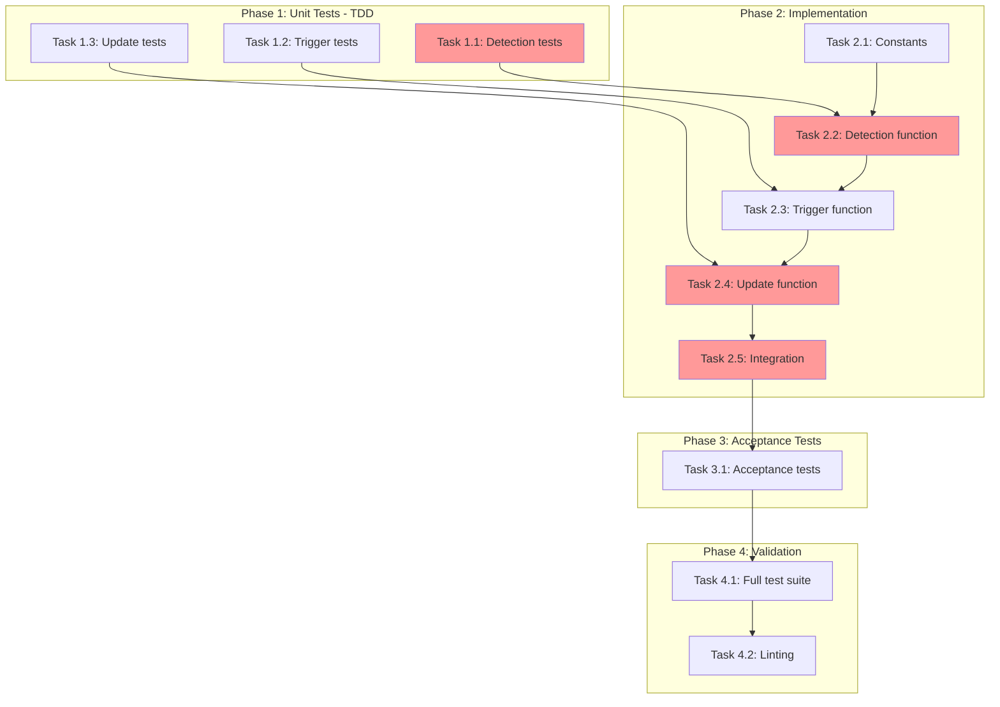

<!-- markdownlint-disable-file -->
# Task Checklist: AGENTS.md `.agent` Directory Reference Update

## Overview

Enhance `teambot init` to update existing AGENTS.md files with a reference section describing the `.agent` directory structure when the `.agent/` directory is newly copied.

## Objectives

* Detect when AGENTS.md exists AND `.agent/` directory was newly copied
* Append `.agent` directory reference section from bundled template (Lines 130-191)
* Prevent duplicate sections (idempotent updates)
* Handle file permission errors gracefully with `logging.debug()`
* Follow existing pattern established by `_update_agents_md_with_template_reference()`

## Research Summary

### Project Files
* `src/teambot/cli.py` - Main CLI with existing AGENTS.md update pattern (Lines 30-136, 507-555)
* `src/teambot/scaffolds.py` - CopyResult structure and scaffold copying (Lines 11-17)
* `src/teambot/scaffolds/AGENTS.md` - Canonical `.agent` directory section content (Lines 130-191)

### External References
* .agent-tracking/research/20260224-agents-md-dot-agent-directory-reference-research.md - Complete implementation analysis

### Standards References
* Existing `_update_agents_md_with_template_reference()` pattern - Proven approach with 16+ unit tests

## Task Dependency Graph

**Critical Path**: T1.1 → T2.2 → T2.4 → T2.5 → T3.1 → T4.1
**Parallel Opportunities**: T1.1, T1.2, T1.3 can run in parallel; T2.1 independent of T1.x

## Implementation Checklist

### [ ] Phase 1: Unit Tests (TDD)

**Phase Objective**: Write failing unit tests for all new functions before implementation

**Test Strategy**: TDD - Tests written BEFORE implementation per objective requirements

#### Sub-phase 1.A: Detection Function Tests

* [ ] Task 1.1: Write tests for `_agents_md_has_agent_directory_reference()`
  * Details: .agent-tracking/details/20260224-agents-md-dot-agent-directory-reference-details.md (Lines 14-54)
  * Dependencies: None
  * Priority: CRITICAL

#### Sub-phase 1.B: Trigger Function Tests

* [ ] Task 1.2: Write tests for `_should_update_agents_md_with_agent_directory()`
  * Details: .agent-tracking/details/20260224-agents-md-dot-agent-directory-reference-details.md (Lines 56-97)
  * Dependencies: None
  * Priority: CRITICAL

#### Sub-phase 1.C: Update Function Tests

* [ ] Task 1.3: Write tests for `_update_agents_md_with_agent_directory_reference()`
  * Details: .agent-tracking/details/20260224-agents-md-dot-agent-directory-reference-details.md (Lines 99-152)
  * Dependencies: None
  * Priority: CRITICAL

### Phase Gate: Phase 1 Complete When
- [ ] All Phase 1 tasks marked complete
- [ ] All unit tests written and failing (red phase of TDD)
- [ ] Validation: `uv run pytest tests/test_agents_md_update.py -v` shows expected failures
- [ ] Artifacts: New test classes in `tests/test_agents_md_update.py`

**Cannot Proceed If**: Tests are not failing for the right reasons (import errors vs assertion failures)

---

### [ ] Phase 2: Implementation

**Phase Objective**: Implement all functions following existing patterns to make tests pass

#### Sub-phase 2.A: Constants

* [ ] Task 2.1: Add `AGENT_DIRECTORY_MARKER` and `AGENT_DIRECTORY_SECTION` constants
  * Details: .agent-tracking/details/20260224-agents-md-dot-agent-directory-reference-details.md (Lines 158-210)
  * Dependencies: None
  * Priority: CRITICAL

#### Sub-phase 2.B: Core Functions

* [ ] Task 2.2: Implement `_agents_md_has_agent_directory_reference()` function
  * Details: .agent-tracking/details/20260224-agents-md-dot-agent-directory-reference-details.md (Lines 212-238)
  * Dependencies: Task 2.1
  * Priority: CRITICAL

* [ ] Task 2.3: Implement `_should_update_agents_md_with_agent_directory()` function
  * Details: .agent-tracking/details/20260224-agents-md-dot-agent-directory-reference-details.md (Lines 240-272)
  * Dependencies: Task 2.2
  * Priority: CRITICAL

* [ ] Task 2.4: Implement `_update_agents_md_with_agent_directory_reference()` function
  * Details: .agent-tracking/details/20260224-agents-md-dot-agent-directory-reference-details.md (Lines 274-322)
  * Dependencies: Task 2.3
  * Priority: CRITICAL

#### Sub-phase 2.C: Integration

* [ ] Task 2.5: Integrate in `cmd_init()` function
  * Details: .agent-tracking/details/20260224-agents-md-dot-agent-directory-reference-details.md (Lines 324-347)
  * Dependencies: Task 2.4
  * Priority: CRITICAL

### Phase Gate: Phase 2 Complete When
- [ ] All Phase 2 tasks marked complete
- [ ] All unit tests from Phase 1 passing (green phase of TDD)
- [ ] Validation: `uv run pytest tests/test_agents_md_update.py -v` passes
- [ ] Artifacts: New functions in `src/teambot/cli.py`

**Cannot Proceed If**: Any unit test failing

---

### [ ] Phase 3: Acceptance Tests

**Phase Objective**: Add end-to-end tests validating full user scenarios

* [ ] Task 3.1: Write acceptance tests for `.agent` directory reference scenarios
  * Details: .agent-tracking/details/20260224-agents-md-dot-agent-directory-reference-details.md (Lines 349-410)
  * Dependencies: Phase 2 completion
  * Priority: HIGH

### Phase Gate: Phase 3 Complete When
- [ ] All Phase 3 tasks marked complete
- [ ] Acceptance tests pass
- [ ] Validation: `uv run pytest tests/test_agents_md_update_acceptance.py -v -m acceptance`
- [ ] Artifacts: New test methods in `tests/test_agents_md_update_acceptance.py`

**Cannot Proceed If**: Acceptance tests failing

---

### [ ] Phase 4: Validation

**Phase Objective**: Ensure all tests pass and code meets quality standards

* [ ] Task 4.1: Run full test suite
  * Details: .agent-tracking/details/20260224-agents-md-dot-agent-directory-reference-details.md (Lines 412-430)
  * Dependencies: Phase 3 completion
  * Priority: HIGH

* [ ] Task 4.2: Run linting and formatting
  * Details: .agent-tracking/details/20260224-agents-md-dot-agent-directory-reference-details.md (Lines 432-447)
  * Dependencies: Task 4.1
  * Priority: HIGH

### Phase Gate: Phase 4 Complete When
- [ ] All Phase 4 tasks marked complete
- [ ] Full test suite passes
- [ ] Validation: `uv run pytest` passes, `uv run ruff check .` passes, `uv run ruff format --check .` passes
- [ ] Artifacts: Clean CI-ready code

**Cannot Proceed If**: Any test failure or lint error

## Effort Estimation

| Task | Estimated Effort | Complexity | Risk |
|------|-----------------|------------|------|
| T1.1-1.3 | 30 min | LOW | LOW |
| T2.1 | 15 min | LOW | LOW |
| T2.2-2.4 | 30 min | MEDIUM | LOW |
| T2.5 | 10 min | LOW | LOW |
| T3.1 | 20 min | MEDIUM | LOW |
| T4.1-4.2 | 10 min | LOW | LOW |

**Total Estimated**: ~2 hours

## Dependencies

* pytest (test framework)
* ruff (linter/formatter)
* Existing `_update_agents_md_with_template_reference()` pattern

## Success Criteria

* `teambot init` detects when AGENTS.md exists and `.agent/` was newly copied
* AGENTS.md updated with full `.agent` directory reference section (matching Lines 130-191 of bundled template)
* Section includes: Commands (4), SDD workflow (10), Instructions (6), Standards (5) tables
* No duplicate sections added on re-run
* File permission errors logged via `logging.debug()`, don't crash
* All existing tests pass
* New tests provide comprehensive coverage
