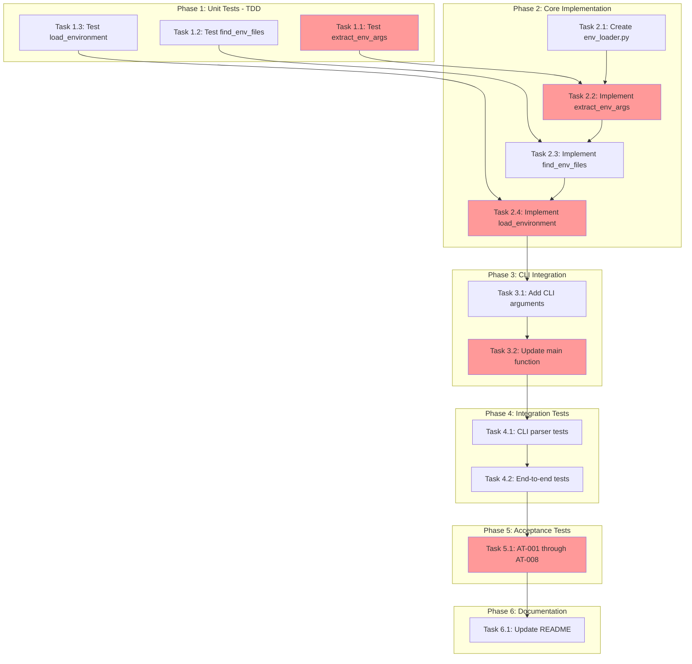

<!-- markdownlint-disable-file -->
# Task Checklist: Enhanced .env File Loading

## Overview

Implement reliable `.env` file loading for TeamBot that works with `uvx` invocations, subdirectory execution, explicit path specification (`--env-file`), and loading disablement (`--no-env`).

## Objectives

* Load `.env` files reliably from cwd regardless of invocation method (uvx, direct, pipx)
* Support parent directory `.env` merge behavior (parent provides defaults, cwd overrides)
* Add `--env-file PATH` CLI argument for explicit path specification
* Add `--no-env` CLI flag to disable all `.env` loading (CI-friendly)
* Maintain 100% backward compatibility with existing behavior

## Research Summary

### Project Files
* `src/teambot/cli.py` (Lines 1286-1313) - Current `main()` with `load_dotenv()` call at line 1289
* `src/teambot/cli.py` (Lines 527-529) - Global argument pattern for argparse

### External References
* `.teambot/enhanced-env-file/artifacts/research.md` - Comprehensive implementation research
* `.teambot/enhanced-env-file/artifacts/test_strategy.md` - TDD approach with component strategies
* `.teambot/enhanced-env-file/artifacts/feature_spec.md` - Full requirements and acceptance criteria

### Standards References
* `pyproject.toml` - pytest configuration and coverage targets
* `tests/test_cli.py` - Existing CLI test patterns

## Task Dependency Graph

**Critical Path**: T1.1 → T2.2 → T2.4 → T3.2 → T5.1
**Parallel Opportunities**: T1.1, T1.2, T1.3 can run in parallel; T4.1 and T4.2 can overlap

## Implementation Checklist

### [x] Phase 1: Unit Tests (TDD - Write First)

**Phase Objective**: Create failing unit tests for all env_loader functions before implementation

**Test Strategy**: TDD - See `.teambot/enhanced-env-file/artifacts/test_strategy.md`

* [x] Task 1.1: Create test file and write tests for `extract_env_args()`
  * Details: .agent-tracking/details/20260224-enhanced-env-file-loading-details.md (Lines 15-55)
  * Dependencies: None
  * Priority: CRITICAL
  * Coverage Target: 95%

* [x] Task 1.2: Write tests for `find_env_files()`
  * Details: .agent-tracking/details/20260224-enhanced-env-file-loading-details.md (Lines 57-97)
  * Dependencies: None (can run parallel with 1.1)
  * Priority: CRITICAL
  * Coverage Target: 95%

* [x] Task 1.3: Write tests for `load_environment()`
  * Details: .agent-tracking/details/20260224-enhanced-env-file-loading-details.md (Lines 99-139)
  * Dependencies: None (can run parallel with 1.1, 1.2)
  * Priority: CRITICAL
  * Coverage Target: 95%

### Phase Gate: Phase 1 Complete When
- [x] All unit tests written in `tests/test_env_loader.py`
- [x] Tests fail with appropriate "module not found" or "function not found" errors
- [x] Validation: `uv run pytest tests/test_env_loader.py` runs (failures expected)
- [x] Artifacts: `tests/test_env_loader.py` exists with 15+ test functions

**Cannot Proceed If**: Tests don't properly import from expected module location

---

### [x] Phase 2: Core Implementation

**Phase Objective**: Implement `env_loader.py` module to make all Phase 1 tests pass

* [x] Task 2.1: Create `src/teambot/env_loader.py` with module skeleton
  * Details: .agent-tracking/details/20260224-enhanced-env-file-loading-details.md (Lines 143-165)
  * Dependencies: None
  * Priority: CRITICAL

* [x] Task 2.2: Implement `extract_env_args()` function
  * Details: .agent-tracking/details/20260224-enhanced-env-file-loading-details.md (Lines 167-210)
  * Dependencies: Task 2.1
  * Priority: CRITICAL

* [x] Task 2.3: Implement `find_env_files()` function
  * Details: .agent-tracking/details/20260224-enhanced-env-file-loading-details.md (Lines 212-260)
  * Dependencies: Task 2.2
  * Priority: HIGH

* [x] Task 2.4: Implement `load_environment()` function
  * Details: .agent-tracking/details/20260224-enhanced-env-file-loading-details.md (Lines 262-310)
  * Dependencies: Task 2.3
  * Priority: CRITICAL

### Phase Gate: Phase 2 Complete When
- [x] All Phase 1 unit tests pass
- [x] Validation: `uv run pytest tests/test_env_loader.py -v` shows all green
- [x] Artifacts: `src/teambot/env_loader.py` with all functions implemented

**Cannot Proceed If**: Any unit test still failing

---

### [x] Phase 3: CLI Integration

**Phase Objective**: Integrate env_loader into CLI with new arguments

* [x] Task 3.1: Add `--env-file` and `--no-env` arguments to CLI parser
  * Details: .agent-tracking/details/20260224-enhanced-env-file-loading-details.md (Lines 314-350)
  * Dependencies: Phase 2 completion
  * Priority: HIGH

* [x] Task 3.2: Update `main()` function to use `load_environment()`
  * Details: .agent-tracking/details/20260224-enhanced-env-file-loading-details.md (Lines 352-400)
  * Dependencies: Task 3.1
  * Priority: CRITICAL

### Phase Gate: Phase 3 Complete When
- [x] `--env-file` and `--no-env` appear in `teambot --help`
- [x] Arguments are mutually exclusive (argparse enforces)
- [x] Validation: `teambot --help | grep -E "(env-file|no-env)"` shows both options
- [x] Artifacts: Modified `src/teambot/cli.py`

**Cannot Proceed If**: CLI doesn't recognize new arguments

---

### [x] Phase 4: Integration Tests

**Phase Objective**: Validate CLI integration with real argument parsing

* [x] Task 4.1: Add CLI parser tests for new arguments
  * Details: .agent-tracking/details/20260224-enhanced-env-file-loading-details.md (Lines 404-440)
  * Dependencies: Phase 3 completion
  * Priority: HIGH
  * Test Framework: pytest

* [x] Task 4.2: Add end-to-end integration tests
  * Details: .agent-tracking/details/20260224-enhanced-env-file-loading-details.md (Lines 442-485)
  * Dependencies: Task 4.1
  * Priority: HIGH

### Phase Gate: Phase 4 Complete When
- [x] All integration tests pass
- [x] Validation: `uv run pytest tests/test_cli.py -v -k env` shows all green
- [x] Artifacts: Extended `tests/test_cli.py` with new test class

**Cannot Proceed If**: Integration tests fail

---

### [x] Phase 5: Acceptance Tests

**Phase Objective**: Validate all 8 acceptance test scenarios from specification

* [x] Task 5.1: Create acceptance test file with AT-001 through AT-008
  * Details: .agent-tracking/details/20260224-enhanced-env-file-loading-details.md (Lines 489-570)
  * Dependencies: Phase 4 completion
  * Priority: CRITICAL
  * Test Approach: TDD (tests already defined in spec)
  * Coverage Target: 100% of acceptance scenarios

### Phase Gate: Phase 5 Complete When
- [x] All 8 acceptance tests pass (7 automated + AT-008 manual verification pending)
- [x] Validation: `uv run pytest tests/test_env_loading_acceptance.py -v -m acceptance`
- [x] Artifacts: `tests/test_env_loading_acceptance.py` with 14 test functions

**Cannot Proceed If**: Any acceptance test fails

---

### [x] Phase 6: Documentation & Validation

**Phase Objective**: Update documentation and run full validation

* [x] Task 6.1: Update README.md with new CLI options
  * Details: .agent-tracking/details/20260224-enhanced-env-file-loading-details.md (Lines 574-600)
  * Dependencies: Phase 5 completion
  * Priority: MEDIUM

* [x] Task 6.2: Run full test suite and validate coverage
  * Details: .agent-tracking/details/20260224-enhanced-env-file-loading-details.md (Lines 602-620)
  * Dependencies: Task 6.1
  * Priority: HIGH

* [x] Task 6.3: Manual verification of uvx invocation (AT-008)
  * Details: .agent-tracking/details/20260224-enhanced-env-file-loading-details.md (Lines 622-640)
  * Dependencies: Task 6.2
  * Priority: HIGH
  * Note: AT-008 is documented for manual verification by user

### Phase Gate: Phase 6 Complete When
- [x] README updated with `--env-file` and `--no-env` documentation
- [x] All tests pass: `uv run pytest` (1778 passed)
- [x] Coverage meets 85%+ for new module (99% for env_loader.py)
- [x] Validation: `uv run pytest --cov=src/teambot/env_loader --cov-report=term-missing`
- [x] Artifacts: Updated `README.md`

**Cannot Proceed If**: Coverage below 85% or any test failing

---

## Effort Estimation

| Task | Estimated Effort | Complexity | Risk |
|------|-----------------|------------|------|
| Phase 1: Unit Tests | 45 min | MEDIUM | LOW |
| Phase 2: Core Implementation | 60 min | HIGH | MEDIUM |
| Phase 3: CLI Integration | 30 min | MEDIUM | LOW |
| Phase 4: Integration Tests | 30 min | LOW | LOW |
| Phase 5: Acceptance Tests | 45 min | MEDIUM | LOW |
| Phase 6: Documentation | 20 min | LOW | LOW |
| **Total** | **~4 hours** | | |

## Dependencies

* python-dotenv v1.0.0+ (already in pyproject.toml)
* pytest with pytest-cov, pytest-mock (already in dev dependencies)
* argparse (Python stdlib)
* pathlib (Python stdlib)
* subprocess (Python stdlib) - for git root detection

## Success Criteria

* All 62 existing CLI tests continue to pass (backward compatibility)
* New `env_loader.py` module has 95%+ unit test coverage
* All 8 acceptance test scenarios (AT-001 through AT-008) pass
* `--env-file` and `--no-env` work with all commands (init, run, status)
* `uvx teambot` invocation loads `.env` from cwd correctly
* Documentation updated with new CLI options
* `uv run ruff check .` and `uv run ruff format --check .` pass
