<!-- markdownlint-disable-file -->
# Task Checklist: SDD Prompt Sync

## Overview

Implement incremental SDD prompt file synchronization during `teambot init` and runtime validation to ensure `stages.yaml` and SDD prompt files stay in sync.

## Objectives

* Enable incremental prompt file sync during init (G-001)
* Validate stages.yaml ↔ prompt file sync at runtime (G-002)
* Provide actionable error messages with remediation steps (G-003)
* Preserve backward compatibility with existing scaffold behavior (G-004)
* Enable transparent change tracking during sync (G-005)

## Research Summary

### Project Files
* `src/teambot/scaffolds.py` - Existing scaffold copy patterns, `CopyResult` NamedTuple
* `src/teambot/cli.py` - `cmd_init()` (Lines 686-763), `cmd_run()` (Lines 785-990)
* `src/teambot/orchestration/stage_config.py` - `StageConfig.prompt_template` field, `load_stages_config()`
* `src/teambot/orchestration/execution_loop.py` - `_load_prompt_template()` (Lines 1034-1059)

### External References
* .agent-tracking/research/20260302-sdd-prompt-sync-research.md - Complete implementation patterns and code examples
* .teambot/sdd-prompt-sync/artifacts/test_strategy.md - TDD approach with 90%+ coverage targets

### Standards References
* AGENTS.md - Project conventions, testing patterns, linting requirements

## Task Dependency Graph

```mermaid
graph TD
    subgraph Phase1[Phase 1: TDD - Core Sync Tests]
        T1.1[Task 1.1: Create test file]
        T1.2[Task 1.2: SyncResult tests]
        T1.3[Task 1.3: sync_sdd_prompts tests]
    end
    
    subgraph Phase2[Phase 2: Sync Implementation]
        T2.1[Task 2.1: Create prompt_sync.py]
        T2.2[Task 2.2: Implement SyncResult]
        T2.3[Task 2.3: Implement sync_sdd_prompts]
    end
    
    subgraph Phase3[Phase 3: TDD - Validation Tests]
        T3.1[Task 3.1: ValidationResult tests]
        T3.2[Task 3.2: validate_prompt_files tests]
        T3.3[Task 3.3: detect_orphaned_prompts tests]
    end
    
    subgraph Phase4[Phase 4: Validation Implementation]
        T4.1[Task 4.1: Implement ValidationResult]
        T4.2[Task 4.2: Implement validate_prompt_files]
        T4.3[Task 4.3: Implement detect_orphaned_prompts]
    end
    
    subgraph Phase5[Phase 5: CLI Integration]
        T5.1[Task 5.1: Integrate with cmd_init]
        T5.2[Task 5.2: Integrate with cmd_run]
        T5.3[Task 5.3: Add --skip-prompt-validation]
    end
    
    subgraph Phase6[Phase 6: Acceptance Tests]
        T6.1[Task 6.1: AT-001 through AT-006]
        T6.2[Task 6.2: Coverage validation]
    end
    
    T1.1 --> T1.2 --> T1.3
    T1.3 --> T2.1
    T2.1 --> T2.2 --> T2.3
    T2.3 --> T3.1
    T3.1 --> T3.2 --> T3.3
    T3.3 --> T4.1
    T4.1 --> T4.2 --> T4.3
    T4.3 --> T5.1
    T5.1 --> T5.2 --> T5.3
    T5.3 --> T6.1 --> T6.2
    
    %% Critical Path highlighted
    style T1.3 fill:#ff9999
    style T2.3 fill:#ff9999
    style T3.2 fill:#ff9999
    style T4.2 fill:#ff9999
    style T5.2 fill:#ff9999
```

**Critical Path**: T1.3 → T2.3 → T3.2 → T4.2 → T5.2 (core sync and validation flow)

## Implementation Checklist

### [x] Phase 1: TDD - Core Sync Function Tests

**Phase Objective**: Write failing tests for `sync_sdd_prompts()` function before implementation

**Test Strategy**: TDD - Tests written BEFORE implementation (per test strategy)

* [x] Task 1.1: Create test file structure
  * Details: .agent-tracking/details/20260302-sdd-prompt-sync-details.md (Lines 15-35)
  * Dependencies: None
  * Priority: CRITICAL

* [x] Task 1.2: Write SyncResult tests
  * Details: .agent-tracking/details/20260302-sdd-prompt-sync-details.md (Lines 37-55)
  * Dependencies: Task 1.1
  * Priority: HIGH

* [x] Task 1.3: Write sync_sdd_prompts() tests
  * Details: .agent-tracking/details/20260302-sdd-prompt-sync-details.md (Lines 57-110)
  * Dependencies: Task 1.2
  * Priority: CRITICAL

### Phase Gate: Phase 1 Complete When
- [ ] All Phase 1 tasks marked complete
- [ ] Test file `tests/test_prompt_sync.py` created
- [ ] Tests run and FAIL (no implementation yet)
- [ ] Validation: `uv run pytest tests/test_prompt_sync.py` runs (tests fail as expected)

**Cannot Proceed If**: Tests don't run or have syntax errors

---

### [x] Phase 2: Sync Function Implementation

**Phase Objective**: Implement `sync_sdd_prompts()` to pass all Phase 1 tests

* [x] Task 2.1: Create prompt_sync.py module
  * Details: .agent-tracking/details/20260302-sdd-prompt-sync-details.md (Lines 115-140)
  * Dependencies: Phase 1 completion
  * Priority: CRITICAL

* [x] Task 2.2: Implement SyncResult NamedTuple
  * Details: .agent-tracking/details/20260302-sdd-prompt-sync-details.md (Lines 142-160)
  * Dependencies: Task 2.1
  * Priority: HIGH

* [x] Task 2.3: Implement sync_sdd_prompts() function
  * Details: .agent-tracking/details/20260302-sdd-prompt-sync-details.md (Lines 162-210)
  * Dependencies: Task 2.2
  * Priority: CRITICAL

### Phase Gate: Phase 2 Complete When
- [ ] All Phase 2 tasks marked complete
- [ ] All Phase 1 tests pass
- [ ] Validation: `uv run pytest tests/test_prompt_sync.py -v`
- [ ] Artifacts: `src/teambot/prompt_sync.py` with `sync_sdd_prompts()`

**Cannot Proceed If**: Any Phase 1 tests fail

---

### [x] Phase 3: TDD - Validation Function Tests

**Phase Objective**: Write failing tests for validation functions before implementation

* [x] Task 3.1: Write ValidationResult and PromptValidationError tests
  * Details: .agent-tracking/details/20260302-sdd-prompt-sync-details.md (Lines 215-245)
  * Dependencies: Phase 2 completion
  * Priority: HIGH

* [x] Task 3.2: Write validate_prompt_files() tests
  * Details: .agent-tracking/details/20260302-sdd-prompt-sync-details.md (Lines 247-300)
  * Dependencies: Task 3.1
  * Priority: CRITICAL

* [x] Task 3.3: Write detect_orphaned_prompts() tests
  * Details: .agent-tracking/details/20260302-sdd-prompt-sync-details.md (Lines 302-340)
  * Dependencies: Task 3.2
  * Priority: MEDIUM

### Phase Gate: Phase 3 Complete When
- [ ] All Phase 3 tasks marked complete
- [ ] New tests added to `tests/test_prompt_sync.py`
- [ ] Validation tests run and FAIL (no implementation yet)
- [ ] Validation: `uv run pytest tests/test_prompt_sync.py::TestValidatePromptFiles -v`

**Cannot Proceed If**: Tests don't run or have syntax errors

---

### [x] Phase 4: Validation Function Implementation

**Phase Objective**: Implement validation functions to pass all Phase 3 tests

* [x] Task 4.1: Implement ValidationResult and PromptValidationError
  * Details: .agent-tracking/details/20260302-sdd-prompt-sync-details.md (Lines 345-380)
  * Dependencies: Phase 3 completion
  * Priority: HIGH

* [x] Task 4.2: Implement validate_prompt_files() function
  * Details: .agent-tracking/details/20260302-sdd-prompt-sync-details.md (Lines 382-425)
  * Dependencies: Task 4.1
  * Priority: CRITICAL

* [x] Task 4.3: Implement detect_orphaned_prompts() function
  * Details: .agent-tracking/details/20260302-sdd-prompt-sync-details.md (Lines 427-470)
  * Dependencies: Task 4.2
  * Priority: MEDIUM

### Phase Gate: Phase 4 Complete When
- [ ] All Phase 4 tasks marked complete
- [ ] All Phase 3 tests pass
- [ ] Validation: `uv run pytest tests/test_prompt_sync.py -v`
- [ ] Artifacts: `prompt_sync.py` with validation functions

**Cannot Proceed If**: Any Phase 3 tests fail

---

### [x] Phase 5: CLI Integration

**Phase Objective**: Integrate sync and validation into CLI commands

* [x] Task 5.1: Integrate sync_sdd_prompts() with cmd_init()
  * Details: .agent-tracking/details/20260302-sdd-prompt-sync-details.md (Lines 475-520)
  * Dependencies: Phase 4 completion
  * Priority: CRITICAL

* [x] Task 5.2: Integrate validate_prompt_files() with cmd_run()
  * Details: .agent-tracking/details/20260302-sdd-prompt-sync-details.md (Lines 522-575)
  * Dependencies: Task 5.1
  * Priority: CRITICAL

* [x] Task 5.3: Add --skip-prompt-validation flag
  * Details: .agent-tracking/details/20260302-sdd-prompt-sync-details.md (Lines 577-605)
  * Dependencies: Task 5.2
  * Priority: HIGH

### Phase Gate: Phase 5 Complete When
- [ ] All Phase 5 tasks marked complete
- [ ] `teambot init` displays sync summary
- [ ] `teambot run` validates prompts before workflow
- [ ] Validation: `uv run pytest tests/test_cli.py -v`
- [ ] Artifacts: Updated `cli.py` with integration

**Cannot Proceed If**: CLI commands fail or ruff check fails

---

### [x] Phase 6: Acceptance Tests & Coverage

**Phase Objective**: Create acceptance tests and validate coverage targets

* [x] Task 6.1: Create acceptance test file with AT-001 through AT-006
  * Details: .agent-tracking/details/20260302-sdd-prompt-sync-details.md (Lines 610-680)
  * Dependencies: Phase 5 completion
  * Priority: HIGH

* [x] Task 6.2: Validate coverage and run final test suite
  * Details: .agent-tracking/details/20260302-sdd-prompt-sync-details.md (Lines 682-710)
  * Dependencies: Task 6.1
  * Priority: CRITICAL

### Phase Gate: Phase 6 Complete When
- [ ] All acceptance tests pass
- [ ] Coverage >= 90% for prompt_sync.py
- [ ] Validation: `uv run pytest --cov=src/teambot/prompt_sync --cov-report=term-missing`
- [ ] Validation: `uv run ruff check . && uv run ruff format --check .`

**Cannot Proceed If**: Coverage < 90% or acceptance tests fail

---

## Effort Estimation

| Task | Estimated Effort | Complexity | Risk |
|------|-----------------|------------|------|
| Phase 1 (TDD Tests) | 45 min | MEDIUM | LOW |
| Phase 2 (Sync Impl) | 30 min | MEDIUM | LOW |
| Phase 3 (Validation Tests) | 45 min | MEDIUM | LOW |
| Phase 4 (Validation Impl) | 30 min | MEDIUM | LOW |
| Phase 5 (CLI Integration) | 60 min | HIGH | MEDIUM |
| Phase 6 (Acceptance) | 45 min | MEDIUM | LOW |
| **Total** | **~4.5 hours** | | |

## Dependencies

* pytest, pytest-cov, pytest-mock (existing dev dependencies)
* pathlib, shutil (stdlib)
* teambot.scaffolds.get_scaffolds_dir()
* teambot.orchestration.stage_config.load_stages_config()

## Success Criteria

* All 6 acceptance tests (AT-001 through AT-006) pass
* Unit test coverage >= 90% for prompt_sync.py
* `teambot init` displays sync summary showing added/skipped files
* `teambot run` blocks with actionable error when prompt files missing
* Orphaned files produce warning but don't block workflow
* `--skip-prompt-validation` flag bypasses validation
* All existing tests continue to pass
* `uv run ruff check .` and `uv run ruff format --check .` pass
