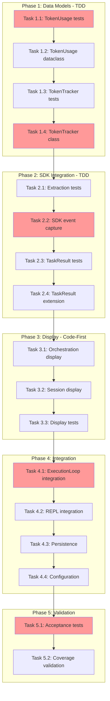

<!-- markdownlint-disable-file -->
# Task Checklist: Operation Cost Visibility

## Overview

Add comprehensive token usage and cost visibility to TeamBot interactions by capturing token data from SDK events, aggregating by agent/stage, and displaying summaries at run completion.

## Objectives

* Capture token usage from Copilot SDK `ASSISTANT_USAGE` events during streaming execution
* Aggregate token usage per-agent, per-stage, and total for orchestration runs
* Display end-of-run token summary panel for file-based orchestration
* Display session token summary on exit for interactive REPL mode
* Persist token tracking data in workflow state metadata with documented schema
* Support graceful degradation when token data is unavailable (display `n/a`, log warning once)
* Add configuration option to enable/disable tracking (default: enabled)

## Research Summary

### Project Files
* `src/teambot/copilot/sdk_client.py` - SDK streaming execution with event handling (Lines 435-531)
* `src/teambot/workflow/state_machine.py` - WorkflowState with extensible metadata dict (Lines 35-86)
* `src/teambot/tasks/models.py` - TaskResult dataclass needing token_usage field (Lines 33-50)
* `src/teambot/config/loader.py` - Config validation pattern for new sections (Lines 217-327)
* `src/teambot/visualization/console.py` - Rich library display patterns

### External References
* `.agent-tracking/research/20260303-operation-cost-visibility-research.md` - Complete research with SDK analysis
* `.teambot/operation-cost-visibility/artifacts/test_strategy.md` - Hybrid testing approach (TDD + Code-First)

### Test Strategy Reference
* `.teambot/operation-cost-visibility/artifacts/test_strategy.md` - Hybrid approach: TDD for core logic, Code-First for display

## Task Dependency Graph

**Critical Path**: T1.1 → T1.2 → T1.3 → T1.4 → T2.1 → T2.2 → T2.4 → T3.1 → T4.1 → T5.1
**Parallel Opportunities**: T3.3 can start after T3.2; T4.3 and T4.4 can run in parallel

## Implementation Checklist

### [x] Phase 1: Data Models (TDD)

**Phase Objective**: Create TokenUsage and TokenTracker classes with comprehensive test coverage

**Test Strategy**: TDD - Write tests BEFORE implementation

#### Sub-phase 1.A: TokenUsage Model

* [x] Task 1.1: Create TokenUsage unit tests
  * Details: .agent-tracking/details/20260303-operation-cost-visibility-details.md (Lines 15-55)
  * Test Approach: TDD
  * Coverage Target: 100%
  * Dependencies: None
  * Priority: CRITICAL

* [x] Task 1.2: Implement TokenUsage dataclass
  * Details: .agent-tracking/details/20260303-operation-cost-visibility-details.md (Lines 57-95)
  * Dependencies: Task 1.1
  * Priority: CRITICAL

#### Sub-phase 1.B: TokenTracker

* [x] Task 1.3: Create TokenTracker unit tests
  * Details: .agent-tracking/details/20260303-operation-cost-visibility-details.md (Lines 97-145)
  * Test Approach: TDD
  * Coverage Target: 95%
  * Dependencies: Task 1.2
  * Priority: CRITICAL

* [x] Task 1.4: Implement TokenTracker class
  * Details: .agent-tracking/details/20260303-operation-cost-visibility-details.md (Lines 147-195)
  * Dependencies: Task 1.3
  * Priority: CRITICAL

### Phase Gate: Phase 1 Complete When
- [ ] All Phase 1 tasks marked complete
- [ ] `tests/test_tokens/test_models.py` exists with passing tests
- [ ] `tests/test_tokens/test_tracker.py` exists with passing tests
- [ ] `src/teambot/tokens/` module created with `models.py` and `tracker.py`
- [ ] Validation: `uv run pytest tests/test_tokens/ -v`

**Cannot Proceed If**: TokenUsage or TokenTracker tests fail

---

### [x] Phase 2: SDK Integration (TDD)

**Phase Objective**: Capture token usage from SDK events and extend TaskResult

**Test Strategy**: TDD - Write tests BEFORE implementation

#### Sub-phase 2.A: SDK Event Capture

* [x] Task 2.1: Create SDK extraction unit tests
  * Details: .agent-tracking/details/20260303-operation-cost-visibility-details.md (Lines 200-250)
  * Test Approach: TDD
  * Coverage Target: 95%
  * Dependencies: Phase 1 completion
  * Priority: CRITICAL

* [x] Task 2.2: Modify SDK client to capture ASSISTANT_USAGE events
  * Details: .agent-tracking/details/20260303-operation-cost-visibility-details.md (Lines 252-310)
  * Dependencies: Task 2.1
  * Priority: CRITICAL

#### Sub-phase 2.B: TaskResult Extension

* [x] Task 2.3: Create TaskResult token_usage tests
  * Details: .agent-tracking/details/20260303-operation-cost-visibility-details.md (Lines 312-350)
  * Test Approach: TDD
  * Coverage Target: 95%
  * Dependencies: Task 2.2
  * Priority: HIGH

* [x] Task 2.4: Add token_usage field to TaskResult
  * Details: .agent-tracking/details/20260303-operation-cost-visibility-details.md (Lines 352-385)
  * Dependencies: Task 2.3
  * Priority: HIGH

### Phase Gate: Phase 2 Complete When
- [x] All Phase 2 tasks marked complete
- [x] SDK client captures `ASSISTANT_USAGE` events
- [x] TaskResult has optional `token_usage` field
- [x] Backward compatibility maintained (old code works)
- [x] Validation: `uv run pytest tests/test_copilot/ tests/test_tasks/ -v`

**Cannot Proceed If**: SDK token capture returns None when data is available

---

### [x] Phase 3: Display Components (Code-First)

**Phase Objective**: Create Rich-based token summary displays for orchestration and interactive modes

**Test Strategy**: Code-First - Implement then add structural tests

* [x] Task 3.1: Implement orchestration summary display
  * Details: .agent-tracking/details/20260303-operation-cost-visibility-details.md (Lines 390-440)
  * Dependencies: Phase 2 completion
  * Priority: HIGH

* [x] Task 3.2: Implement session summary display
  * Details: .agent-tracking/details/20260303-operation-cost-visibility-details.md (Lines 442-475)
  * Dependencies: Task 3.1
  * Priority: HIGH

* [x] Task 3.3: Add display unit tests
  * Details: .agent-tracking/details/20260303-operation-cost-visibility-details.md (Lines 477-515)
  * Test Approach: Code-First
  * Coverage Target: 80%
  * Dependencies: Task 3.2
  * Priority: MEDIUM

### Phase Gate: Phase 3 Complete When
- [x] All Phase 3 tasks marked complete
- [x] `src/teambot/tokens/display.py` exists
- [x] `render_token_summary()` and `render_session_summary()` functions work
- [x] Display shows "n/a" when tokens unavailable
- [x] Validation: `uv run pytest tests/test_tokens/test_display.py -v`

**Cannot Proceed If**: Display crashes on None token data

---

### [x] Phase 4: Integration & Configuration

**Phase Objective**: Wire token tracking into orchestration loop, REPL, persistence, and config

#### Sub-phase 4.A: Runtime Integration

* [x] Task 4.1: Integrate TokenTracker with ExecutionLoop
  * Details: .agent-tracking/details/20260303-operation-cost-visibility-details.md (Lines 520-565)
  * Dependencies: Phase 3 completion
  * Priority: HIGH

* [x] Task 4.2: Integrate session tracking with REPL loop
  * Details: .agent-tracking/details/20260303-operation-cost-visibility-details.md (Lines 567-610)
  * Dependencies: Task 4.1
  * Priority: HIGH

#### Sub-phase 4.B: Persistence & Config

* [x] Task 4.3: Add token data persistence to WorkflowState
  * Details: .agent-tracking/details/20260303-operation-cost-visibility-details.md (Lines 612-655)
  * Dependencies: Task 4.1
  * Priority: HIGH

* [x] Task 4.4: Add token_tracking configuration option
  * Details: .agent-tracking/details/20260303-operation-cost-visibility-details.md (Lines 657-700)
  * Dependencies: None (can run in parallel with 4.3)
  * Priority: MEDIUM

### Phase Gate: Phase 4 Complete When
- [x] All Phase 4 tasks marked complete
- [x] Orchestration runs display token summary at end
- [x] REPL sessions display token summary on exit
- [x] Token data persists in `orchestration_state.json`
- [x] `token_tracking.enabled` config option works
- [x] Validation: `uv run pytest tests/test_orchestration/ tests/test_repl/ tests/test_config/ -v`

**Cannot Proceed If**: Token tracking disrupts existing workflows

---

### [x] Phase 5: Validation & Acceptance

**Phase Objective**: Comprehensive testing and coverage validation

* [x] Task 5.1: Create acceptance tests (AT-001 through AT-006)
  * Details: .agent-tracking/details/20260303-operation-cost-visibility-details.md (Lines 705-780)
  * Test Approach: Acceptance
  * Dependencies: Phase 4 completion
  * Priority: HIGH

* [x] Task 5.2: Validate coverage targets and run full test suite
  * Details: .agent-tracking/details/20260303-operation-cost-visibility-details.md (Lines 782-815)
  * Dependencies: Task 5.1
  * Priority: HIGH

### Phase Gate: Phase 5 Complete When
- [x] All acceptance tests pass
- [x] Unit coverage for tokens module ≥90% (achieved: 100%)
- [x] Integration coverage ≥80%
- [x] No regressions in existing tests
- [x] Validation: `uv run pytest --cov=src/teambot --cov-report=term-missing`

**Cannot Proceed If**: Coverage targets not met or acceptance tests fail

## Effort Estimation

| Task | Estimated Effort | Complexity | Risk |
|------|-----------------|------------|------|
| T1.1-T1.2 | 1 hour | LOW | LOW |
| T1.3-T1.4 | 1.5 hours | MEDIUM | LOW |
| T2.1-T2.2 | 2 hours | MEDIUM | MEDIUM |
| T2.3-T2.4 | 30 min | LOW | LOW |
| T3.1-T3.3 | 1.5 hours | LOW | LOW |
| T4.1-T4.2 | 2 hours | MEDIUM | MEDIUM |
| T4.3-T4.4 | 1 hour | LOW | LOW |
| T5.1-T5.2 | 2 hours | MEDIUM | LOW |

**Total Estimated Effort**: ~11.5 hours

## Dependencies

* `pytest` 7.4.0+ (existing)
* `pytest-cov` (existing)
* `pytest-asyncio` (existing)
* `rich` 13.0.0+ (existing)
* Copilot SDK with `ASSISTANT_USAGE` event support (confirmed)

## Success Criteria

* Token summary panel displays at end of orchestration runs
* Session token summary displays on REPL exit
* Per-agent and per-stage breakdowns are accurate
* Graceful degradation: Shows "n/a" when data unavailable, logs single warning
* No performance degradation or workflow disruption
* All acceptance tests pass
* Coverage targets met (90% unit, 80% integration for tokens module)
