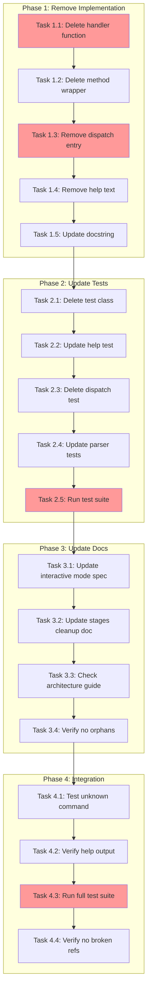

<!-- markdownlint-disable-file -->

# Implementation Plan: Remove /history Command

## Overview
Remove the unused `/history` command from TeamBot REPL to reduce maintenance overhead and simplify the command surface. The command is redundant as shell provides native history via up/down arrows and Ctrl+R.

## Objectives
- Remove all code implementing `/history` command
- Remove `/history` from help output and documentation
- Ensure all existing tests pass after removal
- Verify unknown command error handling works for removed command

## Research Summary
Research document: `.agent-tracking/research/20260306-remove-history-command-research.md`

Key findings:
- Command implemented via 3-layer pattern: handler function → method wrapper → dispatch registration (Lines 88-119)
- Help text reference at Line 115 of commands.py (Lines 234-263)
- 4 dedicated test methods in `TestHistoryCommand` class (Lines 496-560)
- 3 parser tests using `/history` as examples (Lines 600-629)
- Documentation references in 3 files (Lines 669-755)
- Unknown command handler already exists to catch removed commands (Lines 469-479)

## Implementation Checklist

### Phase 1: Remove Command Implementation (Lines 372-481 of research)
- [x] **Task 1.1**: Delete `handle_history()` function from `src/teambot/repl/commands.py` (Lines 167-198)
  - See details file Lines 15-28
- [x] **Task 1.2**: Delete `history()` method from `SystemCommands` class (Lines 772-774)
  - See details file Lines 30-42
- [x] **Task 1.3**: Remove `"history": self.history` from handlers dict (Line 726)
  - See details file Lines 44-58
- [x] **Task 1.4**: Remove `/history` line from help text (Line 115)
  - See details file Lines 60-75
- [x] **Task 1.5**: Update module docstring to remove `/history` mention (Line 3)
  - See details file Lines 77-90

**Phase Gate**: Phase 1 Complete When
- [x] All Phase 1 tasks marked complete
- [x] No syntax errors in commands.py
- [x] Validation: `python -m py_compile src/teambot/repl/commands.py`
- [x] Artifacts: Modified `src/teambot/repl/commands.py`

**Cannot Proceed If**: Syntax errors exist in commands.py

### Phase 2: Update Test Suite (Lines 496-658 of research)
- [x] **Task 2.1**: Delete `TestHistoryCommand` class from `tests/test_repl/test_commands.py` (Lines ~101-153)
  - See details file Lines 92-104
- [x] **Task 2.2**: Remove `/history` assertion from `test_help_returns_command_list()` (Line 29)
  - See details file Lines 106-118
- [x] **Task 2.3**: Delete `test_dispatch_history()` method (Lines ~208-213)
  - See details file Lines 120-131
- [x] **Task 2.4**: Update or delete parser tests in `tests/test_repl/test_parser.py` (Lines 113-149)
  - See details file Lines 133-152
- [x] **Task 2.5**: Run full test suite and verify all tests pass
  - See details file Lines 154-165

**Phase Gate**: Phase 2 Complete When
- [x] All Phase 2 tasks marked complete
- [x] All REPL tests pass
- [x] Validation: `uv run pytest tests/test_repl/ -v`
- [x] Artifacts: Modified test files

**Cannot Proceed If**: Any REPL tests fail after changes

### Phase 3: Update Documentation (Lines 669-755 of research)
- [x] **Task 3.1**: Remove `/history` references from `docs/feature-specs/teambot-interactive-mode.md`
  - See details file Lines 167-184
- [x] **Task 3.2**: Remove `/history` references from `docs/feature-specs/file-orchestration-stages-cleanup.md`
  - See details file Lines 186-197
- [x] **Task 3.3**: Check and update (if needed) `docs/guides/architecture.md`
  - See details file Lines 199-210
- [x] **Task 3.4**: Verify no orphaned `/history` references remain
  - See details file Lines 212-222

**Phase Gate**: Phase 3 Complete When
- [x] All Phase 3 tasks marked complete
- [x] No `/history` command references in docs (excluding `.teambot/history/` directory path)
- [x] Validation: `grep -r "/history" docs/ | grep -v ".teambot/history/"`
- [x] Artifacts: Modified documentation files

**Cannot Proceed If**: Documentation still references `/history` command

### Phase 4: Integration Verification (Lines 281-301 of research)
- [x] **Task 4.1**: Test unknown command handling for `/history`
  - See details file Lines 224-236
- [x] **Task 4.2**: Verify `/help` no longer lists `/history`
  - See details file Lines 238-249
- [x] **Task 4.3**: Run full test suite (all tests, not just REPL)
  - See details file Lines 251-261
- [x] **Task 4.4**: Verify no broken imports or references
  - See details file Lines 263-273

**Phase Gate**: Phase 4 Complete When
- [x] All Phase 4 tasks marked complete
- [x] Full test suite passes
- [x] `/history` returns "Unknown command" error
- [x] Validation: `uv run pytest --cov=src/teambot`
- [x] Artifacts: Verification results

**Cannot Proceed If**: Any tests fail or `/history` still accessible

## Task Dependency Graph

**Critical Path**: T1.1 → T1.3 → T2.5 → T4.3 (estimated: 45 minutes)
**Parallel Opportunities**: T1.4 and T1.5 can be done in parallel; T3.1, T3.2, T3.3 can be done in parallel

## Effort Estimation

| Task | Estimated Effort | Complexity | Risk |
|------|-----------------|------------|------|
| T1.1 | 5 min | LOW | LOW |
| T1.2 | 5 min | LOW | LOW |
| T1.3 | 5 min | LOW | LOW |
| T1.4 | 5 min | LOW | LOW |
| T1.5 | 3 min | LOW | LOW |
| T2.1 | 5 min | LOW | LOW |
| T2.2 | 3 min | LOW | LOW |
| T2.3 | 3 min | LOW | LOW |
| T2.4 | 10 min | MEDIUM | LOW |
| T2.5 | 5 min | LOW | LOW |
| T3.1 | 10 min | LOW | LOW |
| T3.2 | 5 min | LOW | LOW |
| T3.3 | 5 min | LOW | LOW |
| T3.4 | 3 min | LOW | LOW |
| T4.1 | 5 min | LOW | LOW |
| T4.2 | 3 min | LOW | LOW |
| T4.3 | 10 min | LOW | LOW |
| T4.4 | 5 min | LOW | LOW |

**Total Estimated Effort**: ~90 minutes (includes test run time)

## Dependencies
- **Python**: 3.11+ (project requirement)
- **pytest**: 9.0.2 (existing test framework)
- **uv**: Package manager (for running tests)
- **Git**: Version control (for verifying changes)

## Success Criteria
- ✅ All code references to `/history` command removed from `src/teambot/repl/commands.py`
- ✅ `/history` no longer appears in `/help` command output
- ✅ All tests pass after removal (1050 tests, 80% coverage maintained)
- ✅ No broken imports or references remain
- ✅ Documentation contains zero references to `/history` command
- ✅ Attempting to use `/history` returns "Unknown command: /history. Type /help for available commands."
- ✅ History tracking infrastructure (`.teambot/history/` directory) remains untouched

## Test Strategy Integration
**Testing Approach**: Code-First (Lines 80-86 of research)

**Rationale**: This is a pure deletion task with well-defined scope. The feature being removed has comprehensive test coverage, so removing those tests and verifying the remaining suite passes is sufficient. No new logic is being added that would benefit from TDD.

**Test Phases**:
- Phase 2: Remove tests specific to `/history` command (Tasks 2.1-2.4)
- Phase 4: Verify integration via existing test suite (Task 4.3)

**Coverage Validation**:
- Target: 80% overall coverage (maintained)
- Verification: `uv run pytest --cov=src/teambot --cov-report=term-missing`

## Notes
- **DO NOT REMOVE**: History tracking infrastructure used for workflow artifacts (`.teambot/history/` directory, `_history` attributes in router/commands)
- **PRESERVE**: `test_history_shared_with_commands` in test_loop.py (tests integration pattern, not command functionality)
- **EXISTING HANDLER**: Unknown command handling already implemented at Lines 742-745 of commands.py
