<!-- markdownlint-disable-file -->
# Task Checklist: SDD Prompt Renumbering

## Overview

Remove obsolete test strategy prompt (sdd.4) and renumber all subsequent SDD prompts sequentially (5→4, 6→5, 7→6, 7b→6b, 8→7) across repository and scaffold locations, updating all configuration and documentation references.

## Objectives

* Remove `sdd.4-determine-test-strategy.prompt.md` from repository and scaffold directories
* Rename SDD prompts 5→4, 6→5, 7→6, 7b→6b, 8→7 in both locations using `git mv`
* Update `stages.yaml` and scaffold `stages.yaml` with new prompt_template paths
* Update documentation (AGENTS.md, SDD README) with correct file names and step numbers
* Update cross-references within prompt files to reflect new numbering
* Update test files with hardcoded prompt path references
* Validate changes with acceptance tests

## Research Summary

### Project Files
* `.agent/commands/sdd/` - Repository SDD prompt directory with 10 existing files
* `src/teambot/scaffolds/.agent/commands/sdd/` - Scaffold SDD prompts used by `teambot init`
* `stages.yaml` - Stage configuration with prompt_template references (5 stages affected)
* `AGENTS.md` - Documentation table listing all SDD command files
* `.agent/commands/sdd/README.md` - Workflow diagram with step numbers

### External References
* .agent-tracking/research/20260308-sdd-prompt-renumbering-research.md - Comprehensive research on file locations, cross-references, and testing patterns
* Git rename tracking - Use `git mv` to preserve file history and improve rename detection
* Pytest acceptance testing - Existing tests validate `teambot init` scaffold behavior

### Standards References
* SDD numbering convention: `sdd.{number}-{description}.prompt.md`
* Scaffold synchronization: Mirror copy pattern requires exact structure match
* Acceptance testing: `@pytest.mark.acceptance` marker for integration validation

## Task Dependency Graph

```mermaid
graph TD
    subgraph Phase1[Phase 1: File Operations]
        T1.1[Task 1.1: Delete sdd.4 in repository]
        T1.2[Task 1.2: Rename sdd.5→4 to sdd.8→7 in repository]
        T1.3[Task 1.3: Delete sdd.4 in scaffolds]
        T1.4[Task 1.4: Rename sdd.5→4 to sdd.8→7 in scaffolds]
    end
    
    subgraph Phase2[Phase 2: Configuration]
        T2.1[Task 2.1: Update stages.yaml]
        T2.2[Task 2.2: Update scaffold stages.yaml]
    end
    
    subgraph Phase3[Phase 3: Documentation]
        T3.1[Task 3.1: Update AGENTS.md]
        T3.2[Task 3.2: Update SDD README]
        T3.3[Task 3.3: Update scaffold AGENTS.md]
        T3.4[Task 3.4: Update scaffold SDD README]
    end
    
    subgraph Phase4[Phase 4: Cross-References]
        T4.1[Task 4.1: Update sdd.3 references]
        T4.2[Task 4.2: Update renamed prompt handoffs]
    end
    
    subgraph Phase5[Phase 5: Test Updates]
        T5.1[Task 5.1: Update test files]
    end
    
    subgraph Phase6[Phase 6: Validation]
        T6.1[Task 6.1: Run unit tests]
        T6.2[Task 6.2: Run acceptance tests]
        T6.3[Task 6.3: Verify teambot init]
    end
    
    T1.1 --> T1.2
    T1.2 --> T1.3
    T1.3 --> T1.4
    T1.4 --> T2.1
    T2.1 --> T2.2
    T2.2 --> T3.1
    T3.1 --> T3.2
    T3.2 --> T3.3
    T3.3 --> T3.4
    T3.4 --> T4.1
    T4.1 --> T4.2
    T4.2 --> T5.1
    T5.1 --> T6.1
    T6.1 --> T6.2
    T6.2 --> T6.3
    
    %% Critical Path highlighted
    style T1.1 fill:#ff9999
    style T1.2 fill:#ff9999
    style T2.1 fill:#ff9999
    style T3.1 fill:#ff9999
    style T4.1 fill:#ff9999
    style T5.1 fill:#ff9999
    style T6.2 fill:#ff9999
```

**Critical Path**: T1.1 → T1.2 → T2.1 → T3.1 → T4.1 → T5.1 → T6.2 (estimated: 90 minutes)

**Parallel Opportunities**: 
- T3.1 and T3.3 can run in parallel (different files)
- T3.2 and T3.4 can run in parallel (different files)
- Validation tasks T6.1, T6.2, T6.3 can run concurrently

## Implementation Checklist

### [x] Phase 1: Repository File Operations

**Phase Objective**: Remove obsolete sdd.4 file and rename all subsequent prompts using git mv for history preservation.

* [x] Task 1.1: Delete sdd.4-determine-test-strategy.prompt.md from repository
  * Details: .agent-tracking/details/20260308-sdd-prompt-renumbering-details.md (Lines 13-21)
  * Dependencies: None
  * Priority: CRITICAL

* [x] Task 1.2: Rename sdd.5 through sdd.8 in repository (.agent/commands/sdd/)
  * Details: .agent-tracking/details/20260308-sdd-prompt-renumbering-details.md (Lines 23-41)
  * Dependencies: Task 1.1
  * Priority: CRITICAL

* [x] Task 1.3: Delete sdd.4-determine-test-strategy.prompt.md from scaffolds
  * Details: .agent-tracking/details/20260308-sdd-prompt-renumbering-details.md (Lines 43-51)
  * Dependencies: Task 1.2
  * Priority: CRITICAL

* [x] Task 1.4: Rename sdd.5 through sdd.8 in scaffolds (src/teambot/scaffolds/.agent/commands/sdd/)
  * Details: .agent-tracking/details/20260308-sdd-prompt-renumbering-details.md (Lines 53-71)
  * Dependencies: Task 1.3
  * Priority: CRITICAL

#### Phase Gate: Phase 1 Complete When
- [ ] All Phase 1 tasks marked complete
- [ ] No blocking dependencies for Phase 2
- [ ] Validation: `ls -1 .agent/commands/sdd/sdd.*.prompt.md | wc -l` returns 9 (down from 10)
- [ ] Validation: `git status` shows renamed files, not delete+add
- [ ] Artifacts: 9 renamed files in repository, 9 renamed files in scaffolds

**Cannot Proceed If**: File renames not tracked by git (would lose history)

### [x] Phase 2: Configuration Updates

**Phase Objective**: Update stages.yaml files to reference new prompt_template paths for affected stages.

* [x] Task 2.1: Update repository stages.yaml prompt_template references
  * Details: .agent-tracking/details/20260308-sdd-prompt-renumbering-details.md (Lines 73-92)
  * Dependencies: Phase 1 completion
  * Priority: CRITICAL

* [x] Task 2.2: Update scaffold stages.yaml prompt_template references
  * Details: .agent-tracking/details/20260308-sdd-prompt-renumbering-details.md (Lines 94-103)
  * Dependencies: Task 2.1
  * Priority: CRITICAL

#### Phase Gate: Phase 2 Complete When
- [ ] All Phase 2 tasks marked complete
- [ ] No blocking dependencies for Phase 3
- [ ] Validation: `grep "sdd\.[4-8]" stages.yaml` shows only new numbering
- [ ] Validation: `grep "sdd\.4-determine-test-strategy" stages.yaml` returns no results
- [ ] Artifacts: Updated stages.yaml in repository and scaffolds

**Cannot Proceed If**: stages.yaml references non-existent prompt files

### [x] Phase 3: Documentation Updates

**Phase Objective**: Update AGENTS.md and SDD README.md with correct file names and sequential step numbers.

* [x] Task 3.1: Update repository AGENTS.md SDD command table
  * Details: .agent-tracking/details/20260308-sdd-prompt-renumbering-details.md (Lines 105-118)
  * Dependencies: Phase 2 completion
  * Priority: HIGH

* [x] Task 3.2: Update repository .agent/commands/sdd/README.md
  * Details: .agent-tracking/details/20260308-sdd-prompt-renumbering-details.md (Lines 120-133)
  * Dependencies: Task 3.1
  * Priority: HIGH

* [x] Task 3.3: Update scaffold AGENTS.md
  * Details: .agent-tracking/details/20260308-sdd-prompt-renumbering-details.md (Lines 135-143)
  * Dependencies: Task 3.2
  * Priority: HIGH

* [x] Task 3.4: Update scaffold .agent/commands/sdd/README.md
  * Details: .agent-tracking/details/20260308-sdd-prompt-renumbering-details.md (Lines 145-153)
  * Dependencies: Task 3.3
  * Priority: HIGH

#### Phase Gate: Phase 3 Complete When
- [x] All Phase 3 tasks marked complete
- [x] No blocking dependencies for Phase 4
- [x] Validation: `grep -r "sdd\.5-task-planner" AGENTS.md .agent/commands/sdd/README.md` returns no results
- [x] Validation: Documentation consistently references new numbering
- [x] Artifacts: Updated AGENTS.md and README.md in repository and scaffolds

**Cannot Proceed If**: Documentation still references old prompt file names

### [x] Phase 4: Prompt Cross-Reference Updates

**Phase Objective**: Update internal references within prompt files to reflect new step numbers in handoff instructions.

* [x] Task 4.1: Update sdd.3-research-feature.prompt.md cross-references
  * Details: .agent-tracking/details/20260308-sdd-prompt-renumbering-details.md (Lines 155-171)
  * Dependencies: Phase 3 completion
  * Priority: HIGH

* [x] Task 4.2: Update renamed prompt files (sdd.4, sdd.5, sdd.6, sdd.6b, sdd.7) handoff instructions
  * Details: .agent-tracking/details/20260308-sdd-prompt-renumbering-details.md (Lines 173-196)
  * Dependencies: Task 4.1
  * Priority: HIGH

#### Phase Gate: Phase 4 Complete When
- [x] All Phase 4 tasks marked complete
- [x] No blocking dependencies for Phase 5
- [x] Validation: `grep -r "Step 5.*sdd\.5" .agent/commands/sdd/` returns no results
- [x] Validation: All "Next Step" references point to correct sequential numbers
- [x] Artifacts: Updated prompt files with correct cross-references

**Cannot Proceed If**: Prompt files reference non-existent or incorrectly numbered steps

### [✅] Phase 5: Test Reference Updates

**Phase Objective**: Update test files with hardcoded prompt path references to use new numbering.

**Status**: COMPLETE (2026-03-08)

* [✅] Task 5.1: Update test files with hardcoded SDD prompt references
  * Details: .agent-tracking/details/20260308-sdd-prompt-renumbering-details.md (Lines 206-228)
  * Dependencies: Phase 4 completion ✅
  * Priority: CRITICAL
  * **Completed**: All 4 test files updated with new numbering

#### Phase Gate: Phase 5 Complete When
- [✅] All Phase 5 tasks marked complete
- [✅] No blocking dependencies for Phase 6
- [✅] Validation: `grep -r "sdd\.[78]" tests/` shows only new numbering or no results
- [✅] Validation: `grep -r "sdd\.4-determine-test-strategy" tests/` returns no results
- [✅] Artifacts: Updated test files ready for execution

**Cannot Proceed If**: Tests reference old prompt file names that no longer exist ✅ RESOLVED

### [ ] Phase 6: Validation and Testing

**Phase Objective**: Execute comprehensive test suite and validate teambot init behavior with new file structure.

* [ ] Task 6.1: Run unit test suite
  * Details: .agent-tracking/details/20260308-sdd-prompt-renumbering-details.md (Lines 222-230)
  * Dependencies: Phase 5 completion
  * Priority: CRITICAL

* [ ] Task 6.2: Run acceptance test suite
  * Details: .agent-tracking/details/20260308-sdd-prompt-renumbering-details.md (Lines 232-242)
  * Dependencies: Task 6.1
  * Priority: CRITICAL

* [ ] Task 6.3: Manual verification of teambot init
  * Details: .agent-tracking/details/20260308-sdd-prompt-renumbering-details.md (Lines 244-254)
  * Dependencies: Task 6.2
  * Priority: HIGH

#### Phase Gate: Phase 6 Complete When
- [ ] All Phase 6 tasks marked complete
- [ ] All tests passing
- [ ] Validation: `uv run pytest` shows 0 failures
- [ ] Validation: `uv run pytest -m acceptance` shows 0 failures
- [ ] Validation: `teambot init` in test directory creates 9 correctly numbered prompt files
- [ ] Artifacts: Test reports confirming success

**Cannot Proceed If**: Any tests fail or teambot init creates incorrectly numbered files

## Dependencies

* Python 3.12+ with uv package manager
* Git version control (for `git mv` and `git rm` commands)
* pytest testing framework (for validation)
* Working TeamBot repository with existing SDD structure

## Success Criteria

* All 10 SDD prompt files correctly renumbered (9 remaining after deletion)
* Both repository and scaffold locations have identical structure
* stages.yaml references valid prompt_template paths
* All documentation reflects new numbering scheme
* All test references updated to new file names
* Complete test suite passes (unit + acceptance)
* `teambot init` creates correctly numbered SDD prompts
* No broken references in codebase or documentation
* Git history preserved for all renamed files
