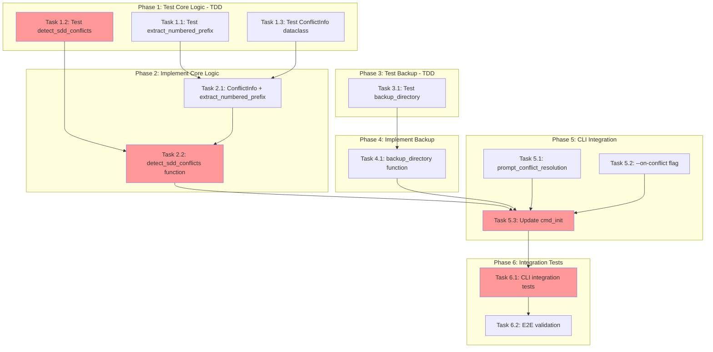

<!-- markdownlint-disable-file -->
# Task Checklist: Init Conflict Detection

## Overview

Enhance `teambot init` to detect numbered prefix conflicts in `.agent/commands/sdd/` and provide interactive remediation options (Replace/Backup/Skip).

## Objectives

* Detect when target `.agent/` directory contains files with same numbered prefix but different names than scaffolds
* Provide clear warning message listing conflicting files
* Offer interactive prompt with Replace/Backup/Skip options
* Support non-interactive mode via `--on-conflict` CLI flag
* Implement backup mechanism to `.agent-tracking/backups/<timestamp>/`

## Research Summary

### Project Files
* `src/teambot/scaffolds.py` (Lines 1-167) - Scaffold copy operations, CopyResult NamedTuple
* `src/teambot/cli.py` (Lines 691-790) - `cmd_init()` implementation
* `src/teambot/cli.py` (Lines 600-660) - Interactive input patterns
* `tests/test_scaffolds.py` (Lines 1-263) - Scaffold test patterns

### External References
* `.agent-tracking/research/20260310-init-conflict-detection-research.md` - Complete implementation patterns and code examples

## Task Dependency Graph

**Critical Path**: T1.2 → T2.2 → T5.3 → T6.1
**Parallel Opportunities**: Phase 1 tasks run in parallel; Phase 3 can run parallel to Phase 2

## Implementation Checklist

### [x] Phase 1: Test Core Logic (TDD)

**Phase Objective**: Establish test coverage for conflict detection core functions before implementation

* [x] Task 1.1: Create tests for `extract_numbered_prefix()` function
  * Details: .agent-tracking/details/20260310-init-conflict-detection-details.md (Lines 14-40)
  * Dependencies: None
  * Priority: HIGH

* [x] Task 1.2: Create tests for `detect_sdd_conflicts()` function
  * Details: .agent-tracking/details/20260310-init-conflict-detection-details.md (Lines 42-82)
  * Dependencies: None
  * Priority: CRITICAL

* [x] Task 1.3: Create tests for `ConflictInfo` dataclass
  * Details: .agent-tracking/details/20260310-init-conflict-detection-details.md (Lines 84-100)
  * Dependencies: None
  * Priority: MEDIUM

### Phase Gate: Phase 1 Complete When
- [x] All Phase 1 tasks marked complete
- [x] Tests exist and fail (TDD red phase)
- [ ] Validation: `uv run pytest tests/test_scaffolds.py -v -k "conflict or prefix" --no-header`
- [ ] Artifacts: New test class `TestConflictDetection` in `tests/test_scaffolds.py`

**Cannot Proceed If**: Tests don't exist or pass prematurely

---

### [x] Phase 2: Implement Core Logic

**Phase Objective**: Implement conflict detection functions to make Phase 1 tests pass

* [x] Task 2.1: Implement `ConflictInfo` dataclass and `extract_numbered_prefix()` function
  * Details: .agent-tracking/details/20260310-init-conflict-detection-details.md (Lines 104-138)
  * Dependencies: Phase 1 tests exist
  * Priority: HIGH

* [x] Task 2.2: Implement `detect_sdd_conflicts()` function
  * Details: .agent-tracking/details/20260310-init-conflict-detection-details.md (Lines 140-180)
  * Dependencies: Task 2.1
  * Priority: CRITICAL

### Phase Gate: Phase 2 Complete When
- [x] All Phase 2 tasks marked complete
- [x] All Phase 1 tests pass (TDD green phase)
- [ ] Validation: `uv run pytest tests/test_scaffolds.py -v -k "conflict or prefix" --no-header`
- [ ] Artifacts: `ConflictInfo`, `extract_numbered_prefix`, `detect_sdd_conflicts` in `scaffolds.py`

**Cannot Proceed If**: Phase 1 tests fail

---

### [x] Phase 3: Test Backup Infrastructure (TDD)

**Phase Objective**: Establish test coverage for backup function before implementation

* [x] Task 3.1: Create tests for `backup_directory()` function
  * Details: .agent-tracking/details/20260310-init-conflict-detection-details.md (Lines 184-220)
  * Dependencies: None (can run parallel to Phase 2)
  * Priority: HIGH

### Phase Gate: Phase 3 Complete When
- [x] Task 3.1 complete
- [x] Tests exist and fail (TDD red phase)
- [ ] Validation: `uv run pytest tests/test_scaffolds.py -v -k "backup" --no-header`
- [ ] Artifacts: New test class `TestBackupDirectory` in `tests/test_scaffolds.py`

**Cannot Proceed If**: Tests don't exist or pass prematurely

---

### [x] Phase 4: Implement Backup Infrastructure

**Phase Objective**: Implement backup function to make Phase 3 tests pass

* [x] Task 4.1: Implement `backup_directory()` function
  * Details: .agent-tracking/details/20260310-init-conflict-detection-details.md (Lines 224-260)
  * Dependencies: Phase 3 tests exist
  * Priority: HIGH

### Phase Gate: Phase 4 Complete When
- [x] Task 4.1 complete
- [x] All Phase 3 tests pass (TDD green phase)
- [ ] Validation: `uv run pytest tests/test_scaffolds.py -v -k "backup" --no-header`
- [ ] Artifacts: `backup_directory` function in `scaffolds.py`

**Cannot Proceed If**: Phase 3 tests fail

---

### [x] Phase 5: CLI Integration

**Phase Objective**: Integrate conflict detection into CLI with interactive and non-interactive modes

* [x] Task 5.1: Implement `prompt_conflict_resolution()` function
  * Details: .agent-tracking/details/20260310-init-conflict-detection-details.md (Lines 264-310)
  * Dependencies: Phase 2 complete
  * Priority: HIGH

* [x] Task 5.2: Add `--on-conflict` CLI flag to init parser
  * Details: .agent-tracking/details/20260310-init-conflict-detection-details.md (Lines 312-340)
  * Dependencies: None
  * Priority: MEDIUM

* [x] Task 5.3: Update `cmd_init()` to invoke conflict detection and prompt
  * Details: .agent-tracking/details/20260310-init-conflict-detection-details.md (Lines 342-400)
  * Dependencies: Tasks 5.1, 5.2, Phase 2, Phase 4
  * Priority: CRITICAL

### Phase Gate: Phase 5 Complete When
- [x] All Phase 5 tasks marked complete
- [x] Interactive prompt displays and accepts input
- [x] `--on-conflict` flag works without prompt
- [ ] Validation: Manual test with conflicting `.agent/` directory
- [ ] Artifacts: Updated `cli.py` with `prompt_conflict_resolution`, `--on-conflict` flag, modified `cmd_init()`

**Cannot Proceed If**: Core logic (Phase 2/4) incomplete

---

### [x] Phase 6: Integration Tests and Validation

**Phase Objective**: Comprehensive testing of full integration including CLI behavior

* [x] Task 6.1: Create CLI integration tests for conflict scenarios
  * Details: .agent-tracking/details/20260310-init-conflict-detection-details.md (Lines 404-450)
  * Dependencies: Phase 5 complete
  * Priority: HIGH

* [x] Task 6.2: End-to-end validation of all acceptance scenarios
  * Details: .agent-tracking/details/20260310-init-conflict-detection-details.md (Lines 452-490)
  * Dependencies: Task 6.1
  * Priority: CRITICAL

### Phase Gate: Phase 6 Complete When
- [x] All Phase 6 tasks marked complete
- [x] All tests pass including new integration tests
- [ ] Validation: `uv run pytest tests/test_scaffolds.py tests/test_cli.py -v --no-header`
- [ ] Artifacts: Full test coverage for conflict detection feature

**Cannot Proceed If**: Integration tests fail

---

## Effort Estimation

| Task | Estimated Effort | Complexity | Risk |
|------|-----------------|------------|------|
| T1.1-1.3 | 30 min | LOW | LOW |
| T2.1-2.2 | 45 min | MEDIUM | LOW |
| T3.1 | 20 min | LOW | LOW |
| T4.1 | 30 min | LOW | LOW |
| T5.1-5.3 | 60 min | MEDIUM | MEDIUM |
| T6.1-6.2 | 45 min | MEDIUM | LOW |

**Total Estimated Effort**: ~4 hours

## Dependencies

* pytest (existing, `uv run pytest`)
* Python 3.10+ (required for `|` union types)
* shutil (stdlib, for `shutil.move`)
* re (stdlib, for regex prefix extraction)
* dataclasses (stdlib, for ConflictInfo)

## Success Criteria

* `teambot init` detects conflicts when running against existing `.agent/` with different-named SDD prompts
* Interactive prompt displays with clear options and accepts 1/2/3 input
* Backup creates timestamped directory in `.agent-tracking/backups/`
* `--on-conflict=replace|backup|skip` bypasses interactive prompt
* `--force` continues to work as before (bypass all checks)
* All 6 acceptance test scenarios pass
* No regression in existing init behavior for non-conflicting scenarios
