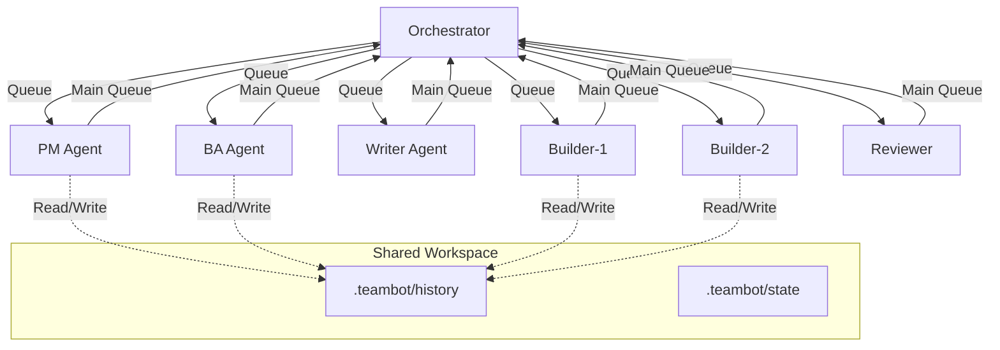

<!-- markdownlint-disable-file -->
# Task Research Documents: TeamBot

TeamBot is a CLI wrapper for GitHub Copilot CLI that enables autonomous, collaborative AI agent teams for software development. This research covers the technical implementation approach for multi-agent orchestration, inter-process communication, window management, history file handling, and testing infrastructure.

## Task Implementation Requests

* Implement parent orchestrator process with Python multiprocessing queues for agent coordination
* Create OS-specific window spawning module (Windows/Linux/macOS)
* Implement history file management with YAML frontmatter parsing
* Build console visualization with Rich library for colored output and progress tracking
* Design JSON configuration schema for agent personas and workflow definitions
* Implement context size monitoring and compaction system for history files
* Create agent runner that wraps GitHub Copilot CLI invocations
* Implement file-based persistence layer for durable state in `.teambot` directory

## Scope and Success Criteria

* **Scope**: Technical implementation research for TeamBot core architecture - multiprocessing, subprocess window management, history files, visualization, testing
* **Exclusions**: Actual code implementation, detailed Copilot CLI prompt engineering, deployment infrastructure
* **Assumptions**:
  1. Python 3.8+ is available on all target platforms
  2. GitHub Copilot CLI is installed and authenticated
  3. Users have appropriate terminal emulators installed
  4. Standard Python libraries (multiprocessing, subprocess) are sufficient
* **Success Criteria**:
  * Technical approach validated with code patterns and examples
  * Cross-platform window management strategy confirmed
  * Testing infrastructure identified and documented
  * Context management approach for history files defined

## Outline

1. Testing Infrastructure Research
2. Inter-Agent Communication (Multiprocessing Queues)
3. Window Management (Cross-Platform Subprocess)
4. History File Management (Frontmatter Parsing)
5. Console Visualization (Rich Library)
6. Context Size Management (Token Counting)
7. Copilot CLI Integration
8. Configuration Schema Design
9. Key Discoveries and Implementation Patterns

### Potential Next Research

* **Agent Prompt Engineering Patterns**
  * **Reasoning**: Need to research effective system prompts for each agent persona (PM, BA, Builder, Reviewer, etc.)
  * **Reference**: FR-021 Dynamic Agent Prompts requirement

* **File Locking Strategies for Shared `.teambot` Directory**
  * **Reasoning**: Multiple agents may read/write files concurrently; need conflict prevention
  * **Reference**: R-002 Risk - Agent context conflicts when accessing shared files

* **GitHub Copilot SDK vs CLI Subprocess**
  * **Reasoning**: Evaluate if `github-copilot-sdk` package provides better programmatic integration than subprocess calls
  * **Reference**: External research found SDK exists at github.com/github/copilot-sdk

## Research Executed

### Testing Infrastructure Research

* **Framework**: pytest (recommended based on project standards in AGENTS.md)
  * **Location**: `tests/` directory (to be created - currently no tests exist)
  * **Naming**: `test_*.py` pattern (standard pytest convention)
  * **Runner**: `uv run pytest` (based on pyproject.toml using uv)
  * **Coverage**: pytest-cov recommended (not currently configured)

**Current State**: No existing test infrastructure. Project uses:
- `pyproject.toml` with Python ≥3.10 requirement
- `ruff` for linting (configured in pyproject.toml, lines 16-28)
- `uv` as package manager

### Test Patterns Found

* **File**: No existing test files found
* **Recommended Pattern** (based on pytest best practices research):

```python
# tests/test_orchestrator.py
import pytest
from unittest.mock import Mock, patch, MagicMock
from multiprocessing import Queue

@pytest.fixture
def mock_queue():
    """Fixture for multiprocessing queue testing."""
    return Queue()

@pytest.fixture
def mock_agent_config():
    """Fixture for agent configuration."""
    return {
        "agent_id": "builder-1",
        "persona": "Builder/Implementer",
        "queue_timeout": 5.0
    }

class TestOrchestrator:
    """Tests for parent orchestrator process."""
    
    def test_agent_spawn_creates_process(self, mock_agent_config):
        """Test that agent spawning creates child process."""
        # Arrange
        orchestrator = Orchestrator()
        
        # Act
        agent = orchestrator.spawn_agent(mock_agent_config)
        
        # Assert
        assert agent.is_alive()
        agent.terminate()
    
    @pytest.mark.parametrize("platform,expected_flag", [
        ("Windows", "CREATE_NEW_CONSOLE"),
        ("Linux", "start_new_session"),
        ("Darwin", "osascript"),
    ])
    def test_window_creation_per_platform(self, platform, expected_flag):
        """Test platform-specific window creation."""
        with patch('platform.system', return_value=platform):
            # Test window creation logic
            pass
```

### Coverage Standards

* **Unit Tests**: 80% minimum (recommended for core orchestration logic)
* **Integration Tests**: 70% minimum (for multi-process coordination)
* **Critical Paths**: 100% required (agent lifecycle, message passing, history file operations)

### Testing Approach Recommendation

* **Orchestrator Core**: TDD (high complexity, critical coordination logic)
* **Window Management**: Code-First with comprehensive tests (OS-specific, hard to mock)
* **History File Parsing**: TDD (well-defined input/output, critical for context management)
* **Copilot CLI Integration**: Code-First (external dependency, integration-focused)
* **Console Visualization**: Code-First (UI/output focused, lower risk)

**Rationale**: Core orchestration and history management have well-defined requirements and are critical for system reliability - TDD helps ensure correctness. Window management and Copilot integration involve external systems that are harder to test in isolation, making code-first with integration tests more practical.

---

## Key Discoveries

### Project Structure

**Current Structure** (from repository analysis):
```
teambot/
├── src/
│   ├── app.py              # Current entrypoint (Lines 1-10)
│   └── load_env.py         # Environment loading (Lines 1-8)
├── pyproject.toml          # Project config, Python ≥3.10, ruff linting
├── .agent-tracking/        # SDD workflow tracking
└── docs/feature-specs/     # TeamBot specification
```

**Proposed Structure for TeamBot**:
```
teambot/
├── src/
│   ├── teambot/
│   │   ├── __init__.py
│   │   ├── cli.py              # CLI entry point
│   │   ├── orchestrator.py     # Parent process, queue management
│   │   ├── agent_runner.py     # Agent process entry point
│   │   ├── window_manager.py   # Cross-platform window spawning
│   │   ├── history/
│   │   │   ├── __init__.py
│   │   │   ├── manager.py      # History file CRUD operations
│   │   │   ├── frontmatter.py  # YAML frontmatter parsing
│   │   │   └── compactor.py    # Context compaction logic
│   │   ├── messaging/
│   │   │   ├── __init__.py
│   │   │   ├── protocol.py     # Message types and serialization
│   │   │   └── router.py       # Queue routing logic
│   │   ├── visualization/
│   │   │   ├── __init__.py
│   │   │   └── console.py      # Rich-based console output
│   │   └── config/
│   │       ├── __init__.py
│   │       ├── schema.py       # JSON schema definitions
│   │       └── loader.py       # Configuration loading
│   └── app.py                  # Legacy entrypoint
├── tests/
│   ├── conftest.py             # Shared fixtures
│   ├── test_orchestrator.py
│   ├── test_window_manager.py
│   ├── test_history/
│   │   ├── test_manager.py
│   │   └── test_frontmatter.py
│   └── test_messaging/
│       └── test_protocol.py
├── .teambot/                   # Runtime working directory
│   ├── history/                # Agent history files
│   ├── state/                  # Persistent state
│   └── config/                 # Runtime configuration
└── pyproject.toml
```

### Implementation Patterns

#### 1. Multiprocessing Queue Communication Pattern

**Best Practices Discovered**:
- Use `if __name__ == '__main__':` guard (critical for Windows/macOS)
- Use sentinel values (`None`) to signal shutdown
- Set timeouts on `.get()` and `.put()` to avoid deadlocks
- Propagate exceptions through queues for parent-side handling
- Join all processes before parent exits

**Recommended Pattern**:

```python
# src/teambot/messaging/protocol.py
from dataclasses import dataclass, field
from typing import Any, Optional
from enum import Enum
import time

class MessageType(Enum):
    TASK_ASSIGN = "task_assign"
    TASK_COMPLETE = "task_complete"
    STATUS_UPDATE = "status_update"
    ERROR = "error"
    SHUTDOWN = "shutdown"
    CONTEXT_REQUEST = "context_request"
    CONTEXT_RESPONSE = "context_response"

@dataclass
class AgentMessage:
    """Standard message format for inter-agent communication."""
    type: MessageType
    source_agent: str
    target_agent: Optional[str] = None  # None = broadcast
    payload: Any = None
    timestamp: float = field(default_factory=time.time)
    correlation_id: Optional[str] = None

# src/teambot/orchestrator.py
from multiprocessing import Process, Queue
from typing import Dict
import time

class Orchestrator:
    """Parent process managing agent lifecycle and communication."""
    
    def __init__(self, config: dict):
        self.config = config
        self.agents: Dict[str, Process] = {}
        self.agent_queues: Dict[str, Queue] = {}
        self.main_queue = Queue()  # Messages TO orchestrator
        self.running = False
    
    def spawn_agent(self, agent_config: dict) -> Process:
        """Spawn agent in new process with dedicated queue."""
        agent_id = agent_config["agent_id"]
        agent_queue = Queue()  # Messages TO this agent
        self.agent_queues[agent_id] = agent_queue
        
        process = Process(
            target=agent_runner_main,
            args=(agent_config, agent_queue, self.main_queue),
            name=f"agent-{agent_id}"
        )
        process.start()
        self.agents[agent_id] = process
        return process
    
    def send_to_agent(self, agent_id: str, message: AgentMessage):
        """Send message to specific agent."""
        if agent_id in self.agent_queues:
            self.agent_queues[agent_id].put(message, timeout=5.0)
    
    def broadcast(self, message: AgentMessage):
        """Send message to all agents."""
        for queue in self.agent_queues.values():
            queue.put(message, timeout=5.0)
    
    def shutdown(self):
        """Graceful shutdown of all agents."""
        shutdown_msg = AgentMessage(
            type=MessageType.SHUTDOWN,
            source_agent="orchestrator"
        )
        self.broadcast(shutdown_msg)
        
        # Wait for agents to finish
        for agent_id, process in self.agents.items():
            process.join(timeout=10.0)
            if process.is_alive():
                process.terminate()
    
    def run(self):
        """Main orchestrator loop."""
        self.running = True
        while self.running:
            try:
                message = self.main_queue.get(timeout=1.0)
                self._handle_message(message)
            except Empty:
                continue
            except Exception as e:
                self._handle_error(e)
```

#### 2. Cross-Platform Window Management Pattern

**Research Findings**:
- Windows: `subprocess.CREATE_NEW_CONSOLE` flag works natively
- Linux: Requires terminal emulator (gnome-terminal, xterm, konsole)
- macOS: AppleScript via `osascript` to open Terminal.app
- `start_new_session=True` creates new session but NOT new window

**Recommended Pattern**:

```python
# src/teambot/window_manager.py
import subprocess
import sys
import platform
import shutil
from typing import Optional, List

class WindowManager:
    """Cross-platform terminal window spawning."""
    
    # Linux terminal emulators in preference order
    LINUX_TERMINALS = [
        ("gnome-terminal", ["gnome-terminal", "--", "{python}", "{script}"]),
        ("konsole", ["konsole", "-e", "{python}", "{script}"]),
        ("xfce4-terminal", ["xfce4-terminal", "-e", "{python} {script}"]),
        ("xterm", ["xterm", "-e", "{python}", "{script}"]),
    ]
    
    def __init__(self):
        self.system = platform.system()
        self._linux_terminal = None
    
    def _detect_linux_terminal(self) -> Optional[tuple]:
        """Detect available terminal emulator on Linux."""
        if self._linux_terminal:
            return self._linux_terminal
        
        for name, cmd_template in self.LINUX_TERMINALS:
            if shutil.which(name):
                self._linux_terminal = (name, cmd_template)
                return self._linux_terminal
        return None
    
    def spawn_window(
        self,
        script: str,
        args: List[str],
        title: Optional[str] = None,
        working_dir: Optional[str] = None
    ) -> subprocess.Popen:
        """Spawn a new terminal window running the given script."""
        
        python = sys.executable
        full_args = [python, script] + args
        
        if self.system == "Windows":
            return self._spawn_windows(full_args, title, working_dir)
        elif self.system == "Darwin":
            return self._spawn_macos(full_args, title, working_dir)
        else:  # Linux/Unix
            return self._spawn_linux(full_args, title, working_dir)
    
    def _spawn_windows(self, args: List[str], title: str, cwd: str) -> subprocess.Popen:
        """Spawn on Windows using CREATE_NEW_CONSOLE."""
        return subprocess.Popen(
            args,
            creationflags=subprocess.CREATE_NEW_CONSOLE,
            cwd=cwd
        )
    
    def _spawn_macos(self, args: List[str], title: str, cwd: str) -> subprocess.Popen:
        """Spawn on macOS using AppleScript and Terminal.app."""
        cmd_str = " ".join(f'"{arg}"' for arg in args)
        if cwd:
            cmd_str = f"cd {cwd} && {cmd_str}"
        
        applescript = f'''
        tell application "Terminal"
            activate
            do script "{cmd_str}"
        end tell
        '''
        return subprocess.Popen(["osascript", "-e", applescript])
    
    def _spawn_linux(self, args: List[str], title: str, cwd: str) -> subprocess.Popen:
        """Spawn on Linux using detected terminal emulator."""
        terminal = self._detect_linux_terminal()
        if not terminal:
            raise RuntimeError("No supported terminal emulator found")
        
        name, cmd_template = terminal
        
        # Build command based on terminal
        if name == "gnome-terminal":
            cmd = ["gnome-terminal", "--working-directory", cwd or ".", "--"] + args
        elif name == "konsole":
            cmd = ["konsole", "--workdir", cwd or ".", "-e"] + args
        else:
            # Generic fallback
            cmd = [name, "-e"] + [" ".join(args)]
        
        return subprocess.Popen(cmd, start_new_session=True)
```

#### 3. History File Frontmatter Pattern

**Library**: `python-frontmatter` (recommended)

**Recommended Pattern**:

```python
# src/teambot/history/frontmatter.py
import frontmatter
from pathlib import Path
from datetime import datetime
from typing import Optional, Dict, Any, List
from dataclasses import dataclass

@dataclass
class HistoryMetadata:
    """Structured frontmatter for history files."""
    title: str
    description: str
    timestamp: datetime
    agent_id: str
    action_type: str  # e.g., "file_created", "code_modified", "test_added"
    files_affected: List[str] = None
    
    def to_dict(self) -> Dict[str, Any]:
        return {
            "title": self.title,
            "description": self.description,
            "timestamp": self.timestamp.isoformat(),
            "agent_id": self.agent_id,
            "action_type": self.action_type,
            "files_affected": self.files_affected or []
        }

class HistoryFileManager:
    """Manage history files with YAML frontmatter."""
    
    def __init__(self, base_dir: Path):
        self.base_dir = Path(base_dir)
        self.history_dir = self.base_dir / "history"
        self.history_dir.mkdir(parents=True, exist_ok=True)
    
    def create_history_file(
        self,
        metadata: HistoryMetadata,
        content: str
    ) -> Path:
        """Create a new history file with frontmatter."""
        # Generate filename: YYYY-MM-DD-HHMMSS-<descriptor>.md
        timestamp_str = metadata.timestamp.strftime("%Y-%m-%d-%H%M%S")
        descriptor = metadata.action_type.replace("_", "-")
        filename = f"{timestamp_str}-{descriptor}.md"
        
        filepath = self.history_dir / filename
        
        post = frontmatter.Post(content)
        post.metadata = metadata.to_dict()
        
        with open(filepath, "w") as f:
            f.write(frontmatter.dumps(post))
        
        return filepath
    
    def scan_frontmatter(self) -> List[Dict[str, Any]]:
        """Efficiently scan all history files' frontmatter without loading content."""
        results = []
        for filepath in sorted(self.history_dir.glob("*.md"), reverse=True):
            with open(filepath) as f:
                # Read only the frontmatter (fast)
                post = frontmatter.load(f)
                results.append({
                    "path": filepath,
                    "metadata": post.metadata,
                    "size": filepath.stat().st_size
                })
        return results
    
    def load_relevant_history(
        self,
        agent_id: str,
        action_types: List[str] = None,
        max_files: int = 10
    ) -> List[frontmatter.Post]:
        """Load history files relevant to the agent's current task."""
        all_files = self.scan_frontmatter()
        
        # Filter by relevance
        relevant = []
        for file_info in all_files:
            meta = file_info["metadata"]
            
            # Skip if not relevant action type
            if action_types and meta.get("action_type") not in action_types:
                continue
            
            relevant.append(file_info)
            
            if len(relevant) >= max_files:
                break
        
        # Load full content for relevant files
        return [frontmatter.load(f["path"]) for f in relevant]
```

#### 4. Console Visualization with Rich

**Library**: `rich` (recommended for colored, multi-task progress display)

**Recommended Pattern**:

```python
# src/teambot/visualization/console.py
from rich.console import Console
from rich.progress import Progress, TaskID, SpinnerColumn, TextColumn, BarColumn
from rich.panel import Panel
from rich.table import Table
from rich.live import Live
from rich.layout import Layout
from typing import Dict, Optional
import threading

class TeamBotConsole:
    """Rich-based console visualization for TeamBot."""
    
    # Agent persona colors
    PERSONA_COLORS = {
        "pm": "blue",
        "ba": "green",
        "writer": "cyan",
        "builder-1": "yellow",
        "builder-2": "magenta",
        "reviewer": "red",
    }
    
    def __init__(self):
        self.console = Console()
        self.progress = Progress(
            SpinnerColumn(),
            TextColumn("[progress.description]{task.description}"),
            BarColumn(),
            TextColumn("[progress.percentage]{task.percentage:>3.0f}%"),
            console=self.console
        )
        self.agent_tasks: Dict[str, TaskID] = {}
        self._lock = threading.Lock()
    
    def add_agent(self, agent_id: str, persona: str, initial_status: str = "Starting..."):
        """Add an agent to the progress display."""
        color = self.PERSONA_COLORS.get(agent_id, "white")
        description = f"[{color}]{persona}[/{color}]: {initial_status}"
        
        with self._lock:
            task_id = self.progress.add_task(description, total=100)
            self.agent_tasks[agent_id] = task_id
    
    def update_agent(self, agent_id: str, status: str, progress: int = None):
        """Update agent status and progress."""
        if agent_id not in self.agent_tasks:
            return
        
        color = self.PERSONA_COLORS.get(agent_id, "white")
        task_id = self.agent_tasks[agent_id]
        
        with self._lock:
            self.progress.update(
                task_id,
                description=f"[{color}]{agent_id}[/{color}]: {status}",
                completed=progress if progress is not None else None
            )
    
    def complete_agent(self, agent_id: str, final_status: str = "Complete"):
        """Mark agent as complete."""
        self.update_agent(agent_id, f"✅ {final_status}", progress=100)
    
    def show_agent_summary(self, agents: Dict[str, dict]):
        """Display a summary table of all agents."""
        table = Table(title="TeamBot Agent Status")
        table.add_column("Agent", style="cyan")
        table.add_column("Persona", style="green")
        table.add_column("Status", style="yellow")
        table.add_column("Progress", style="magenta")
        
        for agent_id, info in agents.items():
            color = self.PERSONA_COLORS.get(agent_id, "white")
            table.add_row(
                f"[{color}]{agent_id}[/{color}]",
                info.get("persona", "Unknown"),
                info.get("status", "Idle"),
                f"{info.get('progress', 0)}%"
            )
        
        self.console.print(table)
    
    def print_agent_message(self, agent_id: str, message: str):
        """Print a message from an agent with colored prefix."""
        color = self.PERSONA_COLORS.get(agent_id, "white")
        self.console.print(f"[{color}][{agent_id}][/{color}] {message}")
```

#### 5. Context Size Management

**Token Estimation**: ~4 characters per token (rough estimate for English text)

**Recommended Pattern**:

```python
# src/teambot/history/compactor.py
from enum import Enum
from typing import List, Tuple
import frontmatter

class CompactionLevel(Enum):
    LITTLE = "little"      # Keep ~80% of content
    MEDIUM = "medium"      # Keep ~50% of content
    HIGH = "high"          # Keep ~20% of content (summary only)

class ContextCompactor:
    """Manage context size and provide compaction options."""
    
    # Approximate token limits (conservative estimates)
    DEFAULT_CONTEXT_LIMIT = 150000  # tokens
    WARNING_THRESHOLD = 0.8  # 80% of limit
    CHARS_PER_TOKEN = 4  # Rough estimate
    
    def __init__(self, context_limit: int = None):
        self.context_limit = context_limit or self.DEFAULT_CONTEXT_LIMIT
        self.warning_threshold = self.context_limit * self.WARNING_THRESHOLD
    
    def estimate_tokens(self, text: str) -> int:
        """Estimate token count from text length."""
        return len(text) // self.CHARS_PER_TOKEN
    
    def estimate_history_tokens(self, history_files: List[frontmatter.Post]) -> int:
        """Estimate total tokens in history files."""
        total_chars = sum(len(post.content) for post in history_files)
        return self.estimate_tokens(total_chars)
    
    def check_context_warning(
        self,
        current_context: str,
        history_files: List[frontmatter.Post]
    ) -> Tuple[bool, int, int]:
        """Check if context is approaching limits.
        
        Returns: (needs_warning, current_tokens, limit_tokens)
        """
        current_tokens = self.estimate_tokens(current_context)
        history_tokens = self.estimate_history_tokens(history_files)
        total_tokens = current_tokens + history_tokens
        
        needs_warning = total_tokens > self.warning_threshold
        return needs_warning, total_tokens, self.context_limit
    
    def compact_content(
        self,
        content: str,
        level: CompactionLevel
    ) -> str:
        """Compact content based on level.
        
        This is a placeholder - in production, would use LLM for smart summarization.
        """
        if level == CompactionLevel.LITTLE:
            # Keep first and last portions
            keep_ratio = 0.8
        elif level == CompactionLevel.MEDIUM:
            # Keep key sections
            keep_ratio = 0.5
        else:  # HIGH
            # Extract summary only
            keep_ratio = 0.2
        
        target_len = int(len(content) * keep_ratio)
        
        # Simple truncation (replace with LLM summarization in production)
        if len(content) <= target_len:
            return content
        
        # Keep beginning and end
        half = target_len // 2
        return content[:half] + "\n\n[... content compacted ...]\n\n" + content[-half:]
    
    def suggest_compaction(
        self,
        total_tokens: int
    ) -> CompactionLevel:
        """Suggest compaction level based on token usage."""
        usage_ratio = total_tokens / self.context_limit
        
        if usage_ratio < 0.85:
            return CompactionLevel.LITTLE
        elif usage_ratio < 0.95:
            return CompactionLevel.MEDIUM
        else:
            return CompactionLevel.HIGH
```

### Configuration Examples

**JSON Configuration Schema** (for `teambot.config.json`):

```json
{
  "$schema": "http://json-schema.org/draft-07/schema#",
  "type": "object",
  "properties": {
    "version": {
      "type": "string",
      "default": "1.0"
    },
    "agents": {
      "type": "array",
      "items": {
        "type": "object",
        "properties": {
          "id": { "type": "string" },
          "persona": { 
            "type": "string",
            "enum": ["pm", "ba", "writer", "builder", "reviewer"]
          },
          "display_name": { "type": "string" },
          "parallel_capable": { "type": "boolean", "default": false },
          "workflow_stages": {
            "type": "array",
            "items": { "type": "string" }
          }
        },
        "required": ["id", "persona", "display_name"]
      }
    },
    "workflow": {
      "type": "object",
      "properties": {
        "stages": {
          "type": "array",
          "items": { "type": "string" }
        },
        "parallel_stages": {
          "type": "array",
          "items": { "type": "string" }
        }
      }
    },
    "history": {
      "type": "object",
      "properties": {
        "directory": { "type": "string", "default": ".teambot/history" },
        "context_limit_tokens": { "type": "integer", "default": 150000 },
        "warning_threshold": { "type": "number", "default": 0.8 }
      }
    },
    "visualization": {
      "type": "object",
      "properties": {
        "colors_enabled": { "type": "boolean", "default": true },
        "progress_style": { 
          "type": "string", 
          "enum": ["bar", "spinner", "minimal"],
          "default": "bar"
        }
      }
    }
  },
  "required": ["version", "agents"]
}
```

**Example Configuration**:

```json
{
  "version": "1.0",
  "agents": [
    {
      "id": "pm",
      "persona": "pm",
      "display_name": "Project Manager / Coordinator",
      "parallel_capable": false,
      "workflow_stages": ["setup", "planning", "coordination", "review"]
    },
    {
      "id": "ba",
      "persona": "ba",
      "display_name": "Business Analyst",
      "parallel_capable": false,
      "workflow_stages": ["business_problem", "spec", "requirements"]
    },
    {
      "id": "writer",
      "persona": "writer",
      "display_name": "Technical Writer",
      "parallel_capable": false,
      "workflow_stages": ["documentation", "review"]
    },
    {
      "id": "builder-1",
      "persona": "builder",
      "display_name": "Builder (Primary)",
      "parallel_capable": true,
      "workflow_stages": ["implementation", "testing"]
    },
    {
      "id": "builder-2",
      "persona": "builder",
      "display_name": "Builder (Secondary)",
      "parallel_capable": true,
      "workflow_stages": ["implementation", "testing"]
    },
    {
      "id": "reviewer",
      "persona": "reviewer",
      "display_name": "Reviewer",
      "parallel_capable": false,
      "workflow_stages": ["review", "validation"]
    }
  ],
  "workflow": {
    "stages": [
      "setup",
      "business_problem",
      "spec",
      "review",
      "research",
      "test_strategy",
      "planning",
      "review",
      "implementation",
      "review",
      "testing",
      "post_implementation_review"
    ],
    "parallel_stages": ["implementation"]
  },
  "history": {
    "directory": ".teambot/history",
    "context_limit_tokens": 150000,
    "warning_threshold": 0.8
  },
  "visualization": {
    "colors_enabled": true,
    "progress_style": "bar"
  }
}
```

---

## Technical Scenarios

### 1. Multi-Agent Orchestration Architecture

TeamBot requires a parent orchestrator process that spawns and manages multiple agent child processes, coordinating their work through message queues.

**Requirements:**
* Parent process manages all agent lifecycles
* Bidirectional communication via multiprocessing queues
* Graceful shutdown with sentinel values
* Error propagation from children to parent
* No shared mutable state between processes

**Preferred Approach:**
* Use Python `multiprocessing.Process` for agent processes
* Dedicated `Queue` per agent (orchestrator → agent)
* Single shared `Queue` for agent → orchestrator messages
* Dataclass-based message protocol for type safety
* Sentinel `SHUTDOWN` message for graceful termination

```text
.teambot/                    # New runtime directory
src/teambot/orchestrator.py  # New orchestrator module
src/teambot/messaging/       # New messaging package
```



**Implementation Details:**

1. **Orchestrator Initialization**:
   - Load configuration from JSON
   - Create main message queue
   - Initialize window manager
   - Set up console visualization

2. **Agent Spawning**:
   - Create dedicated queue per agent
   - Spawn process with `multiprocessing.Process`
   - Pass agent config, input queue, output queue to child
   - Track process handle and queue references

3. **Message Routing**:
   - Orchestrator polls main queue for incoming messages
   - Routes messages based on `target_agent` field
   - Handles broadcast messages to all agents
   - Logs all messages for debugging

#### Considered Alternatives (Removed After Selection)

**Alternative: asyncio with threading** - Rejected because multiprocessing provides true parallelism and process isolation, which is critical for independent agent windows. Threading would share memory space and complicate window management.

**Alternative: ZeroMQ or Redis Pub/Sub** - Rejected as overkill for local execution. Python multiprocessing queues are simpler, require no external dependencies, and are sufficient for inter-process communication on a single machine.

---

### 2. Cross-Platform Window Management

TeamBot must spawn independent terminal windows for each agent, working across Windows, Linux, and macOS without tmux.

**Requirements:**
* Each agent runs in visually separate terminal window
* Works on Windows, Linux (multiple terminal emulators), macOS
* No tmux dependency
* Parent process maintains handles to child processes
* Graceful handling when terminal emulator unavailable

**Preferred Approach:**
* Windows: `subprocess.Popen` with `CREATE_NEW_CONSOLE` flag
* Linux: Detect available terminal emulator, spawn with appropriate command
* macOS: AppleScript via `osascript` to open Terminal.app
* Abstract behind `WindowManager` class for consistent API

```text
src/teambot/window_manager.py  # New cross-platform window module
```

**Implementation Details:**

1. **Platform Detection**: Use `platform.system()` at startup
2. **Linux Terminal Detection**: Check for gnome-terminal, konsole, xterm in PATH order
3. **Fallback Behavior**: If no terminal found, raise clear error with instructions
4. **Process Tracking**: Store `Popen` handles for lifecycle management

#### Considered Alternatives (Removed After Selection)

**Alternative: Rich Live display in single terminal** - Rejected because specification requires independent windows per agent for visual clarity and explicit requirement to avoid single-terminal approaches.

**Alternative: tmux/screen** - Explicitly excluded by specification constraints.

---

### 3. History File Context Management

TeamBot agents must create and read history files with YAML frontmatter, with smart loading based on relevance and context size warnings.

**Requirements:**
* History files have YAML frontmatter (title, description, timestamp, agent-id, action-type)
* Files named with date/time format for chronological sorting
* Efficient frontmatter scanning without loading full content
* Context size monitoring with warning at 80% capacity
* Compaction options: little, medium, high

**Preferred Approach:**
* Use `python-frontmatter` library for parsing/writing
* Dataclass-based metadata for type safety
* Token estimation via character count (~4 chars/token)
* Three-tier compaction with LLM-based summarization (future)

```text
src/teambot/history/           # New history management package
.teambot/history/              # Runtime history file storage
```

**Implementation Details:**

1. **File Naming**: `YYYY-MM-DD-HHMMSS-<action-type>.md`
2. **Frontmatter Schema**:
   ```yaml
   ---
   title: "Created user authentication module"
   description: "Implemented JWT-based auth with refresh tokens"
   timestamp: "2026-01-22T02:48:00Z"
   agent_id: "builder-1"
   action_type: "code_created"
   files_affected:
     - "src/auth/jwt.py"
     - "src/auth/middleware.py"
   ---
   ```
3. **Smart Loading**: Scan frontmatter first, load full content only for relevant files
4. **Context Warning**: Alert when total tokens > 80% of limit (default 150k tokens)

#### Considered Alternatives (Removed After Selection)

**Alternative: SQLite for history storage** - Rejected because markdown files are human-readable, easier to debug, and integrate naturally with git workflows.

---

## External Research (Evidence Log)

* **Python Multiprocessing Best Practices**: [Python Official Docs](https://docs.python.org/3/library/multiprocessing.html)
  * Key finding: Use `if __name__ == '__main__':` guard, sentinel values for shutdown, timeout on queue operations
  * Accessed: 2026-01-22

* **Cross-Platform Window Spawning**: [Stack Overflow](https://stackoverflow.com/questions/6469655/how-can-i-spawn-new-shells-to-run-python-scripts-from-a-base-python-script)
  * Key finding: Windows uses CREATE_NEW_CONSOLE, Linux needs terminal emulator, macOS uses osascript
  * Accessed: 2026-01-22

* **Rich Library Progress Display**: [Rich Documentation](https://rich.readthedocs.io/en/stable/progress.html)
  * Key finding: Thread-safe progress bars, multiple concurrent tasks, BBCode-style coloring
  * Accessed: 2026-01-22

* **Python Frontmatter Library**: [PyPI python-frontmatter](https://pypi.org/project/python-frontmatter/)
  * Key finding: Simple API for parsing/writing YAML frontmatter in markdown files
  * Accessed: 2026-01-22

* **Pytest Best Practices**: [Real Python](https://realpython.com/pytest-python-testing/)
  * Key finding: Fixtures for DRY setup, parametrize for multiple inputs, pytest-mock for mocking
  * Accessed: 2026-01-22

* **GitHub Copilot CLI/SDK**: [github/copilot-sdk](https://github.com/github/copilot-sdk)
  * Key finding: Official SDK exists for programmatic Copilot access; alternative to subprocess CLI invocation
  * Accessed: 2026-01-22

* **Context Window Management**: [Claude Docs](https://platform.claude.com/docs/en/build-with-claude/context-windows)
  * Key finding: ~4 chars/token estimate, 200k token limit, summarization for context compression
  * Accessed: 2026-01-22

### Project Conventions

* **Standards referenced**: `pyproject.toml` (ruff linting, Python ≥3.10, uv package manager)
* **Instructions followed**: AGENTS.md (pytest recommended, `uv run` commands, code-first with TDD where appropriate)
* **File structure**: `src/` for source code, `tests/` for tests (to be created)

---

## Dependencies to Add

Based on research, the following dependencies should be added to `pyproject.toml`:

```toml
[project]
dependencies = [
    "python-dotenv>=1.0.0",
    "python-frontmatter>=1.0.0",  # YAML frontmatter parsing
    "rich>=13.0.0",               # Console visualization
]

[dependency-groups]
dev = [
    "ruff>=0.8.0",
    "pytest>=7.4.0",              # Testing framework
    "pytest-cov>=4.1.0",          # Coverage reporting
    "pytest-mock>=3.12.0",        # Mocking utilities
]
```

---

*Research document generated: 2026-01-22*
*Status: Complete - Ready for test strategy phase*
