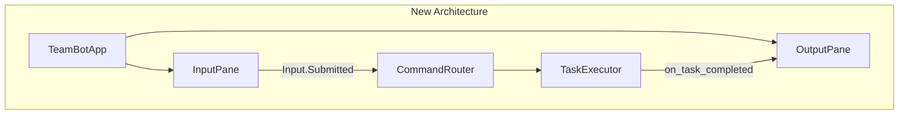

<!-- markdownlint-disable-file -->
# Task Research Document: Split-Pane Terminal Interface

This research document covers the technical implementation approach for adding a split-pane terminal interface to TeamBot. The feature divides the terminal into a left input pane (stable prompt) and a right output pane (async agent responses), eliminating the need for `&` background task syntax.

## Task Implementation Requests

* Implement split-pane terminal layout using Textual framework
* Create InputPane widget for left side (stable prompt, command history)
* Create OutputPane widget for right side (async output, scrolling)
* Integrate with existing TaskExecutor callbacks for output routing
* Deprecate `&` background task syntax (all tasks inherently async)
* Add `/clear` command for output pane
* Implement graceful fallback for narrow terminals (<80 cols)
* Update REPL loop to use Textual event-driven architecture

## Scope and Success Criteria

* **Scope**: Terminal UI library selection, integration with existing REPL/overlay architecture, testing strategy for terminal widgets
* **Assumptions**: 
  * Rich library already in use (v13.0.0+)
  * pytest with asyncio support available
  * Target terminals: VS Code, iTerm2, Windows Terminal, xterm
* **Success Criteria**:
  * ✅ Single recommended library selected with rationale
  * ✅ Integration patterns with existing code documented
  * ✅ Test infrastructure for terminal widgets identified
  * ✅ Code examples for key components provided

## Outline

1. Research Executed
   - Testing Infrastructure Research
   - Test Patterns Found
   - Coverage Standards
   - Testing Approach Recommendation
   - File Analysis (existing visualization/REPL modules)
   - External Research (Textual vs blessed vs raw ANSI)
2. Key Discoveries
   - Project Structure (visualization module, REPL architecture)
   - Implementation Patterns (overlay ANSI, Rich integration)
   - Complete Examples (Textual split-pane app)
3. Technical Scenarios
   - Scenario 1: Library Selection (Textual recommended)
   - Scenario 2: REPL Integration Architecture
   - Scenario 3: Input/Output Isolation

### Potential Next Research

* Research Textual testing patterns with `pilot` test driver
  * **Reasoning**: Need to understand how to simulate user input and verify widget state in tests
  * **Reference**: Textual testing docs at https://textual.textualize.io/guide/testing/

---

## Research Executed

### Testing Infrastructure Research

* **Framework**: pytest 7.4.0+
  * Location: `tests/` directory (mirrors `src/teambot/` structure)
  * Naming: `test_*.py` pattern with `Test*` classes and `test_*` functions
  * Runner: `uv run pytest` with coverage via `--cov=src/teambot --cov-report=term-missing`
  * Coverage: Inline pytest config in `pyproject.toml` (Lines 40-46)

* **Async Support**: pytest-asyncio 0.23.0+ with `asyncio_mode = "auto"`
  * Async tests decorated with `@pytest.mark.asyncio`
  * Uses `AsyncMock` from `unittest.mock` for mocking async methods

* **Mocking**: pytest-mock 3.12.0+ with standard `MagicMock`/`AsyncMock`
  * Heavy use of `@patch` context managers
  * Fixtures in `tests/conftest.py` for shared mocks

### Test Patterns Found

* **File**: `tests/test_visualization/test_overlay.py`
  * Tests overlay renderer with mocked terminal
  * Uses `patch("shutil.get_terminal_size")` for terminal dimension mocking
  * Tests ANSI sequence output verification
  * Example pattern:
    ```python
    def test_overlay_render_top_right(self, mock_terminal_size):
        mock_terminal_size.return_value = os.terminal_size((100, 40))
        overlay = OverlayRenderer(enabled=True)
        # Verify ANSI sequences in captured output
    ```

* **File**: `tests/test_repl/test_loop.py`
  * Tests REPL loop with mocked SDK client
  * Uses `AsyncMock` for `_get_input()` simulation
  * Tests command routing and output handling
  * Example pattern:
    ```python
    @pytest.mark.asyncio
    async def test_loop_handles_agent_command(self, mock_sdk_client):
        with patch.object(loop, "_get_input", new_callable=AsyncMock) as mock_input:
            mock_input.side_effect = ["@pm create plan", "/quit"]
            await loop.run()
    ```

* **File**: `tests/test_tasks/test_executor.py`
  * Tests background task execution
  * Uses callbacks to verify task lifecycle events
  * Tests `on_task_started` and `on_task_completed` hooks

### Coverage Standards

* **Unit Tests**: Target 80%+ (per pytest-cov defaults, current at ~88%)
* **Integration Tests**: Present in `tests/test_integration.py`
* **Critical Paths**: Task execution, overlay rendering, REPL loop

### Testing Approach Recommendation

| Component | Approach | Rationale |
|-----------|----------|-----------|
| **Textual App/Widgets** | Code-First | Textual has `pilot` test framework; prototype first, then test |
| **InputPane** | Code-First then TDD | Core widget, iterate quickly then stabilize with tests |
| **OutputPane** | Code-First then TDD | Similar to InputPane approach |
| **Integration (REPL→Textual)** | TDD | Critical path, define behavior tests first |
| **Fallback Mode** | TDD | Well-defined requirements, test edge cases |

**Rationale**: Textual widget development benefits from rapid prototyping due to visual nature. Once widget behavior is stable, lock it down with tests. Integration paths between existing REPL/TaskExecutor and new Textual app should use TDD since requirements are clear.

### File Analysis

* **`src/teambot/visualization/overlay.py`** (514 lines)
  * Lines 27-35: ANSI escape sequences (SAVE_CURSOR, RESTORE_CURSOR, MOVE_TO, SET_SCROLL_REGION)
  * Lines 105-128: Terminal capability detection (`_check_terminal_support()`)
  * Lines 130-151: SIGWINCH resize handler
  * Lines 168-198: Scroll region management
  * Lines 356-375: `render()` method - main rendering logic
  * Lines 456-472: `print_with_overlay()` - coordinated printing
  * **Key Insight**: Extensive ANSI manipulation already implemented; Textual abstracts this away

* **`src/teambot/visualization/console.py`** (144 lines)
  * Lines 34-144: `ConsoleDisplay` class using Rich `Console`, `Table`, `Panel`
  * **Key Insight**: Already integrated with Rich; Textual builds on Rich

* **`src/teambot/repl/loop.py`** (340 lines)
  * Lines 60-61: Overlay initialization
  * Lines 131-141: Background task completion callbacks
  * Lines 311-327: `_get_input()` using `Prompt.ask()` in executor
  * Lines 251-296: Main command routing loop
  * **Key Insight**: Input loop uses `run_in_executor()` for blocking input - Textual has native async input

* **`src/teambot/repl/commands.py`**
  * System commands: `/help`, `/status`, `/history`, `/tasks`, `/overlay`, `/quit`
  * **Key Insight**: Commands return Rich-formatted strings - compatible with Textual widgets

### Code Search Results

* `asyncio.create_task` usage:
  * `src/teambot/tasks/executor.py` (Lines 133, 315): Background task creation
  * `src/teambot/visualization/overlay.py` (Line 440): Spinner animation task

* `Rich` components used:
  * `Console`, `Panel`, `Table`, `Prompt` in visualization/console.py and repl/loop.py
  * Fully compatible with Textual (same maintainer: Textualize)

### External Research (Evidence Log)

* **Web Search**: "Python blessed library vs Textual library for terminal split pane UI 2024"
  * **Key Findings**: 
    * **Textual** provides built-in split-pane widgets, CSS-like styling, async event loop
    * **blessed** requires manual layout implementation, no widgets
    * Textual is "clear choice for professional, interactive split pane UIs"
  * Sources: 
    * [blessed PyPI](https://pypi.org/project/blessed/)
    * [Real Python Textual Guide](https://realpython.com/python-textual/)
    * [Textual Documentation](https://textual.textualize.io/)

* **Web Search**: "Textual Python Rich library integration split layout example 2024"
  * **Key Findings**:
    * Rich `Layout` can do splits but requires `Live` context for updates
    * Textual extends Rich with widgets, events, and CSS styling
    * Textual `Horizontal`/`Vertical` containers handle split panes natively
  * Sources:
    * [Rich Layout Docs](https://rich.readthedocs.io/en/stable/layout.html)
    * [Rich examples/layout.py](https://github.com/Textualize/rich/blob/master/examples/layout.py)

* **Web Search**: "Python Textual input widget while updating display async terminal app"
  * **Key Findings**:
    * `Input` widget for user text capture
    * `RichLog` widget for async-updating output display
    * Background tasks via `asyncio.create_task()` in `on_mount()`
    * Event handlers: `@on(Input.Submitted)` for input processing
  * Sources:
    * [Textual Events Guide](https://textual.textualize.io/guide/events/)
    * [Textual Widgets Guide](https://textual.textualize.io/guide/widgets/)

### Project Conventions

* **Standards referenced**: 
  * `pyproject.toml` - ruff linting (E, F, I, B, UP), line-length 100
  * Double quotes for strings, space indentation
* **Guidelines followed**: 
  * Test files mirror src structure (`tests/test_visualization/`, `tests/test_repl/`)
  * Fixtures in `conftest.py`
  * Async tests with `@pytest.mark.asyncio`

---

## Key Discoveries

### Project Structure

```
src/teambot/
├── visualization/
│   ├── __init__.py      # Exports: ConsoleDisplay, OverlayRenderer, OverlayState
│   ├── console.py       # Rich-based status tables, message formatting
│   └── overlay.py       # ANSI-based persistent overlay (current approach)
├── repl/
│   ├── __init__.py
│   ├── loop.py          # Main REPL loop, input handling, overlay integration
│   ├── commands.py      # System commands (/help, /status, etc.)
│   ├── parser.py        # Command parsing (@agent, /command, pipelines)
│   └── router.py        # Command routing to handlers
└── tasks/
    └── executor.py      # Background task execution, callbacks
```

**Key Integration Points for Split-Pane**:
1. `repl/loop.py` → Replace with Textual App
2. `visualization/overlay.py` → Superseded by Textual layout
3. `tasks/executor.py` → Keep callbacks, route to OutputPane widget

### Implementation Patterns

**Current Overlay ANSI Pattern** (overlay.py Lines 356-375):
```python
def render(self) -> None:
    if not self.is_enabled:
        return
    content = self._build_content()
    row, col = self._calculate_position()
    
    if self._state.position in (OverlayPosition.TOP_RIGHT, OverlayPosition.TOP_LEFT):
        # Top positions: use scroll region, no cursor save
        output = self._render_box(row, col, content)
    else:
        # Bottom positions: save/restore cursor
        output = SAVE_CURSOR + self._render_box(row, col, content) + RESTORE_CURSOR
    
    sys.stdout.write(output)
    sys.stdout.flush()
```

**Current Input Pattern** (loop.py Lines 311-327):
```python
async def _get_input(self) -> Optional[str]:
    loop = asyncio.get_event_loop()
    return await loop.run_in_executor(
        None, lambda: Prompt.ask("[bold green]teambot[/bold green]")
    )
```

### Complete Examples

**Textual Split-Pane App (Recommended Approach)**:
```python
from textual.app import App, ComposeResult
from textual.containers import Horizontal
from textual.widgets import Input, RichLog, Static
from textual import on
import asyncio

class TeamBotApp(App):
    """Split-pane terminal interface for TeamBot."""
    
    CSS = """
    Horizontal {
        height: 100%;
    }
    #input-pane {
        width: 30%;
        border: solid green;
    }
    #output-pane {
        width: 70%;
        border: solid blue;
    }
    """
    
    def compose(self) -> ComposeResult:
        with Horizontal():
            with Vertical(id="input-pane"):
                yield Static("TeamBot", classes="header")
                yield Input(placeholder="@agent task or /command", id="prompt")
            yield RichLog(id="output-pane", highlight=True, markup=True)
    
    @on(Input.Submitted)
    async def handle_input(self, event: Input.Submitted) -> None:
        command = event.value
        output = self.query_one("#output-pane", RichLog)
        
        # Route command and display in output pane
        output.write(f"[dim]{datetime.now():%H:%M:%S}[/dim] > {command}")
        
        # Execute via existing router/executor
        result = await self._process_command(command)
        output.write(result)
        
        # Clear input for next command
        event.input.clear()
    
    async def _process_command(self, command: str) -> str:
        # Delegate to existing repl/router.py and tasks/executor.py
        pass
```

### API and Schema Documentation

**Textual Key APIs**:
- `App` - Main application class, manages event loop
- `compose()` - Yields widgets to build UI
- `@on(Widget.Event)` - Decorator for event handlers
- `query_one(selector)` - Find widget by ID/class
- `RichLog.write(content)` - Async-safe output writing

**Existing TeamBot APIs to Preserve**:
- `TaskExecutor.on_task_started(callback)` - Hook for task start events
- `TaskExecutor.on_task_completed(callback)` - Hook for task completion
- `AgentRouter.route(command)` - Command routing
- `parse_command(input)` - Command parsing (parser.py)

### Configuration Examples

**New dependency in pyproject.toml**:
```toml
dependencies = [
  "python-dotenv>=1.0.0",
  "python-frontmatter>=1.0.0",
  "rich>=13.0.0",
  "github-copilot-sdk==0.1.16",
  "textual>=0.47.0",  # NEW: Split-pane UI framework
]
```

**Feature flag for gradual rollout**:
```python
# In teambot/config/loader.py
SPLIT_PANE_ENABLED = os.environ.get("TEAMBOT_SPLIT_PANE", "false").lower() == "true"
```

---

## Technical Scenarios

### 1. Library Selection for Split-Pane UI

**Description**: Evaluate terminal UI libraries for implementing split-pane layout with stable input and async output.

**Requirements**:
* Split terminal into left (input) and right (output) panes
* Input pane remains stable during output updates
* Output pane supports async writes without blocking
* Cross-platform: VS Code terminal, iTerm2, Windows Terminal
* Rich library compatibility (already in use)

**Preferred Approach: Textual Framework**

Textual is the clear choice because:
1. **Built on Rich**: Same maintainer (Textualize), native Rich compatibility
2. **Built-in split layouts**: `Horizontal`/`Vertical` containers, CSS-like sizing
3. **Async-native**: Event-driven architecture, no blocking input workarounds
4. **Input widget**: Native `Input` class with history, editing, events
5. **RichLog widget**: Async-safe output with auto-scroll, Rich markup support
6. **Cross-platform**: Works on Windows, macOS, Linux terminals
7. **Testing framework**: `pilot` test driver for simulating input/output

```
src/teambot/
├── ui/                      # NEW: Textual app module
│   ├── __init__.py
│   ├── app.py               # TeamBotApp main class
│   ├── widgets/
│   │   ├── input_pane.py    # Custom InputPane (extends Input)
│   │   └── output_pane.py   # Custom OutputPane (extends RichLog)
│   └── styles.css           # Textual CSS for layout
├── repl/
│   └── loop.py              # UPDATED: Launches Textual app or legacy mode
```



**Implementation Details**:

**app.py - Main Application**:
```python
from textual.app import App, ComposeResult
from textual.containers import Horizontal, Vertical
from textual.widgets import Input, RichLog, Static

class TeamBotApp(App):
    CSS_PATH = "styles.css"
    
    def __init__(self, router, executor, **kwargs):
        super().__init__(**kwargs)
        self._router = router
        self._executor = executor
        # Register callbacks
        self._executor.on_task_completed = self._handle_task_complete
    
    def compose(self) -> ComposeResult:
        with Horizontal():
            with Vertical(id="input-pane"):
                yield Static("[bold green]TeamBot[/bold green]", id="header")
                yield Input(placeholder="@agent task", id="prompt")
            yield RichLog(id="output", highlight=True, markup=True)
    
    async def _handle_task_complete(self, task, result):
        """Callback from TaskExecutor - writes to output pane."""
        output = self.query_one("#output", RichLog)
        timestamp = datetime.now().strftime("%H:%M:%S")
        output.write(f"[dim]{timestamp}[/dim] [green]✓[/green] @{task.agent_id}: {result}")
```

**styles.css - Layout Styling**:
```css
Horizontal {
    height: 100%;
}

#input-pane {
    width: 30%;
    min-width: 25;
    border: solid $primary;
    padding: 1;
}

#output {
    width: 70%;
    border: solid $secondary;
}

#prompt {
    dock: bottom;
}
```

#### Considered Alternatives (Removed After Selection)

**blessed library**: Rejected because it requires manual layout implementation, has no built-in widgets, and would require significant custom code for split-pane behavior. The existing overlay.py shows the complexity of manual ANSI handling.

**Raw ANSI with scroll regions**: Rejected because it's complex to implement reliably across terminals, and the existing overlay.py demonstrates the edge cases involved. Textual abstracts all of this.

**Rich Layout only**: Rejected because Rich Layout requires wrapping in `Live` context for updates, making async input handling complex. Textual's widget system is purpose-built for interactive apps.

---

### 2. REPL Integration Architecture

**Description**: How to integrate Textual app with existing REPL components (parser, router, executor).

**Requirements**:
* Preserve existing command parsing logic
* Maintain TaskExecutor callbacks for background tasks
* Support graceful fallback to legacy mode

**Preferred Approach: Adapter Pattern**

Keep existing REPL logic, create adapters for Textual integration:

```
┌─────────────────────────────────────────────────────────────┐
│                     TeamBotApp (Textual)                     │
├─────────────────────────────────────────────────────────────┤
│  InputPane ──────► parse_command() ──────► Router           │
│                                              │               │
│  OutputPane ◄───── on_task_completed() ◄─── TaskExecutor    │
└─────────────────────────────────────────────────────────────┘
```

**Implementation Details**:

**Modified loop.py entry point**:
```python
def run_interactive_mode(console=None, enable_overlay=True):
    """Entry point - chooses Textual or legacy mode."""
    if SPLIT_PANE_ENABLED and _check_terminal_support():
        from teambot.ui.app import TeamBotApp
        app = TeamBotApp(router=create_router(), executor=create_executor())
        app.run()
    else:
        # Legacy mode with overlay
        loop = REPLLoop(console=console, enable_overlay=enable_overlay)
        asyncio.run(loop.run())
```

**Router integration**:
```python
# In app.py
@on(Input.Submitted)
async def handle_input(self, event: Input.Submitted) -> None:
    command_text = event.value
    output = self.query_one("#output", RichLog)
    
    # Use existing parser
    command = parse_command(command_text)
    
    # Show input echo in output pane
    output.write(f"[bold]>[/bold] {command_text}")
    
    # Route through existing router
    if command.type == CommandType.AGENT:
        # All tasks are background now - no & needed
        await self._executor.submit_task(command)
    elif command.type == CommandType.SYSTEM:
        result = await self._router.route_system(command)
        output.write(result)
    
    event.input.clear()
```

---

### 3. Input/Output Isolation

**Description**: Ensure input pane remains stable while output pane receives async updates.

**Requirements**:
* Input never disrupted by output
* Output scrolls independently
* Both panes handle terminal resize

**Preferred Approach: Textual's Native Widget Isolation**

Textual widgets are inherently isolated - each has its own render region. The framework handles:
- Independent scrolling per widget
- Cursor position isolation
- Resize event propagation to all widgets

**Implementation Details**:

**Output pane auto-scroll**:
```python
class OutputPane(RichLog):
    """Custom output pane with auto-scroll and timestamp."""
    
    def write_message(self, agent_id: str, message: str, status: str = "info"):
        timestamp = datetime.now().strftime("%H:%M:%S")
        
        if status == "success":
            prefix = "[green]✓[/green]"
        elif status == "error":
            prefix = "[red]✗[/red]"
        else:
            prefix = "[blue]ℹ[/blue]"
        
        self.write(f"[dim]{timestamp}[/dim] {prefix} @{agent_id}: {message}")
        self.scroll_end()  # Auto-scroll to bottom
```

**Input pane stability**:
```python
class InputPane(Input):
    """Custom input with command history."""
    
    def __init__(self, **kwargs):
        super().__init__(**kwargs)
        self._history: list[str] = []
        self._history_index = -1
    
    def on_key(self, event):
        if event.key == "up":
            self._navigate_history(-1)
            event.prevent_default()
        elif event.key == "down":
            self._navigate_history(1)
            event.prevent_default()
```

**Resize handling** (automatic via Textual):
```css
/* CSS ensures proportional resize */
#input-pane {
    width: 30%;  /* Percentage-based */
    min-width: 25;  /* Minimum columns */
}

#output {
    width: 1fr;  /* Fill remaining space */
}
```

---

## Validation

```
RESEARCH_VALIDATION: PASS
- Document: CREATED
- Placeholders: 0 remaining
- Technical Approach: DOCUMENTED (Textual framework)
- Test Infrastructure: RESEARCHED (pytest + pilot)
- Implementation Ready: YES
```
