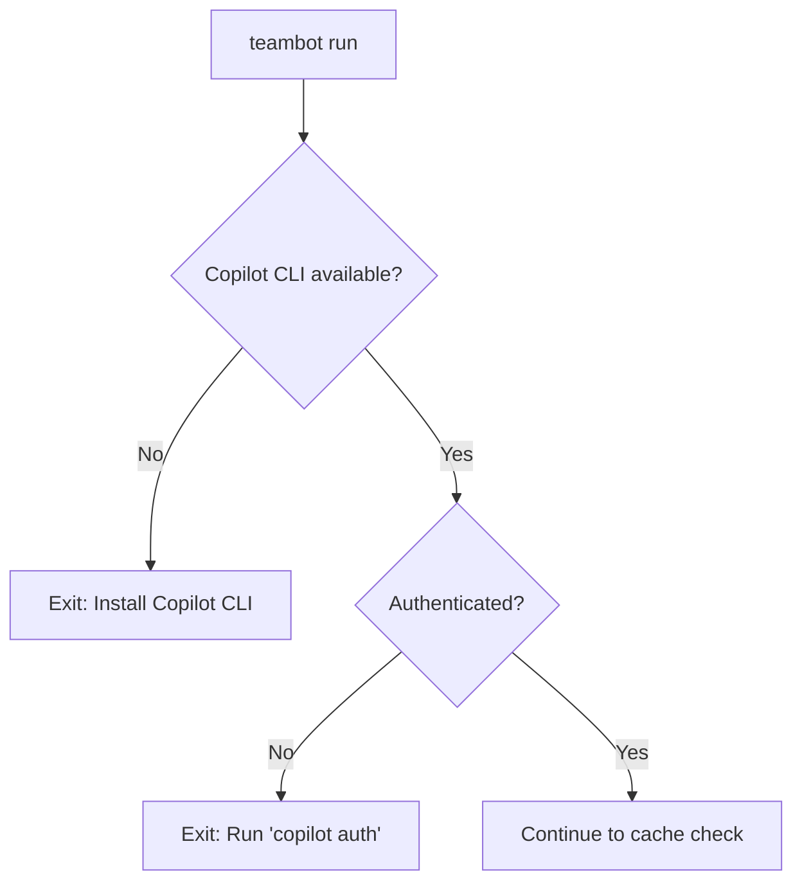
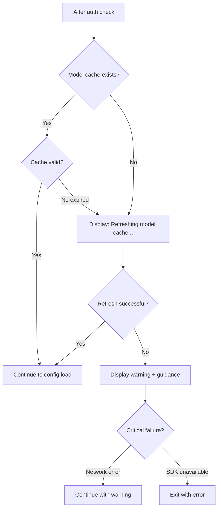

<!-- markdownlint-disable-file -->
# Task Research Document: Model Cache Auto-Setup and Login Validation

This research analyzes the implementation approach for enhancing `teambot run` to automatically validate Copilot CLI authentication and refresh the model cache when missing. The feature ensures a seamless first-run experience by detecting when authentication is missing or model cache is empty, then taking appropriate action with clear user feedback.

## Task Implementation Requests

* **AUTH-001**: Add authentication check at the start of `cmd_run()` before config loading
  * Check Copilot CLI authentication status
  * If not authenticated, exit with clear error instructing user to run `copilot auth`
  * Must be fast and not block unnecessarily
* **CACHE-001**: Add model cache detection after authentication passes
  * Detect when model cache is missing or empty
  * Display status message ("Refreshing model cache...")
  * Trigger automatic model refresh equivalent to `/models --refresh`
* **CACHE-002**: Handle model cache refresh failures gracefully
  * If refresh fails, display clear error with actionable guidance
  * Allow `teambot run` to continue if authentication passed but cache refresh failed
* **TEST-001**: Add comprehensive tests for new auth check and auto-refresh behavior
  * Unit tests for auth check flow
  * Unit tests for cache detection and auto-refresh
  * Acceptance tests for end-to-end scenarios

## Scope and Success Criteria

* **Scope**: 
  * `cmd_run()` function in `src/teambot/cli.py`
  * Model cache detection using `src/teambot/config/model_cache.py`
  * Authentication check using `src/teambot/copilot/sdk_client.py`
  * **Excludes**: Changes to `cmd_init()` (already has auth check + model refresh), REPL commands

* **Assumptions**:
  1. Authentication check uses existing `_check_auth_async()` and `_check_copilot_authentication()` functions
  2. Model refresh uses existing `_refresh_model_cache()` and `refresh_models()` functions
  3. Cache check should happen after config loading to ensure `.teambot/` directory exists
  4. Feature should not change behavior when cache already exists and is valid

* **Success Criteria**:
  * ✅ `teambot run` validates authentication before proceeding
  * ✅ Unauthenticated state stops execution with clear "run `copilot auth`" message
  * ✅ `teambot run` detects missing/empty model cache
  * ✅ Missing cache triggers automatic refresh with status message
  * ✅ Refresh failures provide clear error with actionable guidance
  * ✅ Successful refresh continues normal execution
  * ✅ All existing tests continue to pass
  * ✅ New tests cover auth check and auto-refresh behavior

## Outline

1. **Entry Point Analysis** - Trace all paths through `cmd_run()`
2. **Existing Implementation Review** - How `cmd_init()` handles auth/cache
3. **Model Cache Detection** - How to check if cache is missing/empty
4. **Implementation Approach** - Recommended changes to `cmd_run()`
5. **Testing Strategy** - TDD approach with test patterns
6. **Implementation Details** - Code snippets and examples

### Potential Next Research

* **ConfigLoader model validation behavior**
  * **Reasoning**: Need to understand if config loading triggers model validation that could fail without cache
  * **Reference**: `src/teambot/config/loader.py:183-188` - `_validate_agent()` calls `validate_model()`

## Research Executed

### Testing Infrastructure Research

* **Framework**: pytest (with pytest-cov, pytest-mock)
  * Location: `tests/` directory (mirrors `src/teambot/` structure)
  * Naming: `test_*.py` pattern, classes like `TestClassName`, methods `test_method_name`
  * Runner: `uv run pytest` (from AGENTS.md)
  * Coverage: 80% target per AGENTS.md, uses coverage.py

### Test Patterns Found

* **File**: `tests/test_cli.py` (Lines 366-429)
  * Tests for `_refresh_model_cache()` function
  * Uses `patch()` context managers for async mocking
  * Uses `AsyncMock(return_value=...)` for async functions
  * Fixture pattern: `tmp_path`, `monkeypatch` for directory isolation
  * Capsys for output capture verification

* **File**: `tests/test_init_model_config_acceptance.py` (Lines 1-318)
  * Acceptance test naming pattern: `test_at_XXX_description`
  * Tests exercise real implementation with selective mocking
  * Mocks async network calls but tests real logic
  * Verifies both return values AND console output

### Coverage Standards

* **Unit Tests**: 80% minimum (per AGENTS.md)
* **Acceptance Tests**: Named with `AT-xxx` prefix pattern
* **Critical Paths**: 100% coverage for auth/cache flow (new feature)

### Testing Approach Recommendation

* **Auth Check Logic**: TDD - Well-defined requirements, critical path
* **Cache Detection**: TDD - Clear success criteria, reuses existing patterns
* **Integration with cmd_run**: Code-First - Straightforward wiring of existing functions

**Rationale**: Feature has well-defined requirements matching existing patterns in `cmd_init()`. TDD appropriate for core auth/cache logic since we can write clear acceptance criteria first. Integration wiring follows existing patterns.

### File Analysis

* `src/teambot/cli.py`
  * **Lines 30-63**: `_refresh_model_cache_async()` and `_refresh_model_cache()` - existing cache refresh functions
  * **Lines 66-115**: `_check_auth_async()` and `_check_copilot_authentication()` - existing auth check functions
  * **Lines 369-373**: `cmd_init()` calls auth check then model refresh (non-blocking)
  * **Lines 394-465**: `cmd_run()` - **TARGET FOR MODIFICATION**
  * **Lines 782-786**: `main()` already calls `check_copilot_cli()` before `cmd_run()` (CLI availability check)

* `src/teambot/config/model_cache.py`
  * **Lines 84-98**: `is_cache_valid()` - checks if cache exists and not expired
  * **Lines 101-137**: `load_cache()` - loads cache from disk, returns None if missing
  * **Lines 215-224**: `get_cached_models()` - returns empty list if cache invalid

* `src/teambot/config/schema.py`
  * **Lines 23-70**: `_ensure_models_loaded()` - lazy loads models, warns if no cache
  * **Lines 73-99**: `validate_model()` - returns False if no models loaded
  * **Lines 142-196**: `refresh_models()` - async refresh from SDK

* `src/teambot/config/loader.py`
  * **Lines 182-188**: `_validate_agent()` calls `validate_model(model)` which triggers cache load
  * **Lines 200-209**: `_validate_default_model()` also calls `validate_model()`

### Code Search Results

* `cmd_run` function location: `src/teambot/cli.py:394`
* Authentication check functions: `_check_auth_async`, `_check_copilot_authentication`
* Model cache functions: `load_cache`, `is_cache_valid`, `get_cached_models`, `refresh_models`

### External Research (Evidence Log)

* **Internal codebase analysis**: `grep` and `view` tools
  * `cmd_init()` already implements auth check + model refresh as non-blocking status info
  * `cmd_run()` currently has NO auth check or model cache auto-refresh
  * ConfigLoader validates models during `load()` which can fail if cache empty

### Project Conventions

* Standards referenced: AGENTS.md (testing, linting, code style)
* Instructions followed: TDD preference from objective, existing cli.py patterns

## Entry Point Analysis

### User Input Entry Points

| Entry Point | Code Path | Reaches Feature? | Implementation Required? |
|-------------|-----------|------------------|-------------------------|
| `teambot run obj.md` | main() → cmd_run() | ✅ YES | ✅ YES - Add auth + cache check |
| `teambot run` (interactive) | main() → cmd_run() → run_interactive_mode() | ✅ YES | ✅ YES - Same path |
| `teambot run --resume` | main() → cmd_run() → _run_orchestration_resume() | ✅ YES | ✅ YES - Same entry |
| `teambot init` | main() → cmd_init() | ❌ NO | ❌ NO - Already has auth + cache |
| `teambot status` | main() → cmd_status() | ❌ NO | ❌ NO - Not applicable |

### Code Path Trace

#### Entry Point 1: `teambot run objectives/task.md`
1. User runs: `teambot run objectives/task.md`
2. Handled by: `cli.py:main()` (Lines 768-791)
3. Routes to: `cli.py:cmd_run()` (Line 786)
4. Current flow:
   - Checks config exists (Lines 399-401)
   - Loads config via ConfigLoader (Lines 404-409) ⚠️ **Can fail if no cache**
   - Checks resume flag (Lines 412-418)
   - Loads objective file (Lines 421-428)
   - Runs orchestration or interactive mode

#### Entry Point 2: `teambot run` (interactive mode)
1. User runs: `teambot run`
2. Same path as above, but `args.objective` is None
3. After config loading, routes to `run_interactive_mode()` (Line 461)

#### Entry Point 3: `teambot run --resume`
1. User runs: `teambot run --resume`
2. Same initial path
3. Routes to `_run_orchestration_resume()` (Lines 413-418)

### Coverage Gaps

| Gap | Impact | Required Fix |
|-----|--------|--------------|
| No auth check in `cmd_run()` | User gets confusing errors if not authenticated | Add `_check_copilot_authentication()` call with exit on failure |
| No cache check in `cmd_run()` | ConfigLoader may fail model validation | Add cache detection + auto-refresh before config load |
| ConfigLoader validates models eagerly | Fails with "Invalid model" if cache empty | Auto-refresh cache BEFORE config loading |

### Implementation Scope Verification

- [x] All entry points from acceptance test scenarios are traced
- [x] All code paths that should trigger feature are identified
- [x] Coverage gaps are documented with required fixes

## Key Discoveries

### Critical Discovery: Config Loading Triggers Model Validation ⚠️

The `ConfigLoader.load()` method (Lines 110-124) calls `_validate()` which validates all agent models:

```python
# src/teambot/config/loader.py:182-188
def _validate_agent(self, agent: dict[str, Any], seen_ids: set[str]) -> None:
    ...
    # Validate model if present
    model = agent.get("model")
    if model is not None and not validate_model(model):
        raise ConfigError(
            f"Invalid model '{model}' for agent '{agent_id}'. "
            f"Use '/models' command to see available models."
        )
```

**Impact**: If model cache is missing/empty, `validate_model()` returns `False` and config loading FAILS with `ConfigError`. This means:

1. Cache must be refreshed BEFORE `ConfigLoader.load()` is called
2. Auth check should happen BEFORE cache refresh (need SDK for refresh)
3. Cache refresh must be blocking (not non-blocking like in `cmd_init`)

### Difference from `cmd_init()` Behavior

| Aspect | `cmd_init()` | `cmd_run()` (proposed) |
|--------|--------------|------------------------|
| Auth check | Non-blocking warning | **Blocking - exit if failed** |
| Cache refresh | Non-blocking, after config save | **Blocking - before config load** |
| On failure | Continues with warnings | **Exit with clear error** |

### Existing Helper Functions Available

```python
# Authentication check (async wrapper)
async def _check_auth_async() -> tuple[bool, str | None]:
    """Returns (is_authenticated, error_message)."""

# Authentication check (sync, displays output)  
def _check_copilot_authentication(display: ConsoleDisplay) -> bool:
    """Returns True if authenticated, displays messages."""

# Model cache refresh (async)
async def _refresh_model_cache_async() -> bool:
    """Returns True if refresh succeeded."""

# Model cache refresh (sync, displays output)
def _refresh_model_cache(display: ConsoleDisplay) -> bool:
    """Returns True if refresh succeeded, displays status."""

# Cache validation
def is_cache_valid(cache: ModelCache | None) -> bool:
    """Returns True if cache exists and not expired."""

def load_cache() -> ModelCache | None:
    """Returns cache or None if missing/invalid."""
```

### Project Structure

```
src/teambot/
├── cli.py                    # ✏️ MODIFY: cmd_run() function
├── config/
│   ├── loader.py            # ConfigLoader - validates models
│   ├── model_cache.py       # load_cache(), is_cache_valid()
│   └── schema.py            # validate_model(), refresh_models()
└── copilot/
    └── sdk_client.py        # CopilotSDKClient for auth check

tests/
├── test_cli.py              # ✏️ ADD: TestRunAuthCheck, TestRunModelCache
└── test_*_acceptance.py     # ✏️ ADD: test_model_cache_auto_acceptance.py
```

### Implementation Patterns

Pattern from `cmd_init()` for auth + cache (Lines 369-373):
```python
# Check authentication and refresh model cache (non-blocking)
display.print_info("")
display.print_info("=== Copilot Status ===")
_check_copilot_authentication(display)
_refresh_model_cache(display)
```

For `cmd_run()`, we need **blocking** behavior:
```python
# Check authentication (BLOCKING - exit if failed)
if not _check_copilot_authentication(display):
    return 1

# Check and refresh model cache if needed (BLOCKING - before config load)
if not _ensure_model_cache(display):
    return 1  # Or continue with warning?
```

## Technical Scenarios

### 1. Authentication Check Before Run

When user runs `teambot run`, validate Copilot CLI authentication status before proceeding with any operations.

**Requirements:**
* Check authentication status via SDK
* If not authenticated, display clear error with instructions
* Exit with non-zero code if not authenticated
* Fast check that doesn't block unnecessarily

**Preferred Approach:**
* Use existing `_check_copilot_authentication()` function
* Modify behavior: in `cmd_run()` context, return failure instead of warning
* Check AFTER CLI availability check but BEFORE config loading

```text
src/teambot/cli.py  # Modify cmd_run() to add auth check
```



**Implementation Details:**

The auth check should be the first substantive check in `cmd_run()`:

```python
def cmd_run(args: argparse.Namespace, display: ConsoleDisplay) -> int:
    """Run TeamBot with an objective."""
    config_path = Path(args.config)
    teambot_dir = Path(".teambot")

    # Check authentication FIRST (blocking)
    if not _check_copilot_authentication_blocking(display):
        return 1  # Exit with error

    # Check config exists
    if not config_path.exists():
        ...
```

New helper function variant for blocking check:
```python
def _check_copilot_authentication_blocking(display: ConsoleDisplay) -> bool:
    """Check Copilot authentication status. Blocking version for cmd_run.
    
    Unlike _check_copilot_authentication which continues with warnings,
    this version is strict and returns False on any auth failure.
    
    Args:
        display: Console display for output.
        
    Returns:
        True if authenticated and ready, False otherwise.
    """
    try:
        is_auth, error = asyncio.run(_check_auth_async())
        
        if is_auth:
            return True
        else:
            display.print_error("Copilot not authenticated")
            if error and "not available" not in error.lower():
                display.print_error(f"  {error}")
            display.print_info("Run 'copilot auth' to authenticate")
            display.print_info("Or set GITHUB_TOKEN environment variable")
            return False
    except Exception as e:
        logging.debug(f"Could not check authentication: {e}")
        display.print_error("Could not verify authentication status")
        display.print_info("Run 'copilot auth' to ensure you're authenticated")
        return False
```

#### Considered Alternatives (Removed After Selection)

**Alternative: Reuse existing `_check_copilot_authentication()` directly**
- Rejected because: It prints warnings but doesn't fail, unsuitable for blocking behavior
- The existing function is designed for `cmd_init()` non-blocking context

**Alternative: Check auth only if cache needs refresh**
- Rejected because: Auth should be validated regardless to catch issues early
- User experience is better with consistent auth validation

---

### 2. Model Cache Detection and Auto-Refresh

When user runs `teambot run`, detect if model cache is missing or empty and automatically refresh it before config loading.

**Requirements:**
* Detect missing/empty model cache
* Display status message "Refreshing model cache..." during refresh
* Refresh must complete before ConfigLoader.load() is called
* Handle network failures gracefully with clear error
* Continue normally if refresh succeeds

**Preferred Approach:**
* Add new `_ensure_model_cache()` function
* Check cache using `load_cache()` and `is_cache_valid()`
* Trigger refresh using existing `_refresh_model_cache()`
* Place check AFTER auth check, BEFORE config loading

```text
src/teambot/cli.py  # Add _ensure_model_cache() function
                    # Modify cmd_run() to call it
```



**Implementation Details:**

New function for cache check and auto-refresh:
```python
def _ensure_model_cache(display: ConsoleDisplay) -> bool:
    """Ensure model cache is available, refreshing if needed.
    
    Checks if model cache exists and is valid. If missing or expired,
    automatically refreshes from SDK with status feedback.
    
    Args:
        display: Console display for output.
        
    Returns:
        True if cache is available (existing or refreshed),
        False if refresh was needed but failed critically.
    """
    from teambot.config.model_cache import is_cache_valid, load_cache
    
    cache = load_cache()
    
    if is_cache_valid(cache):
        # Cache exists and valid, no action needed
        return True
    
    # Cache missing or expired - need to refresh
    if cache is None:
        display.print_info("Model cache not found, refreshing...")
    else:
        display.print_info("Model cache expired, refreshing...")
    
    if _refresh_model_cache(display):
        return True
    
    # Refresh failed - warn but allow continue
    # (existing _refresh_model_cache already displays warnings)
    # Config loading will fail if models can't be validated
    # but that's acceptable - user gets clear error message
    return True  # Return True to continue - let config loading handle errors
```

**Decision: Graceful degradation on cache refresh failure**

After analysis, the best approach is:
1. Attempt cache refresh if needed
2. If refresh fails, display warning but continue
3. ConfigLoader will fail with clear "Invalid model" error if cache truly needed
4. This matches user expectation: "try to help, but don't block unnecessarily"

Updated flow:
```python
def cmd_run(args: argparse.Namespace, display: ConsoleDisplay) -> int:
    """Run TeamBot with an objective."""
    config_path = Path(args.config)
    teambot_dir = Path(".teambot")

    # Check authentication FIRST (blocking)
    if not _check_copilot_authentication_blocking(display):
        return 1

    # Ensure model cache is available (auto-refresh if needed)
    _ensure_model_cache(display)  # Non-blocking - warnings only

    # Check config exists
    if not config_path.exists():
        display.print_error(f"Configuration not found: {config_path}")
        display.print_warning("Run 'teambot init' first")
        return 1

    # Load config (may fail if models invalid and cache still empty)
    try:
        loader = ConfigLoader()
        config = loader.load(config_path)
    except ConfigError as e:
        display.print_error(f"Configuration error: {e}")
        return 1
    
    # ... rest of function
```

#### Considered Alternatives (Removed After Selection)

**Alternative: Strict failure on cache refresh failure**
- Rejected because: Too aggressive, blocks users who might not need model validation
- Some configs may have `model: null` which doesn't require validation

**Alternative: Skip cache check entirely, let ConfigLoader fail**
- Rejected because: Error message "Invalid model 'X'" is confusing without cache context
- Auto-refresh provides better UX by trying to help before failing

---

### 3. Integration Testing Strategy

Comprehensive test coverage for the new auth check and cache auto-refresh behavior.

**Requirements:**
* Unit tests for `_check_copilot_authentication_blocking()`
* Unit tests for `_ensure_model_cache()`
* Integration tests for `cmd_run()` with various scenarios
* Acceptance tests following existing AT-xxx pattern

**Preferred Approach:**
* Add new test class `TestRunAuthCheck` in `tests/test_cli.py`
* Add new test class `TestRunModelCache` in `tests/test_cli.py`
* Add acceptance test file `tests/test_model_cache_auto_acceptance.py`
* Follow existing patterns: `patch`, `AsyncMock`, `tmp_path`, `capsys`

**Test Scenarios:**

| Scenario | Expected Behavior |
|----------|-------------------|
| Authenticated + valid cache | Normal execution |
| Authenticated + missing cache | Auto-refresh, then execute |
| Authenticated + expired cache | Auto-refresh, then execute |
| Authenticated + refresh fails | Warning, config load may fail |
| Not authenticated | Exit with error, instructions shown |
| SDK unavailable | Exit with error, install instructions |

**Example Test:**
```python
class TestRunAuthCheck:
    """Tests for authentication check in cmd_run."""

    def test_run_fails_when_not_authenticated(self, tmp_path, monkeypatch, capsys):
        """cmd_run exits with error when not authenticated."""
        import argparse
        from unittest.mock import AsyncMock, patch
        
        from teambot.cli import ConsoleDisplay, cmd_run

        monkeypatch.chdir(tmp_path)
        
        # Create valid config
        (tmp_path / "teambot.json").write_text('{"agents": []}')
        
        # Mock auth to return unauthenticated
        with patch("teambot.cli._check_auth_async", AsyncMock(return_value=(False, None))):
            args = argparse.Namespace(config="teambot.json", objective=None)
            display = ConsoleDisplay()
            
            result = cmd_run(args, display)
        
        assert result == 1
        captured = capsys.readouterr()
        assert "not authenticated" in captured.out.lower()
        assert "copilot auth" in captured.out.lower()


class TestRunModelCache:
    """Tests for model cache auto-refresh in cmd_run."""

    def test_run_auto_refreshes_missing_cache(self, tmp_path, monkeypatch, capsys):
        """cmd_run automatically refreshes model cache when missing."""
        import argparse
        from unittest.mock import AsyncMock, patch
        
        from teambot.cli import ConsoleDisplay, cmd_init, cmd_run

        monkeypatch.chdir(tmp_path)
        
        # Initialize (creates config)
        with patch("teambot.cli._check_auth_async", AsyncMock(return_value=(True, None))):
            with patch("teambot.cli._refresh_model_cache_async", AsyncMock(return_value=True)):
                cmd_init(argparse.Namespace(force=False, no_animation=True), ConsoleDisplay())
        
        # Delete the model cache
        cache_file = tmp_path / ".teambot" / "model_cache.json"
        if cache_file.exists():
            cache_file.unlink()
        
        # Mock auth and refresh for run
        refresh_called = [False]
        async def mock_refresh():
            refresh_called[0] = True
            return True
        
        with patch("teambot.cli._check_auth_async", AsyncMock(return_value=(True, None))):
            with patch("teambot.cli._refresh_model_cache_async", mock_refresh):
                with patch("teambot.config.loader.validate_model", lambda m: True):
                    # Mock REPL to avoid hanging
                    async def mock_repl(*args, **kwargs):
                        pass
                    with patch("teambot.repl.run_interactive_mode", mock_repl):
                        args = argparse.Namespace(config="teambot.json", objective=None)
                        display = ConsoleDisplay()
                        
                        result = cmd_run(args, display)
        
        assert result == 0
        assert refresh_called[0] is True
        captured = capsys.readouterr()
        assert "refresh" in captured.out.lower() or "cache" in captured.out.lower()
```

## Complete Examples

### Modified `cmd_run()` Function

```python
def cmd_run(args: argparse.Namespace, display: ConsoleDisplay) -> int:
    """Run TeamBot with an objective."""
    config_path = Path(args.config)
    teambot_dir = Path(".teambot")

    # ==========================================
    # NEW: Authentication check (blocking)
    # ==========================================
    if not _check_copilot_authentication_blocking(display):
        return 1

    # ==========================================
    # NEW: Ensure model cache available
    # ==========================================
    _ensure_model_cache(display)

    # ==========================================
    # Existing code continues below
    # ==========================================
    if not config_path.exists():
        display.print_error(f"Configuration not found: {config_path}")
        display.print_warning("Run 'teambot init' first")
        return 1

    try:
        loader = ConfigLoader()
        config = loader.load(config_path)
    except ConfigError as e:
        display.print_error(f"Configuration error: {e}")
        return 1

    # ... rest of function unchanged
```

### New Helper Functions

```python
def _check_copilot_authentication_blocking(display: ConsoleDisplay) -> bool:
    """Check Copilot authentication status (blocking version for cmd_run).
    
    Unlike _check_copilot_authentication which continues with warnings,
    this version treats authentication failure as a blocking error.
    
    Args:
        display: Console display for output.
        
    Returns:
        True if authenticated, False otherwise (blocks execution).
    """
    try:
        is_auth, error = asyncio.run(_check_auth_async())
        
        if is_auth:
            return True
        else:
            display.print_error("Copilot not authenticated")
            if error and "not available" not in error.lower():
                display.print_error(f"  {error}")
            display.print_info("Run 'copilot auth' to authenticate")
            display.print_info("Or set GITHUB_TOKEN environment variable")
            return False
    except Exception as e:
        logging.debug(f"Could not check authentication: {e}")
        display.print_error("Could not verify authentication status")
        display.print_info("Run 'copilot auth' to ensure you're authenticated")
        return False


def _ensure_model_cache(display: ConsoleDisplay) -> None:
    """Ensure model cache is available, refreshing if needed.
    
    Checks if model cache exists and is valid. If missing or expired,
    automatically refreshes from SDK with status feedback.
    
    This is non-blocking - if refresh fails, execution continues
    and ConfigLoader will report specific validation errors.
    
    Args:
        display: Console display for output.
    """
    from teambot.config.model_cache import is_cache_valid, load_cache
    
    cache = load_cache()
    
    if is_cache_valid(cache):
        # Cache exists and valid, no action needed
        return
    
    # Cache missing or expired - need to refresh
    if cache is None:
        display.print_info("Refreshing model cache...")
    else:
        display.print_info("Model cache expired, refreshing...")
    
    _refresh_model_cache(display)
```

## Configuration Examples

No configuration changes required. Feature uses existing:

```json
{
  "teambot_dir": ".teambot",
  "default_model": "claude-sonnet-4.5",
  "agents": [
    {
      "id": "pm",
      "persona": "project_manager",
      "model": "claude-sonnet-4.5"
    }
  ]
}
```

Model cache stored at `.teambot/model_cache.json`:

```json
{
  "models": [
    {"id": "claude-sonnet-4.5", "name": "Claude Sonnet 4.5", "category": "standard"},
    {"id": "gpt-5", "name": "GPT-5", "category": "standard"}
  ],
  "timestamp": 1739929860.123,
  "sdk_version": "1.2.0"
}
```
