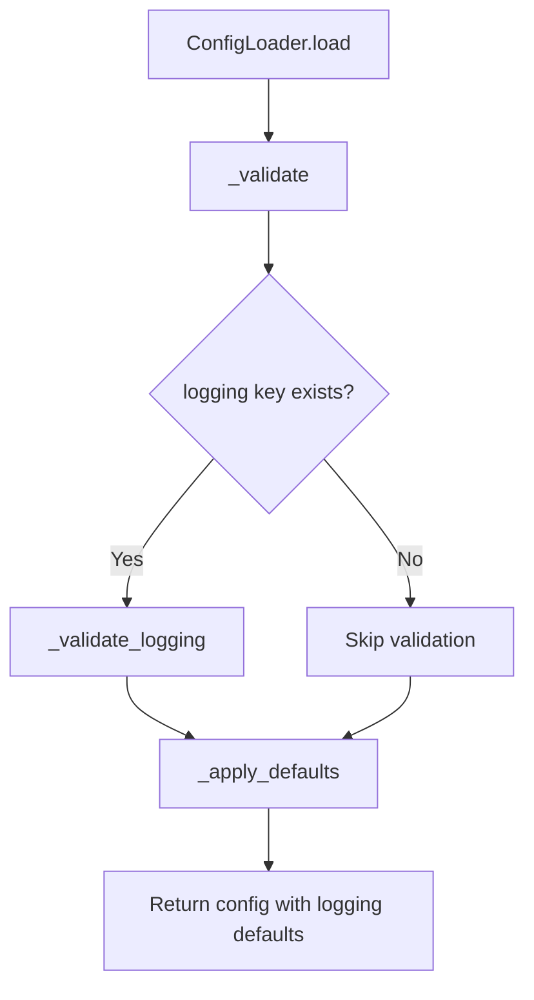
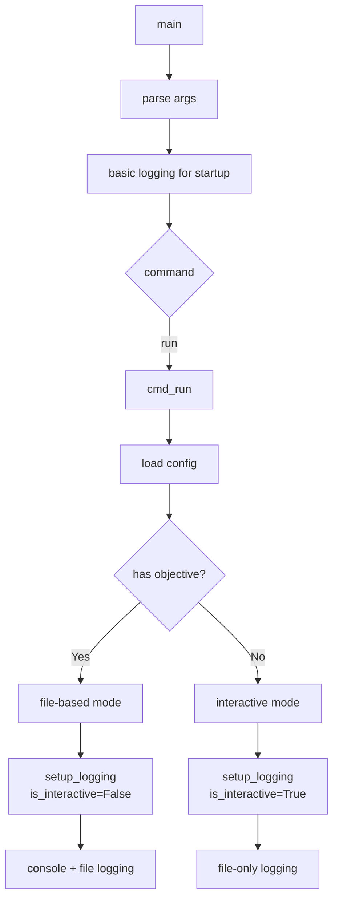

<!-- markdownlint-disable-file -->
# Task Research Document: Configurable Logging Output

This research analyzes the implementation approach for configurable logging output control in TeamBot. The goal is to prevent logging messages (`INFO:`, `DEBUG:`, etc.) from interfering with the Rich/Textual interactive terminal UI while preserving all logging capabilities for debugging and file-based orchestration mode.

## Task Implementation Requests

* **Task 1**: Add `logging` configuration section to `teambot.json` schema with `console_output`, `file_output`, `log_file`, and `level` settings
* **Task 2**: Create logging configuration module (`src/teambot/config/logging_config.py`) to parse and apply logging settings
* **Task 3**: Update `setup_logging()` in `cli.py` to use configuration-based logging with mode detection
* **Task 4**: Add `--log-to-console` CLI override flag for debugging interactive mode
* **Task 5**: Add default log file location (`.teambot/logs/teambot.log`) with rotation support
* **Task 6**: Update `ConfigLoader` to validate new logging configuration options
* **Task 7**: Write unit tests for logging configuration loading and application

## Scope and Success Criteria

* **Scope**: Logging output configuration for interactive UI mode and file-based orchestration mode
* **Exclusions**: Log aggregation, remote logging, structured logging formats (JSON)
* **Assumptions**:
  1. Existing `teambot.json` files without `logging` section should work (backwards compatible)
  2. Interactive mode = Textual/Rich split-pane UI (`TeamBotApp`)
  3. File-based mode = orchestration via `teambot run objectives/file.md`

* **Success Criteria**:
  * ✅ Interactive UI shows no `INFO:`, `DEBUG:` console output pollution
  * ✅ File-based orchestration defaults to console logging
  * ✅ Log file always available at configurable path
  * ✅ Existing configs without `logging` key continue to work
  * ✅ `--log-to-console` flag overrides file-only in interactive mode

## Outline

1. Entry Point Analysis
2. Testing Infrastructure Research
3. Current Logging Implementation Analysis
4. Key Discoveries
5. Technical Scenarios
   - Logging Configuration Schema
   - Mode Detection and Application
   - CLI Override Implementation

### Potential Next Research

* **Log rotation strategy**
  * **Reasoning**: Long-running orchestration (up to 8 hours) may produce large log files
  * **Reference**: Feature spec mentions `.teambot/logs/` as default location

* **Structured logging (JSON)**
  * **Reasoning**: Could enable log aggregation and analysis in future
  * **Reference**: Not in scope for MVP but worth considering architecture

## Research Executed

### Entry Point Analysis

| Entry Point | Code Path | Logging Configured? | Implementation Required? |
|-------------|-----------|---------------------|--------------------------|
| `teambot init` | `cli.py:main()` → `setup_logging()` → `cmd_init()` | YES (L247) | YES |
| `teambot run objective.md` | `cli.py:main()` → `setup_logging()` → `cmd_run()` → `_run_orchestration()` | YES (L247) | YES |
| `teambot run` (no objective) | `cli.py:main()` → `setup_logging()` → `cmd_run()` → `run_interactive_mode()` | YES (L247) | YES - **critical** |
| `teambot status` | `cli.py:main()` → `setup_logging()` → `cmd_status()` | YES (L247) | YES |

**Critical Finding**: All execution modes share a single `setup_logging()` call in `main()` at line 247. This is the **sole configuration point** for logging behavior.

#### Code Path Trace

**Entry Point: Interactive Mode (`teambot run` without objective)**
1. User runs: `teambot run` (no objective file)
2. Handled by: `cli.py:main()` (Lines 835-870)
3. Logging configured: `setup_logging(verbose=args.verbose)` (Line 855)
4. Routes to: `cmd_run()` (Lines 455-534)
5. Since no objective: calls `run_interactive_mode()` (Line 530)
6. Reaches: `TeamBotApp` via `ui/app.py` or `REPLLoop` via `repl/loop.py`
7. **Problem**: `logging.basicConfig()` outputs to `sys.stderr` → interferes with Textual UI

**Entry Point: File-Based Orchestration (`teambot run objective.md`)**
1. User runs: `teambot run objectives/task.md`
2. Handled by: `cli.py:main()` (Lines 835-870)
3. Logging configured: `setup_logging(verbose=args.verbose)` (Line 855)
4. Routes to: `cmd_run()` → `_run_orchestration()` (Lines 561-670)
5. Reaches: `ExecutionLoop.run()` with progress display
6. **Expectation**: Console logging is appropriate here (no split-pane UI)

### Coverage Gaps

| Gap | Impact | Required Fix |
|-----|--------|--------------|
| Single `setup_logging()` for all modes | Interactive UI polluted with log messages | Mode-aware logging configuration |
| No file logging capability | Debug info lost in interactive mode | Add FileHandler to logging config |
| No CLI override | Cannot debug interactive mode issues | Add `--log-to-console` flag |

### Testing Infrastructure Research

* **Framework**: pytest 7.4.0 with pytest-cov, pytest-mock, pytest-asyncio
  * Location: `tests/` directory (mirrors `src/` structure)
  * Naming: `test_*.py` pattern, class `Test*`, function `test_*`
  * Runner: `uv run pytest` (from `pyproject.toml`)
  * Coverage: `--cov=src/teambot --cov-report=term-missing` (default 80% target)

### Test Patterns Found

* **File**: `tests/test_notification_acceptance.py` (Lines 98-135)
  * Uses `caplog` fixture for logging assertions
  * `caplog.set_level(logging.ERROR)` to filter log level
  * Asserts on `caplog.text` for log content verification
  * Pattern: `assert "expected message" in caplog.text.lower()`

* **File**: `tests/test_cli.py` (Lines 1-50)
  * Uses `tmp_path` fixture for temp directories
  * Mocks with `unittest.mock` (MagicMock, AsyncMock)
  * Pattern: Test class per feature area

* **File**: `tests/conftest.py` (Lines 1-185)
  * Shared fixtures: `temp_teambot_dir`, `sample_agent_config`, `mock_sdk_client`
  * Mock streaming session patterns for async tests

### Coverage Standards

* **Unit Tests**: 80% minimum (per `pyproject.toml` addopts)
* **Acceptance Tests**: Marked with `@pytest.mark.acceptance`
* **Critical Paths**: Config loading, mode detection must have 100% coverage

### Testing Approach Recommendation

* **Logging config schema**: TDD (well-defined requirements, critical for backwards compatibility)
* **Mode detection logic**: TDD (clear behavior rules, testable in isolation)
* **CLI flag handling**: Code-First (straightforward argparse addition)
* **Integration with Textual**: Manual verification (complex UI interactions)

**Rationale**: The config loading and mode detection have clear, testable requirements. TDD ensures backwards compatibility is verified before implementation.

### File Analysis

* `src/teambot/cli.py` (Lines 244-250) - Current `setup_logging()` implementation:
  ```python
  def setup_logging(verbose: bool = False) -> None:
      """Configure logging for TeamBot."""
      level = logging.DEBUG if verbose else logging.INFO
      logging.basicConfig(
          level=level,
          format="%(asctime)s - %(name)s - %(levelname)s - %(message)s",
      )
  ```
  **Finding**: Uses `basicConfig()` which defaults to `StreamHandler(sys.stderr)` - this is the source of UI pollution.

* `src/teambot/config/loader.py` (Lines 107-290) - Config validation patterns:
  * Uses `ConfigError` for validation failures
  * `_validate_notifications()` pattern for nested config validation
  * `_apply_defaults()` for backwards compatibility

* `src/teambot/ui/app.py` (Lines 1-100) - Textual app:
  * `TeamBotApp` extends Textual `App`
  * Uses `should_use_split_pane()` to detect mode
  * Checks `TEAMBOT_LEGACY_MODE` env var

* `src/teambot/repl/loop.py` (Lines 397-450) - Mode selection:
  * `run_interactive_mode()` chooses between `TeamBotApp` and `REPLLoop`
  * Environment variable `TEAMBOT_SPLIT_PANE` for explicit mode

### Code Search Results

* `import logging` - 12 files use logging module:
  * `cli.py`, `orchestrator.py`, `agent_runner.py`, `schema.py`, `model_cache.py`
  * `client.py`, `sdk_client.py`, `agent_loader.py`, `executor.py`, `event_bus.py`, `telegram.py`, `state_machine.py`

* `logger.` usage patterns:
  * `logger.info()` - Status updates, task completion
  * `logger.debug()` - Verbose details, cache loading
  * `logger.warning()` - Degraded operation, cache expiry
  * `logger.error()` - Operation failures

### External Research (Evidence Log)

* **Python logging documentation**: Standard library patterns
  * FileHandler, StreamHandler, RotatingFileHandler are appropriate handlers
  * `logging.basicConfig()` only configures root logger once - subsequent calls are no-ops
  * Source: [Python logging docs](https://docs.python.org/3/library/logging.html)

* **Textual documentation**: Terminal handling
  * Textual captures stdout/stderr for its own rendering
  * Logging to stderr interferes with Textual's display
  * Source: [Textual documentation](https://textual.textualize.io/)

### Project Conventions

* **Standards referenced**:
  * Config validation uses `ConfigError` exception (loader.py pattern)
  * Defaults applied via `_apply_defaults()` method
  * Environment variables follow `TEAMBOT_*` prefix pattern

* **Instructions followed**:
  * Clean commits: `uv run ruff format -- .` and `uv run ruff check . --fix`
  * Testing: `uv run pytest` with coverage

## Key Discoveries

### Project Structure

```
src/teambot/
├── cli.py                    # Main entry point, setup_logging() at L244-250
├── config/
│   ├── loader.py             # Config validation, add logging validation here
│   ├── schema.py             # Model validation (pattern to follow)
│   └── logging_config.py     # NEW: Logging configuration module
├── ui/
│   └── app.py                # Textual app, check for mode
└── repl/
    └── loop.py               # run_interactive_mode() mode selection
```

### Implementation Patterns

**Config Validation Pattern** (from `loader.py`):
```python
def _validate_logging(self, logging: dict[str, Any]) -> None:
    """Validate logging configuration."""
    if not isinstance(logging, dict):
        raise ConfigError("'logging' must be an object")
    
    # Validate each field...
```

**Defaults Application Pattern** (from `loader.py`):
```python
def _apply_defaults(self, config: dict[str, Any]) -> None:
    # Apply logging defaults
    if "logging" not in config:
        config["logging"] = {}
    logging_config = config["logging"]
    if "file_output" not in logging_config:
        logging_config["file_output"] = True  # Always log to file
```

### Complete Examples

**Example: Mode-aware logging setup**
```python
# src/teambot/config/logging_config.py
import logging
from pathlib import Path
from typing import Any

def setup_logging(
    config: dict[str, Any],
    is_interactive: bool,
    force_console: bool = False,
    verbose: bool = False,
) -> None:
    """Configure logging based on execution mode and config.
    
    Args:
        config: TeamBot configuration dict.
        is_interactive: True if running in interactive UI mode.
        force_console: Override to enable console output (--log-to-console).
        verbose: Enable DEBUG level logging.
    """
    logging_config = config.get("logging", {})
    
    # Determine log level
    level = logging.DEBUG if verbose else logging.INFO
    level_str = logging_config.get("level", "INFO").upper()
    if level_str in ("DEBUG", "INFO", "WARNING", "ERROR"):
        level = getattr(logging, level_str)
    
    # Clear any existing handlers
    root_logger = logging.getLogger()
    root_logger.handlers.clear()
    root_logger.setLevel(level)
    
    # File handler (always enabled unless explicitly disabled)
    if logging_config.get("file_output", True):
        log_file = logging_config.get("log_file", ".teambot/logs/teambot.log")
        log_path = Path(log_file)
        log_path.parent.mkdir(parents=True, exist_ok=True)
        
        file_handler = logging.FileHandler(log_path)
        file_handler.setLevel(level)
        file_handler.setFormatter(logging.Formatter(
            "%(asctime)s - %(name)s - %(levelname)s - %(message)s"
        ))
        root_logger.addHandler(file_handler)
    
    # Console handler (mode-dependent)
    console_enabled = logging_config.get("console_output")
    if console_enabled is None:
        # Default: console for file-orchestration, no console for interactive
        console_enabled = not is_interactive
    
    if force_console or console_enabled:
        console_handler = logging.StreamHandler()
        console_handler.setLevel(level)
        console_handler.setFormatter(logging.Formatter(
            "%(name)s - %(levelname)s - %(message)s"
        ))
        root_logger.addHandler(console_handler)
```

### API and Schema Documentation

**Proposed `teambot.json` logging schema:**

```json
{
  "logging": {
    "console_output": true | false | null,
    "file_output": true | false,
    "log_file": ".teambot/logs/teambot.log",
    "level": "DEBUG" | "INFO" | "WARNING" | "ERROR"
  }
}
```

| Field | Type | Default | Description |
|-------|------|---------|-------------|
| `console_output` | `boolean \| null` | `null` (auto) | `true` = always console, `false` = never, `null` = mode-dependent |
| `file_output` | `boolean` | `true` | Enable/disable file logging |
| `log_file` | `string` | `.teambot/logs/teambot.log` | Path to log file |
| `level` | `string` | `"INFO"` | Minimum log level |

### Configuration Examples

**Minimal config (uses all defaults):**
```json
{
  "agents": [...],
  "workflow": {...}
}
```
*Behavior*: Interactive mode = file-only logging, file orchestration = console + file

**Explicit silent interactive mode:**
```json
{
  "agents": [...],
  "logging": {
    "console_output": false,
    "file_output": true,
    "log_file": ".teambot/logs/teambot.log"
  }
}
```

**Debug mode with console:**
```json
{
  "agents": [...],
  "logging": {
    "console_output": true,
    "level": "DEBUG"
  }
}
```

## Technical Scenarios

### 1. Logging Configuration Schema

Define the JSON schema and validation for the new `logging` configuration section.

**Requirements:**
* Schema must be optional (backwards compatible)
* Support `console_output`, `file_output`, `log_file`, `level` fields
* Validate field types and enum values
* Apply sensible defaults

**Preferred Approach:**
* Add validation method `_validate_logging()` to `ConfigLoader`
* Add defaults in `_apply_defaults()` method
* Follow existing pattern from `_validate_notifications()`

```text
src/teambot/config/
├── loader.py           # Add _validate_logging() and update _apply_defaults()
└── logging_config.py   # NEW: Logging setup logic
```



**Implementation Details:**

```python
# src/teambot/config/loader.py additions

VALID_LOG_LEVELS = {"DEBUG", "INFO", "WARNING", "ERROR"}

def _validate_logging(self, logging: dict[str, Any]) -> None:
    """Validate logging configuration."""
    if not isinstance(logging, dict):
        raise ConfigError("'logging' must be an object")
    
    if "console_output" in logging:
        val = logging["console_output"]
        if val is not None and not isinstance(val, bool):
            raise ConfigError("'logging.console_output' must be a boolean or null")
    
    if "file_output" in logging:
        if not isinstance(logging["file_output"], bool):
            raise ConfigError("'logging.file_output' must be a boolean")
    
    if "log_file" in logging:
        if not isinstance(logging["log_file"], str):
            raise ConfigError("'logging.log_file' must be a string")
    
    if "level" in logging:
        level = logging["level"]
        if not isinstance(level, str) or level.upper() not in VALID_LOG_LEVELS:
            raise ConfigError(
                f"'logging.level' must be one of: {', '.join(VALID_LOG_LEVELS)}"
            )
```

```python
# Additions to _apply_defaults() in loader.py

# Apply logging defaults
if "logging" not in config:
    config["logging"] = {}
logging_cfg = config["logging"]
if "file_output" not in logging_cfg:
    logging_cfg["file_output"] = True
if "log_file" not in logging_cfg:
    logging_cfg["log_file"] = ".teambot/logs/teambot.log"
if "level" not in logging_cfg:
    logging_cfg["level"] = "INFO"
```

#### Considered Alternatives (Removed After Selection)

**Alternative: Environment variables only**
* Simpler but less flexible and harder to version control
* Rejected: Config file approach is more consistent with existing patterns

---

### 2. Mode Detection and Application

Detect execution mode (interactive vs file-orchestration) and apply appropriate logging configuration.

**Requirements:**
* Detect if running in Textual/Rich interactive mode
* Detect if running in file-based orchestration mode
* Apply mode-specific logging defaults
* Support explicit config overrides

**Preferred Approach:**
* Create `is_interactive_mode()` detection function
* Modify `setup_logging()` to accept config and mode flags
* Call updated `setup_logging()` after config is loaded in `cmd_run()`

```text
src/teambot/
├── cli.py               # Update setup_logging() call location and signature
└── config/
    └── logging_config.py  # is_interactive_mode() and setup_logging()
```



**Implementation Details:**

```python
# src/teambot/config/logging_config.py

import logging
import sys
from pathlib import Path
from typing import Any


def is_interactive_mode(has_objective: bool) -> bool:
    """Determine if running in interactive UI mode.
    
    Args:
        has_objective: True if an objective file was provided.
    
    Returns:
        True if interactive mode (Textual/Rich UI), False if file orchestration.
    """
    import os
    
    # File orchestration mode if objective provided
    if has_objective:
        return False
    
    # Legacy mode flag forces non-interactive
    if os.environ.get("TEAMBOT_LEGACY_MODE", "").lower() == "true":
        return False
    
    # Check if stdout is a TTY (required for interactive)
    if not sys.stdout.isatty():
        return False
    
    return True


def setup_logging(
    config: dict[str, Any],
    is_interactive: bool,
    force_console: bool = False,
    verbose: bool = False,
) -> None:
    """Configure logging based on execution mode and config."""
    # Implementation as shown in Key Discoveries section
    ...
```

**CLI Integration (cli.py changes):**

```python
# In cmd_run(), after config is loaded:

from teambot.config.logging_config import is_interactive_mode, setup_logging

# Determine mode
interactive = is_interactive_mode(has_objective=bool(args.objective))

# Configure logging with mode awareness
setup_logging(
    config=config,
    is_interactive=interactive,
    force_console=getattr(args, "log_to_console", False),
    verbose=getattr(args, "verbose", False),
)
```

#### Considered Alternatives (Removed After Selection)

**Alternative: Detect Textual at runtime**
* Check if Textual app is running via import/instance check
* Rejected: Mode should be determined before app starts, not during

---

### 3. CLI Override Implementation

Add `--log-to-console` flag to enable console logging in interactive mode for debugging.

**Requirements:**
* Add `--log-to-console` flag to `run` subcommand
* Flag overrides config/mode-based console setting
* Useful for debugging interactive mode issues

**Preferred Approach:**
* Add argument to `run_parser` in `create_parser()`
* Pass flag value to `setup_logging()` as `force_console`

```text
src/teambot/cli.py  # Add argument and pass to setup_logging
```

**Implementation Details:**

```python
# In create_parser(), add to run_parser:

run_parser.add_argument(
    "--log-to-console",
    action="store_true",
    help="Enable console logging output (useful for debugging interactive mode)",
)
```

```python
# In cmd_run(), use the flag:

setup_logging(
    config=config,
    is_interactive=interactive,
    force_console=getattr(args, "log_to_console", False),
    verbose=getattr(args, "verbose", False),
)
```

#### Considered Alternatives (Removed After Selection)

**Alternative: Environment variable `TEAMBOT_LOG_CONSOLE=true`**
* Works but less discoverable than CLI flag
* Rejected: CLI flag is more user-friendly and self-documenting

## Implementation Sequence

1. **Phase 1: Config Schema** (TDD)
   - Add `_validate_logging()` to `ConfigLoader`
   - Add logging defaults to `_apply_defaults()`
   - Write tests for validation and defaults

2. **Phase 2: Logging Module** (TDD)
   - Create `src/teambot/config/logging_config.py`
   - Implement `is_interactive_mode()` and `setup_logging()`
   - Write tests for mode detection and handler configuration

3. **Phase 3: CLI Integration** (Code-First)
   - Add `--log-to-console` flag to argparse
   - Move `setup_logging()` call to after config load
   - Update `cmd_run()` to use new logging setup

4. **Phase 4: Manual Verification**
   - Test interactive mode has no console log pollution
   - Test file orchestration has console output
   - Test `--log-to-console` override works
   - Verify log files are created correctly

## Files to Create/Modify

| File | Action | Description |
|------|--------|-------------|
| `src/teambot/config/logging_config.py` | **CREATE** | New module for logging configuration |
| `src/teambot/config/loader.py` | MODIFY | Add `_validate_logging()`, update `_apply_defaults()` |
| `src/teambot/cli.py` | MODIFY | Add `--log-to-console` flag, update logging setup |
| `tests/test_config/test_logging_config.py` | **CREATE** | Tests for logging configuration |
| `tests/test_config/test_loader.py` | MODIFY | Add tests for logging validation |
