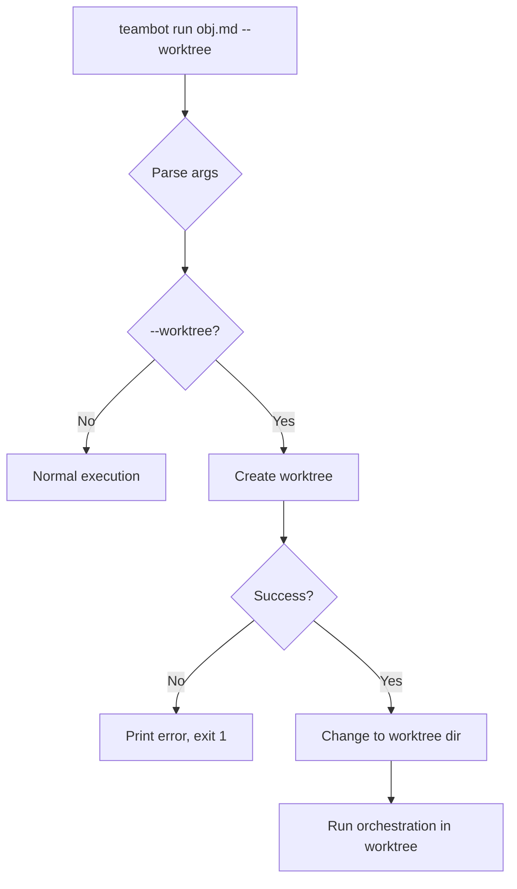
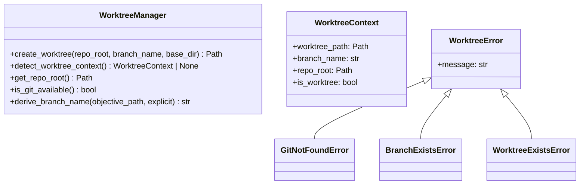
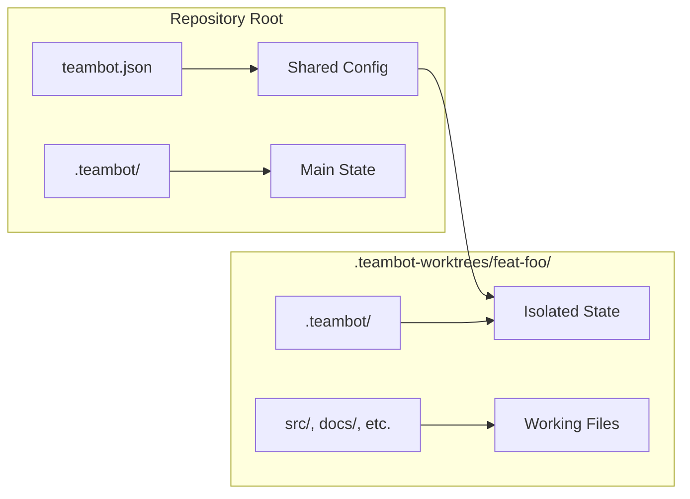

<!-- markdownlint-disable-file -->
# Task Research Document: Git Worktree Isolation for TeamBot

Add a `--worktree` flag to `teambot run` that automatically creates a Git worktree for the objective, runs the entire workflow within that worktree, and leaves the user's main working directory untouched. This enables autonomous multi-feature development where Feature B can start while Feature A is still in review.

## Task Implementation Requests

* Add `--worktree` flag to `teambot run` CLI argument parser
* Add optional `--branch <name>` flag for explicit branch naming
* Create `src/teambot/worktree/` module for Git worktree operations
* Implement worktree creation at `.teambot-worktrees/<branch-name>/`
* Derive branch name from objective filename (e.g., `objective-foo.md` → `feat/foo`)
* Scope `.teambot/` state files to the worktree directory
* Add worktree indicator to REPL prompt and status panel
* Add worktree context to file-based orchestration stage output headers
* Handle error cases: Git not available, worktree creation fails, branch exists
* Ensure `--resume` works within worktree context
* Maintain backward compatibility: running without `--worktree` behaves exactly as today
* Update CLI help and documentation

## Scope and Success Criteria

* Scope: Implementation of `--worktree` flag for `teambot run` command with full isolation of state files and visual indicators
* Exclusions: Multi-worktree orchestration, automatic merge/cleanup, PR creation
* Assumptions:
  1. User has Git installed and is in a Git repository
  2. User has write permissions to create `.teambot-worktrees/` directory
  3. Subprocess calls to Git CLI are acceptable (no GitPython dependency needed)
* Success Criteria:
  * `teambot run objectives/foo.md --worktree` creates worktree, feature branch, and runs objective there
  * Worktree created at `.teambot-worktrees/<branch-name>/` relative to repository root
  * Branch name derived from objective filename by default, overridable with `--branch`
  * State files scoped to worktree (no cross-contamination)
  * Clear error messages for all failure scenarios
  * Interactive REPL shows `[worktree: feat/...]` indicator
  * File-based orchestration stage output includes worktree context
  * All existing tests pass; new tests cover worktree functionality

## Outline

1. Entry Point Analysis
2. Research Executed
   - CLI Implementation Patterns
   - Git Worktree Subprocess Patterns
   - State File Scoping
   - UI Indicator Patterns
   - Testing Infrastructure
3. Key Discoveries
4. Technical Scenarios
   - Scenario 1: CLI Flag Implementation
   - Scenario 2: Worktree Module Design
   - Scenario 3: State File Isolation
   - Scenario 4: UI Indicators
   - Scenario 5: Error Handling
   - Scenario 6: Resume Behavior

### Potential Next Research

* Windows 260-character path length validation
  * **Reasoning**: Nested `.teambot-worktrees/<branch>/.teambot/<feature>/` paths could exceed limits
  * **Reference**: Objective constraints mention Windows validation requirement
* GitPython vs subprocess performance comparison
  * **Reasoning**: May be useful for future enhancements if complex Git operations needed
  * **Reference**: pyproject.toml shows no GitPython dependency currently

## Research Executed

### Testing Infrastructure Research

* **Framework**: pytest 7.4.0+ with pytest-asyncio, pytest-mock, pytest-cov
  * Location: `tests/` directory (mirrors `src/teambot/` structure)
  * Naming: `test_*.py` files, `Test*` classes, `test_*` functions
  * Runner: `uv run pytest` (from pyproject.toml)
  * Coverage: `--cov=src/teambot --cov-report=term-missing`
  * Markers: `acceptance` (excluded by default), `slow`

### Test Patterns Found

* **File**: `tests/test_cli.py` (Lines 1-100)
  * Uses `create_parser()` to test argument parsing
  * Uses `tmp_path` fixture for temporary directories
  * Uses `monkeypatch.chdir()` to change working directory
  * Tests command functions directly with `argparse.Namespace`
  * Creates mock `ConsoleDisplay` for output verification

* **File**: `tests/test_orchestration/conftest.py` (Lines 1-127)
  * Defines `objective_file`, `teambot_dir`, `teambot_dir_with_spec` fixtures
  * Uses `tmp_path` for isolation
  * Creates feature-specific subdirectories matching objective structure
  * Uses `AsyncMock` for SDK client mocking

* **File**: `tests/test_orchestration/test_execution_loop.py` (Lines 1-100)
  * Tests `ExecutionLoop` initialization and run behavior
  * Uses fixtures from `conftest.py`
  * Tests progress callback invocation
  * Tests cancellation and timeout scenarios

### Coverage Standards

* **Unit Tests**: 80% overall (per AGENTS.md)
* **Critical Paths**: High coverage for CLI entry points
* **Acceptance Tests**: Marked with `@pytest.mark.acceptance`, excluded by default

### Testing Approach Recommendation

* **CLI Flag Parsing**: Code-First (simple argparse additions)
* **Worktree Module**: TDD (critical Git operations, error handling)
* **State Isolation**: TDD (correctness critical)
* **UI Indicators**: Code-First (visual-only changes)
* **Integration/E2E**: One acceptance test with real Git repo in temp directory

**Rationale**: Core Git worktree operations are critical for correctness and have multiple error paths, making TDD appropriate. CLI parsing and UI are lower risk and can use code-first approach.

### File Analysis

* `src/teambot/cli.py`
  * Lines 362-401: `create_parser()` defines CLI arguments using argparse
  * Lines 381-396: `run` subparser with `objective`, `--config`, `--resume`, `--max-hours`, `--log-to-console`
  * Lines 572-663: `cmd_run()` main entry point for run command
  * Lines 690-801: `_run_orchestration()` for file-based mode
  * Lines 828-934: `_run_orchestration_resume()` for resume mode
  * Lines 740-778: `on_progress()` callback handles `stage_changed` events

* `src/teambot/orchestration/execution_loop.py`
  * Lines 88-134: `ExecutionLoop.__init__()` sets up `teambot_dir` based on feature name
  * Lines 103-108: Creates feature-specific subdirectory `teambot_dir / feature_name`
  * Lines 135-267: `run()` method executes workflow stages
  * Lines 1073-1140: `resume()` class method for resuming from state file

* `src/teambot/orchestration/objective_parser.py`
  * Lines 30-64: `feature_name` property derives name from title/filename
  * Lines 302-337: `_derive_feature_name()` converts title to short dash-separated name

* `src/teambot/repl/loop.py`
  * Lines 360-382: `_prompt_user()` uses Rich `Prompt.ask()` with `[bold green]teambot[/bold green]`
  * Lines 397-420: `run_interactive_mode()` entry point

* `src/teambot/ui/widgets/status_panel.py`
  * Lines 82-99: `_get_git_branch()` runs `git rev-parse --abbrev-ref HEAD`
  * Lines 101-154: `_format_status()` displays branch in header
  * Lines 109-115: Branch display format `[dim]Branch:[/dim] [white]{branch}[/white]`

* `src/teambot/window_manager.py`
  * Lines 1-100: Cross-platform subprocess patterns using `platform.system()`
  * Lines 72-84: Windows subprocess with `CREATE_NEW_CONSOLE`
  * Lines 86-100: macOS subprocess with AppleScript
  * Lines 104-139: Linux subprocess with terminal emulator detection

### Code Search Results

* `subprocess` usage:
  * `src/teambot/window_manager.py` - cross-platform process spawning
  * `src/teambot/ui/widgets/status_panel.py` - git branch detection

* `argparse` / `add_argument`:
  * `src/teambot/cli.py:362-401` - all CLI argument definitions

* `.teambot` / `teambot_dir`:
  * `src/teambot/cli.py:575` - `teambot_dir = Path(".teambot")`
  * `src/teambot/orchestration/execution_loop.py:92-105` - creates feature subdirectory

* `branch` / `git`:
  * `src/teambot/ui/widgets/status_panel.py:82-99` - branch name retrieval

### External Research (Evidence Log)

* Git worktree documentation: `git worktree --help`
  * Key commands:
    * `git worktree add [-b <new-branch>] <path> [<commit-ish>]` - creates worktree
    * `git worktree list` - lists existing worktrees
    * `git worktree remove <worktree>` - removes worktree
  * Behavior: Creates a new working tree with separate index, allowing parallel branch development
  * Error cases:
    * Branch already exists: `fatal: a branch named 'feat/test' already exists`
    * Path already exists: `fatal: '<path>' already exists`
  * Source: Git manual (`git worktree --help`)

* Git worktree subprocess pattern:
  ```python
  subprocess.run(
      ["git", "worktree", "add", "-b", branch_name, worktree_path],
      capture_output=True,
      text=True,
      check=True,  # Raises CalledProcessError on failure
  )
  ```

### Project Conventions

* Standards referenced:
  * AGENTS.md - Project structure, test patterns, clean commits
  * pyproject.toml - Dependencies (no GitPython), pytest configuration
* Instructions followed:
  * Subprocess calls to Git CLI preferred over adding GitPython
  * Use `uv run ruff format .` and `uv run ruff check . --fix` before commits
  * 80% test coverage target

## Key Discoveries

### Project Structure

```
src/teambot/
├── cli.py                    # 🔧 Modify: add --worktree, --branch flags
├── worktree/                 # ✨ NEW: worktree management module
│   ├── __init__.py
│   ├── manager.py            # WorktreeManager class
│   └── errors.py             # WorktreeError exceptions
├── orchestration/
│   └── execution_loop.py     # 🔧 Modify: support worktree context
├── repl/
│   └── loop.py               # 🔧 Modify: worktree prompt indicator
└── ui/widgets/
    └── status_panel.py       # ℹ️ Already shows branch (auto-works)
```

### Implementation Patterns

**CLI Argument Pattern** (from `cli.py`):
```python
run_parser.add_argument(
    "--worktree",
    action="store_true",
    help="Run in isolated Git worktree with feature branch",
)
run_parser.add_argument(
    "--branch",
    type=str,
    default=None,
    help="Branch name for worktree (default: derived from objective)",
)
```

**Subprocess Pattern** (from `window_manager.py`):
```python
result = subprocess.run(
    ["git", "rev-parse", "--abbrev-ref", "HEAD"],
    capture_output=True,
    text=True,
    timeout=2,
)
if result.returncode == 0:
    return result.stdout.strip()
```

**Error Display Pattern** (from `cli.py`):
```python
display.print_error(f"Configuration not found: {config_path}")
display.print_warning("Run 'teambot init' first")
return 1
```

### Complete Examples

**Branch Name Derivation** (based on `objective_parser.py`):
```python
def derive_branch_name(objective_path: Path, explicit_branch: str | None = None) -> str:
    """Derive branch name from objective file.
    
    Priority:
    1. Explicit --branch argument
    2. Derived from objective filename
    
    Examples:
        objective-foo.md → feat/foo
        sdd-objective-auth.md → feat/auth
        my-feature.md → feat/my-feature
    """
    if explicit_branch:
        return explicit_branch
    
    filename = objective_path.stem.lower()
    # Remove common prefixes
    filename = re.sub(r"^(sdd-)?objective-?", "", filename)
    if not filename:
        filename = "feature"
    return f"feat/{filename}"
```

**Worktree Creation** (new code):
```python
def create_worktree(
    repo_root: Path,
    branch_name: str,
    worktree_base: str = ".teambot-worktrees",
) -> Path:
    """Create Git worktree for isolated development.
    
    Args:
        repo_root: Repository root directory
        branch_name: Name of branch to create (e.g., "feat/foo")
        worktree_base: Base directory for worktrees
    
    Returns:
        Path to the created worktree
    
    Raises:
        WorktreeError: If worktree creation fails
    """
    # Sanitize branch name for directory (feat/foo → feat-foo)
    dir_name = branch_name.replace("/", "-")
    worktree_path = repo_root / worktree_base / dir_name
    
    if worktree_path.exists():
        raise WorktreeError(f"Worktree path already exists: {worktree_path}")
    
    result = subprocess.run(
        ["git", "worktree", "add", "-b", branch_name, str(worktree_path)],
        capture_output=True,
        text=True,
        cwd=repo_root,
    )
    
    if result.returncode != 0:
        if "already exists" in result.stderr:
            raise WorktreeError(f"Branch '{branch_name}' already exists")
        raise WorktreeError(f"Failed to create worktree: {result.stderr}")
    
    return worktree_path
```

### API and Schema Documentation

**Git Worktree Commands**:
| Command | Description |
|---------|-------------|
| `git worktree add -b <branch> <path>` | Create worktree with new branch |
| `git worktree add <path> <branch>` | Create worktree from existing branch |
| `git worktree list` | List all worktrees |
| `git worktree remove <path>` | Remove worktree |
| `git rev-parse --show-toplevel` | Get repository root |
| `git rev-parse --abbrev-ref HEAD` | Get current branch name |

**Exit Codes**:
| Code | Meaning |
|------|---------|
| 0 | Success |
| 1 | General error |
| 128 | Git error (branch exists, path exists, etc.) |
| 130 | Interrupted (Ctrl+C) |

### Configuration Examples

**Extended CLI Usage**:
```bash
# Basic worktree mode
teambot run objectives/auth.md --worktree

# With explicit branch name
teambot run objectives/auth.md --worktree --branch feat/oauth2-support

# Resume in worktree
cd .teambot-worktrees/feat-auth
teambot run --resume
```

## Entry Point Analysis

### User Input Entry Points

| Entry Point | Code Path | Reaches Feature? | Implementation Required? |
|-------------|-----------|------------------|-------------------------|
| `teambot run obj.md --worktree` | cli.py:cmd_run() → _run_orchestration() | YES | YES - main flow |
| `teambot run --resume` (from worktree) | cli.py:cmd_run() → _run_orchestration_resume() | YES | YES - detect worktree context |
| `teambot run` (interactive, no objective) | cli.py:cmd_run() → run_interactive_mode() | PARTIAL | YES - indicator only |

### Code Path Trace

#### Entry Point 1: File-Based Orchestration with --worktree
1. User enters: `teambot run objectives/foo.md --worktree`
2. Handled by: `cli.py:main()` → `cli.py:cmd_run()` (Lines 572-663)
3. **NEW**: Check `args.worktree`, create worktree, change to worktree dir
4. Routes to: `cli.py:_run_orchestration()` (Lines 690-801)
5. Creates: `ExecutionLoop` with `teambot_dir` in worktree
6. Reaches: Feature implementation ✅

#### Entry Point 2: Resume from Worktree Directory
1. User enters: `cd .teambot-worktrees/feat-foo && teambot run --resume`
2. Handled by: `cli.py:cmd_run()` (Lines 572-663)
3. **NEW**: Detect if CWD is a worktree, set indicator context
4. Routes to: `cli.py:_run_orchestration_resume()` (Lines 828-934)
5. Uses: `ExecutionLoop.resume()` (Lines 1073-1140)
6. Reaches: Resume with worktree context ✅

#### Entry Point 3: Interactive Mode in Worktree
1. User enters: `cd .teambot-worktrees/feat-foo && teambot run`
2. Handled by: `cli.py:cmd_run()` → `run_interactive_mode()` (Lines 654-663)
3. Routes to: `repl/loop.py:REPLLoop` (Lines 30-395)
4. **NEW**: Pass worktree context for prompt indicator
5. Reaches: Interactive mode with indicator ✅

### Coverage Gaps

| Gap | Impact | Required Fix |
|-----|--------|--------------|
| Worktree detection in CWD | Resume/interactive won't show indicators | Add `detect_worktree_context()` helper |
| Config path in worktree | May look for teambot.json in wrong place | Use repo root for config, worktree for state |

### Implementation Scope Verification

- [x] All entry points from acceptance test scenarios are traced
- [x] All code paths that should trigger feature are identified
- [x] Coverage gaps are documented with required fixes

## Technical Scenarios

### 1. CLI Flag Implementation

Add `--worktree` and `--branch` flags to the `run` subparser with proper validation.

**Requirements:**
* Add `--worktree` boolean flag
* Add `--branch` optional string argument
* `--branch` without `--worktree` should be ignored or error
* Parse arguments before any side effects

**Preferred Approach:**
* Add flags directly to existing `run_parser` in `create_parser()`
* Validate flag combinations in `cmd_run()` before any operations
* Keep backward compatibility: without flags, behavior unchanged

```text
src/teambot/cli.py  # Modify create_parser() and cmd_run()
```



**Implementation Details:**

```python
# In create_parser(), after existing run_parser arguments (Lines 392-396):
run_parser.add_argument(
    "--worktree",
    action="store_true",
    help="Run in isolated Git worktree with feature branch",
)
run_parser.add_argument(
    "--branch",
    type=str,
    default=None,
    metavar="NAME",
    help="Branch name for worktree (default: feat/<objective-name>)",
)
```

#### Considered Alternatives (Removed After Selection)

**Alternative: Separate `teambot worktree` subcommand** - Would require users to run two commands; the `--worktree` flag is simpler and more intuitive for the primary use case.

---

### 2. Worktree Module Design

Create a dedicated module for Git worktree operations with proper error handling.

**Requirements:**
* Create `src/teambot/worktree/` module
* Implement `WorktreeManager` class with create/detect/validate methods
* Define `WorktreeError` exception hierarchy
* Use subprocess calls to Git CLI

**Preferred Approach:**
* Single `WorktreeManager` class with static/class methods
* Separate `errors.py` for exception definitions
* Validate Git availability on first use

```text
src/teambot/
└── worktree/              # NEW module
    ├── __init__.py        # Exports WorktreeManager, WorktreeError
    ├── manager.py         # WorktreeManager class
    └── errors.py          # WorktreeError, GitNotFoundError, BranchExistsError
```



**Implementation Details:**

```python
# src/teambot/worktree/errors.py
class WorktreeError(Exception):
    """Base exception for worktree operations."""
    pass

class GitNotFoundError(WorktreeError):
    """Git CLI not available."""
    pass

class BranchExistsError(WorktreeError):
    """Branch already exists."""
    pass

class WorktreeExistsError(WorktreeError):
    """Worktree path already exists."""
    pass
```

```python
# src/teambot/worktree/manager.py
import re
import shutil
import subprocess
from dataclasses import dataclass
from pathlib import Path

from teambot.worktree.errors import (
    BranchExistsError,
    GitNotFoundError,
    WorktreeError,
    WorktreeExistsError,
)

WORKTREE_BASE_DIR = ".teambot-worktrees"

@dataclass
class WorktreeContext:
    """Context for worktree execution."""
    worktree_path: Path
    branch_name: str
    repo_root: Path
    is_worktree: bool = True


class WorktreeManager:
    """Manages Git worktree operations."""
    
    @staticmethod
    def is_git_available() -> bool:
        """Check if Git CLI is available."""
        return shutil.which("git") is not None
    
    @staticmethod
    def get_repo_root() -> Path | None:
        """Get the Git repository root, or None if not in a repo."""
        try:
            result = subprocess.run(
                ["git", "rev-parse", "--show-toplevel"],
                capture_output=True,
                text=True,
                timeout=5,
            )
            if result.returncode == 0:
                return Path(result.stdout.strip())
        except (subprocess.TimeoutExpired, FileNotFoundError):
            pass
        return None
    
    @staticmethod
    def derive_branch_name(objective_path: Path, explicit_branch: str | None = None) -> str:
        """Derive branch name from objective file."""
        if explicit_branch:
            # Ensure it has feat/ prefix if not already prefixed
            if "/" not in explicit_branch:
                return f"feat/{explicit_branch}"
            return explicit_branch
        
        filename = objective_path.stem.lower()
        # Remove common prefixes
        filename = re.sub(r"^(sdd-)?objective-?", "", filename)
        if not filename:
            filename = "feature"
        return f"feat/{filename}"
    
    @classmethod
    def create_worktree(
        cls,
        repo_root: Path,
        branch_name: str,
        base_dir: str = WORKTREE_BASE_DIR,
    ) -> WorktreeContext:
        """Create a Git worktree with a new branch."""
        if not cls.is_git_available():
            raise GitNotFoundError("Git CLI not found. Install Git to use --worktree.")
        
        # Sanitize branch name for directory (feat/foo → feat-foo)
        dir_name = branch_name.replace("/", "-")
        worktree_path = repo_root / base_dir / dir_name
        
        if worktree_path.exists():
            raise WorktreeExistsError(
                f"Worktree path already exists: {worktree_path}\n"
                f"Remove it or use a different --branch name."
            )
        
        # Ensure base directory exists
        (repo_root / base_dir).mkdir(exist_ok=True)
        
        result = subprocess.run(
            ["git", "worktree", "add", "-b", branch_name, str(worktree_path)],
            capture_output=True,
            text=True,
            cwd=repo_root,
        )
        
        if result.returncode != 0:
            stderr = result.stderr.strip()
            if "already exists" in stderr:
                raise BranchExistsError(
                    f"Branch '{branch_name}' already exists.\n"
                    f"Use --branch to specify a different name."
                )
            raise WorktreeError(f"Failed to create worktree: {stderr}")
        
        return WorktreeContext(
            worktree_path=worktree_path,
            branch_name=branch_name,
            repo_root=repo_root,
        )
    
    @classmethod
    def detect_worktree_context(cls) -> WorktreeContext | None:
        """Detect if currently running in a worktree.
        
        Returns WorktreeContext if in a worktree, None otherwise.
        """
        try:
            # Check if we're in a worktree (not the main working tree)
            result = subprocess.run(
                ["git", "rev-parse", "--is-inside-work-tree"],
                capture_output=True,
                text=True,
                timeout=5,
            )
            if result.returncode != 0:
                return None
            
            # Get the git dir and common dir to detect worktree
            git_dir_result = subprocess.run(
                ["git", "rev-parse", "--git-dir"],
                capture_output=True,
                text=True,
                timeout=5,
            )
            common_dir_result = subprocess.run(
                ["git", "rev-parse", "--git-common-dir"],
                capture_output=True,
                text=True,
                timeout=5,
            )
            
            if git_dir_result.returncode != 0 or common_dir_result.returncode != 0:
                return None
            
            git_dir = Path(git_dir_result.stdout.strip()).resolve()
            common_dir = Path(common_dir_result.stdout.strip()).resolve()
            
            # If git-dir != common-dir, we're in a worktree
            if git_dir != common_dir:
                # Get branch name
                branch_result = subprocess.run(
                    ["git", "rev-parse", "--abbrev-ref", "HEAD"],
                    capture_output=True,
                    text=True,
                    timeout=5,
                )
                branch_name = branch_result.stdout.strip() if branch_result.returncode == 0 else "unknown"
                
                # Get worktree root
                toplevel_result = subprocess.run(
                    ["git", "rev-parse", "--show-toplevel"],
                    capture_output=True,
                    text=True,
                    timeout=5,
                )
                worktree_path = Path(toplevel_result.stdout.strip()) if toplevel_result.returncode == 0 else Path.cwd()
                
                return WorktreeContext(
                    worktree_path=worktree_path,
                    branch_name=branch_name,
                    repo_root=common_dir.parent,  # Common dir is usually .git in repo root
                    is_worktree=True,
                )
        except (subprocess.TimeoutExpired, FileNotFoundError):
            pass
        
        return None
```

---

### 3. State File Isolation

Ensure `.teambot/` state files are scoped to the worktree directory, not the main repository.

**Requirements:**
* State files created in worktree's `.teambot/` directory
* Config file (`teambot.json`) read from repository root (shared)
* History files scoped to worktree
* Resume finds state in current worktree

**Preferred Approach:**
* When in worktree mode, `teambot_dir` is set to `worktree_path / ".teambot"`
* Config is read from repo root (passed from original working directory)
* ExecutionLoop already handles this via `teambot_dir` parameter



**Implementation Details:**

In `cmd_run()`, when `--worktree` is set:
```python
# Before creating ExecutionLoop
if args.worktree:
    # Create worktree and change directory
    context = WorktreeManager.create_worktree(repo_root, branch_name)
    os.chdir(context.worktree_path)
    display.print_success(f"Created worktree: {context.worktree_path}")
    display.print_success(f"Branch: {context.branch_name}")
    
    # teambot_dir now relative to worktree
    teambot_dir = Path(".teambot")
```

---

### 4. UI Indicators

Add visual indicators for worktree mode in both REPL and file-based orchestration.

**Requirements:**
* REPL prompt shows `[worktree: feat/...]` when in worktree
* File-based stage output includes worktree context
* Status panel already shows branch (no changes needed)

**Preferred Approach:**
* Pass `WorktreeContext` to REPL loop for prompt customization
* Modify `on_progress` callback to include worktree info in stage output
* Status panel's existing branch display works automatically

```text
src/teambot/repl/loop.py      # Modify prompt format
src/teambot/cli.py            # Modify on_progress callback
```

**Implementation Details:**

**REPL Prompt Modification** (`repl/loop.py`):
```python
class REPLLoop:
    def __init__(
        self,
        console: Console | None = None,
        sdk_client: CopilotSDKClient | None = None,
        config: dict | None = None,
        worktree_context: WorktreeContext | None = None,  # NEW
    ):
        # ...
        self._worktree_context = worktree_context
    
    async def _prompt_user(self) -> str | None:
        # Build prompt with worktree indicator
        if self._worktree_context:
            branch = self._worktree_context.branch_name
            if len(branch) > 20:
                branch = branch[:17] + "..."
            prompt = f"[bold cyan][wt:{branch}][/bold cyan] [bold green]teambot[/bold green]"
        else:
            prompt = "[bold green]teambot[/bold green]"
        
        loop = asyncio.get_running_loop()
        line = await loop.run_in_executor(
            None, lambda: Prompt.ask(prompt)
        )
        # ...
```

**File-Based Stage Output** (`cli.py`):
```python
def _run_orchestration(..., worktree_context: WorktreeContext | None = None):
    # ...
    def on_progress(event_type: str, data: dict) -> None:
        if event_type == "stage_changed":
            stage = data.get("stage", "unknown")
            if worktree_context:
                display.print_success(f"Stage: {stage} [worktree: {worktree_context.branch_name}]")
            else:
                display.print_success(f"Stage: {stage}")
        # ...
```

---

### 5. Error Handling

Comprehensive error handling for all failure scenarios.

**Requirements:**
* Git not available → clear error message
* Not in a Git repository → clear error message
* Branch already exists → clear error with suggestion
* Worktree path already exists → clear error with suggestion
* Uncommitted changes warning (optional, non-blocking)

**Preferred Approach:**
* Check Git availability early in `cmd_run()` when `--worktree` is set
* Use custom exception hierarchy for specific error messages
* Follow existing error display patterns (`display.print_error()`, `display.print_warning()`)

**Implementation Details:**

```python
# In cmd_run(), early validation:
if getattr(args, "worktree", False):
    from teambot.worktree import WorktreeManager
    from teambot.worktree.errors import (
        BranchExistsError,
        GitNotFoundError,
        WorktreeError,
        WorktreeExistsError,
    )
    
    if not WorktreeManager.is_git_available():
        display.print_error("Git is required for --worktree mode but was not found")
        display.print_warning("Install Git from: https://git-scm.com/")
        return 1
    
    repo_root = WorktreeManager.get_repo_root()
    if repo_root is None:
        display.print_error("Not in a Git repository")
        display.print_warning("Initialize a Git repository or run without --worktree")
        return 1
    
    # Derive branch name
    branch_name = WorktreeManager.derive_branch_name(
        objective_path,
        getattr(args, "branch", None),
    )
    
    try:
        context = WorktreeManager.create_worktree(repo_root, branch_name)
        display.print_success(f"Created worktree: {context.worktree_path}")
        display.print_success(f"Branch: {context.branch_name}")
        os.chdir(context.worktree_path)
    except BranchExistsError as e:
        display.print_error(str(e))
        return 1
    except WorktreeExistsError as e:
        display.print_error(str(e))
        return 1
    except WorktreeError as e:
        display.print_error(f"Worktree creation failed: {e}")
        return 1
```

---

### 6. Resume Behavior

Ensure `teambot run --resume` works correctly within a worktree context.

**Requirements:**
* Resume from worktree directory finds state files
* Resume preserves worktree context for UI indicators
* Original config location (repo root) is used

**Preferred Approach:**
* Detect worktree context at start of `cmd_run()`
* Pass context through to `_run_orchestration_resume()`
* State files are already in worktree's `.teambot/` from previous run

**Implementation Details:**

```python
def cmd_run(args: argparse.Namespace, display: ConsoleDisplay) -> int:
    # Detect worktree context early
    worktree_context = None
    try:
        from teambot.worktree import WorktreeManager
        worktree_context = WorktreeManager.detect_worktree_context()
    except ImportError:
        pass  # Module not yet available
    
    # ... existing config loading ...
    
    # Resume mode
    if getattr(args, "resume", False):
        return _run_orchestration_resume(
            config,
            teambot_dir,
            display,
            no_animation=getattr(args, "no_animation", False),
            worktree_context=worktree_context,  # NEW parameter
        )
```
