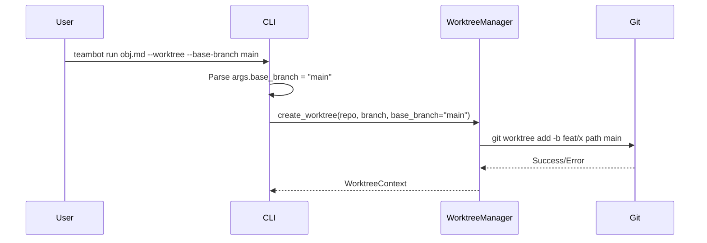
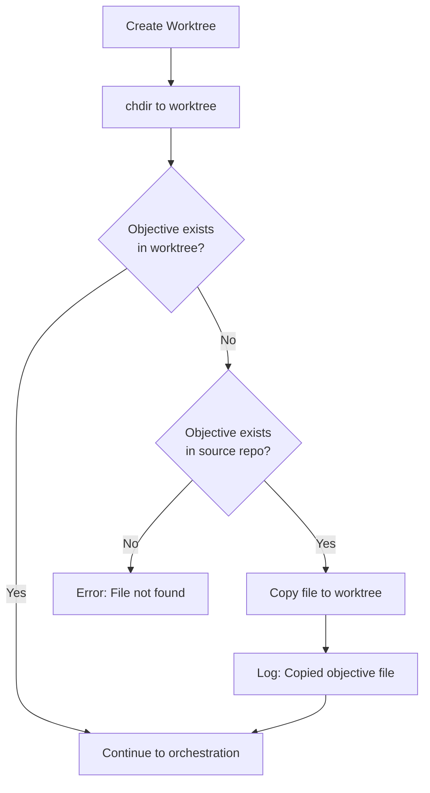

<!-- markdownlint-disable-file -->
# Task Research Document: Worktree Workflow Enhancement

Enhance the `--worktree` option to support objectives that exist only in the source repository (staged or committed) and allow branching from a specified base branch. When using `teambot run <objective> --worktree`, if the objective file exists only in the source repo (staged or uncommitted), it should be automatically copied to the newly created worktree. Additionally, a new `--base-branch` option allows users to specify which branch to base the worktree on.

## Task Implementation Requests

* **Task 1**: Add `--base-branch` CLI option to specify the base branch for worktree creation
* **Task 2**: Update `WorktreeManager.create_worktree()` to accept `base_branch` parameter
* **Task 3**: Implement objective file copying when file doesn't exist in worktree but exists in source
* **Task 4**: Add clear logging/output when objective file is copied to worktree
* **Task 5**: Handle edge cases: parent directory creation, file source precedence, error messages
* **Task 6**: Write TDD unit tests for all new functionality (80%+ coverage)
* **Task 7**: Write acceptance tests for end-to-end workflow validation

## Scope and Success Criteria

* **Scope**: 
  * IN: CLI argument parsing (`--base-branch`), `WorktreeManager.create_worktree()` modification, objective file copying logic in `cmd_run()`, error handling, unit tests, acceptance tests
  * OUT: Changes to other commands, REPL modifications, notification changes
* **Assumptions**:
  1. The objective file path provided is relative to repository root
  2. Git is available and version 2.5+ (existing validation)
  3. Windows 260-character path limit validation remains in place
  4. Working directory file takes precedence over staged/committed versions
* **Success Criteria**:
  * ✅ `--base-branch` option available and functional
  * ✅ Objective file auto-copied when missing in worktree but present in source
  * ✅ Clear log message when file is copied
  * ✅ Backward compatibility maintained (existing workflows unchanged)
  * ✅ 80%+ unit test coverage for new code
  * ✅ Acceptance tests validate end-to-end workflow

## Outline

1. Entry Point Analysis
2. Research Executed (Testing Infrastructure, File Analysis, Code Patterns)
3. Key Discoveries (Project Structure, Implementation Patterns, Examples)
4. Technical Scenarios (Base Branch Support, Objective File Copying)
5. Testing Strategy

### Potential Next Research

* Git worktree behavior with uncommitted changes
  * **Reasoning**: Verify how `git worktree add` handles uncommitted changes in source repo
  * **Reference**: Edge case #2 in objective spec

---

## Entry Point Analysis

### User Input Entry Points

| Entry Point | Code Path | Reaches Feature? | Implementation Required? |
|-------------|-----------|------------------|-------------------------|
| `teambot run obj.md --worktree` | cli.py:cmd_run() → worktree mode block (L599-657) | YES | YES - add base-branch handling, file copying |
| `teambot run obj.md --worktree --branch feat/x` | cli.py:cmd_run() → derive_branch_name() → create_worktree() | YES | YES - pass base_branch to create_worktree() |
| `teambot run obj.md --worktree --base-branch main` | cli.py:cmd_run() → create_worktree() | NO (new) | YES - add CLI argument, modify git command |
| `teambot run obj.md` (no --worktree) | cli.py:cmd_run() → standard flow (L668+) | NO | NO - unchanged |
| Interactive mode (no objective) | cli.py:cmd_run() → run_interactive_mode() | NO | NO - unchanged |
| Resume mode `--resume` | cli.py:cmd_run() → _run_orchestration_resume() | Partial | NO - worktree detection only |

### Code Path Trace

#### Entry Point 1: `teambot run obj.md --worktree`

1. User runs: `teambot run objectives/my-task.md --worktree`
2. Handled by: `cli.py:cmd_run()` (L584)
3. Fast-fail config check: L592-596
4. **Worktree mode block**: L598-657
   - Validates objective provided (L600-604)
   - Imports WorktreeManager (L606-611)
   - Validates Git available (L613-617)
   - Gets repo_root (L620-624)
   - **Validates objective exists in source** (L627-630) ⚠️ **CURRENT FAILURE POINT**
   - Derives branch name (L632)
   - Creates worktree (L635-636)
   - Changes directory (L641)
5. Continues to objective loading (L706-711)
6. **Objective file check happens again** (L708) ⚠️ **SECOND FAILURE POINT** (now in worktree context)

#### Entry Point 2: `teambot run obj.md --worktree --base-branch main` (NEW)

1. User runs: `teambot run obj.md --worktree --base-branch main`
2. CLI parser extracts `args.base_branch = "main"` (NEW)
3. Passes to `WorktreeManager.create_worktree(repo_root, branch_name, base_branch="main")` (MODIFIED)
4. Git command becomes: `git worktree add -b <new-branch> <path> main` (MODIFIED)

### Coverage Gaps

| Gap | Impact | Required Fix |
|-----|--------|--------------|
| `--base-branch` CLI arg missing | Cannot specify base branch | Add argparse argument (L402-408) |
| `create_worktree()` ignores base_branch | Always branches from HEAD | Modify signature and git command (manager.py L156-216) |
| Objective file not copied | Fails when file only in source | Add copy logic after create_worktree() (cli.py ~L642) |
| No log message for copy | User unaware of auto-copy | Add display.print_success() after copy |

### Implementation Scope Verification

- [x] All entry points from acceptance test scenarios are traced
- [x] All code paths that should trigger feature are identified  
- [x] Coverage gaps are documented with required fixes

---

## Research Executed

### Testing Infrastructure Research

* **Framework**: pytest 7.4.0+ with pytest-cov, pytest-mock, pytest-asyncio
  * Location: `tests/` directory mirroring `src/teambot/` structure
  * Naming: `test_*.py` files, `Test*` classes, `test_*` functions
  * Runner: `uv run pytest` (from pyproject.toml L37)
  * Coverage: pytest-cov with 80% target, default addopts excludes acceptance tests (L58)

### Test Patterns Found

* **File**: `tests/test_worktree/test_manager.py` (Lines 1-220)
  * Uses pytest fixtures for mocking (`mocker`, `mock_git_version_check`)
  * Mocks `subprocess.run` for Git commands
  * Mocks `shutil.which` for Git availability
  * Clear arrange-act-assert structure
  * Tests exception types and messages

* **File**: `tests/test_worktree_acceptance.py` (Lines 1-243)
  * Uses `temp_git_repo` fixture (real Git operations in tmp_path)
  * Creates actual Git commits for testing
  * Validates Git worktree list output
  * Uses `monkeypatch.chdir()` for directory changes

* **File**: `tests/test_worktree/conftest.py` (Lines 1-43)
  * Provides `mock_git_subprocess`, `mock_shutil_which`, `mock_git_version_check` fixtures
  * `worktree_context` fixture with test data

### Coverage Standards

* **Unit Tests**: 80% minimum (per AGENTS.md and pyproject.toml)
* **Integration Tests**: 70% minimum
* **Critical Paths**: 100% for error handling

### Testing Approach Recommendation

* **CLI argument parsing (`--base-branch`)**: Code-First (straightforward argparse addition)
* **`create_worktree()` modification**: TDD (critical path, clear requirements)
* **Objective file copying logic**: TDD (complex edge cases, error handling)
* **Acceptance tests**: Code-First (validate after implementation)

**Rationale**: The objective spec explicitly requests TDD. Core logic (file copying, branch handling) has well-defined requirements making TDD appropriate. Argument parsing is simple enough for code-first.

---

### File Analysis

* **`src/teambot/cli.py`** (Lines 584-757)
  * `cmd_run()` main entry point (L584)
  * Worktree mode handling (L598-657)
  * Current objective check in source repo (L627-630)
  * Creates worktree via `WorktreeManager.create_worktree()` (L636)
  * Changes to worktree directory (L641)
  * Second objective check after directory change (L706-710)
  * **Gap**: No file copying between checks

* **`src/teambot/worktree/manager.py`** (Lines 156-216)
  * `create_worktree()` method signature (L156-161)
  * Parameters: `repo_root`, `branch_name`, `base_dir`
  * **Missing**: `base_branch` parameter
  * Git command construction (L199-204): `["git", "worktree", "add", "-b", branch_name, str(worktree_path)]`
  * **Gap**: No `<commit-ish>` argument for base branch

* **`src/teambot/scaffolds.py`** (Lines 50-106)
  * File copying pattern with `shutil.copy2()`
  * Directory creation with `mkdir(parents=True, exist_ok=True)`
  * `CopyResult` dataclass for operation status
  * Good pattern to follow for objective file copying

* **`src/teambot/worktree/errors.py`** (Lines 1-63)
  * Custom exception hierarchy: `WorktreeError` base
  * Specific errors: `GitNotFoundError`, `BranchExistsError`, `WorktreeExistsError`, `GitVersionError`, `PathTooLongError`
  * **Gap**: No `BaseBranchNotFoundError` or `ObjectiveFileCopyError`

### Code Search Results

* `argparse.*add_argument.*--branch`
  * `cli.py:402-408` - Existing `--branch` argument for worktree branch name
  
* `WorktreeManager.create_worktree`
  * `src/teambot/worktree/manager.py:156` - Method definition
  * `src/teambot/cli.py:636` - Usage in cmd_run
  
* `shutil.copy2`
  * `src/teambot/scaffolds.py:62` - File copy pattern
  * `src/teambot/scaffolds.py:105` - Directory copy pattern

### External Research (Evidence Log)

* **Git Documentation**: `git worktree add --help`
  * Usage: `git worktree add [-b <new-branch>] <path> [<commit-ish>]`
  * The `<commit-ish>` argument specifies the base branch/commit for the new worktree
  * If omitted, defaults to HEAD
  * Source: Local Git installation, accessed 2026-02-24

* **Git diff staged files**: `git diff --cached --name-only`
  * Lists files staged for commit
  * Can be used to detect if objective file is staged
  * Source: Local Git installation, accessed 2026-02-24

### Project Conventions

* **Standards referenced**: 
  * AGENTS.md - Development workflow, testing requirements
  * pyproject.toml - Test configuration, coverage targets
* **Instructions followed**:
  * TDD testing preference from objective spec
  * Windows path validation (260-char limit)
  * Error handling patterns from existing worktree code

---

## Key Discoveries

### Project Structure

```
src/teambot/
├── cli.py                    # CLI entry point, cmd_run() handles worktree
├── worktree/
│   ├── __init__.py           # Public exports
│   ├── manager.py            # WorktreeManager class, create_worktree()
│   └── errors.py             # Custom exception hierarchy
└── scaffolds.py              # File copying patterns (reference)

tests/
├── test_cli.py               # CLI tests including worktree flags
├── test_worktree/
│   ├── conftest.py           # Fixtures for worktree tests
│   ├── test_manager.py       # Unit tests for WorktreeManager
│   ├── test_validation.py    # Path/version validation tests
│   ├── test_branch_naming.py # Branch name derivation tests
│   └── test_errors.py        # Exception tests
└── test_worktree_acceptance.py # End-to-end acceptance tests
```

### Implementation Patterns

1. **Error Handling**: Custom exceptions inherit from `WorktreeError`, include helpful messages with suggestions (e.g., "Use --branch to specify a different name")

2. **Git Command Execution**: Use `subprocess.run()` with `capture_output=True, text=True`, check `returncode`, parse `stderr` for specific error conditions

3. **Path Validation**: Windows 260-char limit checked via `platform.system()` before operations

4. **File Copying**: Use `shutil.copy2()` for single files, create parent dirs with `mkdir(parents=True, exist_ok=True)`

5. **CLI Arguments**: Use `argparse` with `add_argument()`, optional arguments have `default=None`, boolean flags use `action="store_true"`

### Complete Examples

**Current worktree creation command (manager.py L199-204):**
```python
result = subprocess.run(
    ["git", "worktree", "add", "-b", branch_name, str(worktree_path)],
    capture_output=True,
    text=True,
    cwd=repo_root,
)
```

**Modified command with base_branch:**
```python
cmd = ["git", "worktree", "add", "-b", branch_name, str(worktree_path)]
if base_branch:
    cmd.append(base_branch)
result = subprocess.run(cmd, capture_output=True, text=True, cwd=repo_root)
```

**File copy pattern (from scaffolds.py):**
```python
# Ensure parent directory exists
target_path.parent.mkdir(parents=True, exist_ok=True)
shutil.copy2(source_path, target_path)
```

### API and Schema Documentation

**`WorktreeManager.create_worktree()` - Current Signature:**
```python
@classmethod
def create_worktree(
    cls,
    repo_root: Path,
    branch_name: str,
    base_dir: str = WORKTREE_BASE_DIR,
) -> WorktreeContext:
```

**`WorktreeManager.create_worktree()` - Proposed Signature:**
```python
@classmethod
def create_worktree(
    cls,
    repo_root: Path,
    branch_name: str,
    base_dir: str = WORKTREE_BASE_DIR,
    base_branch: str | None = None,
) -> WorktreeContext:
```

### Configuration Examples

**CLI argument addition (cli.py ~L408):**
```python
run_parser.add_argument(
    "--base-branch",
    type=str,
    default=None,
    metavar="BRANCH",
    help="Branch to base the worktree on (default: current HEAD)",
)
```

---

## Technical Scenarios

### 1. Base Branch Support (`--base-branch`)

Add `--base-branch` CLI option to specify which branch the worktree should be based on, modifying the `git worktree add` command to include the base branch as the `<commit-ish>` argument.

**Requirements:**
* New `--base-branch` CLI argument accepting a branch name string
* Pass `base_branch` parameter to `WorktreeManager.create_worktree()`
* Modify git command to include base branch when provided
* Error handling for non-existent base branch
* Backward compatible: omitting `--base-branch` preserves current behavior (HEAD)

**Preferred Approach:**

The `git worktree add` command supports a `<commit-ish>` argument after the path:
```
git worktree add -b <new-branch> <path> [<commit-ish>]
```

When `--base-branch main` is specified, the command becomes:
```
git worktree add -b feat/my-feature .teambot-worktrees/feat-my-feature main
```

```text
src/teambot/
├── cli.py               # Add --base-branch argument, pass to create_worktree()
└── worktree/
    ├── manager.py       # Add base_branch parameter, modify git command
    └── errors.py        # Add BaseBranchNotFoundError (optional)

tests/
├── test_cli.py          # Test --base-branch parsing
└── test_worktree/
    └── test_manager.py  # Test create_worktree with base_branch
```



**Implementation Details:**

1. **CLI Argument (cli.py ~L408):**
```python
run_parser.add_argument(
    "--base-branch",
    type=str,
    default=None,
    metavar="BRANCH",
    help="Branch to base the worktree on (default: current HEAD)",
)
```

2. **Update create_worktree() signature (manager.py L156-161):**
```python
@classmethod
def create_worktree(
    cls,
    repo_root: Path,
    branch_name: str,
    base_dir: str = WORKTREE_BASE_DIR,
    base_branch: str | None = None,  # NEW
) -> WorktreeContext:
```

3. **Modify git command (manager.py ~L199-204):**
```python
cmd = ["git", "worktree", "add", "-b", branch_name, str(worktree_path)]
if base_branch:
    cmd.append(base_branch)
result = subprocess.run(cmd, capture_output=True, text=True, cwd=repo_root)
```

4. **Pass base_branch from CLI (cli.py ~L636):**
```python
worktree_context = WorktreeManager.create_worktree(
    repo_root, 
    branch_name,
    base_branch=getattr(args, "base_branch", None),
)
```

5. **Error handling for invalid base branch (manager.py):**
```python
if result.returncode != 0:
    stderr = result.stderr.strip()
    if "already exists" in stderr:
        raise BranchExistsError(branch_name)
    if "invalid reference" in stderr or "not a valid ref" in stderr:
        raise WorktreeError(f"Base branch not found: {base_branch}")
    raise WorktreeError(f"Failed to create worktree: {stderr}")
```

#### Considered Alternatives (Removed After Selection)

**Alternative: Separate `--from` flag** - Rejected because Git's own terminology uses `<commit-ish>` and `--base-branch` is clearer for users.

---

### 2. Objective File Auto-Copy

When the objective file doesn't exist in the newly created worktree but exists in the source repository (working directory, staged, or committed), automatically copy it to the worktree and log the action.

**Requirements:**
* Check if objective file exists in worktree after `chdir()`
* If not, check if file exists in source repository (working dir first, then staged)
* Copy file to worktree, creating parent directories as needed
* Log success message: `"[OK] Copied objective file to worktree"`
* Error if file doesn't exist in source either

**Preferred Approach:**

Implement file copying logic in `cmd_run()` after worktree creation and directory change. Use the existing file copying pattern from `scaffolds.py`.

File source precedence:
1. Working directory (original repo): `repo_root / objective_path`
2. Staged version: Not directly accessible without `git show :path` - simplified to working dir only for MVP

```text
src/teambot/
└── cli.py               # Add file copy logic after worktree chdir (L641-657)
```



**Implementation Details:**

1. **File copy logic (cli.py, after L641):**
```python
# After: os.chdir(worktree_context.worktree_path)

# Check if objective exists in worktree
worktree_objective = Path(args.objective)
if not worktree_objective.exists():
    # Check if objective exists in source repo (working directory)
    source_objective = repo_root / args.objective
    if source_objective.exists():
        # Create parent directories if needed
        worktree_objective.parent.mkdir(parents=True, exist_ok=True)
        # Copy file to worktree
        shutil.copy2(source_objective, worktree_objective)
        display.print_success(f"Copied objective file to worktree: {args.objective}")
    else:
        display.print_error(f"Objective file not found: {args.objective}")
        display.print_warning("File must exist in source repository or worktree")
        return 1
```

2. **Add import at top of file:**
```python
import shutil
```

3. **Store repo_root before chdir (around L620):**
```python
# Get repository root (store for later file copying)
repo_root = WorktreeManager.get_repo_root()
```

Note: `repo_root` is already captured at L620 and remains valid after `chdir()`.

4. **Remove redundant objective check (L627-630):**

Current code checks if objective exists before creating worktree:
```python
if not objective_path.exists():
    display.print_error(f"Objective file not found: {objective_path}")
    return 1
```

This should be REMOVED or modified because:
- With the new feature, file only needs to exist in source OR worktree
- The check happens AFTER worktree creation and potential copy

**Updated flow:**
```python
# REMOVE: The pre-worktree objective check at L627-630
# Let the post-chdir logic handle existence checking
```

#### Considered Alternatives (Removed After Selection)

**Alternative: Check staged files with `git diff --cached`** - Rejected for MVP complexity. Working directory check covers the primary use case.

---

## Edge Cases and Error Handling

| Edge Case | Expected Behavior | Implementation |
|-----------|-------------------|----------------|
| Objective exists in worktree already | No copy, proceed normally | Check with `worktree_objective.exists()` |
| Objective only in source working dir | Copy to worktree | `shutil.copy2(source, target)` |
| Objective doesn't exist anywhere | Error with clear message | Return 1 with helpful error |
| Parent directories don't exist | Create them | `mkdir(parents=True, exist_ok=True)` |
| `--base-branch` with non-existent branch | Error with clear message | Parse git stderr for "invalid reference" |
| `--base-branch` with existing worktree | Ignore (only applies at creation) | Check `worktree_path.exists()` before git command |

---

## Test Implementation Plan

### Unit Tests (TDD)

1. **`tests/test_worktree/test_manager.py`** - Add tests for `base_branch` parameter:
   - `test_create_worktree_with_base_branch` - Verify git command includes base branch
   - `test_create_worktree_base_branch_none` - Verify default behavior unchanged
   - `test_create_worktree_invalid_base_branch` - Verify error handling

2. **`tests/test_cli.py`** - Add tests for `--base-branch` argument:
   - `test_parser_base_branch_flag` - Verify argument parsing
   - `test_parser_base_branch_default_none` - Verify default value
   - `test_parser_worktree_with_base_branch` - Verify combined flags

3. **`tests/test_cli.py`** - Add tests for objective file copying:
   - `test_cmd_run_worktree_copies_objective_from_source` - Happy path
   - `test_cmd_run_worktree_no_copy_when_exists` - Skip copy if exists
   - `test_cmd_run_worktree_creates_parent_dirs` - Directory creation
   - `test_cmd_run_worktree_error_when_not_found` - Error case

### Acceptance Tests

4. **`tests/test_worktree_acceptance.py`** - Add acceptance tests:
   - `test_at_011_objective_copied_from_source` - E2E file copy
   - `test_at_012_base_branch_creates_correct_ancestry` - E2E base branch
   - `test_at_013_combined_base_branch_and_file_copy` - Combined scenario

---

## Summary

The worktree workflow enhancement requires changes to:

1. **CLI argument parsing** (`cli.py`): Add `--base-branch` argument
2. **WorktreeManager** (`manager.py`): Add `base_branch` parameter and modify git command
3. **Objective file handling** (`cli.py`): Add copy logic after worktree creation

The implementation follows existing patterns in the codebase (argparse, subprocess, shutil) and maintains backward compatibility. TDD approach recommended for core logic with clear test coverage targets.
