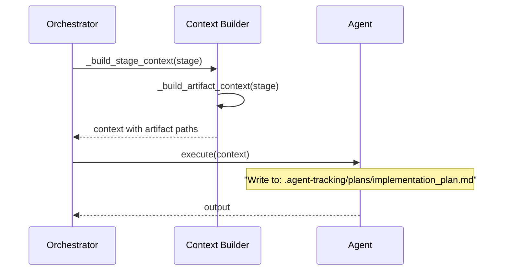

<!-- markdownlint-disable-file -->
# Task Research Document: File-Based Orchestration Critical Failure Handling

This research document covers the implementation of robust failure handling in TeamBot's file-based orchestration system. The feature ensures critical stage failures (like missing implementation plans) immediately halt the workflow with clear feedback, and fixes the root cause of artifact path mismatches that prevent artifacts from being found.

## Task Implementation Requests

* **Phase 1**: Implement artifact path injection into agent context before stage execution
* **Phase 2**: Schema migration - rename `artifacts` to `required_artifacts` and add `input_artifacts` field
* **Phase 3**: Implement artifact validation after stage completion
* **Phase 4**: Implement `halt_workflow()` mechanism with proper state persistence
* **Phase 5**: User feedback - actionable error messages with exact paths and fix instructions
* **Phase 6**: Resume capability - detect and recover from `status: "halted"` state
* **Add `workflow_halted` notification event** to existing notification system

## Scope and Success Criteria

* **Scope**: Implementing failure handling mechanisms within the orchestration layer including artifact path injection, validation, halt mechanism, user feedback, and resume capability. Changes limited to orchestration module, notification events, CLI resume logic, and `stages.yaml` schema.
* **Exclusions**: Agent prompt template modifications, automatic retry of failed stages, UI improvements beyond console/notification messages.
* **Assumptions**:
  1. All artifacts are stored in `.agent-tracking/` directory (not `.teambot/`)
  2. `.teambot/` is for working files and orchestration state only
  3. If ANY stage in a parallel group fails, the ENTIRE group fails (no partial success)
  4. `halt_workflow()` stops execution immediately (process exit), not a soft state transition
* **Success Criteria**:
  * Orchestrator injects explicit artifact output paths into agent context before stage execution
  * When a stage fails to produce a required artifact, the workflow MUST halt immediately
  * Halted state includes clear explanation of what artifact was missing and which stage failed
  * User receives feedback explaining the failure and recommended next steps
  * Resume functionality can restart from halted stage after user intervention

## Outline

1. [Entry Point Analysis](#entry-point-analysis) - All code paths traced
2. [Research Executed](#research-executed) - Testing infrastructure, file analysis
3. [Key Discoveries](#key-discoveries) - Project structure, implementation patterns
4. [Technical Scenarios](#technical-scenarios) - 6 implementation phases with details
5. [Potential Next Research](#potential-next-research) - Open items

### Potential Next Research

* None - research is complete for implementation planning

## Entry Point Analysis

### User Input Entry Points

| Entry Point | Code Path | Reaches Feature? | Implementation Required? |
|-------------|-----------|------------------|-------------------------|
| `teambot run objective.md` | cli.py:_run_orchestration() → ExecutionLoop.run() | YES | YES - artifact validation |
| `teambot run --resume` | cli.py:_run_orchestration_resume() → ExecutionLoop.resume() → run() | YES | YES - halted state handling |
| ExecutionLoop.run() direct | orchestration/execution_loop.py:run() | YES | YES - core changes |
| Parallel stage execution | parallel_stage_executor.py:execute_parallel() | YES | YES - group failure handling |

### Code Path Trace

#### Entry Point 1: `teambot run objectives/my-objective.md`
1. User enters: `teambot run objectives/my-objective.md`
2. Handled by: `cli.py:_run_orchestration()` (lines 1015-1130)
3. Routes to: `cli.py:_run_orchestration_async()` (lines 989-1010)
4. Reaches: `execution_loop.py:ExecutionLoop.run()` (lines 135-248) ✅

#### Entry Point 2: `teambot run --resume`
1. User enters: `teambot run --resume`
2. Handled by: `cli.py:_run_orchestration_resume()` (lines 1161-1260)
3. Routes to: `ExecutionLoop.resume()` (lines 1072-1128) then `run()`
4. Reaches: Main execution loop ✅

#### Entry Point 3: Parallel Stage Execution
1. Parallel group triggered: `execution_loop.py:_execute_parallel_group()` (lines 294-356)
2. Routes to: `parallel_stage_executor.py:execute_parallel()` (lines 42-124)
3. Reaches: Individual stage execution ✅

### Coverage Gaps

| Gap | Impact | Required Fix |
|-----|--------|--------------|
| No artifact validation after stage completion | Stages "complete" without producing artifacts | Add `_validate_required_artifacts()` call after stage execution |
| No halt mechanism | Workflow continues after critical failures | Add `_halt_workflow()` method with state persistence |
| No input artifact validation before stage start | Stages start with missing prerequisites | Add `_validate_input_artifacts()` call before stage execution |
| No artifact path injection | Agents write to inconsistent paths | Add artifact context to `_build_stage_context()` |
| Resume doesn't handle `halted` status | Can't recover from halted state | Update `resume()` to detect and handle `halted` status |

### Implementation Scope Verification

- [x] All entry points from acceptance test scenarios are traced
- [x] All code paths that should trigger feature are identified
- [x] Coverage gaps are documented with required fixes

## Research Executed

### Testing Infrastructure Research

* **Framework**: pytest 8.x with pytest-asyncio
  * Location: `tests/` directory mirroring `src/teambot/` structure
  * Naming: `test_*.py` pattern, classes `Test*`, methods `test_*`
  * Runner: `uv run pytest` (from pyproject.toml)
  * Coverage: pytest-cov with 80% target (per AGENTS.md)

### Test Patterns Found

* **File**: `tests/test_orchestration/test_execution_loop.py` (Lines 1-150)
  * Uses pytest fixtures from `conftest.py` for temp directories
  * AsyncMock for SDK client mocking
  * Clear arrange-act-assert structure
  * `@pytest.mark.asyncio` decorator for async tests
  * Fixtures: `objective_file`, `teambot_dir`, `mock_sdk_client`

* **File**: `tests/test_orchestration/conftest.py` (Lines 1-127)
  * `sample_objective_content` - sample markdown
  * `sample_feature_spec_content` - spec without acceptance tests (for orchestration tests)
  * `teambot_dir_with_spec` - sets up feature-specific directory structure

### Coverage Standards

* **Unit Tests**: 80% minimum (per AGENTS.md)
* **Integration Tests**: Covered via `test_orchestration/test_integration.py`
* **Critical Paths**: 100% required for halt mechanism

### Testing Approach Recommendation

* **Artifact Validation Logic**: TDD (critical safety mechanism)
* **Halt Mechanism**: TDD (critical path, must be thoroughly tested)
* **Path Injection**: TDD (core functionality)
* **Schema Migration**: Code-First (straightforward field rename)
* **Resume Handling**: TDD (user-facing recovery path)
* **Notification Event**: Code-First (simple event addition)

**Rationale**: This feature implements critical safety mechanisms that must be thoroughly tested before implementation. TDD approach ensures failure cases are properly handled.

### File Analysis

* `src/teambot/orchestration/execution_loop.py` (Lines 85-1144)
  * Core orchestration driver
  * `ExecutionLoop.__init__()` - creates feature-specific subdirectory (L100-108)
  * `run()` - main execution loop (L135-248)
  * `_save_state()` - persists state to `orchestration_state.json` (L1031-1070)
  * `resume()` - classmethod to resume from saved state (L1072-1128)
  * `_build_stage_context()` - builds context for agents (L856-959)
  * `_find_feature_spec_content()` - searches for spec artifacts (L769-792)
  * Current artifacts path: `.teambot/{feature}/artifacts/` NOT `.agent-tracking/`

* `src/teambot/orchestration/stage_config.py` (Lines 17-335)
  * `StageConfig` dataclass with `artifacts` field (L26)
  * `load_stages_config()` - loads from YAML file (L82-116)
  * `_parse_configuration()` - parses stage definitions (L119-233)

* `src/teambot/workflow/stages.py` (Lines 1-212)
  * `WorkflowStage` enum with all stages
  * `StageMetadata` dataclass with `required_artifacts` field (L41)
  * `STAGE_METADATA` dict with stage definitions (L46-160)

* `src/teambot/cli.py` (Lines 1137-1260)
  * `_run_orchestration_resume()` - handles `--resume` flag
  * `on_progress()` callback - handles event types for display and notifications
  * Current event types: `stage_changed`, `orchestration_started`, `orchestration_completed`, `agent_running`, `agent_complete`, `review_progress`, etc.

* `src/teambot/notifications/events.py` (Lines 1-29)
  * `NotificationEvent` dataclass with `event_type`, `data`, `stage`, `agent`, `feature_name`

* `stages.yaml` (Lines 1-448)
  * Complete stage definitions with `artifacts` field (to be renamed `required_artifacts`)
  * Artifact paths currently relative: e.g., `implementation_plan.md`
  * `parallel_groups` section for concurrent stage execution

### Code Search Results

* `artifacts` field usage:
  * `stage_config.py:26` - `StageConfig.artifacts` field
  * `stage_config.py:145` - parsing from YAML
  * `execution_loop.py:929-932` - building context with artifact paths
  * `stages.yaml` - 13 occurrences defining artifacts per stage

* `_save_state` usage:
  * `execution_loop.py:1031-1070` - saves `orchestration_state.json`
  * Called after each stage completion (L239) and on errors (L173, 179, 197, etc.)

* Notification event emission:
  * `execution_loop.py:_emit_completed_event()` (L250-274)
  * `cli.py:on_progress()` (L1068-1100, L1207-1245)
  * `event_bus.py:emit_sync()` (L127-173)

### External Research (Evidence Log)

* No external research required - all information available in codebase

### Project Conventions

* Standards referenced: AGENTS.md, pyproject.toml
* Instructions followed: TDD for critical safety mechanisms
* Linting: `uv run ruff check .` and `uv run ruff format .`

## Key Discoveries

### Project Structure

```
src/teambot/
├── orchestration/
│   ├── execution_loop.py    # Main driver - needs artifact validation, halt mechanism
│   ├── stage_config.py      # StageConfig - needs schema updates
│   ├── parallel_stage_executor.py  # Parallel execution - needs group failure handling
│   └── ...
├── workflow/
│   └── stages.py            # StageMetadata - has required_artifacts already
├── notifications/
│   ├── events.py            # NotificationEvent - add workflow_halted
│   ├── event_bus.py         # EventBus - no changes needed
│   └── templates.py         # Message templates - add halt template
├── cli.py                   # Entry point - needs halted status handling in resume
└── ...

.teambot/{feature}/
├── artifacts/               # Current artifact location (to be deprecated)
│   └── feature_spec.md
└── orchestration_state.json # State persistence

.agent-tracking/             # New artifact location
├── plans/
│   └── implementation_plan.md
├── research/
│   └── research.md
├── specs/
│   └── feature_spec.md
└── test-strategies/
    └── test_strategy.md
```

### Implementation Patterns

**Current Artifact Path Resolution (PROBLEM)**:
```python
# execution_loop.py:777-779
artifacts_spec = self.teambot_dir / "artifacts" / "feature_spec.md"
# Resolves to: .teambot/{feature}/artifacts/feature_spec.md
```

**Current Context Building (MISSING PATH INJECTION)**:
```python
# execution_loop.py:910-912
parts.extend([
    "## Working Directory",
    f"All artifacts for this objective should be saved to: `{self.teambot_dir}`",
    f"- Artifacts directory: `{self.teambot_dir / 'artifacts'}`",
])
# Does NOT inject explicit output paths for required artifacts
```

**Current State Persistence**:
```python
# execution_loop.py:1052-1068
state = {
    "objective_file": str(self.objective_path),
    "current_stage": self.current_stage.name,
    "status": status,  # "in_progress", "complete", "cancelled", "error"
    # No "halted" status currently
}
```

### Complete Examples

**Artifact Validation Pattern (TO BE IMPLEMENTED)**:
```python
def _validate_required_artifacts(self, stage: WorkflowStage) -> tuple[bool, list[str]]:
    """Validate that all required artifacts exist after stage completion.
    
    Returns:
        Tuple of (all_valid, list_of_missing_artifact_paths)
    """
    stage_config = self.stages_config.stages.get(stage)
    if not stage_config or not stage_config.required_artifacts:
        return True, []
    
    missing = []
    for artifact_path in stage_config.required_artifacts:
        # Resolve relative to .agent-tracking/
        full_path = self.agent_tracking_dir / artifact_path
        if not full_path.exists():
            missing.append(str(full_path))
    
    return len(missing) == 0, missing
```

**Halt Workflow Pattern (TO BE IMPLEMENTED)**:
```python
def _halt_workflow(
    self, 
    reason: str, 
    stage: WorkflowStage, 
    missing_artifacts: list[str],
    on_progress: Callable | None
) -> None:
    """Halt workflow immediately due to critical failure.
    
    Persists halted state and exits process.
    """
    # Persist halted state
    self._save_state_halted(reason, stage, missing_artifacts)
    
    # Emit notification
    if on_progress:
        on_progress("workflow_halted", {
            "stage": stage.name,
            "reason": reason,
            "missing_artifacts": missing_artifacts,
        })
    
    # Exit process with non-zero code
    raise WorkflowHaltedError(reason, stage, missing_artifacts)
```

### API and Schema Documentation

**Current StageConfig Schema** (stage_config.py:17-35):
```python
@dataclass
class StageConfig:
    name: str
    description: str
    work_agent: str | None
    review_agent: str | None
    allowed_personas: list[str] = field(default_factory=list)
    artifacts: list[str] = field(default_factory=list)  # TO BE RENAMED
    exit_criteria: list[str] = field(default_factory=list)
    optional: bool = False
    is_review_stage: bool = False
    is_acceptance_test_stage: bool = False
    requires_acceptance_tests_passed: bool = False
    parallel_agents: list[str] | None = None
    prompt_template: str | None = None
    include_objective: bool = True
```

**Proposed StageConfig Schema**:
```python
@dataclass
class StageConfig:
    # ... existing fields ...
    required_artifacts: list[str] = field(default_factory=list)  # RENAMED
    input_artifacts: list[str] = field(default_factory=list)     # NEW
    # Paths relative to .agent-tracking/ e.g., "plans/implementation_plan.md"
```

### Configuration Examples

**Current stages.yaml (PLAN stage)**:
```yaml
PLAN:
  name: Plan
  description: Create implementation plan with task breakdown and dependencies
  work_agent: pm
  review_agent: reviewer
  allowed_personas:
    - project_manager
    - pm
    - builder
    - developer
  artifacts:
    - implementation_plan.md  # Ambiguous path
  exit_criteria:
    - Actionable plan with atomic tasks and clear dependencies
```

**Proposed stages.yaml (PLAN stage)**:
```yaml
PLAN:
  name: Plan
  description: Create implementation plan with task breakdown and dependencies
  work_agent: pm
  review_agent: reviewer
  allowed_personas:
    - project_manager
    - pm
    - builder
    - developer
  input_artifacts:
    - test-strategies/test_strategy.md  # Read from .agent-tracking/
    - research/research.md
  required_artifacts:
    - plans/implementation_plan.md  # Write to .agent-tracking/
  exit_criteria:
    - Actionable plan with atomic tasks and clear dependencies
```

## Technical Scenarios

### 1. Artifact Path Injection (Root Cause Fix)

Inject explicit artifact paths into agent context so agents know exactly WHERE to read from and write to.

**Requirements:**
* Orchestrator generates artifact context with full paths before stage execution
* Input artifacts (from prior stages) listed with read paths
* Output artifacts (required outputs) listed with write paths
* Paths resolved to `.agent-tracking/` base directory

**Preferred Approach:**
* Add `_build_artifact_context()` method to ExecutionLoop
* Inject artifact paths into `_build_stage_context()` result
* Use `.agent-tracking/` as base for all artifact paths

```text
src/teambot/orchestration/
└── execution_loop.py  # Add _build_artifact_context(), update _build_stage_context()
```



**Implementation Details:**

```python
# execution_loop.py - New method
def _build_artifact_context(self, stage: WorkflowStage) -> str:
    """Build artifact path context for a stage.
    
    Returns markdown block with input and output artifact paths.
    """
    stage_config = self.stages_config.stages.get(stage)
    if not stage_config:
        return ""
    
    parts = ["", "## Artifact Paths", ""]
    
    # Input artifacts (read from)
    if stage_config.input_artifacts:
        parts.append("### Input Artifacts (read from these paths):")
        for artifact in stage_config.input_artifacts:
            full_path = self.agent_tracking_dir / artifact
            parts.append(f"- `{full_path}`")
        parts.append("")
    
    # Output artifacts (write to)
    if stage_config.required_artifacts:
        parts.append("### Output Artifacts (MUST write to these paths):")
        for artifact in stage_config.required_artifacts:
            full_path = self.agent_tracking_dir / artifact
            parts.append(f"- `{full_path}`")
        parts.append("")
    
    return "\n".join(parts)
```

```python
# execution_loop.py - Update __init__
def __init__(self, ...):
    # ... existing code ...
    # Add agent tracking directory (new)
    self.agent_tracking_dir = Path(".agent-tracking")
    self.agent_tracking_dir.mkdir(parents=True, exist_ok=True)
```

#### Considered Alternatives (Removed After Selection)

Environment variables for paths were considered but rejected as less explicit than context injection and harder to debug.

---

### 2. Schema Migration

Rename `artifacts` field to `required_artifacts` and add `input_artifacts` field for clarity of intent.

**Requirements:**
* Rename `artifacts` → `required_artifacts` in StageConfig dataclass
* Add `input_artifacts` field to StageConfig
* Update YAML parser to handle both fields
* Update all `stages.yaml` stage definitions with full paths

**Preferred Approach:**
* Modify `StageConfig` dataclass in `stage_config.py`
* Update `_parse_configuration()` for new fields
* Update all stage definitions in `stages.yaml`
* Backward compatibility: accept `artifacts` as alias for `required_artifacts` with deprecation warning

```text
src/teambot/orchestration/
└── stage_config.py  # Update StageConfig dataclass, parser
stages.yaml          # Update all stage definitions
```

**Implementation Details:**

```python
# stage_config.py - Updated StageConfig
@dataclass
class StageConfig:
    name: str
    description: str
    work_agent: str | None
    review_agent: str | None
    allowed_personas: list[str] = field(default_factory=list)
    required_artifacts: list[str] = field(default_factory=list)  # RENAMED
    input_artifacts: list[str] = field(default_factory=list)     # NEW
    exit_criteria: list[str] = field(default_factory=list)
    optional: bool = False
    is_review_stage: bool = False
    is_acceptance_test_stage: bool = False
    requires_acceptance_tests_passed: bool = False
    parallel_agents: list[str] | None = None
    prompt_template: str | None = None
    include_objective: bool = True
```

```python
# stage_config.py - Updated parser
def _parse_configuration(data: dict[str, Any]) -> StagesConfiguration:
    # ... existing code ...
    
    config = StageConfig(
        # ... existing fields ...
        # Handle both 'required_artifacts' and 'artifacts' (backward compat)
        required_artifacts=(
            stage_data.get("required_artifacts")
            or stage_data.get("artifacts", [])
        ),
        input_artifacts=stage_data.get("input_artifacts", []),
        # ... remaining fields ...
    )
```

---

### 3. Artifact Validation

Validate that required artifacts exist after stage completion, before transitioning to next stage.

**Requirements:**
* Implement `_validate_required_artifacts()` method
* Call validation after each stage completion
* For parallel groups, validate ALL stages before proceeding
* Return list of missing artifacts for error reporting

**Preferred Approach:**
* Add validation method to ExecutionLoop
* Call after `_execute_work_stage()` and `_execute_review_stage()`
* Integrate with halt mechanism for failure handling

```text
src/teambot/orchestration/
└── execution_loop.py  # Add _validate_required_artifacts()
```

**Implementation Details:**

```python
# execution_loop.py - New method
def _validate_required_artifacts(
    self, 
    stage: WorkflowStage
) -> tuple[bool, list[str]]:
    """Validate that all required artifacts exist.
    
    Args:
        stage: The workflow stage to validate
        
    Returns:
        Tuple of (all_valid, list_of_missing_artifact_paths)
    """
    stage_config = self.stages_config.stages.get(stage)
    if not stage_config or not stage_config.required_artifacts:
        return True, []
    
    missing = []
    for artifact_path in stage_config.required_artifacts:
        full_path = self.agent_tracking_dir / artifact_path
        if not full_path.exists():
            missing.append(str(full_path))
    
    return len(missing) == 0, missing


def _validate_input_artifacts(
    self,
    stage: WorkflowStage
) -> tuple[bool, list[str]]:
    """Validate that all input artifacts exist before stage starts.
    
    Args:
        stage: The workflow stage to validate
        
    Returns:
        Tuple of (all_valid, list_of_missing_artifact_paths)
    """
    stage_config = self.stages_config.stages.get(stage)
    if not stage_config or not stage_config.input_artifacts:
        return True, []
    
    missing = []
    for artifact_path in stage_config.input_artifacts:
        full_path = self.agent_tracking_dir / artifact_path
        if not full_path.exists():
            missing.append(str(full_path))
    
    return len(missing) == 0, missing
```

---

### 4. Halt Mechanism

Implement immediate workflow halt on critical failures with proper state persistence.

**Requirements:**
* Implement `_halt_workflow()` method
* Persist halted state with `status: "halted"`, `halt_reason`, `halted_at_stage`, `missing_artifacts`
* Exit process with non-zero exit code
* Emit `workflow_halted` notification event

**Preferred Approach:**
* Add custom exception `WorkflowHaltedError`
* Add `_halt_workflow()` method that saves state and raises exception
* Handle exception at top level to exit gracefully
* Add `workflow_halted` event to notification system

```text
src/teambot/orchestration/
├── execution_loop.py  # Add _halt_workflow(), WorkflowHaltedError
└── __init__.py        # Export new exception
src/teambot/notifications/
└── events.py          # Document workflow_halted event type
```

**Implementation Details:**

```python
# execution_loop.py - New exception
class WorkflowHaltedError(Exception):
    """Raised when workflow must halt due to critical failure."""
    
    def __init__(
        self, 
        reason: str, 
        stage: WorkflowStage, 
        missing_artifacts: list[str]
    ):
        self.reason = reason
        self.stage = stage
        self.missing_artifacts = missing_artifacts
        super().__init__(reason)


# execution_loop.py - New method
def _halt_workflow(
    self,
    reason: str,
    stage: WorkflowStage,
    missing_artifacts: list[str],
    on_progress: Callable[[str, Any], None] | None,
) -> None:
    """Halt workflow immediately due to critical failure.
    
    Persists halted state and raises WorkflowHaltedError.
    """
    # Save halted state
    self._save_state_halted(reason, stage, missing_artifacts)
    
    # Emit notification
    if on_progress:
        on_progress("workflow_halted", {
            "stage": stage.name,
            "reason": reason,
            "missing_artifacts": missing_artifacts,
            "halt_message": self._format_halt_message(stage, missing_artifacts),
        })
    
    # Raise exception to halt execution
    raise WorkflowHaltedError(reason, stage, missing_artifacts)


def _save_state_halted(
    self,
    reason: str,
    stage: WorkflowStage,
    missing_artifacts: list[str],
) -> None:
    """Save orchestration state with halted status."""
    import json
    from datetime import datetime
    
    state_file = self.teambot_dir / "orchestration_state.json"
    
    state = {
        "objective_file": str(self.objective_path),
        "current_stage": stage.name,
        "elapsed_seconds": self.time_manager.elapsed_seconds,
        "max_seconds": self.time_manager.max_seconds,
        "status": "halted",  # NEW status
        "halt_reason": reason,
        "halted_at_stage": stage.name,
        "missing_artifacts": missing_artifacts,
        "halted_at": datetime.now().isoformat(),
        "stages_config_source": self.stages_config.source,
        "feature_name": self.feature_name,
        "stage_outputs": {k.name: v for k, v in self.stage_outputs.items()},
    }
    
    state_file.write_text(json.dumps(state, indent=2), encoding="utf-8")


def _format_halt_message(
    self,
    stage: WorkflowStage,
    missing_artifacts: list[str],
) -> str:
    """Format actionable halt message for user."""
    lines = [
        "",
        "❌ WORKFLOW HALTED: Missing required artifact",
        "",
        f"Stage: {stage.name}",
    ]
    
    for artifact in missing_artifacts:
        lines.append(f"Missing: {artifact}")
    
    lines.extend([
        "",
        "Cause: Agent completed but did not create required artifact",
        "",
        "To fix:",
        "  1. Manually create the required artifact at the path above, OR",
        "  2. Run the appropriate SDD prompt to generate it",
        "",
        f"To resume after fixing:",
        f"  teambot run --resume {self.objective_path}",
        "",
    ])
    
    return "\n".join(lines)
```

---

### 5. User Feedback

Format actionable error messages with exact paths and fix instructions.

**Requirements:**
* Halt message includes stage name, missing artifacts with FULL paths
* Recommended actions (manual creation or SDD prompt)
* Exact resume command
* Console output is clear and helpful
* Notifications include failure details

**Preferred Approach:**
* `_format_halt_message()` method generates actionable message
* CLI `on_progress` callback handles `workflow_halted` event for console display
* Notification templates include halt details

```text
src/teambot/
├── cli.py                          # Handle workflow_halted in on_progress
└── notifications/templates.py      # Add halt message template
```

**Implementation Details:**

```python
# cli.py - Update on_progress callback (both _run_orchestration and _run_orchestration_resume)
def on_progress(event_type: str, data: dict) -> None:
    # ... existing handlers ...
    
    elif event_type == "workflow_halted":
        stage = data.get("stage", "unknown")
        reason = data.get("reason", "unknown")
        missing = data.get("missing_artifacts", [])
        halt_msg = data.get("halt_message", "")
        
        display.print_error(f"Workflow halted at stage: {stage}")
        display.print_error(f"Reason: {reason}")
        for artifact in missing:
            display.print_error(f"  Missing: {artifact}")
        if halt_msg:
            display.console.print(halt_msg)
    
    # ... emit to EventBus ...
```

---

### 6. Resume Capability

Update resume functionality to detect and handle `status: "halted"` state.

**Requirements:**
* `resume()` classmethod detects `status: "halted"` in state
* Re-validate prerequisites before resuming halted stage
* Clear halt state on successful stage completion
* Show user what was fixed if validation now passes

**Preferred Approach:**
* Update `resume()` to check for `halted` status
* Re-run input artifact validation before resuming
* If validation fails again, halt immediately
* If validation passes, clear halt state and continue

```text
src/teambot/orchestration/
└── execution_loop.py  # Update resume() classmethod
```

**Implementation Details:**

```python
# execution_loop.py - Updated resume()
@classmethod
def resume(cls, teambot_dir: Path, config: dict[str, Any]) -> ExecutionLoop:
    """Resume from saved state, including halted state.
    
    For halted state, re-validates prerequisites before resuming.
    """
    import json
    
    state_file = teambot_dir / "orchestration_state.json"
    
    if not state_file.exists():
        state_file = cls._find_latest_state_file(teambot_dir)
    
    if state_file is None or not state_file.exists():
        raise ValueError("No orchestration state to resume")
    
    state = json.loads(state_file.read_text(encoding="utf-8"))
    
    # Check if resuming from halted state
    if state.get("status") == "halted":
        halted_stage = state.get("halted_at_stage")
        missing = state.get("missing_artifacts", [])
        logger.info(f"Resuming from halted state at {halted_stage}")
        logger.info(f"Previously missing: {missing}")
    
    # ... rest of existing resume logic ...
    
    # Return loop positioned at halted stage
    # Input artifact validation will run at stage execution time
    return loop
```

#### Integration in run() method

```python
# execution_loop.py - Update run() to validate inputs before stage execution
async def run(self, sdk_client, on_progress=None):
    # ... existing setup ...
    
    while self.current_stage != WorkflowStage.COMPLETE:
        # ... existing checks (cancellation, timeout) ...
        
        stage = self.current_stage
        
        # VALIDATE INPUT ARTIFACTS BEFORE STAGE STARTS
        inputs_valid, missing_inputs = self._validate_input_artifacts(stage)
        if not inputs_valid:
            self._halt_workflow(
                reason=f"Missing input artifacts for {stage.name}",
                stage=stage,
                missing_artifacts=missing_inputs,
                on_progress=on_progress,
            )
        
        # ... execute stage ...
        
        # VALIDATE OUTPUT ARTIFACTS AFTER STAGE COMPLETES
        outputs_valid, missing_outputs = self._validate_required_artifacts(stage)
        if not outputs_valid:
            self._halt_workflow(
                reason=f"Missing required artifacts after {stage.name}",
                stage=stage,
                missing_artifacts=missing_outputs,
                on_progress=on_progress,
            )
        
        # Advance to next stage
        self.current_stage = self._get_next_stage(stage)
        self._save_state()
```

---

## Files to Modify Summary

| File | Changes |
|------|---------|
| `src/teambot/orchestration/execution_loop.py` | Add `agent_tracking_dir`, `_build_artifact_context()`, `_validate_required_artifacts()`, `_validate_input_artifacts()`, `_halt_workflow()`, `_save_state_halted()`, `_format_halt_message()`, `WorkflowHaltedError`, update `run()`, update `resume()` |
| `src/teambot/orchestration/stage_config.py` | Rename `artifacts` → `required_artifacts`, add `input_artifacts` field, update parser |
| `src/teambot/orchestration/__init__.py` | Export `WorkflowHaltedError` |
| `src/teambot/cli.py` | Handle `workflow_halted` event in both `on_progress` callbacks |
| `src/teambot/notifications/templates.py` | Add halt message template (optional) |
| `stages.yaml` | Update all stage definitions with `required_artifacts`, `input_artifacts`, full paths |

## Test Files to Create

| File | Purpose |
|------|---------|
| `tests/test_orchestration/test_artifact_validation.py` | Test artifact validation logic |
| `tests/test_orchestration/test_halt_mechanism.py` | Test halt workflow behavior |
| `tests/test_orchestration/test_path_injection.py` | Test artifact path context injection |
| `tests/test_file_orchestration_critical_failures_acceptance.py` | Acceptance tests AT-001 through AT-011 |
