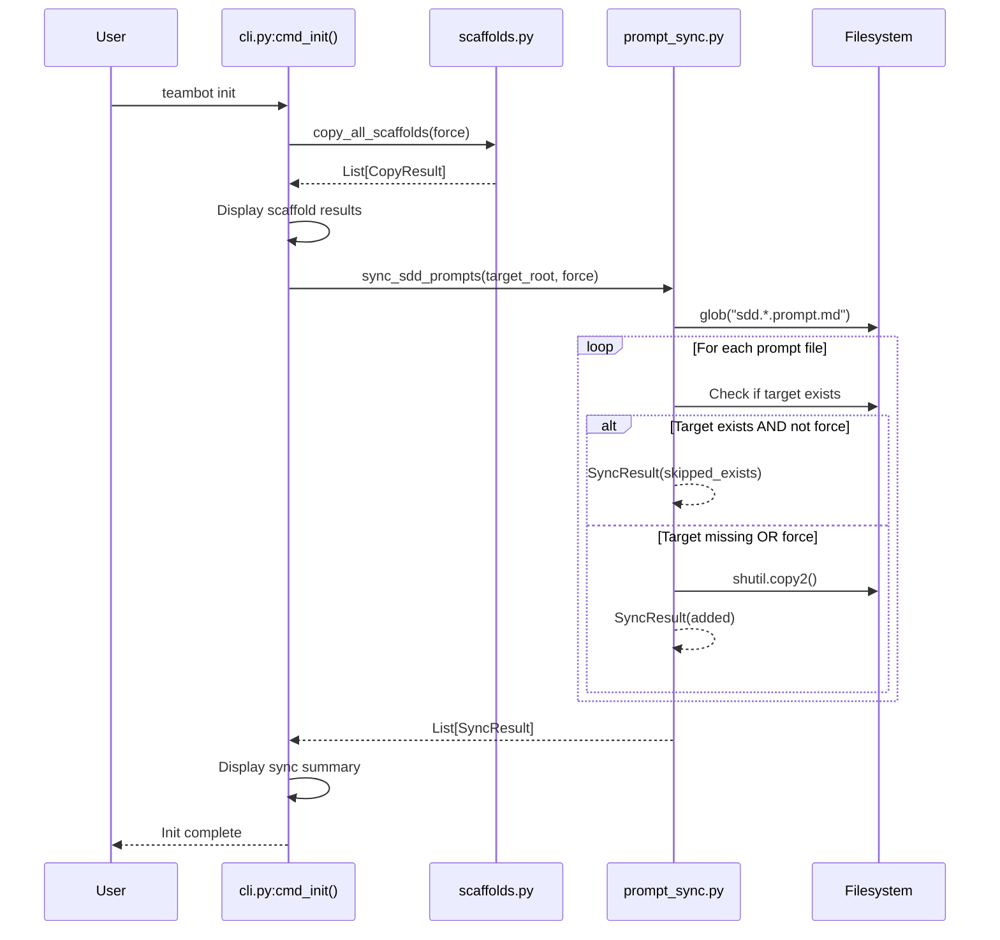
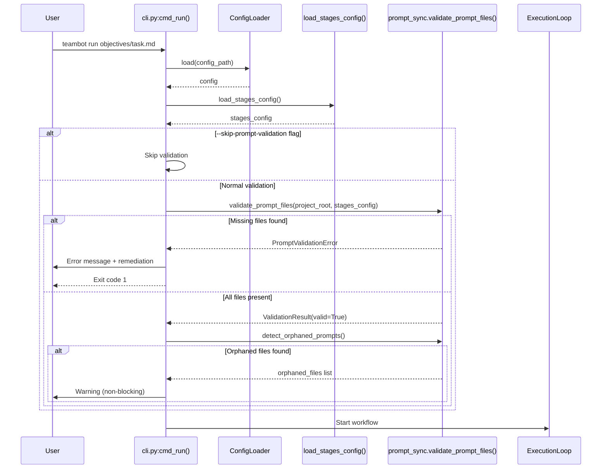

<!-- markdownlint-disable-file -->
# Task Research Document: SDD Prompt Sync

This research documents the technical approach for implementing incremental SDD prompt file synchronization during `teambot init` and runtime validation to ensure `stages.yaml` and SDD prompt files stay in sync. The feature addresses the problem where upgrading TeamBot doesn't add new SDD prompt files to existing projects because the `.agent/` directory copy is skipped when it already exists.

## Task Implementation Requests

* **FR-001**: Implement `sync_sdd_prompts()` function in new `src/teambot/prompt_sync.py` module to incrementally sync SDD prompt files
* **FR-002**: Display sync summary showing files added/skipped during `teambot init`
* **FR-003**: Implement `validate_prompt_files()` to validate all `prompt_template` paths exist before workflow execution
* **FR-004**: Implement `detect_orphaned_prompts()` to warn about unreferenced prompt files (non-blocking)
* **FR-005**: Ensure all validation errors include actionable remediation commands
* **FR-006**: Support `--force` flag to reset all SDD prompt files to defaults
* **FR-007**: Add prompt sync health check to `teambot status` output
* **FR-008**: Add `--skip-prompt-validation` flag to bypass validation in `teambot run`
* **CLI Integration**: Call `sync_sdd_prompts()` after `copy_all_scaffolds()` in `cmd_init()`
* **Validation Integration**: Call `validate_prompt_files()` in `cmd_run()` after config load, before workflow start

## Scope and Success Criteria

* **Scope**: 
  - Incremental sync of SDD prompt files (`.agent/commands/sdd/sdd.*.prompt.md`) only
  - Runtime validation of `prompt_template` references in `stages.yaml`
  - Integration with existing `scaffolds.py` and `cli.py` patterns
  - NOT in scope: schema validation of prompt content, conflict resolution, versioning

* **Assumptions**:
  1. `stages.yaml` is located at repository root
  2. SDD prompt files follow the `sdd.*.prompt.md` naming pattern
  3. Users want to preserve customizations by default
  4. Bundled scaffold files are source of truth for defaults

* **Success Criteria**:
  * `teambot init` copies missing SDD prompt files without overwriting existing ones
  * `teambot run` validates prompt file existence before SETUP stage
  * Error messages include specific `teambot init` remediation command
  * All acceptance tests (AT-001 through AT-006) pass
  * 80%+ test coverage for new module

## Outline

1. Entry Point Analysis - All code paths for sync and validation
2. Testing Infrastructure Research - pytest patterns and conventions
3. Key Discoveries - Project structure, patterns, APIs
4. Technical Scenarios - Implementation approaches with examples

### Potential Next Research

* Investigate `teambot status` command structure for FR-007 integration
  * **Reasoning**: Need to understand existing status output format for adding prompt sync health section
  * **Reference**: FR-007 in feature spec
  
* Research Windows/macOS path handling edge cases
  * **Reasoning**: NFR-007 requires cross-platform compatibility
  * **Reference**: pyproject.toml platform-specific handling

## Entry Point Analysis

### User Input Entry Points

| Entry Point | Code Path | Reaches Feature? | Implementation Required? |
|-------------|-----------|------------------|-------------------------|
| `teambot init` | `cli.py:cmd_init()` → `scaffolds.copy_all_scaffolds()` | YES - Sync point | YES - Call `sync_sdd_prompts()` after scaffold copy |
| `teambot init --force` | `cli.py:cmd_init()` → `scaffolds.copy_all_scaffolds(force=True)` | YES - Force sync | YES - Pass `force=True` to sync |
| `teambot run <objective>` | `cli.py:cmd_run()` → `_run_orchestration()` → `ExecutionLoop` | YES - Validation point | YES - Call `validate_prompt_files()` before workflow |
| `teambot run --resume` | `cli.py:cmd_run()` → `_run_orchestration_resume()` | YES - Validation point | YES - Validate on resume too |
| `teambot run --skip-prompt-validation` | `cli.py:cmd_run()` | YES - Skip validation | YES - Add flag parsing |
| `teambot status` | `cli.py:cmd_status()` (if exists) | YES - Status check | YES - Add health check section |

### Code Path Trace

#### Entry Point 1: `teambot init`
1. User runs: `teambot init`
2. Handled by: `cli.py:cmd_init()` (Lines 686-763)
3. Creates config: `ConfigLoader().save(config, config_path)` (Line 704)
4. Creates directories: `.teambot/history`, `.teambot/state` (Lines 707-710)
5. Copies scaffolds: `copy_all_scaffolds(Path.cwd(), force=force)` (Line 721)
6. **Gap**: No incremental SDD prompt sync after scaffold copy
7. Updates AGENTS.md references (Lines 734-737)
8. Shows guidance: `_display_post_init_guidance()` (Line 761)

**Required Change**: After Line 721 results processing, call `sync_sdd_prompts()` for incremental sync

#### Entry Point 2: `teambot run <objective>`
1. User runs: `teambot run objectives/my-task.md`
2. Handled by: `cli.py:cmd_run()` (Lines 785-990)
3. Config validation: `ConfigLoader().load(config_path)` (Line 910)
4. Logging setup: `setup_mode_logging()` (Lines 920-925)
5. Objective loading: `objective_path.read_text()` (Line 944)
6. **Gap**: No prompt file validation before workflow start
7. Orchestration: `_run_orchestration()` (Line 967)
8. ExecutionLoop loads stages: `load_stages_config()` (Line 118 in execution_loop.py)
9. Template loading: `_load_prompt_template()` returns None if missing (Line 1059)

**Required Change**: After Line 910 (config load), call `validate_prompt_files()` before orchestration

#### Entry Point 3: Interactive mode
1. User runs: `teambot run` (no objective)
2. Handled by: `cli.py:cmd_run()` → Line 979 `run_interactive_mode()`
3. No stages.yaml usage in interactive mode
4. **NOT affected by this feature** - validation only for orchestration mode

### Coverage Gaps

| Gap | Impact | Required Fix |
|-----|--------|--------------|
| `cmd_init()` has no incremental sync | New prompt files not added to existing projects | Add `sync_sdd_prompts()` call after scaffold copy |
| `cmd_run()` has no prompt validation | Workflow fails silently when prompt missing | Add `validate_prompt_files()` before orchestration |
| `_load_prompt_template()` silently returns None | No clear error when prompt file missing | Validation catches this earlier with clear error |

### Implementation Scope Verification

- [x] All entry points from acceptance test scenarios are traced
- [x] All code paths that should trigger feature are identified
- [x] Coverage gaps are documented with required fixes

## Research Executed

### Testing Infrastructure Research

* **Framework**: pytest with pytest-cov and pytest-mock
  * Location: `tests/` directory (mirrors `src/teambot/` structure)
  * Naming: `test_*.py` pattern, `Test*` classes, `test_*` functions
  * Runner: `uv run pytest`
  * Coverage: pytest-cov with 80% target, `--cov=src/teambot --cov-report=term-missing`

* **Acceptance Test Handling**: 
  * Marked with `@pytest.mark.acceptance`
  * Excluded by default via `addopts = "-m 'not acceptance'"` in pyproject.toml (Line 62)
  * Run explicitly with: `uv run pytest -m acceptance`

### Test Patterns Found

* **File**: `tests/test_scaffolds.py` (Lines 1-263)
  * Uses `tmp_path` pytest fixture for temp directories
  * Explicit `assert result.copied is True/False` pattern
  * Tests organized by class: `TestCopyScaffoldFile`, `TestCopyScaffoldDirectory`, `TestCopyAllScaffolds`
  * Clear arrange-act-assert structure within each test
  * Tests verify both return values AND filesystem state

* **File**: `tests/test_cli.py` (typical patterns)
  * Uses `mocker.patch()` for external dependencies
  * Tests check exit codes and console output
  * Fixture-based config setup

### Coverage Standards

* **Unit Tests**: 80% minimum (per pyproject.toml addopts)
* **Acceptance Tests**: Explicitly marked, run separately
* **Critical Paths**: Full coverage for error handling and edge cases

### Testing Approach Recommendation

* **`sync_sdd_prompts()`**: TDD (high complexity, critical path)
* **`validate_prompt_files()`**: TDD (high complexity, critical path)
* **`detect_orphaned_prompts()`**: TDD (clear requirements)
* **CLI integration**: Code-First (straightforward integration, existing patterns)
* **Display formatting**: Code-First (UX-focused, visual verification needed)

**Rationale**: Core sync and validation logic has well-defined requirements with complex edge cases (file existence, force mode, error handling), making TDD appropriate. CLI integration follows existing patterns and can be done Code-First.

### File Analysis

* `src/teambot/scaffolds.py` (Lines 1-168)
  * `get_scaffolds_dir()` - Returns Path to bundled scaffolds (Lines 20-32)
  * `CopyResult` NamedTuple - `source, target, copied, reason` (Lines 11-17)
  * `copy_scaffold_file()` - Single file copy with force flag (Lines 35-63)
  * `copy_scaffold_directory()` - Directory copy, skips if not empty (Lines 66-106)
  * `copy_all_scaffolds()` - Copies all scaffolds to target (Lines 109-167)

* `src/teambot/cli.py` (Lines 686-763 for init, 785-990 for run)
  * `cmd_init()` - Creates config, directories, copies scaffolds (Lines 686-763)
  * `cmd_run()` - Loads config, validates, runs orchestration (Lines 785-990)
  * Config loading happens at Line 910
  * Orchestration starts at Line 967

* `src/teambot/orchestration/stage_config.py` (Lines 1-343)
  * `StageConfig` dataclass with `prompt_template: str | None` field (Line 35)
  * `load_stages_config()` - Loads from YAML or returns defaults (Lines 84-118)
  * `StagesConfiguration.stages` - Dict mapping `WorkflowStage` to `StageConfig`

* `src/teambot/orchestration/execution_loop.py` (Lines 1034-1059)
  * `_load_prompt_template()` - Loads prompt content, returns None if missing
  * Currently returns None silently on missing file (Line 1059)

### Code Search Results

* `prompt_template` field usage:
  * `stages.yaml` - Defined per stage (10 stages with prompts)
  * `stage_config.py:35` - `prompt_template: str | None`
  * `execution_loop.py:921` - Used in `_execute_work_stage()`
  * `execution_loop.py:1034-1059` - Loaded in `_load_prompt_template()`

* SDD prompt files in scaffold:
  * `src/teambot/scaffolds/.agent/commands/sdd/sdd.*.prompt.md` - 10 files
  * Pattern: `sdd.0-initialize.prompt.md` through `sdd.8-post-implementation-review.prompt.md`
  * Plus: `sdd.7b-implementation-review.prompt.md` (the file that exposed this issue)

### External Research (Evidence Log)

* Python pathlib documentation
  * `Path.glob()` - Used for pattern matching files
  * `Path.resolve()` - Used for symlink resolution (security)
  * Source: [Python pathlib docs](https://docs.python.org/3/library/pathlib.html)

* shutil documentation
  * `shutil.copy2()` - Preserves metadata, used in existing scaffolds.py
  * Source: [Python shutil docs](https://docs.python.org/3/library/shutil.html)

### Project Conventions

* Standards referenced: 
  * Return `CopyResult` for file operations (established in `scaffolds.py`)
  * Use `NamedTuple` or `@dataclass` for result types
  * Explicit `force: bool = False` parameter pattern
  
* Instructions followed:
  * TDD approach per project testing preference
  * No new dependencies (stdlib only)
  * Match existing code style (ruff format)

## Key Discoveries

### Project Structure

```
src/teambot/
├── scaffolds.py          # Existing scaffold copy functions
├── scaffolds/            # Bundled scaffold files
│   ├── .agent/
│   │   └── commands/
│   │       └── sdd/      # SDD prompt files (10 files)
│   │           ├── README.md
│   │           ├── sdd.0-initialize.prompt.md
│   │           ├── sdd.1-create-feature-spec.prompt.md
│   │           └── ... (8 more)
│   ├── stages.yaml
│   └── AGENTS.md
├── cli.py                # cmd_init(), cmd_run() entry points
└── orchestration/
    ├── stage_config.py   # StagesConfiguration, load_stages_config()
    └── execution_loop.py # _load_prompt_template()
```

### Implementation Patterns

1. **CopyResult Pattern** (from `scaffolds.py`):
```python
class CopyResult(NamedTuple):
    source: str
    target: Path
    copied: bool
    reason: str  # "copied", "skipped_exists", "source_missing", "skipped_not_empty"
```

2. **Scaffold Copy Pattern** (from `scaffolds.py`):
```python
def copy_scaffold_file(scaffold_name: str, target_path: Path, *, force: bool = False) -> CopyResult:
    source_path = get_scaffolds_dir() / scaffold_name
    if not source_path.exists():
        return CopyResult(scaffold_name, target_path, False, "source_missing")
    if target_path.exists() and not force:
        return CopyResult(scaffold_name, target_path, False, "skipped_exists")
    # ... copy logic
    return CopyResult(scaffold_name, target_path, True, "copied")
```

3. **Error Message Pattern** (from `MissingArtifactError`):
```python
raise MissingArtifactError(
    artifact_path=expected_path,
    stage=stage.name,
    recovery_steps=["Run command X", "Or manually create file at Y"],
)
```

### Complete Examples

**Proposed sync_sdd_prompts() implementation:**
```python
# src/teambot/prompt_sync.py
from pathlib import Path
from typing import NamedTuple

from teambot.scaffolds import get_scaffolds_dir


class SyncResult(NamedTuple):
    """Result of a prompt file sync operation."""
    filename: str
    target: Path
    copied: bool
    reason: str  # "added", "skipped_exists", "source_missing"


def get_sdd_prompt_dir() -> Path:
    """Get path to bundled SDD prompt files."""
    return get_scaffolds_dir() / ".agent" / "commands" / "sdd"


def sync_sdd_prompts(
    target_root: Path,
    *,
    force: bool = False,
) -> list[SyncResult]:
    """Sync SDD prompt files from scaffolds to target directory.
    
    Only syncs files matching 'sdd.*.prompt.md' pattern.
    Existing files are preserved unless force=True.
    
    Args:
        target_root: Root directory of user's repository
        force: If True, overwrite existing files
        
    Returns:
        List of SyncResult for each prompt file
    """
    results: list[SyncResult] = []
    
    scaffold_dir = get_sdd_prompt_dir()
    target_dir = target_root / ".agent" / "commands" / "sdd"
    
    if not scaffold_dir.exists():
        return results
    
    # Ensure target directory exists
    target_dir.mkdir(parents=True, exist_ok=True)
    
    # Sync each SDD prompt file
    for scaffold_file in sorted(scaffold_dir.glob("sdd.*.prompt.md")):
        target_file = target_dir / scaffold_file.name
        
        if target_file.exists() and not force:
            results.append(SyncResult(
                scaffold_file.name, target_file, False, "skipped_exists"
            ))
        else:
            import shutil
            shutil.copy2(scaffold_file, target_file)
            results.append(SyncResult(
                scaffold_file.name, target_file, True, "added"
            ))
    
    return results
```

**Proposed validate_prompt_files() implementation:**
```python
from dataclasses import dataclass
from pathlib import Path

from teambot.orchestration.stage_config import StagesConfiguration, load_stages_config
from teambot.workflow.stages import WorkflowStage


@dataclass
class ValidationResult:
    """Result of prompt file validation."""
    valid: bool
    missing: list[tuple[str, str]]  # List of (path, stage_name)
    orphaned: list[str]  # Files not referenced by any stage


class PromptValidationError(Exception):
    """Raised when prompt file validation fails."""
    
    def __init__(self, missing: list[tuple[str, str]]):
        self.missing = missing
        msg = self._format_error_message()
        super().__init__(msg)
    
    def _format_error_message(self) -> str:
        lines = ["Missing prompt file(s) referenced in stages.yaml:"]
        for path, stage in self.missing:
            lines.append(f"  - {path} (stage: {stage})")
        lines.append("")
        lines.append("Run 'teambot init' to sync missing SDD prompt files.")
        return "\n".join(lines)


def validate_prompt_files(
    project_root: Path,
    stages_config: StagesConfiguration | None = None,
) -> ValidationResult:
    """Validate all prompt_template paths in stages.yaml exist.
    
    Args:
        project_root: Root directory containing stages.yaml
        stages_config: Pre-loaded stages configuration, or None to load
        
    Returns:
        ValidationResult with validation status and details
        
    Raises:
        PromptValidationError: If any referenced prompt files are missing
    """
    if stages_config is None:
        stages_config = load_stages_config(project_root / "stages.yaml")
    
    missing: list[tuple[str, str]] = []
    
    for stage, config in stages_config.stages.items():
        if config.prompt_template:
            template_path = project_root / config.prompt_template
            if not template_path.exists():
                missing.append((config.prompt_template, stage.name))
    
    if missing:
        raise PromptValidationError(missing)
    
    return ValidationResult(valid=True, missing=[], orphaned=[])
```

### API and Schema Documentation

**stages.yaml `prompt_template` field:**
```yaml
stages:
  SETUP:
    prompt_template: .agent/commands/sdd/sdd.0-initialize.prompt.md  # Relative to repo root
    # OR
    prompt_template: null  # No prompt for this stage
```

**StageConfig dataclass (stage_config.py:17-36):**
```python
@dataclass
class StageConfig:
    name: str
    description: str
    work_agent: str | None
    review_agent: str | None
    # ... other fields
    prompt_template: str | None = None  # Path relative to repo root
```

### Configuration Examples

**stages.yaml prompt_template usage:**
```yaml
# Stages with prompts (10 stages)
SETUP:
  prompt_template: .agent/commands/sdd/sdd.0-initialize.prompt.md
SPEC:
  prompt_template: .agent/commands/sdd/sdd.1-create-feature-spec.prompt.md
SPEC_REVIEW:
  prompt_template: .agent/commands/sdd/sdd.2-review-spec.prompt.md
RESEARCH:
  prompt_template: .agent/commands/sdd/sdd.3-research-feature.prompt.md
TEST_STRATEGY:
  prompt_template: .agent/commands/sdd/sdd.4-determine-test-strategy.prompt.md
PLAN:
  prompt_template: .agent/commands/sdd/sdd.5-task-planner-for-feature.prompt.md
PLAN_REVIEW:
  prompt_template: .agent/commands/sdd/sdd.6-review-plan.prompt.md
IMPLEMENTATION:
  prompt_template: .agent/commands/sdd/sdd.7-task-implementer-for-feature.prompt.md
IMPLEMENTATION_REVIEW:
  prompt_template: .agent/commands/sdd/sdd.7b-implementation-review.prompt.md
POST_REVIEW:
  prompt_template: .agent/commands/sdd/sdd.8-post-implementation-review.prompt.md

# Stages without prompts (4 stages)
BUSINESS_PROBLEM:
  prompt_template: null
TEST:
  prompt_template: null
ACCEPTANCE_TEST:
  prompt_template: null
COMPLETE:
  prompt_template: null
```

## Technical Scenarios

### 1. Incremental SDD Prompt Sync (FR-001, FR-002, FR-006)

Implement a new `prompt_sync.py` module that syncs individual SDD prompt files incrementally, preserving user customizations while adding new files from bundled scaffolds.

**Requirements:**
* Sync only `sdd.*.prompt.md` files (not README.md or other files)
* Preserve existing files by default (skip if exists)
* Support `--force` flag to overwrite all files
* Return `SyncResult` list consistent with existing `CopyResult` pattern
* Display summary during `teambot init`

**Preferred Approach:** New module with dedicated sync function

```text
src/teambot/
├── prompt_sync.py          # NEW: sync_sdd_prompts(), SyncResult
├── scaffolds.py            # EXISTING: unchanged
└── cli.py                  # MODIFIED: call sync_sdd_prompts() in cmd_init()
```



**Implementation Details:**

1. **New module `src/teambot/prompt_sync.py`**:
```python
"""SDD prompt file synchronization and validation."""
from __future__ import annotations

import shutil
from pathlib import Path
from typing import NamedTuple

from teambot.scaffolds import get_scaffolds_dir


class SyncResult(NamedTuple):
    """Result of a prompt file sync operation."""
    filename: str
    target: Path
    copied: bool
    reason: str  # "added", "skipped_exists", "source_missing"


def get_sdd_prompt_dir() -> Path:
    """Get path to bundled SDD prompt files."""
    return get_scaffolds_dir() / ".agent" / "commands" / "sdd"


def sync_sdd_prompts(
    target_root: Path,
    *,
    force: bool = False,
) -> list[SyncResult]:
    """Sync SDD prompt files from scaffolds to target directory."""
    results: list[SyncResult] = []
    
    scaffold_dir = get_sdd_prompt_dir()
    target_dir = target_root / ".agent" / "commands" / "sdd"
    
    if not scaffold_dir.exists():
        return results
    
    # Ensure target directory exists
    target_dir.mkdir(parents=True, exist_ok=True)
    
    for scaffold_file in sorted(scaffold_dir.glob("sdd.*.prompt.md")):
        target_file = target_dir / scaffold_file.name
        
        if target_file.exists() and not force:
            results.append(SyncResult(
                scaffold_file.name, target_file, False, "skipped_exists"
            ))
        else:
            shutil.copy2(scaffold_file, target_file)
            results.append(SyncResult(
                scaffold_file.name, target_file, True, "added"
            ))
    
    return results
```

2. **CLI integration in `cmd_init()` (after Line 737)**:
```python
# Sync SDD prompt files incrementally
from teambot.prompt_sync import sync_sdd_prompts

display.print_success("")
display.print_success("=== Syncing SDD Prompt Files ===")

sync_results = sync_sdd_prompts(Path.cwd(), force=force)

added = [r for r in sync_results if r.copied]
skipped = [r for r in sync_results if not r.copied]

for result in sync_results:
    if result.copied:
        display.print_success(f"  Added: {result.filename}")
    else:
        display.print_warning(f"  Skipped (exists): {result.filename}")

display.print_info(f"  Summary: {len(added)} added, {len(skipped)} skipped")
```

#### Considered Alternatives (Removed After Selection)

**Alternative: Modify `copy_scaffold_directory()` for incremental sync**
- Would require changing existing function behavior
- Risk of breaking backward compatibility
- More complex merge of directory-level and file-level logic
- **Rejected**: Violates constraint to keep existing functions unchanged

**Alternative: Add sync to `copy_all_scaffolds()`**
- Would couple sync logic to general scaffold copy
- Makes it harder to test sync in isolation
- **Rejected**: Separate function is cleaner and more testable

### 2. Runtime Validation (FR-003, FR-004, FR-005, FR-008)

Implement prompt file validation that runs before workflow execution, blocking if required prompt files are missing and warning about orphaned files.

**Requirements:**
* Validate ALL `prompt_template` paths in `stages.yaml` exist
* Skip validation for null/empty `prompt_template` values
* Provide actionable error messages with `teambot init` remediation
* Warn about orphaned files (non-blocking)
* Support `--skip-prompt-validation` flag

**Preferred Approach:** Validation function in `prompt_sync.py` with CLI integration

```text
src/teambot/
├── prompt_sync.py          # ADD: validate_prompt_files(), detect_orphaned_prompts()
├── cli.py                  # MODIFIED: call validation in cmd_run(), add --skip-prompt-validation
```



**Implementation Details:**

1. **Validation functions in `prompt_sync.py`**:
```python
from dataclasses import dataclass
from pathlib import Path
from teambot.orchestration.stage_config import StagesConfiguration, load_stages_config


@dataclass
class ValidationResult:
    """Result of prompt file validation."""
    valid: bool
    missing: list[tuple[str, str]]  # (path, stage_name)
    orphaned: list[str]


class PromptValidationError(Exception):
    """Raised when prompt file validation fails."""
    
    def __init__(self, missing: list[tuple[str, str]]):
        self.missing = missing
        super().__init__(self._format_message())
    
    def _format_message(self) -> str:
        lines = ["Missing prompt file(s) referenced in stages.yaml:"]
        for path, stage in self.missing:
            lines.append(f"  - {path} (stage: {stage})")
        lines.append("")
        lines.append("Run 'teambot init' to sync missing SDD prompt files.")
        return "\n".join(lines)


def validate_prompt_files(
    project_root: Path,
    stages_config: StagesConfiguration | None = None,
) -> ValidationResult:
    """Validate all prompt_template paths exist."""
    if stages_config is None:
        stages_yaml = project_root / "stages.yaml"
        if not stages_yaml.exists():
            return ValidationResult(valid=True, missing=[], orphaned=[])
        stages_config = load_stages_config(stages_yaml)
    
    missing: list[tuple[str, str]] = []
    
    for stage, config in stages_config.stages.items():
        if config.prompt_template:
            template_path = project_root / config.prompt_template
            if not template_path.exists():
                missing.append((config.prompt_template, stage.name))
    
    if missing:
        raise PromptValidationError(missing)
    
    return ValidationResult(valid=True, missing=[], orphaned=[])


def detect_orphaned_prompts(
    project_root: Path,
    stages_config: StagesConfiguration | None = None,
) -> list[str]:
    """Find SDD prompt files not referenced by any stage."""
    if stages_config is None:
        stages_yaml = project_root / "stages.yaml"
        if not stages_yaml.exists():
            return []
        stages_config = load_stages_config(stages_yaml)
    
    # Get all referenced prompts
    referenced = {
        config.prompt_template
        for config in stages_config.stages.values()
        if config.prompt_template
    }
    
    # Get all SDD prompt files
    sdd_dir = project_root / ".agent" / "commands" / "sdd"
    if not sdd_dir.exists():
        return []
    
    orphaned = []
    for prompt_file in sdd_dir.glob("sdd.*.prompt.md"):
        relative_path = f".agent/commands/sdd/{prompt_file.name}"
        if relative_path not in referenced:
            orphaned.append(relative_path)
    
    return orphaned
```

2. **CLI integration in `cmd_run()` (after config load, ~Line 912)**:
```python
# Validate prompt files (unless skipped)
if not getattr(args, "skip_prompt_validation", False):
    from teambot.prompt_sync import (
        PromptValidationError,
        detect_orphaned_prompts,
        validate_prompt_files,
    )
    
    try:
        validate_prompt_files(Path.cwd())
    except PromptValidationError as e:
        display.print_error(str(e))
        return 1
    
    # Warn about orphaned files (non-blocking)
    orphaned = detect_orphaned_prompts(Path.cwd())
    if orphaned:
        display.print_warning("Orphaned prompt files (not referenced by any stage):")
        for path in orphaned:
            display.print_warning(f"  ⚠ {path}")
```

3. **Add argument in argparse setup**:
```python
# In create_parser() or equivalent
run_parser.add_argument(
    "--skip-prompt-validation",
    action="store_true",
    help="Skip validation of prompt file references",
)
```

#### Considered Alternatives (Removed After Selection)

**Alternative: Validate in ExecutionLoop.__init__()**
- Would delay validation until after orchestration setup
- More complex to return clear error to user
- **Rejected**: CLI-level validation provides clearer user feedback

**Alternative: Use existing ArtifactValidator pattern**
- ArtifactValidator is for stage prerequisites, not global validation
- Different error recovery pattern (SDD commands vs init)
- **Rejected**: Prompt validation is fundamentally different from artifact validation

## Implementation Readiness

### Module Structure Summary

```
src/teambot/
├── prompt_sync.py    # NEW MODULE
│   ├── SyncResult                    # NamedTuple for sync results
│   ├── ValidationResult              # Dataclass for validation results
│   ├── PromptValidationError         # Exception with actionable message
│   ├── get_sdd_prompt_dir()          # Path to bundled prompts
│   ├── sync_sdd_prompts()            # FR-001, FR-006
│   ├── validate_prompt_files()       # FR-003, FR-005
│   └── detect_orphaned_prompts()     # FR-004
├── scaffolds.py      # UNCHANGED
└── cli.py            # MODIFIED
    ├── cmd_init()    # Call sync_sdd_prompts() after scaffold copy
    └── cmd_run()     # Call validate_prompt_files() before orchestration
```

### Test File Structure

```
tests/
├── test_prompt_sync.py              # NEW: Unit tests for prompt_sync.py
│   ├── TestSyncSddPrompts           # ~15 test cases
│   ├── TestValidatePromptFiles      # ~10 test cases
│   └── TestDetectOrphanedPrompts    # ~5 test cases
└── test_sdd_prompt_sync_acceptance.py  # NEW: AT-001 through AT-006
```

### Implementation Order

1. **TDD: sync_sdd_prompts()** - Core sync function with tests first
2. **TDD: validate_prompt_files()** - Validation function with tests first
3. **TDD: detect_orphaned_prompts()** - Orphan detection with tests first
4. **Integration: cmd_init()** - Add sync call after scaffold copy
5. **Integration: cmd_run()** - Add validation before orchestration
6. **Integration: --skip-prompt-validation flag** - Add argument parsing
7. **Acceptance tests** - AT-001 through AT-006

### Risks and Mitigations

| Risk | Mitigation |
|------|------------|
| Path handling differences on Windows | Use `pathlib.Path` throughout, add Windows CI test |
| Performance with many prompt files | Current scope is ~10 files, performance not a concern |
| Breaking existing init behavior | New sync is additive, existing copy_all_scaffolds unchanged |
| Symlink security issues | Use `Path.resolve()` before operations |
