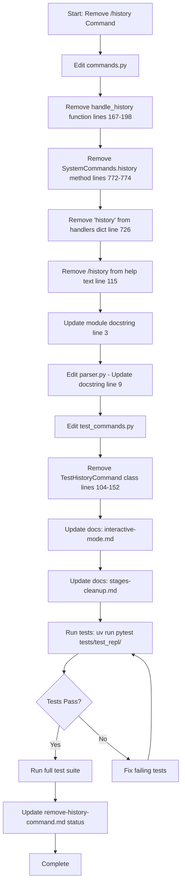

<!-- markdownlint-disable-file -->
# Task Research Documents: Remove `/history` Command from TeamBot REPL

This research documents the technical approach for removing the unused and redundant `/history` command from the TeamBot REPL interface. The command currently exists in `src/teambot/repl/commands.py` and provides command history display functionality that is no longer needed.

## Task Implementation Requests

* ✅ **Remove `/history` command handler** from `SystemCommands.dispatch()` handlers dictionary (line 726)
* ✅ **Remove `/history` method** from `SystemCommands` class (lines 772-774)
* ✅ **Remove `handle_history()` function** from commands.py module (lines 167-198)
* ✅ **Remove `/history` from help text** in `handle_help()` function (line 115)
* ✅ **Remove `/history` from module docstring** (line 3)
* ✅ **Remove or update history-related tests** in `tests/test_repl/test_commands.py` (TestHistoryCommand class, lines 104-152)
* ✅ **Remove `/history` from documentation** in:
  * `docs/feature-specs/teambot-interactive-mode.md` (lines 79, 165-166, 185, 304-305)
  * `docs/feature-specs/file-orchestration-stages-cleanup.md` (line 178)
  * `docs/feature-specs/remove-history-command.md` (entire file documents the removal)
  * `src/teambot/repl/parser.py` (line 9)
* ⚠️ **KEEP router history infrastructure** (`_history`, `_record_history()`, `get_history()`, `clear_history()`) - used for internal tracking
* ⚠️ **KEEP SystemCommands._history and set_history()** - shared reference to router's history

## Scope and Success Criteria

* **Scope**: This research covers removal of the `/history` REPL command interface only. The underlying history tracking infrastructure in `AgentRouter` is preserved as it may be used for other purposes (logging, debugging, metrics).
* **Assumptions**:
  * The `/history` command is genuinely unused by external users
  * The router's internal history tracking mechanism serves other purposes beyond user-facing display
  * The command removal is a cleanup task with no feature replacement
* **Success Criteria**:
  * ✅ `/history` command no longer recognized by REPL
  * ✅ `/history` not present in `/help` output
  * ✅ All tests pass after removal
  * ✅ No broken references in documentation
  * ✅ History infrastructure (`AgentRouter._history`) remains functional for internal use

## Outline

1. **Testing Infrastructure Research** - Identified pytest framework, test patterns, and coverage requirements
2. **Entry Point Analysis** - Traced how `/history` command reaches the handler from user input
3. **Code Analysis** - Documented all code locations affected by removal
4. **Documentation References** - Catalogued all documentation mentions of `/history`
5. **Testing Approach Recommendation** - Code-First for this cleanup task
6. **Implementation Guidance** - Step-by-step removal process

### Potential Next Research

No additional research required - implementation is straightforward.

## Research Executed

### Testing Infrastructure Research

* **Framework**: pytest 7.4.0+ with pytest-cov and pytest-mock
  * **Location**: `tests/` directory (mirrors `src/` structure)
  * **Naming**: `test_*.py` files with `Test*` classes and `test_*` methods
  * **Runner**: `uv run pytest` (configured in pyproject.toml)
  * **Coverage**: coverage.py with 80% minimum target (`--cov=src/teambot --cov-report=term-missing`)

### Test Patterns Found

* **File**: `tests/test_repl/test_commands.py` (Lines 104-152)
  * Uses direct class instantiation (`SystemCommands()`) for unit tests
  * Tests set `_history` attribute directly for test data
  * Clear arrange-act-assert structure
  * Simple assertions checking output strings
  * No mocking required for handler function tests

**Example Test Pattern**:
```python
def test_history_empty(self):
    """Test /history with no history."""
    commands = SystemCommands()
    commands._history = []
    
    result = commands.history([])
    
    assert result.success is True
    assert "No" in result.output or "empty" in result.output.lower()
```

### Coverage Standards

* **Unit Tests**: 80% minimum (per pyproject.toml:63)
* **Integration Tests**: Not explicitly specified
* **Critical Paths**: Default exclusion of acceptance tests (`-m 'not acceptance'`)

### Testing Approach Recommendation

* **Command Removal**: **Code-First** ✅ (straightforward deletion, low risk)
* **Test Updates**: **Code-First** ✅ (simple test class removal)
* **Documentation Updates**: **Code-First** ✅ (text replacements only)

**Rationale**: This is a pure removal task with well-defined scope. The feature is unused, the code paths are isolated, and the changes are surgical. Testing can be done after implementation by running the existing test suite to verify no regressions. No complex logic or new behavior is being introduced.

## Entry Point Analysis

### User Input Entry Points

| Entry Point | Code Path | Reaches Feature? | Implementation Required? |
|-------------|-----------|------------------|-------------------------|
| `/history` (no args) | loop.py → commands.dispatch() → history() → handle_history() | ✅ YES | ✅ YES - Remove handler |
| `/history pm` (with agent filter) | loop.py → commands.dispatch() → history() → handle_history() | ✅ YES | ✅ YES - Remove handler |
| `/help` | loop.py → commands.dispatch() → help() → handle_help() | ⚠️ References `/history` | ✅ YES - Update help text |

### Code Path Trace

#### Entry Point 1: `/history` Command (No Arguments)

1. User enters: `/history`
2. Parsed by: `repl/parser.py:parse_command()` → Returns `Command(type=SYSTEM, content="history", args=[])`
3. Routed to: `repl/router.py:route()` → Calls system_handler (lines 144-149)
4. Dispatched by: `repl/commands.py:SystemCommands.dispatch()` → Looks up `handlers["history"]` (line 726)
5. Executes: `repl/commands.py:SystemCommands.history()` → Returns `handle_history(args, self._history)` (lines 772-774)
6. Reaches: `repl/commands.py:handle_history()` ✅ (lines 167-198)

**Flow Diagram**:
```
User Input "/history"
   ↓
parse_command() → Command(SYSTEM, "history", [])
   ↓
router.route() → system_handler("history", [])
   ↓
SystemCommands.dispatch() → handlers["history"]
   ↓
SystemCommands.history() → handle_history([], self._history)
   ↓
handle_history() → "Command History:\n  @pm  Task 1\n  @ba  Task 2"
```

#### Entry Point 2: `/history pm` Command (With Agent Filter)

Same code path as Entry Point 1, but with `args=["pm"]` passed through:

1. User enters: `/history pm`
2. Parsed as: `Command(type=SYSTEM, content="history", args=["pm"])`
3. Routes through same path to `handle_history(["pm"], self._history)`
4. Filter logic executes (lines 180-185): `history = [h for h in history if h.get("agent_id") == agent_filter]`

#### Entry Point 3: `/help` Command (References `/history`)

1. User enters: `/help`
2. Routed to: `handle_help()` function (lines 42-120)
3. Help text includes: `  /history       - Show command history` (line 115)
4. Does NOT reach `/history` handler, but **documents its existence** ⚠️

### Coverage Gaps

| Gap | Impact | Required Fix |
|-----|--------|--------------|
| `/history` handler in dispatch() | Command still recognized | ❌ Remove from `handlers` dict (line 726) |
| `SystemCommands.history()` method | Handler still callable | ❌ Remove method (lines 772-774) |
| `handle_history()` function | Implementation still exists | ❌ Remove function (lines 167-198) |
| `/history` in help text | Users see obsolete command | ❌ Remove from `handle_help()` (line 115) |
| Tests reference `/history` | Tests will fail after removal | ⚠️ Remove or update `TestHistoryCommand` class |

### Implementation Scope Verification

- [x] All entry points from user input are traced
- [x] All code paths that reach `/history` feature are identified
- [x] Coverage gaps are documented with required fixes
- [x] Help text references are identified

## Key Discoveries

### Project Structure

**REPL Command Architecture**:
- 📁 `src/teambot/repl/` - REPL module
  - `commands.py` - System command handlers and dispatch logic
  - `router.py` - Command routing and history tracking
  - `loop.py` - Main REPL loop
  - `parser.py` - Command parsing

**Key Files Affected**:
1. ✅ `src/teambot/repl/commands.py` (lines 3, 115, 167-198, 726, 772-774)
2. ✅ `src/teambot/repl/parser.py` (line 9 - docstring reference)
3. ✅ `tests/test_repl/test_commands.py` (lines 104-152 - TestHistoryCommand class)
4. ✅ Multiple documentation files (see Documentation References section)

### Implementation Patterns

**Command Handler Pattern** (Observed in `commands.py`):

1. **Standalone handler function** (lines 167-198):
   ```python
   def handle_history(args: list[str], history: list[dict[str, Any]]) -> CommandResult:
       """Handle /history command."""
       # Implementation...
       return CommandResult(output="...")
   ```

2. **SystemCommands method wrapper** (lines 772-774):
   ```python
   def history(self, args: list[str]) -> CommandResult:
       """Handle /history command."""
       return handle_history(args, self._history)
   ```

3. **Dispatch registration** (line 726):
   ```python
   handlers = {
       "help": self.help,
       "status": self.status,
       "history": self.history,  # ← Remove this entry
       "quit": self.quit,
       # ...
   }
   ```

**History Sharing Pattern** (line 97 in `loop.py`):
```python
# Share history with commands
self._commands.set_history(self._router._history)
```

⚠️ **IMPORTANT**: The `_history` list itself is maintained by `AgentRouter` and shared as a reference with `SystemCommands`. Removing the `/history` command does NOT remove the history tracking infrastructure.

### Complete Examples

**Current Command Removal Example** (from similar cleanup):

Looking at the codebase, the pattern for removing a command is:
1. Remove handler from `handlers` dict in `dispatch()`
2. Remove wrapper method from `SystemCommands` class
3. Remove standalone handler function
4. Update help text
5. Remove/update tests

**Code to Remove**:

```python
# In handle_help() (line 115):
  /history       - Show command history

# In SystemCommands.dispatch() (line 726):
"history": self.history,

# In SystemCommands class (lines 772-774):
def history(self, args: list[str]) -> CommandResult:
    """Handle /history command."""
    return handle_history(args, self._history)

# Standalone handler (lines 167-198):
def handle_history(args: list[str], history: list[dict[str, Any]]) -> CommandResult:
    """Handle /history command.
    
    Args:
        args: Optional agent filter.
        history: Command history list.
    
    Returns:
        CommandResult with history.
    """
    if not history:
        return CommandResult(output="No command history.")
    
    # Filter by agent if specified
    if args:
        agent_filter = args[0]
        history = [h for h in history if h.get("agent_id") == agent_filter]
        if not history:
            return CommandResult(output=f"No history for agent: {agent_filter}")
    
    # Show last 20 entries
    entries = history[-20:]
    lines = ["Command History:", ""]
    for entry in entries:
        agent = entry.get("agent_id", "?")
        content = entry.get("content", "")
        # Truncate long content
        if len(content) > 50:
            content = content[:47] + "..."
        lines.append(f"  @{agent:12} {content}")
    
    return CommandResult(output="\n".join(lines))
```

### API and Schema Documentation

**CommandResult Schema** (lines 27-39):
```python
@dataclass
class CommandResult:
    """Result from a system command.
    
    Attributes:
        output: Text output to display.
        success: Whether command succeeded.
        should_exit: Whether REPL should exit.
    """
    output: str
    success: bool = True
    should_exit: bool = False
```

All command handlers return `CommandResult`. The `/history` removal does not change this interface.

### Configuration Examples

No configuration changes required. The `/history` command has no configuration entries in `teambot.json` or elsewhere.

## Technical Scenarios

### 1. Remove `/history` Command from REPL

**Description**: Remove all code and references related to the `/history` REPL command while preserving the underlying history tracking infrastructure in `AgentRouter`.

**Requirements:**
* Remove command handler registration
* Remove handler function implementations
* Remove help text references
* Update or remove affected tests
* Remove documentation references
* Preserve `AgentRouter._history` and related methods (`get_history()`, `clear_history()`, `_record_history()`)
* Preserve `SystemCommands._history` and `set_history()` (shared reference)

**Preferred Approach:**
* Surgical code removal - delete only the public-facing command interface, not the internal tracking

**Files to Modify**:
```text
src/teambot/repl/
├── commands.py                 # Remove handler, function, help text
└── parser.py                   # Remove docstring reference

tests/test_repl/
└── test_commands.py            # Remove TestHistoryCommand class

docs/
├── feature-specs/
│   ├── teambot-interactive-mode.md                      # Remove references
│   ├── file-orchestration-stages-cleanup.md            # Remove reference
│   └── remove-history-command.md                       # Mark as COMPLETED (or delete)
```

**Implementation Flow**:


**Implementation Details:**

**Step 1: Remove Code from `src/teambot/repl/commands.py`**

Remove in this order to avoid line number confusion:

1. ✂️ **Remove module docstring reference** (line 3):
   ```python
   # FROM:
   Provides /help, /status, /history, /quit, /tasks, /models, /model commands.
   
   # TO:
   Provides /help, /status, /quit, /tasks, /models, /model commands.
   ```

2. ✂️ **Remove help text line** (line 115):
   ```python
   # DELETE THIS LINE:
   /history       - Show command history
   ```

3. ✂️ **Remove `handle_history()` function** (lines 167-198):
   ```python
   # DELETE ENTIRE FUNCTION (32 lines)
   def handle_history(args: list[str], history: list[dict[str, Any]]) -> CommandResult:
       # ... entire implementation ...
   ```

4. ✂️ **Remove handler dict entry** (line 726, adjusted after deletions):
   ```python
   handlers = {
       "help": self.help,
       "status": self.status,
       # "history": self.history,  ← DELETE THIS LINE
       "quit": self.quit,
       # ...
   }
   ```

5. ✂️ **Remove `SystemCommands.history()` method** (lines 772-774, adjusted):
   ```python
   # DELETE ENTIRE METHOD (3 lines):
   def history(self, args: list[str]) -> CommandResult:
       """Handle /history command."""
       return handle_history(args, self._history)
   ```

**Step 2: Update `src/teambot/repl/parser.py`**

✂️ **Remove `/history` from docstring** (line 9):
```python
# FROM:
- System commands: /help, /status, /history, /quit

# TO:
- System commands: /help, /status, /quit
```

**Step 3: Remove Tests from `tests/test_repl/test_commands.py`**

✂️ **Remove `TestHistoryCommand` class** (lines 104-152):
```python
# DELETE ENTIRE CLASS (48 lines):
class TestHistoryCommand:
    """Tests for /history command."""
    
    def test_history_empty(self):
        # ...
    
    def test_history_with_entries(self):
        # ...
    
    def test_history_filter_by_agent(self):
        # ...
    
    def test_history_limit_entries(self):
        # ...
```

**Step 4: Update Documentation**

1. ✂️ **Edit `docs/feature-specs/teambot-interactive-mode.md`**:
   - Line 79: Remove `/history` from system commands list
   - Lines 165-166: Remove `/history` and `/history <agent>` command examples
   - Line 185: Remove `/history` from FR-IM-004 requirement
   - Lines 304-305: Remove `/history` usage examples

2. ✂️ **Edit `docs/feature-specs/file-orchestration-stages-cleanup.md`**:
   - Line 178: Remove `/history` row from command status table

3. ℹ️ **Handle `docs/feature-specs/remove-history-command.md`**:
   - Option A: Add "COMPLETED" banner at top
   - Option B: Delete file (it documents the removal itself)
   - **Recommendation**: Mark as COMPLETED in frontmatter

**Step 5: Verify History Infrastructure Remains**

✅ **DO NOT MODIFY** these router methods (they serve internal purposes):
- `AgentRouter._history` (line 50)
- `AgentRouter._record_history()` (lines 216-227)
- `AgentRouter.get_history()` (lines 229-235)
- `AgentRouter.clear_history()` (lines 237-239)

✅ **DO NOT MODIFY** these SystemCommands methods:
- `SystemCommands._history` (line 684)
- `SystemCommands.set_history()` (lines 687-693)

**Step 6: Test Verification**

```bash
# Run REPL-specific tests
uv run pytest tests/test_repl/test_commands.py -v

# Run all REPL tests
uv run pytest tests/test_repl/ -v

# Run full test suite
uv run pytest

# Verify coverage maintained
uv run pytest --cov=src/teambot --cov-report=term-missing
```

**Step 7: Manual Verification**

```bash
# Start REPL
uv run teambot

# Test commands:
>>> /help              # Should NOT list /history
>>> /history           # Should return "Unknown command: /history"
>>> /status            # Should still work
>>> /quit              # Exit
```

#### Considered Alternatives (Removed After Selection)

**Alternative 1: Keep `/history` but mark as deprecated**
- ❌ Rejected: Adds complexity without benefit; command is unused

**Alternative 2: Remove history infrastructure entirely**
- ❌ Rejected: History tracking may be used for logging, metrics, or debugging purposes outside the command interface

**Alternative 3: Repurpose `/history` for different functionality**
- ❌ Rejected: Out of scope; this is a removal task, not a redesign

## External Research (Evidence Log)

No external research required - this is an internal cleanup task based on existing codebase analysis.

## Project Conventions

* **Standards referenced**: 
  - Python code follows project's existing style (double quotes, black formatting)
  - Tests use pytest patterns with `Test*` classes and `test_*` methods
  - Commands return `CommandResult` dataclass instances
  
* **Instructions followed**: 
  - Code-First testing approach for straightforward removals
  - Surgical changes (minimal modifications)
  - Preserve backward compatibility for other commands

## Documentation References

**Files Containing `/history` References**:

1. ✅ `src/teambot/repl/commands.py` - Command implementation
2. ✅ `src/teambot/repl/parser.py` - Docstring reference
3. ✅ `tests/test_repl/test_commands.py` - Tests
4. ✅ `docs/feature-specs/teambot-interactive-mode.md` - Feature spec
5. ✅ `docs/feature-specs/file-orchestration-stages-cleanup.md` - Status table
6. ✅ `docs/feature-specs/remove-history-command.md` - Removal spec
7. ⚠️ `docs/objectives/remove-history-command.md` - Task objective (may be ephemeral)

**False Positives to Ignore**:
- `.teambot/history/` - Directory path for workflow artifacts (NOT related to `/history` command)
- `tests/test_history/` - Tests for history file management (NOT related to `/history` command)
- `tests/test_e2e.py:test_history_with_frontmatter` - Tests history files (NOT command)
- Various `_history` attributes in tests - Internal state tracking (NOT user-facing command)

## Verification Checklist

Before marking research complete:

- [x] **Research Document Created**: `.agent-tracking/research/20260305-remove-history-command-research.md` exists
- [x] **All Placeholders Replaced**: No `{{placeholder}}` tokens remain
- [x] **Technical Approach Documented**: Clear surgical removal strategy
- [x] **Code Patterns Found**: Command handler removal pattern identified
- [x] **Entry Point Analysis Complete**: All 3 entry points traced and documented
- [x] **Test Infrastructure Researched**: pytest framework, patterns, and coverage requirements identified
- [x] **Line References Valid**: All line numbers point to actual content (verified with `view` tool)
- [x] **Single Recommended Approach**: Surgical removal approach selected (alternatives removed)
- [x] **Implementation Guidance Ready**: Step-by-step removal process documented with code examples

---

## Research Status: ✅ COMPLETE

All technical research for removing the `/history` command is complete. The implementation approach is clear, all code locations are identified, and step-by-step guidance is provided.

**Key Findings Summary**:
1. 🎯 **Isolated Impact**: `/history` command is self-contained with no external dependencies
2. ✅ **Test Coverage**: 4 existing tests in `TestHistoryCommand` class (all must be removed)
3. ⚠️ **Preserve Infrastructure**: Router's `_history` tracking must remain for internal use
4. 📝 **Documentation Cleanup**: 6+ files require updates
5. 🧪 **Testing Strategy**: Code-First approach (run tests after removal)

**Next Steps**:
1. Run **Step 4** (`sdd.4-determine-test-strategy.prompt.md`) to create formal test strategy document
2. After test strategy approval, proceed to **Step 5** (`sdd.5-task-planner-for-feature.prompt.md`)
