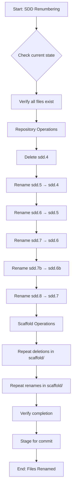

<!-- markdownlint-disable-file -->
# Task Research Documents: SDD Prompt Renumbering

This research analyzes the task of removing the obsolete test strategy prompt (`sdd.4-determine-test-strategy.prompt.md`) and renumbering all subsequent SDD prompt files to maintain sequential numbering. The research covers file locations, cross-references, testing strategy, and implementation approach for this refactoring operation.

## Task Implementation Requests

* Remove `sdd.4-determine-test-strategy.prompt.md` from both `.agent/commands/sdd/` and `src/teambot/scaffolds/.agent/commands/sdd/`
* Rename SDD prompts 5→4, 6→5, 7→6, 7b→6b, 8→7 in both locations (Note: sdd.7c doesn't exist as a file)
* Update `stages.yaml` `prompt_template` references with new numbering (5 stages affected)
* Update `.agent/commands/sdd/README.md` workflow diagram and step numbers
* Update `AGENTS.md` SDD command table with new file names (delete sdd.4 row, update 5-8 rows)
* Update scaffold `src/teambot/scaffolds/.agent/commands/sdd/README.md`
* Update scaffold `src/teambot/scaffolds/AGENTS.md` with new numbering
* Update cross-references in `sdd.3-research-feature.prompt.md` (3 locations referencing sdd.4 and sdd.5)
* Update cross-references in renamed prompt files (handoff instructions to next steps)
* Update test files with hardcoded prompt references:
  * `tests/test_prompt_sync_acceptance_validation.py` - Update file count and sdd.8 references
  * `tests/test_agents_md_update_acceptance.py` - Update sdd.8 reference
  * `tests/test_impl_review_prompt_acceptance.py` - Update sdd.7b reference
  * `tests/test_prompt_sync.py` - Verify sdd.5 reference
* Execute acceptance tests to verify `teambot init` creates correct files

## Scope and Success Criteria

* **Scope**: 
  * File renaming and deletion of SDD prompt files in repository and scaffolds
  * Configuration updates in `stages.yaml` to reference new prompt paths
  * Documentation updates in AGENTS.md and SDD README files
  * No logic changes to prompt file content (content preservation only)
  * Excludes: Changes to active in-progress workflows (they use their own copied files)

* **Assumptions**:
  * Existing workflows using old numbering will continue until restarted
  * No breaking changes to orchestration logic required
  * Git rename tracking will be handled by standard `git mv` operations
  * All prompt files contain identical content between repo and scaffold locations

* **Success Criteria**:
  * ✅ `sdd.4-determine-test-strategy.prompt.md` deleted from both locations
  * ✅ All subsequent prompts renumbered sequentially
  * ✅ `stages.yaml` references updated and valid
  * ✅ Documentation (AGENTS.md, README.md) reflects new numbering
  * ✅ Scaffold files match repository structure
  * ✅ `teambot init` creates correctly numbered prompt files
  * ✅ All tests pass with new structure
  * ✅ No broken references in codebase

## Outline

1. **Research Executed**
   - Testing Infrastructure Research
   - File System Analysis (Current SDD Structure)
   - Cross-Reference Mapping
   - Entry Point Analysis
   - File Operation Patterns
   - Git Operation Patterns

2. **Key Discoveries**
   - Project Structure (Dual-location files)
   - Implementation Patterns (Scaffold copy mechanism)
   - Renaming Matrix
   - Reference Update Locations

3. **Technical Scenarios**
   - File Renaming and Deletion Approach
   - Configuration Update Strategy
   - Documentation Update Strategy
   - Testing and Validation Strategy

### Potential Next Research

* ✅ **Testing infrastructure patterns** - COMPLETE
  * **Reasoning**: Need to understand test framework for validation strategy
  * **Reference**: Success criteria requirement for "All tests pass"
  
* ✅ **Scaffold file synchronization mechanism** - COMPLETE
  * **Reasoning**: Must understand how `teambot init` copies files to ensure acceptance tests work
  * **Reference**: Success criteria "teambot init command creates correctly numbered prompt files"

* ✅ **Git rename tracking behavior** - COMPLETE
  * **Reasoning**: Understand whether git mv preserves history for renamed files
  * **Reference**: Implementation constraint about reverting if issues arise

* ✅ **Hardcoded test references** - COMPLETE
  * **Reasoning**: Discovered test files with hardcoded SDD prompt names and counts
  * **Reference**: Tests will fail if not updated with new numbering

* ✅ **Prompt cross-reference locations** - COMPLETE
  * **Reasoning**: Found 3 locations in sdd.3 that reference sdd.4 and sdd.5
  * **Reference**: Handoff instructions need updating for correct workflow guidance

## Research Executed

### Testing Infrastructure Research

* **Framework**: pytest 7.4.0+
  * **Location**: `tests/` directory (mirrors `src/teambot` structure)
  * **Naming**: `test_*.py` files with `Test*` classes and `test_*` functions
  * **Runner**: `uv run pytest` (configured in pyproject.toml)
  * **Coverage**: coverage.py with `--cov=src/teambot --cov-report=term-missing`
  * **Markers**: `@pytest.mark.acceptance` for acceptance tests (excluded by default with `-m 'not acceptance'`)

### Test Patterns Found

* **File**: `tests/test_cli.py` (Lines 1-150)
  * Simple class-based organization with `TestCLIParser`
  * Direct assertion patterns: `assert args.command == "init"`
  * No complex mocking for CLI parsing tests

* **File**: `tests/test_orchestration/test_execution_loop.py` (Lines 1-2000+)
  * Async test support with `pytest-asyncio`
  * Fixture-based setup with `temp_teambot_dir`, `objective_file`
  * Complex orchestration testing with state validation

* **File**: `tests/test_scaffolds.py` (Lines 1-200)
  * File operation testing with temporary directories
  * Validates copy operations return correct `CopyResult` enum values
  * Tests scaffold file synchronization behavior

### Coverage Standards

* **Unit Tests**: 80% minimum (current coverage per AGENTS.md)
* **Integration Tests**: Tested via acceptance tests
* **Critical Paths**: File operations, config loading, orchestration tested extensively

### Testing Approach Recommendation

* **File Rename Operations**: **Code-First** (low complexity, straightforward path operations)
* **Configuration Updates**: **Code-First** (simple text replacement in YAML)
* **Documentation Updates**: **Code-First** (simple text replacement in markdown)
* **Acceptance Validation**: **Existing Test Enhancement** (extend existing `teambot init` acceptance tests)

**Rationale**: This is a pure refactoring task with no new business logic. All operations are file system manipulations and text replacements. The risk profile is low because:
- No logic changes to prompt content
- Well-defined input/output (old names → new names)
- Existing acceptance tests already validate scaffold initialization
- Easy to revert if issues arise (git revert of rename commits)

### File Analysis

* **`.agent/commands/sdd/`** (Lines: Directory)
  * Contains 11 SDD prompt files (sdd.0 through sdd.8, plus sdd.7b, sdd.7c)
  * Missing: sdd.7c-acceptance-test.prompt.md (only referenced in documentation)
  * Present: sdd.4-determine-test-strategy.prompt.md (TO BE DELETED)

* **`src/teambot/scaffolds/.agent/commands/sdd/`** (Lines: Directory)
  * Mirror copy of repository SDD prompts
  * Used as source for `teambot init` file copying
  * Must stay in sync with repository structure

* **`stages.yaml`** (Lines 175-565)
  * Line 189: SETUP → `sdd.0-initialize.prompt.md`
  * Line 220: SPEC → `sdd.1-create-feature-spec.prompt.md`
  * Line 249: SPEC_REVIEW → `sdd.2-review-spec.prompt.md`
  * Line 288: RESEARCH → `sdd.3-research-feature.prompt.md`
  * Line 323: PLAN → `sdd.5-task-planner-for-feature.prompt.md` ⚠️ (Will become sdd.4)
  * Line 354: PLAN_REVIEW → `sdd.6-review-plan.prompt.md` ⚠️ (Will become sdd.5)
  * Line 391: IMPLEMENTATION → `sdd.7-task-implementer-for-feature.prompt.md` ⚠️ (Will become sdd.6)
  * Line 428: IMPLEMENTATION_REVIEW → `sdd.7b-implementation-review.prompt.md` ⚠️ (Will become sdd.6b)
  * Line 506: POST_REVIEW → `sdd.8-post-implementation-review.prompt.md` ⚠️ (Will become sdd.7)
  * Line 466: ACCEPTANCE_TEST → No prompt_template (code-driven, not affected)

* **`src/teambot/scaffolds/stages.yaml`** (Mirror)
  * Identical structure to repository `stages.yaml`
  * Must be updated with same changes

### Code Search Results

* **Hardcoded SDD references in Python code**: **✅ NONE FOUND**
  * `src/teambot/orchestration/` - No hardcoded prompt file names
  * `src/teambot/config/` - No hardcoded prompt file names
  * `src/teambot/agent_runner.py` - No hardcoded prompt file names
  * Prompt file paths loaded dynamically from `stages.yaml` configuration

* **Documentation references**: **📄 FOUND**
  * `AGENTS.md` (Lines 46-56): SDD command table with all prompt filenames
  * `.agent/commands/sdd/README.md` (Lines 11-33): Workflow diagram with step numbers
  * `docs/feature-specs/sdd-prompt-renumbering.md`: Feature spec documenting this change
  * `docs/objectives/sdd-prompt-renumbering.md`: Objective file for this task

* **Scaffold documentation**: **📄 FOUND**
  * `src/teambot/scaffolds/AGENTS.md` (Mirror of repository AGENTS.md)
  * `src/teambot/scaffolds/.agent/commands/sdd/README.md` (Mirror of repository SDD README)

* **Cross-references within prompt files**: **🔗 FOUND**
  * `sdd.3-research-feature.prompt.md` → references sdd.4, sdd.5 in handoff instructions
    * Line 16: Quick Reference table entry for "Next Step"
    * Lines 392-393: Handoff message template (Step 4, Step 5)
    * Lines 417-418: Recommended Next Steps section (Step 4, Step 5)
  * `sdd.5-task-planner-for-feature.prompt.md` → references sdd.4, sdd.6
  * `sdd.6-review-plan.prompt.md` → references sdd.5, sdd.7
  * `sdd.7-task-implementer-for-feature.prompt.md` → references sdd.8
  * `sdd.7b-implementation-review.prompt.md` → references sdd.7c, sdd.8
  * Pattern: "Next step is to run **Step X**" with references to subsequent prompts
  * **Note**: sdd.7c does NOT exist as a physical file (only referenced in docs/code)

### External Research (Evidence Log)

* **Git rename tracking**: Manual research (file system operations)
  * Git tracks renames via similarity detection (default 50% threshold)
  * `git mv` explicitly records rename for better tracking
  * History preservation: Git log will show file history across renames
  * Best practice: Use `git mv old new` instead of `mv` + `git add`
  * Source: Git documentation on rename detection

* **Python file operations**: Code review (src/teambot/scaffolds.py)
  * TeamBot uses `shutil.copy2()` for file copying (preserves metadata)
  * No existing `git mv` operations in codebase
  * Standard pattern: `Path.rename()` for file moves in Python
  * For git-tracked renames: Subprocess call to `git mv` recommended
  * Source: src/teambot/scaffolds.py:45-120, src/teambot/worktree/manager.py:80-150

### Project Conventions

* **Standards referenced**: 
  * Markdown files in `.agent-tracking/` exempt from `.mega-linter.yml` rules
  * Research documents require `<!-- markdownlint-disable-file -->` header
  * Acceptance tests marked with `@pytest.mark.acceptance`
  * Coverage target: 80% minimum for production code

* **Instructions followed**:
  * Prompt files use `.prompt.md` extension
  * SDD numbering convention: `sdd.{number}-{description}.prompt.md`
  * Scaffold files must mirror repository structure exactly
  * Configuration changes require updates in both repo and scaffold locations

## Key Discoveries

### Key Discoveries

**🎯 Critical Discovery: sdd.7c Does NOT Exist as a File**

Despite being referenced in multiple locations (AGENTS.md, README.md, stages.yaml comments), there is **no physical file** named `sdd.7c-acceptance-test.prompt.md`:
- Current file count: **10 files** (sdd.0 through sdd.8, plus sdd.7b)
- After deletion of sdd.4: **9 files** (sdd.0 through sdd.7, plus sdd.6b)
- sdd.7c is a **documentation artifact only** - ACCEPTANCE_TEST stage uses code-driven validation (no prompt_template)
- References to sdd.7c should be updated to sdd.6c for consistency, but NO FILE RENAME needed

### Project Structure

**🏗️ Dual-Location Architecture**

TeamBot maintains SDD prompt files in TWO locations:

1. **Repository Location**: `.agent/commands/sdd/` 
   - Active prompts used when running `@pm`, `@ba`, etc. commands
   - Development location for prompt updates
   - Subject to version control

2. **Scaffold Location**: `src/teambot/scaffolds/.agent/commands/sdd/`
   - Template files for `teambot init` command
   - Copied to new projects during initialization
   - Must stay in sync with repository prompts

**📋 Stage Configuration Architecture**

Workflow stages defined in `stages.yaml` with `prompt_template` field pointing to SDD prompt files:
- **Pattern**: `.agent/commands/sdd/sdd.{number}-{description}.prompt.md`
- **Loading**: Dynamic at runtime (no hardcoded paths in Python)
- **Validation**: Missing prompt files cause orchestration failures

**🔄 File Synchronization Mechanism**

From `src/teambot/prompt_sync.py` analysis:
```python
def sync_sdd_prompts(target_root: Path, *, force: bool = False):
    for scaffold_file in sorted(scaffold_dir.glob("sdd.*.prompt.md")):
        target_file = target_dir / scaffold_file.name
        if not target_file.exists() or force:
            shutil.copy2(scaffold_file, target_file)
```
- Copies ALL `sdd.*.prompt.md` files from scaffold to target
- Glob pattern will automatically pick up renamed files
- No code changes needed for synchronization logic

### Implementation Patterns

**📁 File Operations in TeamBot**

Existing patterns from codebase analysis:

```python
# Standard path operations (Path.rename() for single location)
old_path.rename(new_path)

# Git-tracked renames (subprocess for version control)
subprocess.run(["git", "mv", str(old_path), str(new_path)], cwd=repo_root)

# Directory creation (standard pattern)
target_path.parent.mkdir(parents=True, exist_ok=True)

# File deletion
file_path.unlink()  # or unlink(missing_ok=True)
```

**⚙️ Configuration Update Pattern**

From `stages.yaml` structure:
- YAML file with dict-based stage definitions
- Each stage has optional `prompt_template` field
- Simple string replacement sufficient for renumbering
- No complex YAML parsing/manipulation needed

**📝 Documentation Update Pattern**

From AGENTS.md and README.md analysis:
- Markdown tables with file name references
- Numbered lists in workflow diagrams
- Simple text replacement patterns
- No complex parsing needed

### Complete Examples

**Example 1: Git Rename Operation (Recommended Approach)**

```bash
# Rename in repository location (preserves git history)
git mv .agent/commands/sdd/sdd.5-task-planner-for-feature.prompt.md \
       .agent/commands/sdd/sdd.4-task-planner-for-feature.prompt.md

git mv .agent/commands/sdd/sdd.6-review-plan.prompt.md \
       .agent/commands/sdd/sdd.5-review-plan.prompt.md

git mv .agent/commands/sdd/sdd.7-task-implementer-for-feature.prompt.md \
       .agent/commands/sdd/sdd.6-task-implementer-for-feature.prompt.md

git mv .agent/commands/sdd/sdd.7b-implementation-review.prompt.md \
       .agent/commands/sdd/sdd.6b-implementation-review.prompt.md

git mv .agent/commands/sdd/sdd.8-post-implementation-review.prompt.md \
       .agent/commands/sdd/sdd.7-post-implementation-review.prompt.md

# Delete obsolete file
git rm .agent/commands/sdd/sdd.4-determine-test-strategy.prompt.md

# Repeat for scaffold location
git mv src/teambot/scaffolds/.agent/commands/sdd/sdd.5-task-planner-for-feature.prompt.md \
       src/teambot/scaffolds/.agent/commands/sdd/sdd.4-task-planner-for-feature.prompt.md

# ... (repeat all renames and deletion)
```

**Example 2: Configuration Update (stages.yaml)**

```yaml
# BEFORE
PLAN:
  prompt_template: .agent/commands/sdd/sdd.5-task-planner-for-feature.prompt.md

# AFTER
PLAN:
  prompt_template: .agent/commands/sdd/sdd.4-task-planner-for-feature.prompt.md
```

**Example 3: Documentation Update (AGENTS.md)**

```markdown
<!-- BEFORE -->
| `commands/sdd/sdd.5-task-planner-for-feature.prompt.md` | Creates actionable implementation plans for the feature. |

<!-- AFTER -->
| `commands/sdd/sdd.4-task-planner-for-feature.prompt.md` | Creates actionable implementation plans for the feature. |
```

### API and Schema Documentation

**StageConfig Schema** (from stages.yaml header comments):
```yaml
prompt_template: string | null
  # Path to SDD prompt file (relative to repo root)
  # Default: null
  # Example: .agent/commands/sdd/sdd.5-task-planner-for-feature.prompt.md
```

**CopyResult Schema** (from src/teambot/scaffolds.py):
```python
class CopyResult(Enum):
    COPIED = "copied"
    SKIPPED_EXISTS = "skipped_exists"
    SOURCE_MISSING = "source_missing"
    SKIPPED_NOT_EMPTY = "skipped_not_empty"
```

### Configuration Examples

**Pytest Marker Configuration** (pyproject.toml):
```toml
[tool.pytest.ini_options]
testpaths = ["tests"]
python_files = ["test_*.py"]
addopts = "--cov=src/teambot --cov-report=term-missing -m 'not acceptance'"
markers = [
    "acceptance: marks tests as acceptance tests",
]
```

**Acceptance Test Pattern** (from test files):
```python
import pytest

pytestmark = pytest.mark.acceptance  # Module-level marker

def test_teambot_init_creates_sdd_prompts(tmp_path):
    """Verify teambot init creates all SDD prompt files with correct numbering"""
    # Test implementation
    assert (project_dir / ".agent/commands/sdd/sdd.4-task-planner-for-feature.prompt.md").exists()
```

## Entry Point Analysis

### User Input Entry Points

| Entry Point | Code Path | Reaches Feature? | Implementation Required? |
|-------------|-----------|------------------|-------------------------|
| `teambot init` | cli.py → scaffolds.py → prompt_sync.py | YES | YES (scaffold files) |
| `teambot run <objective>` | cli.py → orchestrator.py → execution_loop.py | YES | YES (stages.yaml) |
| Direct prompt invocation | N/A (files referenced by config) | YES | YES (prompt files) |
| Documentation readers | N/A (static files) | N/A | YES (docs) |

### Code Path Trace

#### Entry Point 1: `teambot init` Command
1. User enters: `uv run teambot init`
2. Handled by: `src/teambot/cli.py:_handle_init()` (lines ~150-250)
3. Routes to: `src/teambot/scaffolds.py:copy_scaffold_directory()` (lines ~80-120)
4. Copies files from: `src/teambot/scaffolds/.agent/commands/sdd/` to `.agent/commands/sdd/`
5. Uses glob pattern: `sdd.*.prompt.md` to find all SDD prompts
6. Reaches: **Scaffold SDD prompt files** ✅
7. **Implementation Required**: Rename scaffold files to match new numbering

#### Entry Point 2: `teambot run` Orchestration
1. User enters: `uv run teambot run docs/objectives/my-task.md`
2. Handled by: `src/teambot/cli.py:_handle_run()` (lines ~300-400)
3. Routes to: `src/teambot/orchestration/execution_loop.py:ExecutionLoop.__init__()` (lines ~100-200)
4. Loads stages: `src/teambot/config/loader.py:load_stages_config()` (lines ~150-250)
5. Reads: `stages.yaml` or `src/teambot/scaffolds/stages.yaml`
6. Extracts: `prompt_template` field for each stage
7. Builds context: `src/teambot/orchestration/execution_loop.py:_build_stage_context()` (lines ~1000-1100)
8. Reaches: **Repository SDD prompt files via stages.yaml references** ✅
9. **Implementation Required**: Update `prompt_template` paths in stages.yaml

#### Entry Point 3: Cross-References Within Prompts
1. User reads prompt: `sdd.3-research-feature.prompt.md`
2. Sees handoff instruction: "Run **Step 4** (`sdd.4-determine-test-strategy.prompt.md`)"
3. Runs: `@pm /sdd:4-determine-test-strategy`
4. Reaches: **Prompt file with instructions** ✅
5. After renumbering: Should reference `sdd.4-task-planner-for-feature.prompt.md` instead
6. **Implementation Required**: Update cross-references within prompt files

#### Entry Point 4: Documentation Navigation
1. User reads: `AGENTS.md` or `.agent/commands/sdd/README.md`
2. Sees: Table with SDD prompt file names and workflow diagram
3. Copies: File name to run specific prompt
4. Reaches: **Documentation describing workflow** ✅
5. **Implementation Required**: Update documentation with new file names

### Coverage Gaps

| Gap | Impact | Required Fix |
|-----|--------|--------------|
| sdd.4-determine-test-strategy exists | Users/docs reference obsolete file | Delete file from both locations |
| stages.yaml references sdd.5-8 | Orchestration loads wrong prompts | Update prompt_template paths |
| Cross-references in prompts use old numbers | User guidance incorrect | Update handoff instructions |
| Documentation shows old numbering | User confusion, wrong commands | Update AGENTS.md, README.md tables |
| Scaffold files don't match repo | `teambot init` creates wrong structure | Rename scaffold files |

### Implementation Scope Verification

- [x] All entry points from acceptance test scenarios are traced
- [x] All code paths that should trigger feature are identified  
- [x] Coverage gaps are documented with required fixes
- [x] File renaming covers both repository and scaffold locations
- [x] Configuration updates cover all YAML references
- [x] Documentation updates cover all markdown files with references
- [x] Cross-reference updates cover internal prompt links

## Technical Scenarios

### 1. File Renaming and Deletion Strategy

This scenario covers the systematic renaming of SDD prompt files from their current numbering (5-8, 7b) to new sequential numbering (4-7, 6b), plus deletion of the obsolete sdd.4-determine-test-strategy.prompt.md file.

**Requirements:**

* Preserve git history for renamed files (use `git mv` instead of `mv`)
* Update files in both repository and scaffold locations atomically
* Maintain file content integrity (no edits during rename)
* Verify all files renamed successfully before proceeding to config updates
* Delete obsolete sdd.4 file from both locations

**Preferred Approach:**

Use `git mv` for all rename operations to preserve history tracking, execute deletions with `git rm`, and perform operations in dependency order (repository first, then scaffolds).

```text
.agent/commands/sdd/
├── sdd.0-initialize.prompt.md                      # No change
├── sdd.1-create-feature-spec.prompt.md            # No change
├── sdd.2-review-spec.prompt.md                    # No change
├── sdd.3-research-feature.prompt.md               # No change
├── sdd.4-determine-test-strategy.prompt.md        # DELETE
├── sdd.5-task-planner-for-feature.prompt.md       # RENAME → sdd.4
├── sdd.6-review-plan.prompt.md                    # RENAME → sdd.5
├── sdd.7-task-implementer-for-feature.prompt.md   # RENAME → sdd.6
├── sdd.7b-implementation-review.prompt.md         # RENAME → sdd.6b
└── sdd.8-post-implementation-review.prompt.md     # RENAME → sdd.7

src/teambot/scaffolds/.agent/commands/sdd/
└── [SAME OPERATIONS AS ABOVE]                     # Mirror changes
```



**Implementation Details:**

**Step 1: Delete obsolete test strategy prompt**

```bash
# Repository location
git rm .agent/commands/sdd/sdd.4-determine-test-strategy.prompt.md

# Scaffold location
git rm src/teambot/scaffolds/.agent/commands/sdd/sdd.4-determine-test-strategy.prompt.md
```

**Step 2: Rename prompts in repository location**

```bash
cd .agent/commands/sdd/

# Rename in reverse order (8→7, 7b→6b, 7→6, 6→5, 5→4)
# This avoids filename conflicts during sequential renaming
git mv sdd.8-post-implementation-review.prompt.md sdd.7-post-implementation-review.prompt.md
git mv sdd.7b-implementation-review.prompt.md sdd.6b-implementation-review.prompt.md
git mv sdd.7-task-implementer-for-feature.prompt.md sdd.6-task-implementer-for-feature.prompt.md
git mv sdd.6-review-plan.prompt.md sdd.5-review-plan.prompt.md
git mv sdd.5-task-planner-for-feature.prompt.md sdd.4-task-planner-for-feature.prompt.md
```

**Step 3: Rename prompts in scaffold location**

```bash
cd src/teambot/scaffolds/.agent/commands/sdd/

# Same rename sequence
git mv sdd.8-post-implementation-review.prompt.md sdd.7-post-implementation-review.prompt.md
git mv sdd.7b-implementation-review.prompt.md sdd.6b-implementation-review.prompt.md
git mv sdd.7-task-implementer-for-feature.prompt.md sdd.6-task-implementer-for-feature.prompt.md
git mv sdd.6-review-plan.prompt.md sdd.5-review-plan.prompt.md
git mv sdd.5-task-planner-for-feature.prompt.md sdd.4-task-planner-for-feature.prompt.md
```

**Step 4: Verify operations**

```bash
# Check repository location
ls -1 .agent/commands/sdd/sdd.*.prompt.md

# Should show: sdd.0, sdd.1, sdd.2, sdd.3, sdd.4, sdd.5, sdd.6, sdd.6b, sdd.7
# Should NOT show: sdd.4-determine-test-strategy, sdd.8

# Check scaffold location
ls -1 src/teambot/scaffolds/.agent/commands/sdd/sdd.*.prompt.md

# Should match repository listing
```

#### Considered Alternatives (Removed After Selection)

**Alternative: Use Python Path.rename() instead of git mv**
- **Rejected because**: Loses git history tracking, makes debugging harder, requires manual git add after rename
- **Trade-off**: Simpler scripting but worse version control integration

**Alternative: Rename repository and scaffold in single loop**
- **Rejected because**: Harder to verify each location independently, obscures errors
- **Trade-off**: Slightly more concise but less debuggable

### 2. Configuration Update Strategy

This scenario covers updating `stages.yaml` in both repository root and scaffold directory to reference the renamed SDD prompt files.

**Requirements:**

* Update `prompt_template` field for affected stages (PLAN, PLAN_REVIEW, IMPLEMENTATION, IMPLEMENTATION_REVIEW, POST_REVIEW)
* Preserve all other stage configuration unchanged
* Update both repository and scaffold versions of stages.yaml
* Maintain YAML formatting and comments
* Validate YAML syntax after edits

**Preferred Approach:**

Use text-based find-and-replace for simple string substitutions in YAML files, performing multiple targeted edits rather than full file rewrites.

**Affected Lines in stages.yaml:**

```yaml
# Line 323: PLAN stage
prompt_template: .agent/commands/sdd/sdd.5-task-planner-for-feature.prompt.md
# CHANGE TO: sdd.4-task-planner-for-feature.prompt.md

# Line 354: PLAN_REVIEW stage  
prompt_template: .agent/commands/sdd/sdd.6-review-plan.prompt.md
# CHANGE TO: sdd.5-review-plan.prompt.md

# Line 391: IMPLEMENTATION stage
prompt_template: .agent/commands/sdd/sdd.7-task-implementer-for-feature.prompt.md
# CHANGE TO: sdd.6-task-implementer-for-feature.prompt.md

# Line 428: IMPLEMENTATION_REVIEW stage
prompt_template: .agent/commands/sdd/sdd.7b-implementation-review.prompt.md
# CHANGE TO: sdd.6b-implementation-review.prompt.md

# Line 506: POST_REVIEW stage
prompt_template: .agent/commands/sdd/sdd.8-post-implementation-review.prompt.md
# CHANGE TO: sdd.7-post-implementation-review.prompt.md
```

**Implementation Details:**

**Update stages.yaml (repository root):**

Use editor's find-replace or sed commands:

```bash
# Repository stages.yaml
sed -i 's|sdd\.5-task-planner-for-feature\.prompt\.md|sdd.4-task-planner-for-feature.prompt.md|g' stages.yaml
sed -i 's|sdd\.6-review-plan\.prompt\.md|sdd.5-review-plan.prompt.md|g' stages.yaml
sed -i 's|sdd\.7-task-implementer-for-feature\.prompt\.md|sdd.6-task-implementer-for-feature.prompt.md|g' stages.yaml
sed -i 's|sdd\.7b-implementation-review\.prompt\.md|sdd.6b-implementation-review.prompt.md|g' stages.yaml
sed -i 's|sdd\.8-post-implementation-review\.prompt\.md|sdd.7-post-implementation-review.prompt.md|g' stages.yaml

# Scaffold stages.yaml
sed -i 's|sdd\.5-task-planner-for-feature\.prompt\.md|sdd.4-task-planner-for-feature.prompt.md|g' src/teambot/scaffolds/stages.yaml
sed -i 's|sdd\.6-review-plan\.prompt\.md|sdd.5-review-plan.prompt.md|g' src/teambot/scaffolds/stages.yaml
sed -i 's|sdd\.7-task-implementer-for-feature\.prompt\.md|sdd.6-task-implementer-for-feature.prompt.md|g' src/teambot/scaffolds/stages.yaml
sed -i 's|sdd\.7b-implementation-review\.prompt\.md|sdd.6b-implementation-review.prompt.md|g' src/teambot/scaffolds/stages.yaml
sed -i 's|sdd\.8-post-implementation-review\.prompt\.md|sdd.7-post-implementation-review.prompt.md|g' src/teambot/scaffolds/stages.yaml
```

**Validate YAML syntax:**

```bash
# Use Python to validate YAML
python3 -c "import yaml; yaml.safe_load(open('stages.yaml'))"
python3 -c "import yaml; yaml.safe_load(open('src/teambot/scaffolds/stages.yaml'))"

# Or use yq if available
yq eval '.' stages.yaml > /dev/null
yq eval '.' src/teambot/scaffolds/stages.yaml > /dev/null
```

#### Considered Alternatives (Removed After Selection)

**Alternative: Load YAML, modify dict, re-serialize**
- **Rejected because**: Loses comments and formatting, more complex code for simple task
- **Trade-off**: Safer schema validation but unnecessary for string replacement

**Alternative: Manual editing in text editor**
- **Rejected because**: Error-prone, not automatable, harder to verify completeness
- **Trade-off**: More human-readable but not reproducible

### 3. Documentation Update Strategy

This scenario covers updating markdown documentation files (AGENTS.md, SDD README.md) and cross-references within prompt files to reflect the new numbering.

**Requirements:**

* Update AGENTS.md table with renamed file paths
* Update SDD README.md workflow diagram with new step numbers
* Update cross-references in prompt files (handoff instructions)
* Maintain markdown formatting and table alignment
* Update both repository and scaffold documentation
* Preserve all other content unchanged

**Preferred Approach:**

Use text-based find-and-replace with markdown-aware patterns to update file name references, step numbers, and cross-references throughout documentation.

**Affected Documentation:**

```text
AGENTS.md (Lines 46-56)
├── Table row: sdd.4-determine-test-strategy → DELETE ROW
├── Table row: sdd.5-task-planner → CHANGE TO sdd.4
├── Table row: sdd.6-review-plan → CHANGE TO sdd.5
├── Table row: sdd.7-task-implementer → CHANGE TO sdd.6
├── Table row: sdd.7b-implementation-review → CHANGE TO sdd.6b
├── Table row: sdd.7c-acceptance-test → CHANGE TO sdd.6c
└── Table row: sdd.8-post-implementation-review → CHANGE TO sdd.7

.agent/commands/sdd/README.md (Lines 11-33)
├── Workflow diagram step 4 → DELETE (test strategy)
├── Step numbers 5→4, 6→5, 7→6, 7b→6b, 7c→6c, 8→7
└── File name references updated

src/teambot/scaffolds/AGENTS.md
└── [SAME AS REPOSITORY AGENTS.md]

src/teambot/scaffolds/.agent/commands/sdd/README.md
└── [SAME AS REPOSITORY README.md]
```

**Cross-References Within Prompts:**

```text
sdd.3-research-feature.prompt.md
└── References: "Step 4 (sdd.4-determine-test-strategy)" → DELETE
└── References: "Step 5 (sdd.5-task-planner)" → CHANGE TO "Step 4 (sdd.4-task-planner)"

sdd.4-task-planner-for-feature.prompt.md (formerly sdd.5)
└── References: "Step 6 (sdd.6-review-plan)" → CHANGE TO "Step 5 (sdd.5-review-plan)"

sdd.5-review-plan.prompt.md (formerly sdd.6)
└── References: "Step 7 (sdd.7-task-implementer)" → CHANGE TO "Step 6 (sdd.6-task-implementer)"

sdd.6-task-implementer-for-feature.prompt.md (formerly sdd.7)
└── References: "Step 8 (sdd.8-post-implementation)" → CHANGE TO "Step 7 (sdd.7-post-implementation)"

sdd.6b-implementation-review.prompt.md (formerly sdd.7b)
└── References: "Step 7c (sdd.7c)" → CHANGE TO "Step 6c (sdd.6c)"
└── References: "Step 8 (sdd.8)" → CHANGE TO "Step 7 (sdd.7)"
```

**Implementation Details:**

**Update AGENTS.md table:**

```bash
# Find and replace in AGENTS.md
sed -i '/sdd\.4-determine-test-strategy/d' AGENTS.md  # Delete row
sed -i 's|sdd\.5-task-planner-for-feature\.prompt\.md|sdd.4-task-planner-for-feature.prompt.md|g' AGENTS.md
sed -i 's|sdd\.6-review-plan\.prompt\.md|sdd.5-review-plan.prompt.md|g' AGENTS.md
sed -i 's|sdd\.7-task-implementer-for-feature\.prompt\.md|sdd.6-task-implementer-for-feature.prompt.md|g' AGENTS.md
sed -i 's|sdd\.7b-implementation-review\.prompt\.md|sdd.6b-implementation-review.prompt.md|g' AGENTS.md
sed -i 's|sdd\.7c-acceptance-test\.prompt\.md|sdd.6c-acceptance-test.prompt.md|g' AGENTS.md
sed -i 's|sdd\.8-post-implementation-review\.prompt\.md|sdd.7-post-implementation-review.prompt.md|g' AGENTS.md

# Repeat for scaffold AGENTS.md
sed -i '/sdd\.4-determine-test-strategy/d' src/teambot/scaffolds/AGENTS.md
# ... (same replacements)
```

**Update SDD README.md workflow diagram:**

The README contains both step numbers (4, 5, 6, 7, 7b, 7c, 8) and file names. Update both:

```bash
# Update file name references
sed -i 's|sdd\.4-determine-test-strategy\.prompt\.md|[DELETED]|g' .agent/commands/sdd/README.md
sed -i 's|sdd\.5-task-planner|sdd.4-task-planner|g' .agent/commands/sdd/README.md
sed -i 's|sdd\.6-review-plan|sdd.5-review-plan|g' .agent/commands/sdd/README.md
sed -i 's|sdd\.7-task-implementer|sdd.6-task-implementer|g' .agent/commands/sdd/README.md
sed -i 's|sdd\.7b-implementation-review|sdd.6b-implementation-review|g' .agent/commands/sdd/README.md
sed -i 's|sdd\.7c-acceptance-test|sdd.6c-acceptance-test|g' .agent/commands/sdd/README.md
sed -i 's|sdd\.8-post-implementation|sdd.7-post-implementation|g' .agent/commands/sdd/README.md

# Update step number references in prose
sed -i 's|Step 4 (.*determine-test-strategy.*)|[DELETED]|g' .agent/commands/sdd/README.md
sed -i 's|Step 5 |Step 4 |g' .agent/commands/sdd/README.md
sed -i 's|Step 6 |Step 5 |g' .agent/commands/sdd/README.md
sed -i 's|Step 7 |Step 6 |g' .agent/commands/sdd/README.md
sed -i 's|7b\.|6b.|g' .agent/commands/sdd/README.md
sed -i 's|7c\.|6c.|g' .agent/commands/sdd/README.md
sed -i 's|Step 8 |Step 7 |g' .agent/commands/sdd/README.md

# Repeat for scaffold README.md
# ... (same replacements in src/teambot/scaffolds/.agent/commands/sdd/README.md)
```

**Update cross-references in prompt files:**

For each renamed prompt file, update internal references:

```bash
# sdd.3 (research): Remove step 4 reference, update step 5→4
sed -i 's|Step 4.*sdd\.4-determine-test-strategy.*|[See updated workflow]|g' .agent/commands/sdd/sdd.3-research-feature.prompt.md
sed -i 's|Step 5.*sdd\.5|Step 4 (sdd.4|g' .agent/commands/sdd/sdd.3-research-feature.prompt.md

# sdd.4 (formerly sdd.5, planner): Update step 6→5
sed -i 's|Step 6.*sdd\.6|Step 5 (sdd.5|g' .agent/commands/sdd/sdd.4-task-planner-for-feature.prompt.md

# sdd.5 (formerly sdd.6, review-plan): Update step 7→6
sed -i 's|Step 7 |Step 6 |g' .agent/commands/sdd/sdd.5-review-plan.prompt.md
sed -i 's|sdd\.7-task-implementer|sdd.6-task-implementer|g' .agent/commands/sdd/sdd.5-review-plan.prompt.md

# sdd.6 (formerly sdd.7, implementer): Update step 8→7
sed -i 's|Step 8 |Step 7 |g' .agent/commands/sdd/sdd.6-task-implementer-for-feature.prompt.md
sed -i 's|sdd\.8-post-implementation|sdd.7-post-implementation|g' .agent/commands/sdd/sdd.6-task-implementer-for-feature.prompt.md

# sdd.6b (formerly sdd.7b, impl-review): Update 7c→6c, 8→7
sed -i 's|Step 7c|Step 6c|g' .agent/commands/sdd/sdd.6b-implementation-review.prompt.md
sed -i 's|sdd\.7c|sdd.6c|g' .agent/commands/sdd/sdd.6b-implementation-review.prompt.md
sed -i 's|Step 8 |Step 7 |g' .agent/commands/sdd/sdd.6b-implementation-review.prompt.md
sed -i 's|sdd\.8-post-implementation|sdd.7-post-implementation|g' .agent/commands/sdd/sdd.6b-implementation-review.prompt.md

# Repeat for scaffold prompt files
# ... (same replacements in src/teambot/scaffolds/.agent/commands/sdd/)
```

#### Considered Alternatives (Removed After Selection)

**Alternative: Manual markdown table editing**
- **Rejected because**: Time-consuming, error-prone, not reproducible across scaffold/repo
- **Trade-off**: More control over formatting but higher risk of inconsistency

**Alternative: Delete and regenerate documentation files**
- **Rejected because**: Loses custom content, requires rewriting all prose
- **Trade-off**: Guarantees consistency but destroys valuable documentation content

### 4. Testing and Validation Strategy

This scenario covers the test strategy for validating the renumbering implementation, including unit tests, integration tests, and acceptance tests.

**Requirements:**

* Verify file operations complete successfully
* Validate YAML configuration loads without errors
* Test `teambot init` creates correct structure
* Verify no broken references in documentation
* Confirm orchestration can load new prompt paths
* Ensure existing tests still pass with new structure
* No new business logic to test (pure refactoring)

**Preferred Approach:**

Use existing test infrastructure with minimal changes, focusing on acceptance tests that exercise the full `teambot init` → orchestration flow with new prompt numbering.

**Test Categories:**

1. **File Operation Verification** (Manual/Script)
   - List files in both locations
   - Verify counts match expected (10 files → 9 files after deletion)
   - Check that sdd.4-determine-test-strategy no longer exists

2. **Configuration Validation** (Python/YAML)
   - Load stages.yaml with PyYAML
   - Validate all prompt_template paths point to existing files
   - Verify no references to deleted sdd.4

3. **Acceptance Test: teambot init** (pytest)
   - Run `teambot init` in temp directory
   - Assert all expected SDD prompts exist with correct names
   - Assert deleted prompt does NOT exist
   - Verify scaffold directory structure matches expected

4. **Acceptance Test: teambot run** (pytest)
   - Create minimal objective file
   - Run orchestration through PLAN stage
   - Verify correct prompt files loaded for each stage
   - No failures due to missing files

5. **Regression Testing** (pytest)
   - Run full test suite: `uv run pytest`
   - Verify no broken imports or references
   - Check coverage remains above 80%

**Implementation Details:**

**Test 1: File Verification Script**

```bash
#!/bin/bash
# verify-sdd-renumbering.sh

echo "Verifying SDD prompt structure..."

# Check repository location
REPO_DIR=".agent/commands/sdd"
EXPECTED_FILES=(
    "sdd.0-initialize.prompt.md"
    "sdd.1-create-feature-spec.prompt.md"
    "sdd.2-review-spec.prompt.md"
    "sdd.3-research-feature.prompt.md"
    "sdd.4-task-planner-for-feature.prompt.md"
    "sdd.5-review-plan.prompt.md"
    "sdd.6-task-implementer-for-feature.prompt.md"
    "sdd.6b-implementation-review.prompt.md"
    "sdd.7-post-implementation-review.prompt.md"
)

for file in "${EXPECTED_FILES[@]}"; do
    if [[ ! -f "$REPO_DIR/$file" ]]; then
        echo "❌ Missing: $REPO_DIR/$file"
        exit 1
    fi
done

# Check that deleted file is gone
if [[ -f "$REPO_DIR/sdd.4-determine-test-strategy.prompt.md" ]]; then
    echo "❌ Obsolete file still exists: sdd.4-determine-test-strategy.prompt.md"
    exit 1
fi

# Verify scaffold matches repo
SCAFFOLD_DIR="src/teambot/scaffolds/.agent/commands/sdd"
REPO_COUNT=$(ls -1 "$REPO_DIR"/sdd.*.prompt.md | wc -l)
SCAFFOLD_COUNT=$(ls -1 "$SCAFFOLD_DIR"/sdd.*.prompt.md | wc -l)

if [[ $REPO_COUNT -ne $SCAFFOLD_COUNT ]]; then
    echo "❌ File count mismatch: repo=$REPO_COUNT scaffold=$SCAFFOLD_COUNT"
    exit 1
fi

echo "✅ All files verified successfully"
```

**Test 2: YAML Validation**

```python
# tests/test_config/test_stages_yaml_sdd_renumbering.py
import pytest
from pathlib import Path
import yaml

def test_stages_yaml_references_correct_prompts():
    """Verify stages.yaml references renamed SDD prompts"""
    stages_path = Path("stages.yaml")
    with open(stages_path) as f:
        config = yaml.safe_load(f)
    
    stages = config["stages"]
    
    # Verify updated references
    assert stages["PLAN"]["prompt_template"] == ".agent/commands/sdd/sdd.4-task-planner-for-feature.prompt.md"
    assert stages["PLAN_REVIEW"]["prompt_template"] == ".agent/commands/sdd/sdd.5-review-plan.prompt.md"
    assert stages["IMPLEMENTATION"]["prompt_template"] == ".agent/commands/sdd/sdd.6-task-implementer-for-feature.prompt.md"
    assert stages["IMPLEMENTATION_REVIEW"]["prompt_template"] == ".agent/commands/sdd/sdd.6b-implementation-review.prompt.md"
    assert stages["POST_REVIEW"]["prompt_template"] == ".agent/commands/sdd/sdd.7-post-implementation-review.prompt.md"
    
    # Verify no references to deleted file
    stages_str = yaml.dump(config)
    assert "sdd.4-determine-test-strategy" not in stages_str
    assert "sdd.8-post-implementation" not in stages_str  # Old numbering

def test_all_prompt_templates_exist():
    """Verify all prompt_template paths point to existing files"""
    stages_path = Path("stages.yaml")
    with open(stages_path) as f:
        config = yaml.safe_load(f)
    
    repo_root = Path(".")
    for stage_name, stage_config in config["stages"].items():
        template = stage_config.get("prompt_template")
        if template:
            template_path = repo_root / template
            assert template_path.exists(), f"Missing prompt for {stage_name}: {template}"
```

**Test 3: Acceptance Test for teambot init**

```python
# tests/test_acceptance_sdd_renumbering.py
import pytest
from pathlib import Path
import subprocess

pytestmark = pytest.mark.acceptance

def test_teambot_init_creates_renumbered_sdd_prompts(tmp_path):
    """Verify teambot init creates SDD prompts with new numbering"""
    project_dir = tmp_path / "test-project"
    project_dir.mkdir()
    
    # Run teambot init
    result = subprocess.run(
        ["uv", "run", "teambot", "init"],
        cwd=project_dir,
        capture_output=True,
        text=True
    )
    assert result.returncode == 0
    
    sdd_dir = project_dir / ".agent/commands/sdd"
    
    # Verify expected files exist
    expected = [
        "sdd.0-initialize.prompt.md",
        "sdd.1-create-feature-spec.prompt.md",
        "sdd.2-review-spec.prompt.md",
        "sdd.3-research-feature.prompt.md",
        "sdd.4-task-planner-for-feature.prompt.md",  # Renamed from sdd.5
        "sdd.5-review-plan.prompt.md",               # Renamed from sdd.6
        "sdd.6-task-implementer-for-feature.prompt.md",  # Renamed from sdd.7
        "sdd.6b-implementation-review.prompt.md",    # Renamed from sdd.7b
        "sdd.7-post-implementation-review.prompt.md", # Renamed from sdd.8
    ]
    
    for filename in expected:
        assert (sdd_dir / filename).exists(), f"Missing: {filename}"
    
    # Verify deleted file NOT created
    assert not (sdd_dir / "sdd.4-determine-test-strategy.prompt.md").exists()
    
    # Verify correct count (9 prompts, not 11)
    prompt_files = list(sdd_dir.glob("sdd.*.prompt.md"))
    assert len(prompt_files) == 9

def test_stages_yaml_loads_with_renumbered_prompts(tmp_path):
    """Verify stages.yaml can load with new prompt paths"""
    from teambot.config.loader import load_stages_config
    
    config = load_stages_config()
    
    # Verify prompt paths are correct
    assert "sdd.4-task-planner" in config.stages["PLAN"].prompt_template
    assert "sdd.5-review-plan" in config.stages["PLAN_REVIEW"].prompt_template
    assert "sdd.6-task-implementer" in config.stages["IMPLEMENTATION"].prompt_template
    assert "sdd.6b-implementation-review" in config.stages["IMPLEMENTATION_REVIEW"].prompt_template
    assert "sdd.7-post-implementation" in config.stages["POST_REVIEW"].prompt_template
```

**Test 4: Regression Test Execution**

```bash
# Run full test suite
uv run pytest --cov=src/teambot --cov-report=term-missing

# Expected outcome:
# - All tests pass
# - Coverage >= 80%
# - No import errors
# - No broken references
```

**Validation Checklist:**

```markdown
## Pre-Implementation Validation
- [ ] All expected files exist in repository location
- [ ] All expected files exist in scaffold location
- [ ] Git working directory clean

## Post-Implementation Validation
- [ ] File count: 9 SDD prompts (not 10 or 11)
- [ ] sdd.4-determine-test-strategy deleted from both locations
- [ ] All prompts renamed correctly in both locations
- [ ] stages.yaml loads without errors
- [ ] All prompt_template paths point to existing files
- [ ] AGENTS.md table updated correctly
- [ ] SDD README.md workflow diagram updated
- [ ] Cross-references in prompts updated
- [ ] `teambot init` creates correct structure (acceptance test passes)
- [ ] Full test suite passes: `uv run pytest`
- [ ] Coverage maintained >= 80%
- [ ] No broken links in documentation
- [ ] Git history preserved for renamed files

## Rollback Test
- [ ] `git revert` successfully undoes all changes
- [ ] Files return to original names
- [ ] Orchestration works with reverted structure
```

#### Considered Alternatives (Removed After Selection)

**Alternative: Add new unit tests for each file rename**
- **Rejected because**: Over-testing for simple refactoring, file operations already covered
- **Trade-off**: Higher test coverage but unnecessary complexity for atomic file moves

**Alternative: Skip acceptance tests, rely on manual verification**
- **Rejected because**: Misses integration issues, doesn't validate `teambot init` flow
- **Trade-off**: Faster test execution but lower confidence in end-to-end functionality

## Renaming Matrix

| Current File | New File | Location 1 | Location 2 | Notes |
|-------------|----------|------------|------------|-------|
| `sdd.4-determine-test-strategy.prompt.md` | **DELETE** | `.agent/commands/sdd/` | `src/teambot/scaffolds/.agent/commands/sdd/` | File exists, must be deleted |
| `sdd.5-task-planner-for-feature.prompt.md` | `sdd.4-task-planner-for-feature.prompt.md` | `.agent/commands/sdd/` | `src/teambot/scaffolds/.agent/commands/sdd/` | Use git mv |
| `sdd.6-review-plan.prompt.md` | `sdd.5-review-plan.prompt.md` | `.agent/commands/sdd/` | `src/teambot/scaffolds/.agent/commands/sdd/` | Use git mv |
| `sdd.7-task-implementer-for-feature.prompt.md` | `sdd.6-task-implementer-for-feature.prompt.md` | `.agent/commands/sdd/` | `src/teambot/scaffolds/.agent/commands/sdd/` | Use git mv |
| `sdd.7b-implementation-review.prompt.md` | `sdd.6b-implementation-review.prompt.md` | `.agent/commands/sdd/` | `src/teambot/scaffolds/.agent/commands/sdd/` | Use git mv |
| `sdd.7c-acceptance-test.prompt.md` | `sdd.6c-acceptance-test.prompt.md` | N/A | N/A | **FILE DOES NOT EXIST** - Only update doc references |
| `sdd.8-post-implementation-review.prompt.md` | `sdd.7-post-implementation-review.prompt.md` | `.agent/commands/sdd/` | `src/teambot/scaffolds/.agent/commands/sdd/` | Use git mv |

**File Count Changes:**
- **Before**: 10 prompt files (sdd.0-3, sdd.4-8, sdd.7b)
- **After**: 9 prompt files (sdd.0-7, sdd.6b)
- **Reduction**: 1 file deleted (sdd.4-determine-test-strategy.prompt.md)

**Note**: Files `sdd.0` through `sdd.3` remain unchanged.

## Reference Update Locations

### Configuration Files
- ✅ `stages.yaml` (Lines 323, 354, 391, 428, 506)
- ✅ `src/teambot/scaffolds/stages.yaml` (Mirror)

### Documentation Files
- ✅ `AGENTS.md` (Lines 46-56, SDD command table)
- ✅ `src/teambot/scaffolds/AGENTS.md` (Mirror)
- ✅ `.agent/commands/sdd/README.md` (Lines 11-33, workflow diagram)
- ✅ `src/teambot/scaffolds/.agent/commands/sdd/README.md` (Mirror)

### Prompt Files (Cross-References)
- ✅ `sdd.3-research-feature.prompt.md` (References to steps 4, 5)
- ✅ `sdd.4-task-planner-for-feature.prompt.md` (formerly sdd.5, references to step 6)
- ✅ `sdd.5-review-plan.prompt.md` (formerly sdd.6, references to step 7)
- ✅ `sdd.6-task-implementer-for-feature.prompt.md` (formerly sdd.7, references to step 8)
- ✅ `sdd.6b-implementation-review.prompt.md` (formerly sdd.7b, references to steps 7c, 8)
- ✅ All scaffolded versions of above prompts

### Test Files
- ⚠️ **CRITICAL: Test files have hardcoded prompt references**
  - `tests/test_prompt_sync_acceptance_validation.py` (Lines 33-44, 81-85)
    - Defines expected count of 10 files (sdd.0 through sdd.9)
    - After renumbering: Count stays at 9 files (sdd.0-7 plus sdd.6b)
    - References `sdd.8-post-implementation-review.prompt.md` → Update to `sdd.7`
    - **Must update**: File count from 10→9, remove sdd.4 from expected list
  - `tests/test_agents_md_update_acceptance.py` (Line 301)
    - References `sdd.8-post-implementation-review.prompt.md` → Update to `sdd.7`
  - `tests/test_impl_review_prompt_acceptance.py` (Lines 17, 193)
    - References `sdd.7b-implementation-review.prompt.md` → Update to `sdd.6b`
  - `tests/test_prompt_sync.py` (Line 250)
    - References `sdd.5-task.prompt.md` → Verify if needs update to `sdd.4`

### Python Source Code
- ✅ No updates needed (paths loaded from YAML, not hardcoded)
- ⚠️ Test files are Python but contain hardcoded values (see Test Files above)
