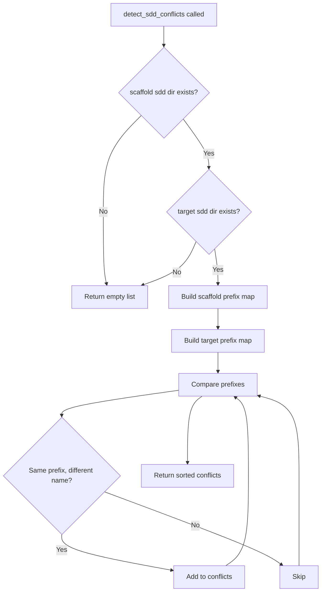
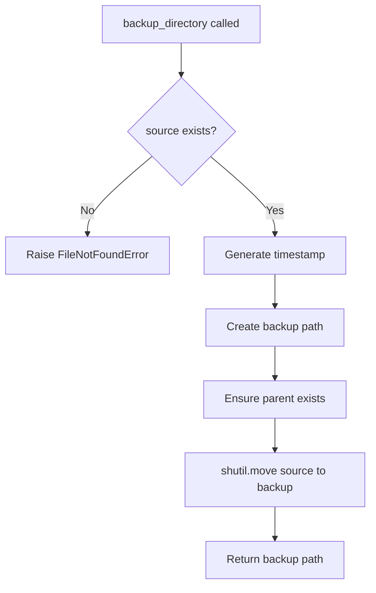

<!-- markdownlint-disable-file -->
# Task Research Document: Init Conflict Detection

**Feature**: Enhanced `teambot init` command to detect and warn about conflicting or stale scaffold files when the target directory contains similarly-named files that would cause confusion. Provides interactive remediation options (Replace/Backup/Skip) at detection time.

## Task Implementation Requests

* Implement `detect_sdd_conflicts()` function to identify numbered prefix conflicts between scaffold and target directories
* Implement `extract_numbered_prefix()` helper to parse `sdd.N-` patterns from filenames
* Create `backup_directory()` function to move `.agent/` to `.agent-tracking/backups/<timestamp>/`
* Create `ConflictInfo` dataclass to hold conflict metadata (prefix, source_name, target_name)
* Implement interactive `prompt_conflict_resolution()` function using `input()` with Replace/Backup/Skip options
* Update `copy_scaffold_directory()` to detect conflicts before returning `skipped_not_empty`
* Add `--on-conflict` CLI flag for non-interactive mode (replace/backup/skip)
* Update `cmd_init()` to invoke conflict detection and prompt when appropriate
* Write comprehensive tests following TDD approach

## Scope and Success Criteria

* **Scope**: Conflict detection specifically for `.agent/` directory scaffold copying during `teambot init`. Detection focuses on numbered prefix patterns (e.g., `sdd.4-`). Backup mechanism moves entire `.agent/` directory to timestamped backup location.
* **Exclusions**: Non-`.agent/` scaffold files (`stages.yaml`, `AGENTS.md`), content-level merging, automatic migration tooling
* **Assumptions**:
  * Users have terminal access for interactive prompts
  * Numbered prefix pattern `sdd.N-` is reliable indicator of versioned SDD prompt files
  * `.agent-tracking/` is the appropriate parent for backup storage
* **Success Criteria**:
  * ✅ Conflict detection correctly identifies prefix overlaps (same number, different name)
  * ✅ Interactive prompt displays clearly with 3 remediation options
  * ✅ Backup creates timestamped directory preserving full `.agent/` structure
  * ✅ `--force` flag bypasses detection (existing behavior preserved)
  * ✅ `--on-conflict` flag enables non-interactive CI/CD usage
  * ✅ Non-conflicting scenarios unchanged (backward compatible)

## Outline

1. Testing Infrastructure Research
2. Entry Point Analysis
3. Technical Scenarios
   - Scenario 1: Conflict Detection Core Logic
   - Scenario 2: Backup Infrastructure
   - Scenario 3: Interactive Prompt Integration
   - Scenario 4: CLI Flag Integration
4. Key Discoveries
5. Implementation Patterns
6. Potential Next Research

### Potential Next Research

* Performance benchmarking for directories with 100+ files
  * **Reasoning**: NFR-001 requires <100ms detection time; should verify approach is efficient
  * **Reference**: `.agent-tracking/spec-reviews/20260310-init-conflict-detection-review.md` Lines 35-36
* Error handling for edge cases (permission denied, disk full during backup)
  * **Reasoning**: Spec review identified this as minor enhancement
  * **Reference**: `.agent-tracking/spec-reviews/20260310-init-conflict-detection-review.md` Line 39

## Research Executed

### Testing Infrastructure Research

* **Framework**: pytest 7.x with pytest-cov and pytest-mock
  * **Location**: `tests/` directory with flat structure for unit tests
  * **Naming**: `test_*.py` files with `Test*` classes and `test_*` functions
  * **Runner**: `uv run pytest` (configured in `pyproject.toml`)
  * **Coverage**: `--cov=src/teambot --cov-report=term-missing` (default addopts)

* **Markers**:
  * `@pytest.mark.acceptance` - Slow/E2E tests excluded by default (`-m 'not acceptance'`)
  * `@pytest.mark.slow` - Long-running tests

### Test Patterns Found

* **File**: `tests/test_scaffolds.py` (Lines 1-263)
  * Uses `tmp_path` fixture for isolated filesystem tests
  * Tests organized by function in class-based groups (`TestCopyScaffoldFile`, `TestCopyScaffoldDirectory`)
  * Asserts both return value and filesystem state
  * Tests `CopyResult` named tuple fields explicitly

* **File**: `tests/test_cli.py` (Lines 657-774)
  * Uses `monkeypatch.chdir(tmp_path)` for directory isolation
  * Uses `argparse.Namespace(force=False)` for argument mocking
  * Creates `ConsoleDisplay()` instance for output capture
  * Verifies file existence and content after operations

* **File**: `tests/test_cli.py` (Lines 897-952) - Interactive Input Mocking
  * Uses `monkeypatch.setattr("builtins.input", lambda _: next(inputs))`
  * Creates iterator of responses: `inputs = iter(["y", "", "", "2"])`
  * Pattern for testing multi-prompt interactive flows

### Coverage Standards

* **Unit Tests**: Project uses TDD approach per spec
* **Integration Tests**: Implied by acceptance test scenarios
* **Critical Paths**: 6 acceptance test scenarios defined in specification

### Testing Approach Recommendation

* **`detect_sdd_conflicts()` function**: TDD (core logic, well-defined inputs/outputs)
* **`extract_numbered_prefix()` helper**: TDD (pure function, easily testable)
* **`backup_directory()` function**: TDD (filesystem operation with clear contract)
* **`prompt_conflict_resolution()` function**: Code-First (interactive UI, harder to test first)
* **CLI integration (`cmd_init()` changes)**: Code-First (integration work, builds on TDD core)

**Rationale**: The specification mandates TDD for conflict detection logic. Core functions have well-defined inputs/outputs making TDD natural. Interactive prompts and CLI integration are better suited to code-first with immediate validation.

## Entry Point Analysis

### User Input Entry Points

| Entry Point | Code Path | Reaches Feature? | Implementation Required? |
|-------------|-----------|------------------|-------------------------|
| `teambot init` (no flags) | `cli.py:cmd_init()` → `scaffolds.copy_all_scaffolds()` → `copy_scaffold_directory()` | YES | YES - detect conflicts, prompt |
| `teambot init --force` | `cli.py:cmd_init()` → `scaffolds.copy_all_scaffolds(force=True)` | YES | NO - bypass detection (existing) |
| `teambot init --on-conflict=X` | `cli.py:cmd_init()` → new conflict handling | YES | YES - new flag, non-interactive |

### Code Path Trace

#### Entry Point 1: `teambot init` (Fresh Repository)
1. User enters: `teambot init`
2. Handled by: `cli.py:cmd_init()` (Lines 691-790)
3. Routes to: `scaffolds.copy_all_scaffolds()` (Lines 726)
4. Calls: `copy_scaffold_directory(".agent", ...)` (Lines 160-165)
5. **Current behavior**: If `.agent/` doesn't exist → copies scaffold ✅

#### Entry Point 2: `teambot init` (Existing Non-Empty `.agent/`)
1. User enters: `teambot init`
2. Handled by: `cli.py:cmd_init()` (Lines 691-790)
3. Routes to: `scaffolds.copy_all_scaffolds()` (Line 726)
4. Calls: `copy_scaffold_directory(".agent", ...)` (Lines 160-165)
5. **Current behavior**: Returns `CopyResult(copied=False, reason="skipped_not_empty")` (Line 94)
6. **CLI displays**: `"Skipped (not empty): .agent"` (Line 734)
7. **NEW FEATURE INSERTION POINT**: Between steps 4 and 5, detect conflicts

#### Entry Point 3: `teambot init --force`
1. User enters: `teambot init --force`
2. Handled by: `cli.py:cmd_init()` with `force=True` (Line 694)
3. Routes to: `scaffolds.copy_all_scaffolds(force=True)` (Line 726)
4. Calls: `copy_scaffold_directory(".agent", force=True)` (Lines 160-165)
5. **Current behavior**: Removes existing, copies scaffold ✅
6. **No change needed**: `--force` bypasses conflict detection per spec FR-009

### Coverage Gaps

| Gap | Impact | Required Fix |
|-----|--------|--------------|
| No conflict detection before `skipped_not_empty` | Users confused by stale files | Add detection in `copy_scaffold_directory()` or CLI |
| No interactive prompt | Users must manually use `--force` | Add prompt in `cmd_init()` |
| No backup option | Users lose customizations | Add backup function + prompt option |
| No `--on-conflict` flag | CI/CD cannot automate | Add argparse flag |

### Implementation Scope Verification

- [x] All entry points from acceptance test scenarios are traced
- [x] All code paths that should trigger feature are identified
- [x] Coverage gaps are documented with required fixes
- [x] `--force` bypass behavior confirmed (no change needed)

## Key Discoveries

### Project Structure

```
src/teambot/
├── scaffolds.py          # Scaffold copy operations (CopyResult, copy_scaffold_directory)
├── scaffolds/            # Bundled scaffold files
│   ├── .agent/
│   │   └── commands/sdd/ # SDD prompt files (sdd.N-*.prompt.md)
│   ├── agents/
│   ├── stages.yaml
│   └── AGENTS.md
├── cli.py                # CLI entry point (cmd_init at L691)
└── prompt_sync.py        # Existing SDD prompt sync (pattern reference)
```

**Backup directory target**: `.agent-tracking/backups/<timestamp>/.agent/`

### Implementation Patterns

#### Pattern 1: CopyResult NamedTuple (scaffolds.py:11-17)
```python
class CopyResult(NamedTuple):
    """Result of a scaffold copy operation."""
    source: str
    target: Path
    copied: bool
    reason: str  # "copied", "skipped_exists", "source_missing", "skipped_not_empty"
```

#### Pattern 2: Scaffold Directory Copy (scaffolds.py:66-106)
```python
def copy_scaffold_directory(
    scaffold_name: str,
    target_path: Path,
    *,
    force: bool = False,
) -> CopyResult:
    # Check if target exists and is non-empty
    if target_path.exists():
        if not force:
            if any(target_path.iterdir()):
                return CopyResult(scaffold_name, target_path, False, "skipped_not_empty")
```

#### Pattern 3: Interactive Input Pattern (cli.py:612-660)
```python
try:
    response = input("Enable real-time notifications? [y/N]: ").strip().lower()
    return response in ("y", "yes")
except (EOFError, KeyboardInterrupt):
    return False
```

#### Pattern 4: Timestamp Format (history/manager.py:18-19)
```python
ts = metadata.timestamp
date_part = ts.strftime("%Y-%m-%d-%H%M%S")  # Filesystem-safe
```

### Complete Examples

#### Conflict Detection Implementation
```python
# src/teambot/scaffolds.py (proposed additions)

from dataclasses import dataclass
import re

@dataclass
class ConflictInfo:
    """Information about a file conflict."""
    prefix: str           # e.g., "sdd.4-"
    scaffold_name: str    # e.g., "sdd.4-task-planner-for-feature.prompt.md"
    existing_name: str    # e.g., "sdd.4-determine-test-strategy.prompt.md"

def extract_numbered_prefix(filename: str) -> str | None:
    """Extract numbered prefix from SDD prompt filename.
    
    Args:
        filename: e.g., "sdd.4-task-planner-for-feature.prompt.md"
    
    Returns:
        Prefix like "sdd.4-" or None if not matching pattern
    """
    match = re.match(r'^(sdd\.\d+-)', filename)
    return match.group(1) if match else None

def detect_sdd_conflicts(
    scaffold_dir: Path,
    target_dir: Path,
) -> list[ConflictInfo]:
    """Detect SDD prompt file conflicts.
    
    Looks for files with same numbered prefix but different names.
    
    Args:
        scaffold_dir: Path to scaffold SDD commands directory
        target_dir: Path to target SDD commands directory
        
    Returns:
        List of ConflictInfo for each detected conflict
    """
    if not target_dir.exists():
        return []
    
    scaffold_sdd = scaffold_dir / ".agent" / "commands" / "sdd"
    target_sdd = target_dir / ".agent" / "commands" / "sdd"
    
    if not scaffold_sdd.exists() or not target_sdd.exists():
        return []
    
    # Build prefix -> filename maps
    scaffold_prefixes: dict[str, str] = {}
    for f in scaffold_sdd.glob("sdd.*.prompt.md"):
        prefix = extract_numbered_prefix(f.name)
        if prefix:
            scaffold_prefixes[prefix] = f.name
    
    target_prefixes: dict[str, str] = {}
    for f in target_sdd.glob("sdd.*.prompt.md"):
        prefix = extract_numbered_prefix(f.name)
        if prefix:
            target_prefixes[prefix] = f.name
    
    # Find conflicts: same prefix, different name
    conflicts = []
    for prefix, scaffold_name in scaffold_prefixes.items():
        if prefix in target_prefixes:
            existing_name = target_prefixes[prefix]
            if scaffold_name != existing_name:
                conflicts.append(ConflictInfo(prefix, scaffold_name, existing_name))
    
    return sorted(conflicts, key=lambda c: c.prefix)
```

#### Backup Directory Implementation
```python
# src/teambot/scaffolds.py (proposed additions)

import shutil
from datetime import datetime

def backup_directory(source: Path, backup_root: Path) -> Path:
    """Move directory to timestamped backup location.
    
    Args:
        source: Directory to back up (e.g., .agent/)
        backup_root: Parent for backups (e.g., .agent-tracking/backups/)
        
    Returns:
        Path to created backup directory
        
    Raises:
        FileNotFoundError: If source doesn't exist
        PermissionError: If unable to create backup
    """
    if not source.exists():
        raise FileNotFoundError(f"Cannot backup: {source} does not exist")
    
    # Generate filesystem-safe timestamp
    timestamp = datetime.now().strftime("%Y%m%d-%H%M%S")
    backup_dir = backup_root / timestamp / source.name
    
    # Ensure backup parent exists
    backup_dir.parent.mkdir(parents=True, exist_ok=True)
    
    # Move source to backup
    shutil.move(str(source), str(backup_dir))
    
    return backup_dir
```

#### Interactive Prompt Implementation
```python
# src/teambot/cli.py (proposed additions)

from typing import Literal

ConflictResolution = Literal["replace", "backup", "skip"]

def prompt_conflict_resolution(
    conflicts: list["ConflictInfo"],
    display: ConsoleDisplay,
) -> ConflictResolution:
    """Prompt user to resolve scaffold conflicts.
    
    Args:
        conflicts: List of detected conflicts
        display: Console display for output
        
    Returns:
        User's choice: "replace", "backup", or "skip"
    """
    display.print_warning("")
    display.print_warning("⚠ Conflict detected in .agent/commands/sdd/:")
    display.print_warning("")
    display.print_info("  The target directory contains files that may conflict with current scaffolds:")
    display.print_info("")
    
    for conflict in conflicts:
        display.print_info(f"  {conflict.prefix}*:")
        display.print_warning(f"    - Existing: {conflict.existing_name}")
        display.print_success(f"    - New:      {conflict.scaffold_name}")
    
    display.print_info("")
    display.print_info("How would you like to proceed?")
    display.print_info("")
    display.print_info("  [1] Replace - Clear existing directory and copy new scaffolds")
    display.print_info("  [2] Backup  - Move existing to .agent-tracking/backups/ then copy new")
    display.print_info("  [3] Skip    - Keep existing files (may cause workflow confusion)")
    display.print_info("")
    
    try:
        while True:
            response = input("Choice [1/2/3]: ").strip()
            if response == "1":
                return "replace"
            elif response == "2":
                return "backup"
            elif response == "3":
                return "skip"
            else:
                display.print_warning("Please enter 1, 2, or 3")
    except (EOFError, KeyboardInterrupt):
        display.print_warning("\nOperation cancelled, keeping existing files")
        return "skip"
```

### API and Schema Documentation

#### CopyResult Fields (Extended)
| Field | Type | Description | Values |
|-------|------|-------------|--------|
| `source` | str | Name of scaffold being copied | e.g., ".agent" |
| `target` | Path | Destination path | e.g., `/project/.agent` |
| `copied` | bool | Whether copy succeeded | True/False |
| `reason` | str | Outcome reason | "copied", "skipped_exists", "source_missing", "skipped_not_empty", **"conflict_detected"** (new) |

#### ConflictInfo Fields (New)
| Field | Type | Description | Example |
|-------|------|-------------|---------|
| `prefix` | str | Numbered prefix | "sdd.4-" |
| `scaffold_name` | str | New file from scaffold | "sdd.4-task-planner-for-feature.prompt.md" |
| `existing_name` | str | Existing file in target | "sdd.4-determine-test-strategy.prompt.md" |

### Configuration Examples

#### CLI Argument Extension
```python
# In create_parser() init subparser
init_parser.add_argument(
    "--on-conflict",
    choices=["replace", "backup", "skip"],
    default=None,
    help="How to handle scaffold conflicts: replace (clear and copy), backup (preserve to .agent-tracking/backups/), skip (keep existing)",
)
```

#### Backup Directory Structure
```
.agent-tracking/
└── backups/
    └── 20260310-221500/
        └── .agent/
            ├── commands/
            │   └── sdd/
            │       ├── sdd.4-determine-test-strategy.prompt.md
            │       └── ...
            ├── instructions/
            └── standards/
```

## Technical Scenarios

### 1. Conflict Detection Core Logic

**Description**: Detect when existing `.agent/commands/sdd/` contains files with same numbered prefix but different names than scaffold files.

**Requirements**:
* Parse `sdd.N-` prefix pattern from filenames
* Compare scaffold prefixes against target prefixes
* Return list of conflicts (same prefix, different name)
* Handle missing directories gracefully (return empty list)

**Preferred Approach**:
Pure function approach with `detect_sdd_conflicts()` taking explicit paths. Uses regex for prefix extraction, dictionary-based comparison for O(n) efficiency.

```text
src/teambot/scaffolds.py  # Add ConflictInfo, extract_numbered_prefix, detect_sdd_conflicts
tests/test_scaffolds.py   # Add TestConflictDetection class
```



**Implementation Details**:

1. **Prefix Extraction** - Use regex `^(sdd\.\d+-)` to extract prefix
2. **Dictionary Mapping** - O(n) lookup for prefix comparison
3. **Sorting** - Return conflicts sorted by prefix for consistent output

```python
# Test cases for TDD
def test_extract_prefix_valid():
    assert extract_numbered_prefix("sdd.4-task-planner.prompt.md") == "sdd.4-"
    
def test_extract_prefix_invalid():
    assert extract_numbered_prefix("README.md") is None
    
def test_detect_conflicts_same_prefix_different_name():
    # Setup: scaffold has sdd.4-new.prompt.md, target has sdd.4-old.prompt.md
    conflicts = detect_sdd_conflicts(scaffold_dir, target_dir)
    assert len(conflicts) == 1
    assert conflicts[0].prefix == "sdd.4-"
```

#### Considered Alternatives (Removed After Selection)
**Content-based comparison**: Rejected because spec requires fast detection (<100ms) with file listing only, no content parsing. Pattern-based detection is sufficient for the numbered prefix conflict scenario.

### 2. Backup Infrastructure

**Description**: Move existing `.agent/` directory to `.agent-tracking/backups/<timestamp>/` preserving structure.

**Requirements**:
* Generate filesystem-safe ISO 8601 timestamp
* Create backup parent directories as needed
* Use `shutil.move()` for atomic move operation
* Return path to created backup

**Preferred Approach**:
Simple `backup_directory()` function that generates timestamp, creates parent dirs, and moves directory. Uses existing codebase pattern from `history/manager.py` for timestamp format.

```text
src/teambot/scaffolds.py  # Add backup_directory function
tests/test_scaffolds.py   # Add TestBackupDirectory class
```



**Implementation Details**:

1. **Timestamp Format**: `%Y%m%d-%H%M%S` (e.g., `20260310-221500`) - filesystem-safe, sortable
2. **Backup Path**: `.agent-tracking/backups/<timestamp>/.agent/`
3. **Error Handling**: Let `shutil.move` raise natural exceptions for permissions, disk space

```python
# Test cases for TDD
def test_backup_creates_timestamped_directory(tmp_path):
    source = tmp_path / ".agent"
    source.mkdir()
    (source / "test.txt").write_text("content")
    backup_root = tmp_path / ".agent-tracking" / "backups"
    
    result = backup_directory(source, backup_root)
    
    assert not source.exists()  # Moved, not copied
    assert result.exists()
    assert (result / "test.txt").exists()
    assert re.match(r"\d{8}-\d{6}", result.parent.name)  # Timestamp folder

def test_backup_raises_for_missing_source(tmp_path):
    with pytest.raises(FileNotFoundError):
        backup_directory(tmp_path / "nonexistent", tmp_path / "backups")
```

#### Considered Alternatives (Removed After Selection)
**Copy then delete**: Rejected because `shutil.move()` is atomic within same filesystem and handles symlinks correctly. Copy+delete risks partial operations.

### 3. Interactive Prompt Integration

**Description**: When conflicts detected, present interactive menu with Replace/Backup/Skip options.

**Requirements**:
* Display clear conflict summary
* Present 3 numbered options
* Accept valid input (1/2/3)
* Handle EOF/KeyboardInterrupt gracefully (default to skip)

**Preferred Approach**:
Use raw `input()` with validation loop, following existing pattern in `cli.py` for Telegram setup. Display uses `ConsoleDisplay` methods for consistent formatting.

```text
src/teambot/cli.py        # Add prompt_conflict_resolution function
tests/test_cli.py         # Add TestConflictResolutionPrompt class
```

**Implementation Details**:

1. **Display**: Use `display.print_warning()` for conflict header, `display.print_info()` for options
2. **Input Loop**: Repeat until valid choice (1, 2, or 3)
3. **Exception Handling**: Catch `EOFError` and `KeyboardInterrupt`, return "skip"

```python
# Test pattern from existing tests (test_cli.py:907)
def test_prompt_returns_backup_on_option_2(monkeypatch, tmp_path):
    from teambot.cli import prompt_conflict_resolution
    
    inputs = iter(["2"])
    monkeypatch.setattr("builtins.input", lambda _: next(inputs))
    
    conflicts = [ConflictInfo("sdd.4-", "new.md", "old.md")]
    display = ConsoleDisplay()
    
    result = prompt_conflict_resolution(conflicts, display)
    
    assert result == "backup"
```

#### Considered Alternatives (Removed After Selection)
**Click.prompt()**: Rejected because current codebase uses raw `input()` consistently. Maintaining pattern reduces cognitive load and test complexity.

### 4. CLI Flag Integration

**Description**: Add `--on-conflict` flag for non-interactive mode to support CI/CD pipelines.

**Requirements**:
* Flag accepts: replace, backup, skip
* When provided, skip interactive prompt
* `--force` is alias for `--on-conflict=replace` (backward compatible)
* If both specified, `--on-conflict` takes precedence with warning

**Preferred Approach**:
Add argument to init subparser, check in `cmd_init()` before calling prompt. Integrate with existing `force` flag logic.

```text
src/teambot/cli.py        # Modify create_parser(), cmd_init()
tests/test_cli.py         # Add TestInitOnConflictFlag class
```

**Implementation Details**:

1. **Parser Addition**: Add `--on-conflict` with `choices=["replace", "backup", "skip"]`
2. **Flag Precedence**: Check `on_conflict` first, fall back to `force` for replace behavior
3. **Warning**: If both `--force` and `--on-conflict` provided, warn but use `--on-conflict`

```python
# CLI usage examples
# teambot init                         # Interactive prompt if conflicts
# teambot init --force                 # Replace without prompt (existing behavior)
# teambot init --on-conflict=replace   # Same as --force
# teambot init --on-conflict=backup    # Auto-backup without prompt
# teambot init --on-conflict=skip      # Keep existing without prompt
```

#### Considered Alternatives (Removed After Selection)
**Separate --backup flag**: Rejected because single `--on-conflict` flag is cleaner and extensible. Aligns with common CLI patterns (e.g., git merge strategies).

## Project Conventions

* **Standards referenced**: pytest, argparse patterns from existing codebase
* **Instructions followed**: TDD approach per specification, existing test patterns

## File References Summary

| File | Lines | Purpose |
|------|-------|---------|
| `src/teambot/scaffolds.py` | 1-167 | Scaffold copy operations, CopyResult |
| `src/teambot/cli.py` | 691-790 | `cmd_init()` implementation |
| `src/teambot/cli.py` | 608-660 | Interactive input pattern reference |
| `tests/test_scaffolds.py` | 1-263 | Scaffold test patterns |
| `tests/test_cli.py` | 657-774 | Init command tests |
| `tests/test_cli.py` | 897-952 | Input mocking pattern |
| `src/teambot/history/manager.py` | 18-19 | Timestamp format pattern |
| `.agent-tracking/specs/init-conflict-detection.md` | Full | Feature specification |
