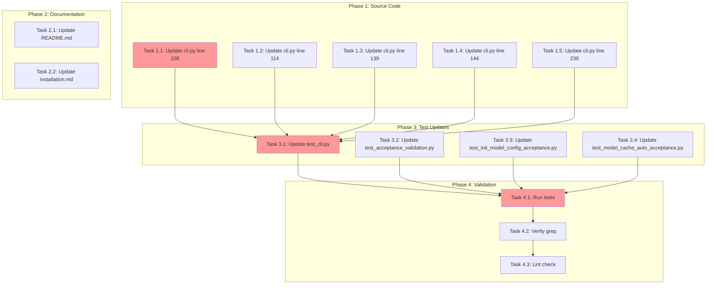

<!-- markdownlint-disable-file -->
# Task Checklist: Fix Authentication Command Message

## Overview

Update all error messages from incorrect `copilot auth` to correct `copilot login` command across source code, documentation, and test assertions.

## Objectives

* Replace all 5 occurrences of `copilot auth` in `src/teambot/cli.py` with `copilot login`
* Update 3 documentation files with correct command
* Update 9 test assertions to verify `copilot login` output
* Ensure all tests pass after changes

## Research Summary

### Project Files
* `src/teambot/cli.py` - Contains 5 authentication error messages (lines 108, 114, 139, 144, 239)
* `README.md` - Installation instructions (line 17)
* `docs/guides/installation.md` - Installation guide (lines 17, 227)

### External References
* .teambot/auth-message/artifacts/research.md - Complete analysis of all occurrences and line numbers

### Test Strategy Reference
* .teambot/auth-message/artifacts/test_strategy.md - CODE-FIRST approach approved

## Task Dependency Graph

**Critical Path**: Phase 1 → Phase 3 → Phase 4 (estimated: 30 min)
**Parallel Opportunities**: All Phase 1 tasks can run in parallel; Phase 2 independent of other phases

## Implementation Checklist

### [ ] Phase 1: Source Code Updates

**Phase Objective**: Update all 5 error messages in `src/teambot/cli.py` from `copilot auth` to `copilot login`

* [ ] Task 1.1: Update `_check_copilot_authentication()` primary message
  * Details: .agent-tracking/details/20260222-auth-message-fix-details.md (Lines 15-25)
  * File: `src/teambot/cli.py` line 108
  * Dependencies: None
  * Priority: CRITICAL

* [ ] Task 1.2: Update `_check_copilot_authentication()` exception message
  * Details: .agent-tracking/details/20260222-auth-message-fix-details.md (Lines 27-37)
  * File: `src/teambot/cli.py` line 114
  * Dependencies: None
  * Priority: CRITICAL

* [ ] Task 1.3: Update `_check_copilot_authentication_blocking()` primary message
  * Details: .agent-tracking/details/20260222-auth-message-fix-details.md (Lines 39-49)
  * File: `src/teambot/cli.py` line 139
  * Dependencies: None
  * Priority: CRITICAL

* [ ] Task 1.4: Update `_check_copilot_authentication_blocking()` exception message
  * Details: .agent-tracking/details/20260222-auth-message-fix-details.md (Lines 51-61)
  * File: `src/teambot/cli.py` line 144
  * Dependencies: None
  * Priority: CRITICAL

* [ ] Task 1.5: Update `check_copilot_installed()` installation message
  * Details: .agent-tracking/details/20260222-auth-message-fix-details.md (Lines 63-73)
  * File: `src/teambot/cli.py` line 239
  * Dependencies: None
  * Priority: CRITICAL

### Phase Gate: Phase 1 Complete When
- [ ] All 5 strings updated in cli.py
- [ ] No blocking dependencies for Phase 3
- [ ] Validation: `grep "copilot auth" src/teambot/cli.py` returns empty
- [ ] Artifacts: Updated cli.py

**Cannot Proceed If**: Any `copilot auth` string remains in cli.py

### [ ] Phase 2: Documentation Updates

**Phase Objective**: Update all documentation to reference `copilot login` command

* [ ] Task 2.1: Update README.md
  * Details: .agent-tracking/details/20260222-auth-message-fix-details.md (Lines 79-89)
  * File: `README.md` line 17
  * Dependencies: None
  * Priority: HIGH

* [ ] Task 2.2: Update installation guide
  * Details: .agent-tracking/details/20260222-auth-message-fix-details.md (Lines 91-105)
  * File: `docs/guides/installation.md` lines 17 and 227
  * Dependencies: None
  * Priority: HIGH

### Phase Gate: Phase 2 Complete When
- [ ] All 3 documentation occurrences updated
- [ ] Validation: `grep "copilot auth" README.md docs/guides/installation.md` returns empty
- [ ] Artifacts: Updated README.md, installation.md

**Cannot Proceed If**: Any `copilot auth` string remains in documentation

### [ ] Phase 3: Test Assertion Updates (Code-First)

**Test Strategy**: Code-First - See .teambot/auth-message/artifacts/test_strategy.md

* [ ] Task 3.1: Update test_cli.py assertions
  * Details: .agent-tracking/details/20260222-auth-message-fix-details.md (Lines 111-125)
  * File: `tests/test_cli.py` lines 609, 629
  * Test Approach: Code-First (update assertions after source changes)
  * Dependencies: Phase 1 completion
  * Priority: CRITICAL

* [ ] Task 3.2: Update test_acceptance_validation.py assertions
  * Details: .agent-tracking/details/20260222-auth-message-fix-details.md (Lines 127-149)
  * File: `tests/test_acceptance_validation.py` lines 118 (docstring), 155-156, 408
  * Dependencies: Phase 1 completion
  * Priority: CRITICAL

* [ ] Task 3.3: Update test_init_model_config_acceptance.py assertions
  * Details: .agent-tracking/details/20260222-auth-message-fix-details.md (Lines 151-167)
  * File: `tests/test_init_model_config_acceptance.py` lines 115, 135
  * Dependencies: Phase 1 completion
  * Priority: CRITICAL

* [ ] Task 3.4: Update test_model_cache_auto_acceptance.py assertion
  * Details: .agent-tracking/details/20260222-auth-message-fix-details.md (Lines 169-181)
  * File: `tests/test_model_cache_auto_acceptance.py` line 110
  * Dependencies: Phase 1 completion
  * Priority: CRITICAL

### Phase Gate: Phase 3 Complete When
- [ ] All 9 test assertions updated
- [ ] Validation: `grep "copilot auth" tests/test_cli.py tests/test_acceptance_validation.py tests/test_init_model_config_acceptance.py tests/test_model_cache_auto_acceptance.py` returns empty
- [ ] Artifacts: Updated test files

**Cannot Proceed If**: Any test assertion still references `copilot auth`

### [ ] Phase 4: Validation

**Phase Objective**: Verify all changes work correctly and no occurrences missed

* [ ] Task 4.1: Run affected tests
  * Details: .agent-tracking/details/20260222-auth-message-fix-details.md (Lines 187-195)
  * Command: `uv run pytest tests/test_cli.py tests/test_acceptance_validation.py tests/test_init_model_config_acceptance.py tests/test_model_cache_auto_acceptance.py -v`
  * Success: All tests pass
  * Dependencies: Phase 1, Phase 3 completion
  * Priority: CRITICAL

* [ ] Task 4.2: Verify no remaining occurrences
  * Details: .agent-tracking/details/20260222-auth-message-fix-details.md (Lines 197-205)
  * Command: `grep -r "copilot auth" src/ tests/ docs/ README.md`
  * Success: No matches returned
  * Dependencies: Task 4.1
  * Priority: CRITICAL

* [ ] Task 4.3: Run linting checks
  * Details: .agent-tracking/details/20260222-auth-message-fix-details.md (Lines 207-215)
  * Command: `uv run ruff check . && uv run ruff format --check .`
  * Success: No errors
  * Dependencies: Task 4.2
  * Priority: HIGH

### Phase Gate: Phase 4 Complete When
- [ ] All tests pass
- [ ] Zero `copilot auth` occurrences in scope
- [ ] Linting passes
- [ ] Artifacts: Test results, grep verification

**Cannot Proceed If**: Tests fail or `copilot auth` found in scope

## Effort Estimation

| Task | Estimated Effort | Complexity | Risk |
|------|-----------------|------------|------|
| Phase 1 (5 tasks) | 5 min | LOW | LOW |
| Phase 2 (2 tasks) | 3 min | LOW | LOW |
| Phase 3 (4 tasks) | 5 min | LOW | LOW |
| Phase 4 (3 tasks) | 10 min | LOW | LOW |
| **Total** | **23 min** | **LOW** | **LOW** |

## Dependencies

* Python 3.12+
* uv package manager
* pytest test framework
* ruff linter

## Success Criteria

* All 17 occurrences of `copilot auth` replaced with `copilot login`
* All tests pass without modification to test logic
* Zero matches from `grep -r "copilot auth" src/ tests/ docs/ README.md`
* Linting passes with no errors
