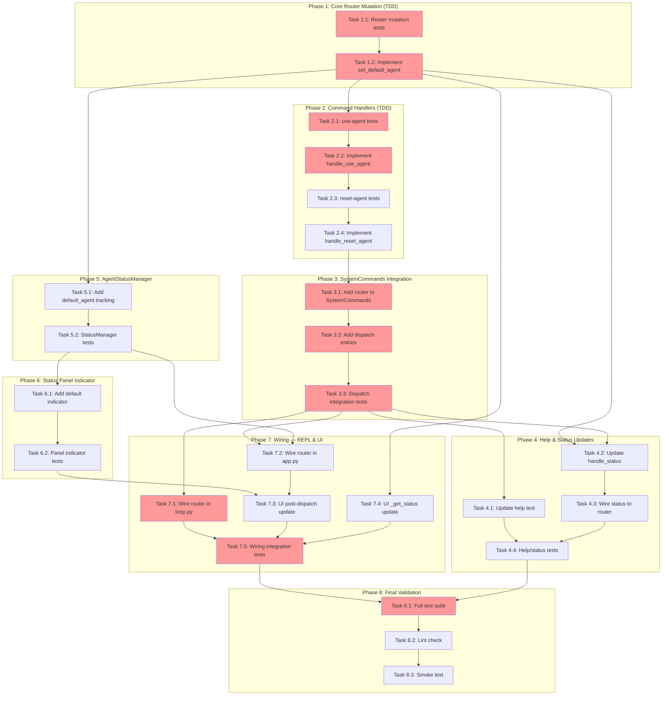

<!-- markdownlint-disable-file -->

# Implementation Plan: Runtime Default Agent Switching

**Overview**: Add `/use-agent` and `/reset-agent` slash commands to change the default agent at runtime, with UI visibility of the current default, without persisting to `teambot.json`.

## Objectives

1. Enable runtime switching of the default agent via `/use-agent <agent-id>` command
2. Enable reset to config default via `/reset-agent` command
3. Display current default agent in the status panel and `/status` output
4. Maintain session-scoped changes only (no config file mutation)
5. Preserve full backward compatibility with `@agent` directives

## Research Summary

- **Research**: `.agent-tracking/research/20260209-default-agent-switching-research.md`
- **Test Strategy**: `.agent-tracking/test-strategies/20260209-default-agent-switching-test-strategy.md`
- **Feature Spec**: `.teambot/default-agent-switching/artifacts/feature_spec.md`

## Implementation Checklist

### Phase 1: Core Router Mutation (TDD)
> **Gate**: Router can be mutated at runtime with validation; config default preserved
> Details: Lines 1-77 of details file

- [ ] **Task 1.1**: Write tests for `AgentRouter.set_default_agent()` and `get_config_default_agent()`
  - File: `tests/test_repl/test_router.py`
  - Add class `TestRouterDefaultAgentMutation` with 6 tests
  - Details: Lines 10-39

- [ ] **Task 1.2**: Implement `set_default_agent()`, `get_config_default_agent()`, `_config_default_agent` on `AgentRouter`
  - File: `src/teambot/repl/router.py`
  - Add `_config_default_agent` in `__init__` (after line 52)
  - Add `set_default_agent()` and `get_config_default_agent()` methods (after line 91)
  - Details: Lines 41-77

### Phase 1 Gate
- [ ] All Phase 1 tasks marked complete
- [ ] `uv run pytest tests/test_repl/test_router.py -v` passes
- [ ] `get_default_agent()` returns mutated value; `get_config_default_agent()` returns original
- [ ] Invalid agent ID raises `RouterError`

**Cannot Proceed If**: Router mutation tests fail or `_config_default_agent` is not preserved after `set_default_agent()`

---

### Phase 2: Command Handlers (TDD)
> **Gate**: `/use-agent` and `/reset-agent` commands work with all code paths tested
> Details: Lines 79-162 of details file

- [ ] **Task 2.1**: Write tests for `handle_use_agent()` handler function
  - File: `tests/test_repl/test_commands.py`
  - Add class `TestUseAgentCommand` with 5 tests (no-args, valid switch, invalid agent, idempotent, no-router)
  - Details: Lines 85-115

- [ ] **Task 2.2**: Implement `handle_use_agent()` module-level function
  - File: `src/teambot/repl/commands.py`
  - Follow `handle_model()` pattern (lines 218-277)
  - Details: Lines 117-138

- [ ] **Task 2.3**: Write tests for `handle_reset_agent()` handler function
  - File: `tests/test_repl/test_commands.py`
  - Add class `TestResetAgentCommand` with 3 tests (reset, already-at-default, no-router)
  - Details: Lines 140-155

- [ ] **Task 2.4**: Implement `handle_reset_agent()` module-level function
  - File: `src/teambot/repl/commands.py`
  - Details: Lines 157-162

### Phase 2 Gate
- [ ] All Phase 2 tasks marked complete
- [ ] `uv run pytest tests/test_repl/test_commands.py -v -k "UseAgent or ResetAgent"` passes
- [ ] All 8 handler tests pass (5 use-agent + 3 reset-agent)

**Cannot Proceed If**: Any handler code path is untested or invalid agent IDs are not rejected

---

### Phase 3: SystemCommands Integration (Code-First)
> **Gate**: `/use-agent` and `/reset-agent` dispatch through SystemCommands
> Details: Lines 164-217 of details file

- [ ] **Task 3.1**: Add `_router` parameter to `SystemCommands.__init__()` and add `set_router()` setter
  - File: `src/teambot/repl/commands.py`
  - Follow existing `set_executor()` / `set_overlay()` pattern (lines 548-562)
  - Details: Lines 170-188

- [ ] **Task 3.2**: Add `use_agent()` and `reset_agent()` wrapper methods to `SystemCommands`
  - File: `src/teambot/repl/commands.py`
  - Add dispatch entries `"use-agent"` and `"reset-agent"` to handlers dict (after line 585)
  - Details: Lines 190-210

- [ ] **Task 3.3**: Write dispatch integration tests
  - File: `tests/test_repl/test_commands.py`
  - Test `dispatch("use-agent", ...)` and `dispatch("reset-agent", ...)` routing
  - Details: Lines 212-217

### Phase 3 Gate
- [ ] All Phase 3 tasks marked complete
- [ ] `uv run pytest tests/test_repl/test_commands.py -v` passes
- [ ] `dispatch("use-agent", ["builder-1"])` returns success with correct output
- [ ] Unknown commands still return error

**Cannot Proceed If**: Dispatch table doesn't route to new handlers

---

### Phase 4: Help and Status Updates (Code-First)
> **Gate**: `/help` documents new commands; `/status` shows default agent
> Details: Lines 219-276 of details file

- [ ] **Task 4.1**: Update `handle_help()` to include `/use-agent` and `/reset-agent`
  - File: `src/teambot/repl/commands.py`
  - Add entries to main help output (lines 85-98)
  - Details: Lines 225-238

- [ ] **Task 4.2**: Update `handle_status()` to show default agent info
  - File: `src/teambot/repl/commands.py`
  - Add default agent line after "Agent Status:" header (line 126)
  - Accept optional `router` parameter for default agent info
  - Details: Lines 240-260

- [ ] **Task 4.3**: Update `SystemCommands.status()` to pass router info to `handle_status()`
  - File: `src/teambot/repl/commands.py`
  - Modify `status()` method (lines 601-614) to pass router
  - Details: Lines 262-270

- [ ] **Task 4.4**: Write tests for help and status enhancements
  - File: `tests/test_repl/test_commands.py`
  - Test `/help` contains new commands; `/status` shows default agent
  - Details: Lines 272-276

### Phase 4 Gate
- [ ] All Phase 4 tasks marked complete
- [ ] `/help` output contains `/use-agent` and `/reset-agent`
- [ ] `/status` output contains "Default Agent:" line
- [ ] `uv run pytest tests/test_repl/test_commands.py -v` passes

**Cannot Proceed If**: Help or status output missing new content

---

### Phase 5: AgentStatusManager Default Tracking (Code-First)
> **Gate**: `AgentStatusManager` tracks default agent and notifies listeners on change
> Details: Lines 278-318 of details file

- [ ] **Task 5.1**: Add `_default_agent` field, `set_default_agent()`, and `get_default_agent()` to `AgentStatusManager`
  - File: `src/teambot/ui/agent_state.py`
  - Follow `set_model()` pattern (lines 194-209) for change detection and notification
  - Details: Lines 284-306

- [ ] **Task 5.2**: Write tests for `AgentStatusManager` default agent tracking
  - File: `tests/test_ui/test_agent_state.py`
  - Test set/get, listener notification, no-change-no-notify
  - Details: Lines 308-318

### Phase 5 Gate
- [ ] All Phase 5 tasks marked complete
- [ ] `uv run pytest tests/test_ui/test_agent_state.py -v` passes
- [ ] Listener is notified when default changes; not notified on no-op set

**Cannot Proceed If**: `AgentStatusManager` doesn't notify on default agent change

---

### Phase 6: Status Panel Default Indicator (Code-First)
> **Gate**: Status panel shows "⬤ default" indicator on the current default agent row
> Details: Lines 320-360 of details file

- [ ] **Task 6.1**: Update `StatusPanel._format_status()` to show default agent indicator
  - File: `src/teambot/ui/widgets/status_panel.py`
  - Add `⬤ default` label for default agent row in `_format_status()` (lines 101-142)
  - Details: Lines 326-350

- [ ] **Task 6.2**: Write tests for status panel default indicator
  - File: `tests/test_ui/test_status_panel.py`
  - Test indicator present for default, absent for non-default, moves on change
  - Details: Lines 352-360

### Phase 6 Gate
- [ ] All Phase 6 tasks marked complete
- [ ] `uv run pytest tests/test_ui/test_status_panel.py -v` passes
- [ ] Default agent row displays indicator; non-default rows do not

**Cannot Proceed If**: Indicator not visible or applied to wrong agent

---

### Phase 7: Wiring — REPL and UI Integration (Code-First)
> **Gate**: Router wired to SystemCommands in both modes; UI updates on command
> Details: Lines 362-440 of details file

- [ ] **Task 7.1**: Wire router to `SystemCommands` in `REPLLoop.__init__()`
  - File: `src/teambot/repl/loop.py`
  - Pass router to `SystemCommands` constructor (line 58) or use `set_router()`
  - Details: Lines 368-380

- [ ] **Task 7.2**: Wire router to `SystemCommands` in `TeamBotApp.__init__()`
  - File: `src/teambot/ui/app.py`
  - Pass router to `SystemCommands` constructor (line 55)
  - Initialize `AgentStatusManager._default_agent` from router
  - Details: Lines 382-398

- [ ] **Task 7.3**: Update `TeamBotApp._handle_system_command()` to refresh status panel after `/use-agent` and `/reset-agent`
  - File: `src/teambot/ui/app.py`
  - Add post-dispatch handler (after line 312), following `/model` pattern
  - Details: Lines 400-418

- [ ] **Task 7.4**: Update `TeamBotApp._get_status()` to show default agent info
  - File: `src/teambot/ui/app.py`
  - Add default agent line to status output (after line 414)
  - Details: Lines 420-432

- [ ] **Task 7.5**: Write integration tests for REPL and UI wiring
  - File: `tests/test_repl/test_loop.py`, `tests/test_ui/test_app.py`
  - Test router is passed to SystemCommands; status panel updates on command
  - Details: Lines 434-440

### Phase 7 Gate
- [ ] All Phase 7 tasks marked complete
- [ ] `uv run pytest tests/test_repl/test_loop.py tests/test_ui/test_app.py -v` passes
- [ ] Router accessible from SystemCommands in both modes
- [ ] Status panel updates after `/use-agent` in UI mode

**Cannot Proceed If**: Router not wired or UI not updating

---

### Phase 8: Final Validation
> **Gate**: All tests pass, linting clean, no regressions

- [ ] **Task 8.1**: Run full test suite
  - Command: `uv run pytest --cov=src/teambot --cov-report=term-missing`
  - Verify no regressions; new code coverage ≥95%

- [ ] **Task 8.2**: Run linting
  - Command: `uv run ruff check . && uv run ruff format --check .`

- [ ] **Task 8.3**: Manual smoke test (if applicable)
  - Verify `/use-agent builder-1` then plain text routes to builder-1
  - Verify `/reset-agent` restores config default
  - Verify `/status` shows current default

## Dependencies

| Dependency | Required For | Status |
|------------|--------------|--------|
| Python 3.12+ | All phases | ✅ Available |
| uv | Package management | ✅ Available |
| pytest + plugins | Testing | ✅ Available |
| ruff | Linting | ✅ Available |
| `AgentRouter` class | Phase 1 | ✅ Exists (router.py:30) |
| `SystemCommands` class | Phase 2-3 | ✅ Exists (commands.py:515) |
| `AgentStatusManager` class | Phase 5 | ✅ Exists (agent_state.py:77) |
| `StatusPanel` class | Phase 6 | ✅ Exists (status_panel.py:17) |

## Task Dependency Graph

**Critical Path**: T1.1 → T1.2 → T2.1 → T2.2 → T2.4 → T3.1 → T3.2 → T3.3 → T7.1 → T7.5 → T8.1
**Parallel Opportunities**: Phase 4 (help/status) can run parallel to Phase 5 (AgentStatusManager) after Phase 3 completes; Phase 5+6 can run parallel to Phase 4

## Effort Estimation

| Task | Estimated Effort | Complexity | Risk |
|------|-----------------|------------|------|
| T1.1 Router mutation tests | 15 min | LOW | LOW |
| T1.2 Implement set_default_agent | 15 min | LOW | LOW |
| T2.1 use-agent handler tests | 20 min | MEDIUM | LOW |
| T2.2 Implement handle_use_agent | 20 min | MEDIUM | LOW |
| T2.3 reset-agent handler tests | 10 min | LOW | LOW |
| T2.4 Implement handle_reset_agent | 10 min | LOW | LOW |
| T3.1 Router in SystemCommands | 10 min | LOW | LOW |
| T3.2 Dispatch entries + wrappers | 15 min | LOW | LOW |
| T3.3 Dispatch integration tests | 10 min | LOW | LOW |
| T4.1 Update help text | 5 min | LOW | LOW |
| T4.2 Update handle_status | 20 min | MEDIUM | MEDIUM |
| T4.3 Wire status to router | 10 min | LOW | LOW |
| T4.4 Help/status tests | 15 min | LOW | LOW |
| T5.1 AgentStatusManager default | 15 min | LOW | LOW |
| T5.2 StatusManager tests | 10 min | LOW | LOW |
| T6.1 Status panel indicator | 20 min | MEDIUM | MEDIUM |
| T6.2 Panel indicator tests | 15 min | LOW | LOW |
| T7.1 Wire router in loop.py | 5 min | LOW | LOW |
| T7.2 Wire router in app.py | 10 min | LOW | LOW |
| T7.3 UI post-dispatch update | 10 min | LOW | MEDIUM |
| T7.4 UI _get_status update | 10 min | LOW | LOW |
| T7.5 Wiring integration tests | 20 min | MEDIUM | MEDIUM |
| T8.1 Full test suite | 10 min | LOW | LOW |
| T8.2 Lint check | 5 min | LOW | LOW |
| T8.3 Smoke test | 5 min | LOW | LOW |

## Success Criteria

1. `/use-agent builder-1` routes subsequent plain text to `builder-1`
2. `/use-agent` (no args) displays current default and available agents
3. `/use-agent foo` shows error with valid agents listed
4. `/reset-agent` restores config default
5. `/status` shows "Default Agent:" line with current and config info
6. `/help` lists `/use-agent` and `/reset-agent`
7. Status panel shows `⬤ default` indicator on correct agent
8. Explicit `@agent` directives unaffected by default switch
9. `teambot.json` never modified
10. All tests pass; ≥95% coverage on new code
11. Linting clean (`ruff check .` passes)
