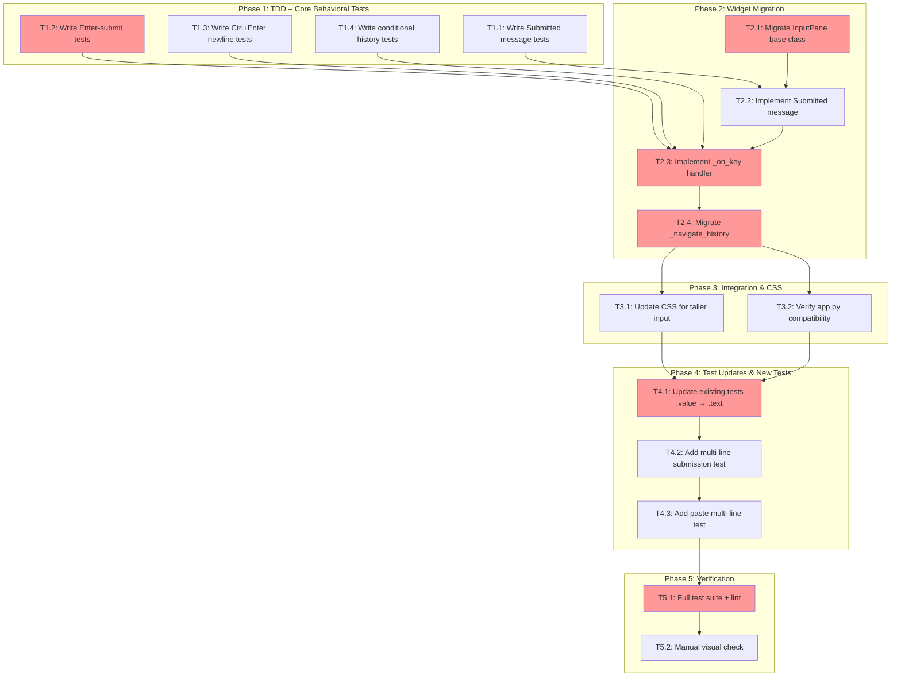

<!-- markdownlint-disable-file -->
# Implementation Plan: Enhanced Multi-Line Text Input

**Objective**: Migrate the TeamBot `InputPane` widget from Textual's single-line `Input` to multi-line `TextArea`, enabling multi-line composition, word wrap, scrolling, and intuitive Enter-to-submit / Ctrl+Enter-for-newline keybindings while preserving history navigation and existing workflows.

**Research**: [.agent-tracking/research/20260210-enhanced-text-input-research.md](../research/20260210-enhanced-text-input-research.md)
**Test Strategy**: [.agent-tracking/test-strategies/20260210-enhanced-text-input-test-strategy.md](../test-strategies/20260210-enhanced-text-input-test-strategy.md)
**Approach**: Hybrid (TDD for key handling & message contract; Code-First for migration wiring, history, CSS)

---

## Objectives

1. Replace the single-line `Input`-based `InputPane` with a `TextArea`-based widget supporting multi-line editing
2. Implement Enter-to-submit and Ctrl+Enter / Alt+Enter for newline insertion
3. Reconcile Up/Down arrow history navigation with multi-line cursor movement (conditional on cursor position)
4. Update CSS for a taller input area (5 lines default, min 3, max 10)
5. Preserve the `Submitted` message API contract so `app.py` handler requires no changes
6. Update all existing tests and add new multi-line-specific tests
7. Ensure full test suite and lint pass with no regressions

---

## Task Dependency Graph

**Critical Path**: T1.2 → T2.1 → T2.3 → T2.4 → T4.1 → T5.1
**Parallel Opportunities**: T1.1–T1.4 can all be written in parallel; T3.1 and T3.2 can run in parallel; T4.2 and T4.3 can run in parallel after T4.1.

---

## Phase 1: TDD – Core Behavioral Tests (Write Failing Tests First)

> **Approach**: TDD — write tests before implementation per test strategy.

- [ ] **T1.1**: Write `Submitted` message API contract tests — [Details Lines 10-33](../details/20260210-enhanced-text-input-details.md)
  - File: `tests/test_ui/test_input_pane.py`
  - Tests: `test_submitted_message_has_value`, `test_submitted_message_has_input_ref`
  - Verifies custom `Submitted` message has `.value` (str) and `.input` (widget ref) attributes

- [ ] **T1.2**: Write Enter-to-submit tests — [Details Lines 35-101](../details/20260210-enhanced-text-input-details.md)
  - File: `tests/test_ui/test_input_pane.py`
  - Tests: `test_enter_submits_text`, `test_enter_clears_input`, `test_enter_on_empty_does_not_submit`
  - Verifies Enter posts Submitted with correct value and clears widget

- [ ] **T1.3**: Write Ctrl+Enter / Alt+Enter newline tests — [Details Lines 103-149](../details/20260210-enhanced-text-input-details.md)
  - File: `tests/test_ui/test_input_pane.py`
  - Tests: `test_ctrl_enter_inserts_newline`, `test_alt_enter_inserts_newline`
  - Verifies newline is inserted without submission

- [ ] **T1.4**: Write conditional history navigation tests — [Details Lines 151-233](../details/20260210-enhanced-text-input-details.md)
  - File: `tests/test_ui/test_input_pane.py`
  - Tests: `test_history_up_only_on_first_line`, `test_history_down_only_on_last_line`, `test_single_line_up_down_is_history`
  - Verifies Up triggers history only at first line, Down only at last line

### Phase Gate: Phase 1 Complete When
- [ ] All TDD tests written in `tests/test_ui/test_input_pane.py`
- [ ] Tests reference `InputPane.Submitted`, `.text`, and conditional cursor behavior
- [ ] Tests are expected to FAIL (widget not yet migrated)
- [ ] Artifacts: Updated `tests/test_ui/test_input_pane.py` with new test class `TestMultiLineInput`

**Cannot Proceed If**: Tests cannot be written due to import errors or fixture issues.

---

## Phase 2: Widget Migration (Core Implementation)

> **Approach**: Code-First — implement to make Phase 1 tests pass.

- [ ] **T2.1**: Migrate `InputPane` base class from `Input` to `TextArea` — [Details Lines 235-297](../details/20260210-enhanced-text-input-details.md)
  - File: `src/teambot/ui/widgets/input_pane.py`
  - Change import: `from textual.widgets import Input` → `from textual.widgets import TextArea`
  - Change class: `InputPane(Input)` → `InputPane(TextArea)`
  - Update constructor: pass `soft_wrap=True`, `show_line_numbers=False`, forward `id`/`placeholder` kwargs
  - Import `Message` from `textual.message` and `events` from `textual`

- [ ] **T2.2**: Implement custom `Submitted` message — [Details Lines 299-334](../details/20260210-enhanced-text-input-details.md)
  - File: `src/teambot/ui/widgets/input_pane.py`
  - Add nested `class Submitted(Message)` with `input` and `value` attributes
  - Preserves API contract: `event.value`, `event.input`, `event.input.clear()`

- [ ] **T2.3**: Implement `_on_key` handler — [Details Lines 336-403](../details/20260210-enhanced-text-input-details.md)
  - File: `src/teambot/ui/widgets/input_pane.py`
  - `enter` → stop, prevent_default, post `Submitted`, store history
  - `ctrl+enter` / `alt+enter` → stop, prevent_default, insert `"\n"`
  - `up` + `cursor_at_first_line` → history backward
  - `down` + `cursor_at_last_line` → history forward
  - All else → `await super()._on_key(event)`
  - Remove old `on_input_submitted` and `on_key` methods

- [ ] **T2.4**: Migrate `_navigate_history` to use `.text` — [Details Lines 405-430](../details/20260210-enhanced-text-input-details.md)
  - File: `src/teambot/ui/widgets/input_pane.py`
  - Replace all `self.value` with `self.text`

### Phase Gate: Phase 2 Complete When
- [ ] All Phase 1 TDD tests pass
- [ ] `InputPane` extends `TextArea` with custom `Submitted` message
- [ ] `_on_key` correctly handles Enter, Ctrl+Enter, Alt+Enter, conditional Up/Down
- [ ] Validation: `uv run pytest tests/test_ui/test_input_pane.py -v`
- [ ] Artifacts: Updated `src/teambot/ui/widgets/input_pane.py`

**Cannot Proceed If**: TDD tests from Phase 1 still fail after implementation.

---

## Phase 3: Integration & CSS

> **Approach**: Code-First — straightforward wiring and styling.

- [ ] **T3.1**: Update CSS for taller input — [Details Lines 432-468](../details/20260210-enhanced-text-input-details.md)
  - File: `src/teambot/ui/styles.css`
  - Add `height: 5; min-height: 3; max-height: 10;` to `#prompt`

- [ ] **T3.2**: Verify `app.py` compatibility — [Details Lines 470-495](../details/20260210-enhanced-text-input-details.md)
  - File: `src/teambot/ui/app.py`
  - Verify `@on(InputPane.Submitted)` handler works with custom message
  - Verify `event.value.strip()`, `event.input.clear()` work unchanged
  - No code changes expected — custom `Submitted` preserves API

### Phase Gate: Phase 3 Complete When
- [ ] CSS updated with height properties
- [ ] App handler verified compatible (no changes needed)
- [ ] Validation: `uv run pytest tests/test_ui/test_app.py -v`
- [ ] Artifacts: Updated `src/teambot/ui/styles.css`

**Cannot Proceed If**: App integration tests fail due to message API mismatch.

---

## Phase 4: Test Updates & New Tests

> **Approach**: Code-First — update existing tests then add new coverage.

- [ ] **T4.1**: Update existing tests `.value` → `.text` — [Details Lines 497-521](../details/20260210-enhanced-text-input-details.md)
  - Files: `tests/test_ui/test_input_pane.py` (4 tests), `tests/test_ui/test_app.py` (1 test)
  - Change all `input_pane.value` assertions to `input_pane.text`
  - Ensure `pilot.press("enter")` still triggers submission flow

- [ ] **T4.2**: Add multi-line submission integration test — [Details Lines 523-562](../details/20260210-enhanced-text-input-details.md)
  - File: `tests/test_ui/test_input_pane.py`
  - Test: `test_multiline_content_submitted_intact`
  - Use Ctrl+Enter to build multi-line input, then Enter to submit; verify `\n` in submitted value

- [ ] **T4.3**: Add multi-line history recall test — [Details Lines 564-608](../details/20260210-enhanced-text-input-details.md)
  - File: `tests/test_ui/test_input_pane.py`
  - Test: `test_multiline_history_recall`
  - Submit multi-line content, navigate history, verify full multi-line text is restored

### Phase Gate: Phase 4 Complete When
- [ ] All existing 4 history tests pass with `.text` assertions
- [ ] `test_input_cleared_after_submit` passes with `.text` assertion
- [ ] New multi-line tests pass
- [ ] Validation: `uv run pytest tests/test_ui/ -v`
- [ ] Artifacts: Updated test files

**Cannot Proceed If**: Existing tests broken by migration.

---

## Phase 5: Verification

- [ ] **T5.1**: Full test suite + lint — [Details Lines 610-641](../details/20260210-enhanced-text-input-details.md)
  - Run: `uv run pytest` (all ~1084 tests)
  - Run: `uv run ruff check .` and `uv run ruff format .`
  - Zero failures, zero lint errors

- [ ] **T5.2**: Manual visual check — [Details Lines 643-671](../details/20260210-enhanced-text-input-details.md)
  - Launch: `uv run teambot init` (or similar) to visually confirm:
    - Input box is taller (~5 lines)
    - Word wrap works
    - Enter submits
    - Ctrl+Enter / Alt+Enter inserts newline (if terminal supports it)
    - Up/Down history works on single-line input
  - Note: This is informational — CI relies on automated tests

### Phase Gate: Phase 5 Complete When
- [ ] `uv run pytest` passes all tests
- [ ] `uv run ruff check .` passes
- [ ] Visual confirmation documented
- [ ] Artifacts: None (verification only)

**Cannot Proceed If**: Test failures or lint errors.

---

## Effort Estimation

| Task | Estimated Effort | Complexity | Risk |
|------|-----------------|------------|------|
| T1.1 | 15 min | LOW | LOW |
| T1.2 | 20 min | LOW | LOW |
| T1.3 | 15 min | LOW | LOW |
| T1.4 | 20 min | MEDIUM | LOW |
| T2.1 | 20 min | MEDIUM | MEDIUM |
| T2.2 | 10 min | LOW | LOW |
| T2.3 | 30 min | HIGH | HIGH |
| T2.4 | 10 min | LOW | LOW |
| T3.1 | 5 min | LOW | LOW |
| T3.2 | 10 min | LOW | LOW |
| T4.1 | 15 min | LOW | LOW |
| T4.2 | 15 min | MEDIUM | LOW |
| T4.3 | 15 min | MEDIUM | LOW |
| T5.1 | 10 min | LOW | LOW |
| T5.2 | 10 min | LOW | LOW |

**Total Estimated Effort**: ~3.5 hours
**Highest Risk**: T2.3 (`_on_key` handler) — key interception in Textual requires careful event.stop()/prevent_default() usage

---

## Dependencies

| Dependency | Status | Notes |
|------------|--------|-------|
| Textual >= 0.48.0 (TextArea with soft_wrap) | ✅ Installed (7.4.0) | Verified in research |
| pytest + pytest-asyncio | ✅ Installed | Existing test infrastructure |
| `re.DOTALL` in parser | ✅ Already present | Multi-line content supported |
| No changes to `app.py` handler | ✅ Custom Submitted preserves API | Verified in research |

---

## Success Criteria

1. ✅ `InputPane` extends `TextArea` with multi-line editing, soft wrap, and scrolling
2. ✅ Enter submits input; Ctrl+Enter and Alt+Enter insert newlines
3. ✅ History navigation: Up on first line = history backward, Down on last line = history forward
4. ✅ Input box visually shows ~5 lines with min 3 / max 10
5. ✅ All existing tests pass (updated for `.text` API)
6. ✅ New TDD tests cover key handling, message contract, and multi-line scenarios
7. ✅ `uv run pytest` passes all ~1084+ tests with no regressions
8. ✅ `uv run ruff check .` and `uv run ruff format .` pass
