<!-- markdownlint-disable-file -->
# Task Checklist: File-Based Orchestration Critical Failure Handling

## Overview

Implement robust critical failure handling in TeamBot's file-based orchestration to immediately halt workflow on missing artifacts with clear, actionable error messages.

## Objectives

* Add pre-stage artifact validation to halt workflow before stage execution if required artifacts are missing
* Create clear, actionable failure notifications via existing notification system (Telegram)
* Fix artifact path resolution to handle mismatches between expected and actual artifact locations
* Implement `MissingArtifactError` exception with recovery guidance

## Research Summary

### Project Files
* `src/teambot/orchestration/execution_loop.py` - Main execution loop (Lines 135-248) - needs artifact validation
* `src/teambot/orchestration/stage_config.py` - StageConfig with `artifacts` field (Lines 17-35)
* `stages.yaml` - Stage artifacts defined per stage (Lines 151-409)
* `src/teambot/notifications/events.py` - NotificationEvent structure (Lines 1-28)

### External References
* .agent-tracking/research/20260129-file-based-orchestration-research.md - Core orchestration architecture
* .agent-tracking/test-strategies/20260129-file-based-orchestration-test-strategy.md - TDD for critical components

### Standards References
* AGENTS.md - Clean commit requirements, test requirements

## Test Strategy

**Approach**: TDD - These are critical safety mechanisms that must be thoroughly tested before implementation.

Per .agent-tracking/test-strategies/20260129-file-based-orchestration-test-strategy.md (Lines 65-94):
- ObjectiveParser and critical validators use TDD
- Coverage Target: 95% for validators, 85% for integration
- Test framework: pytest with pytest-asyncio

## Implementation Checklist

### [ ] Phase 1: Core Exception and Validation Infrastructure (TDD)

**Phase Objective**: Create exception types and validation utilities for artifact checking

* [ ] Task 1.1: Write tests for MissingArtifactError exception
  * Details: .agent-tracking/details/20260225-critical-failure-handling-details.md (Lines 15-45)
  * Dependencies: None
  * Priority: CRITICAL

* [ ] Task 1.2: Implement MissingArtifactError exception class
  * Details: .agent-tracking/details/20260225-critical-failure-handling-details.md (Lines 47-80)
  * Dependencies: Task 1.1
  * Priority: CRITICAL

* [ ] Task 1.3: Write tests for ArtifactValidator class
  * Details: .agent-tracking/details/20260225-critical-failure-handling-details.md (Lines 82-130)
  * Dependencies: Task 1.2
  * Priority: CRITICAL

* [ ] Task 1.4: Implement ArtifactValidator class
  * Details: .agent-tracking/details/20260225-critical-failure-handling-details.md (Lines 132-175)
  * Dependencies: Task 1.3
  * Priority: CRITICAL

### Phase Gate: Phase 1 Complete When
- [ ] All Phase 1 tasks marked complete
- [ ] Tests pass: `uv run pytest tests/test_orchestration/test_artifact_validator.py -v`
- [ ] Coverage ≥ 95% for validator module
- [ ] No blocking dependencies for Phase 2

**Cannot Proceed If**: Tests fail or coverage below 95%

### [ ] Phase 2: Artifact Path Resolution Fix

**Phase Objective**: Fix root cause of artifact path mismatches

* [ ] Task 2.1: Write tests for artifact path resolution scenarios
  * Details: .agent-tracking/details/20260225-critical-failure-handling-details.md (Lines 177-215)
  * Dependencies: Phase 1 completion
  * Priority: HIGH

* [ ] Task 2.2: Implement multi-location artifact resolver
  * Details: .agent-tracking/details/20260225-critical-failure-handling-details.md (Lines 217-265)
  * Dependencies: Task 2.1
  * Priority: HIGH

### Phase Gate: Phase 2 Complete When
- [ ] All Phase 2 tasks marked complete
- [ ] Artifact resolution tests pass
- [ ] Existing tests still pass: `uv run pytest tests/test_orchestration/ -v`

**Cannot Proceed If**: Existing tests break

### [ ] Phase 3: ExecutionLoop Integration

**Phase Objective**: Integrate artifact validation into execution loop

* [ ] Task 3.1: Write integration tests for pre-stage validation
  * Details: .agent-tracking/details/20260225-critical-failure-handling-details.md (Lines 267-310)
  * Dependencies: Phase 2 completion
  * Priority: CRITICAL

* [ ] Task 3.2: Add artifact validation to ExecutionLoop._execute_work_stage
  * Details: .agent-tracking/details/20260225-critical-failure-handling-details.md (Lines 312-355)
  * Dependencies: Task 3.1
  * Priority: CRITICAL

* [ ] Task 3.3: Add artifact validation to ExecutionLoop._execute_review_stage
  * Details: .agent-tracking/details/20260225-critical-failure-handling-details.md (Lines 357-395)
  * Dependencies: Task 3.2
  * Priority: CRITICAL

### Phase Gate: Phase 3 Complete When
- [ ] All Phase 3 tasks marked complete
- [ ] Integration tests pass
- [ ] `uv run pytest tests/test_orchestration/test_execution_loop.py -v` passes
- [ ] Validation artifacts: Workflow halts on missing artifact

**Cannot Proceed If**: Integration tests fail

### [ ] Phase 4: Notification System Integration

**Phase Objective**: Send actionable notifications on critical failures

* [ ] Task 4.1: Write tests for critical failure notification events
  * Details: .agent-tracking/details/20260225-critical-failure-handling-details.md (Lines 397-435)
  * Dependencies: Phase 3 completion
  * Priority: HIGH

* [ ] Task 4.2: Add critical_failure event type to notification system
  * Details: .agent-tracking/details/20260225-critical-failure-handling-details.md (Lines 437-475)
  * Dependencies: Task 4.1
  * Priority: HIGH

* [ ] Task 4.3: Integrate notification emission on MissingArtifactError
  * Details: .agent-tracking/details/20260225-critical-failure-handling-details.md (Lines 477-510)
  * Dependencies: Task 4.2
  * Priority: HIGH

### Phase Gate: Phase 4 Complete When
- [ ] All Phase 4 tasks marked complete
- [ ] Notification tests pass
- [ ] Manual verification: Error triggers Telegram notification

**Cannot Proceed If**: Notification system breaks

### [ ] Phase 5: State Persistence and Recovery

**Phase Objective**: Ensure state is properly saved on critical failure for recovery

* [ ] Task 5.1: Write tests for state persistence on critical failure
  * Details: .agent-tracking/details/20260225-critical-failure-handling-details.md (Lines 512-545)
  * Dependencies: Phase 4 completion
  * Priority: HIGH

* [ ] Task 5.2: Add CRITICAL_FAILURE result type and state handling
  * Details: .agent-tracking/details/20260225-critical-failure-handling-details.md (Lines 547-585)
  * Dependencies: Task 5.1
  * Priority: HIGH

### Phase Gate: Phase 5 Complete When
- [ ] All Phase 5 tasks marked complete
- [ ] State persistence tests pass
- [ ] Recovery guidance included in saved state

**Cannot Proceed If**: State persistence fails

### [ ] Phase 6: Final Validation and Documentation

**Phase Objective**: Validate all components work together and document

* [ ] Task 6.1: Create acceptance test for critical failure scenario
  * Details: .agent-tracking/details/20260225-critical-failure-handling-details.md (Lines 587-620)
  * Dependencies: Phase 5 completion
  * Priority: CRITICAL

* [ ] Task 6.2: Run full test suite and validate coverage
  * Details: .agent-tracking/details/20260225-critical-failure-handling-details.md (Lines 622-645)
  * Dependencies: Task 6.1
  * Priority: HIGH

* [ ] Task 6.3: Lint and format code
  * Details: .agent-tracking/details/20260225-critical-failure-handling-details.md (Lines 647-660)
  * Dependencies: Task 6.2
  * Priority: HIGH

### Phase Gate: Phase 6 Complete When
- [ ] All tests pass: `uv run pytest --cov=src/teambot -v`
- [ ] Coverage meets target (85%+)
- [ ] Lint passes: `uv run ruff check . && uv run ruff format --check .`

**Cannot Proceed If**: Tests or linting fail

## Task Dependency Graph

```mermaid
graph TD
    subgraph Phase1[Phase 1: Core Infrastructure TDD]
        T1.1[Task 1.1: Tests for MissingArtifactError]
        T1.2[Task 1.2: Implement MissingArtifactError]
        T1.3[Task 1.3: Tests for ArtifactValidator]
        T1.4[Task 1.4: Implement ArtifactValidator]
    end
    
    subgraph Phase2[Phase 2: Path Resolution Fix]
        T2.1[Task 2.1: Path resolution tests]
        T2.2[Task 2.2: Implement resolver]
    end
    
    subgraph Phase3[Phase 3: ExecutionLoop Integration]
        T3.1[Task 3.1: Integration tests]
        T3.2[Task 3.2: Work stage validation]
        T3.3[Task 3.3: Review stage validation]
    end
    
    subgraph Phase4[Phase 4: Notifications]
        T4.1[Task 4.1: Notification tests]
        T4.2[Task 4.2: Critical failure event]
        T4.3[Task 4.3: Emit on error]
    end
    
    subgraph Phase5[Phase 5: State Persistence]
        T5.1[Task 5.1: State tests]
        T5.2[Task 5.2: CRITICAL_FAILURE result]
    end
    
    subgraph Phase6[Phase 6: Final Validation]
        T6.1[Task 6.1: Acceptance test]
        T6.2[Task 6.2: Full test suite]
        T6.3[Task 6.3: Lint and format]
    end
    
    T1.1 --> T1.2
    T1.2 --> T1.3
    T1.3 --> T1.4
    T1.4 --> T2.1
    T2.1 --> T2.2
    T2.2 --> T3.1
    T3.1 --> T3.2
    T3.2 --> T3.3
    T3.3 --> T4.1
    T4.1 --> T4.2
    T4.2 --> T4.3
    T4.3 --> T5.1
    T5.1 --> T5.2
    T5.2 --> T6.1
    T6.1 --> T6.2
    T6.2 --> T6.3
    
    %% Critical Path highlighted
    style T1.1 fill:#ff9999
    style T1.4 fill:#ff9999
    style T3.2 fill:#ff9999
    style T6.1 fill:#ff9999
```

**Critical Path**: T1.1 → T1.4 → T2.2 → T3.2 → T4.3 → T5.2 → T6.1
**Parallel Opportunities**: None - TDD approach requires sequential test-then-implement

## Effort Estimation

| Task | Estimated Effort | Complexity | Risk |
|------|-----------------|------------|------|
| T1.1-1.4 | 1.5 hours | MEDIUM | LOW |
| T2.1-2.2 | 1 hour | MEDIUM | MEDIUM |
| T3.1-3.3 | 2 hours | HIGH | MEDIUM |
| T4.1-4.3 | 1 hour | LOW | LOW |
| T5.1-5.2 | 1 hour | MEDIUM | LOW |
| T6.1-6.3 | 1 hour | LOW | LOW |

**Total Estimated Effort**: ~7.5 hours

## Dependencies

* pytest, pytest-asyncio, pytest-cov (existing dev dependencies)
* Existing notification system (Telegram channel)
* Existing orchestration_state.json persistence

## Success Criteria

* Workflow immediately halts when required artifacts are missing
* Error messages include exact path expected and what stage requires it
* Error messages include actionable recovery steps
* Notifications sent to configured channels on critical failure
* State properly saved for potential recovery/resume
* All existing tests continue to pass
* New test coverage ≥ 85% for new code
