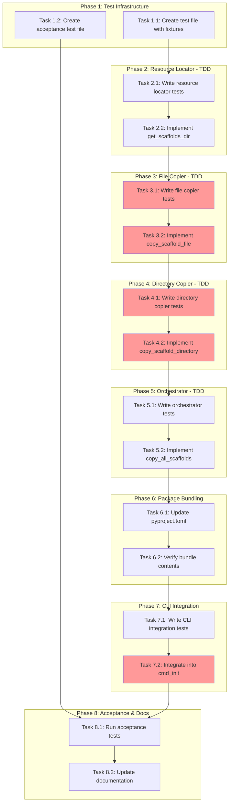

<!-- markdownlint-disable-file -->
# Task Plan: Map Repo Files to Package Location

## Overview

Enhance `teambot init` to automatically copy scaffolding files (stages.yaml, AGENTS.md, .agent/, .github/agents/, docs/sdd-objective-template.md) from the installed package to user repositories, with conditional copying that never overwrites existing files.

## Objectives

1. Bundle scaffolding files into the teambot package using Hatchling `force-include`
2. Create a `scaffolds.py` module for conditional file/directory copying
3. Integrate scaffold copying into `cmd_init()` with clear console output
4. Ensure cross-platform compatibility and safe re-run behavior
5. Achieve 90%+ test coverage using TDD approach

## Research Summary

- **Research Document**: `.agent-tracking/research/20260217-map-repo-files-research.md`
- **Test Strategy**: `.teambot/map-repo-files/artifacts/test_strategy.md`
- **Approach**: TDD (Test-Driven Development) per test strategy
- **Package bundling**: Hatchling `force-include` configuration
- **File access**: `importlib.resources.files()` for package resource access

## Task Dependency Graph



**Critical Path**: T1.1 → T2.1 → T2.2 → T3.1 → T3.2 → T4.1 → T4.2 → T5.1 → T5.2 → T6.1 → T7.1 → T7.2 → T8.1

## Implementation Checklist

### Phase 1: Test Infrastructure Setup
*(Details: Lines 15-45)*

- [ ] **Task 1.1**: Create `tests/test_scaffolds.py` with test class structure and fixtures
- [ ] **Task 1.2**: Create `tests/test_init_scaffolds_acceptance.py` with acceptance test structure

### Phase Gate: Phase 1 Complete When
- [ ] Both test files created with class skeletons
- [ ] Test files import successfully: `uv run python -c "import tests.test_scaffolds"`
- [ ] Artifacts: `tests/test_scaffolds.py`, `tests/test_init_scaffolds_acceptance.py`

**Cannot Proceed If**: Test file creation fails or imports error

---

### Phase 2: Resource Locator (TDD)
*(Details: Lines 47-80)*

- [ ] **Task 2.1**: Write tests for `get_scaffolds_dir()` function
  - Test: returns Path object
  - Test: scaffolds directory exists
  - Test: contains expected files (stages.yaml)
- [ ] **Task 2.2**: Implement `get_scaffolds_dir()` in `src/teambot/scaffolds.py`

### Phase Gate: Phase 2 Complete When
- [ ] All resource locator tests pass: `uv run pytest tests/test_scaffolds.py::TestGetScaffoldsDir -v`
- [ ] No ruff errors: `uv run ruff check src/teambot/scaffolds.py`
- [ ] Artifacts: `src/teambot/scaffolds.py` (partial)

**Cannot Proceed If**: Tests fail or scaffolds directory not locatable

---

### Phase 3: Single File Copier (TDD)
*(Details: Lines 82-130)*

- [ ] **Task 3.1**: Write tests for `copy_scaffold_file()` function
  - Test: copies file when target missing
  - Test: skips when target exists (CRITICAL)
  - Test: force flag overwrites existing
  - Test: creates parent directories
  - Test: returns CopyResult with correct status
- [ ] **Task 3.2**: Implement `copy_scaffold_file()` function

### Phase Gate: Phase 3 Complete When
- [ ] All file copier tests pass: `uv run pytest tests/test_scaffolds.py::TestCopyScaffoldFile -v`
- [ ] Coverage for copy_scaffold_file ≥ 100%
- [ ] Artifacts: `src/teambot/scaffolds.py` (updated)

**Cannot Proceed If**: Never-overwrite tests fail

---

### Phase 4: Directory Tree Copier (TDD)
*(Details: Lines 132-180)*

- [ ] **Task 4.1**: Write tests for `copy_scaffold_directory()` function
  - Test: copies directory when target missing
  - Test: skips when target exists and not empty (CRITICAL)
  - Test: copies into empty directory
  - Test: force flag overwrites existing directory
  - Test: returns CopyResult with correct status
- [ ] **Task 4.2**: Implement `copy_scaffold_directory()` function

### Phase Gate: Phase 4 Complete When
- [ ] All directory copier tests pass: `uv run pytest tests/test_scaffolds.py::TestCopyScaffoldDirectory -v`
- [ ] Coverage for copy_scaffold_directory ≥ 100%
- [ ] Artifacts: `src/teambot/scaffolds.py` (updated)

**Cannot Proceed If**: Directory-exists skip tests fail

---

### Phase 5: Scaffolding Orchestrator (TDD)
*(Details: Lines 182-230)*

- [ ] **Task 5.1**: Write tests for `copy_all_scaffolds()` function
  - Test: copies all 5 items to empty repository
  - Test: skips all existing items
  - Test: handles mixed state (some exist, some don't)
  - Test: returns list of CopyResult
- [ ] **Task 5.2**: Implement `copy_all_scaffolds()` function

### Phase Gate: Phase 5 Complete When
- [ ] All orchestrator tests pass: `uv run pytest tests/test_scaffolds.py::TestCopyAllScaffolds -v`
- [ ] Coverage for scaffolds.py ≥ 90%
- [ ] Artifacts: `src/teambot/scaffolds.py` (complete)

**Cannot Proceed If**: Full orchestration tests fail

---

### Phase 6: Package Bundling
*(Details: Lines 232-265)*

- [ ] **Task 6.1**: Update `pyproject.toml` with `[tool.hatch.build.targets.wheel.force-include]` section
- [ ] **Task 6.2**: Verify bundle by building wheel and inspecting contents

### Phase Gate: Phase 6 Complete When
- [ ] Build succeeds: `uv build`
- [ ] Wheel contains scaffolds: `unzip -l dist/*.whl | grep scaffolds`
- [ ] Artifacts: `pyproject.toml` (updated), `dist/*.whl`

**Cannot Proceed If**: Build fails or scaffolds not in wheel

---

### Phase 7: CLI Integration
*(Details: Lines 267-310)*

- [ ] **Task 7.1**: Write CLI integration tests in `tests/test_cli.py`
  - Test: init copies scaffolds to new repo
  - Test: init skips existing scaffolds
  - Test: init --force overwrites scaffolds
- [ ] **Task 7.2**: Integrate `copy_all_scaffolds()` into `cmd_init()` in `src/teambot/cli.py`

### Phase Gate: Phase 7 Complete When
- [ ] All CLI tests pass: `uv run pytest tests/test_cli.py::TestCLIInit -v`
- [ ] Existing CLI tests still pass
- [ ] Console output matches specification format
- [ ] Artifacts: `src/teambot/cli.py` (updated)

**Cannot Proceed If**: Existing CLI tests regress

---

### Phase 8: Acceptance Testing & Documentation
*(Details: Lines 312-350)*

- [ ] **Task 8.1**: Run and verify all acceptance tests pass
- [ ] **Task 8.2**: Update documentation (README.md, docs/guides/installation.md)

### Phase Gate: Phase 8 Complete When
- [ ] All tests pass: `uv run pytest --cov=src/teambot --cov-report=term-missing`
- [ ] Coverage ≥ 80% overall
- [ ] Documentation updated with new init behavior
- [ ] Artifacts: Documentation files (updated)

**Cannot Proceed If**: Acceptance tests fail or coverage below target

---

## Effort Estimation

| Task | Estimated Effort | Complexity | Risk |
|------|-----------------|------------|------|
| T1.1 Test infrastructure | 15 min | LOW | LOW |
| T1.2 Acceptance structure | 15 min | LOW | LOW |
| T2.1-2.2 Resource locator | 30 min | LOW | MEDIUM |
| T3.1-3.2 File copier | 45 min | MEDIUM | HIGH |
| T4.1-4.2 Directory copier | 45 min | MEDIUM | HIGH |
| T5.1-5.2 Orchestrator | 30 min | LOW | LOW |
| T6.1-6.2 Package bundling | 30 min | LOW | MEDIUM |
| T7.1-7.2 CLI integration | 30 min | LOW | LOW |
| T8.1-8.2 Acceptance & docs | 30 min | LOW | LOW |

**Total Estimated**: ~4.5 hours

## Dependencies

### Tools Required
- Python 3.10+
- uv package manager
- pytest, pytest-cov, pytest-mock

### Prerequisites
- [x] Research document validated
- [x] Test strategy approved
- [ ] Existing CLI tests passing (verify before starting)

## Success Criteria

1. ✅ `teambot init` copies all 5 scaffolding items to empty repository
2. ✅ Existing files are never overwritten (safe re-run)
3. ✅ Console output clearly shows copied vs. skipped status
4. ✅ Works when installed via pip/uvx (wheel distribution)
5. ✅ All tests pass with ≥80% coverage
6. ✅ Documentation updated

## Validation Commands

```bash
# Run all scaffolds tests
uv run pytest tests/test_scaffolds.py -v

# Run acceptance tests
uv run pytest tests/test_init_scaffolds_acceptance.py -v

# Run full test suite with coverage
uv run pytest --cov=src/teambot --cov-report=term-missing

# Verify build
uv build && unzip -l dist/*.whl | grep scaffolds

# Manual verification
cd /tmp && mkdir test-repo && cd test-repo && git init && teambot init
```
