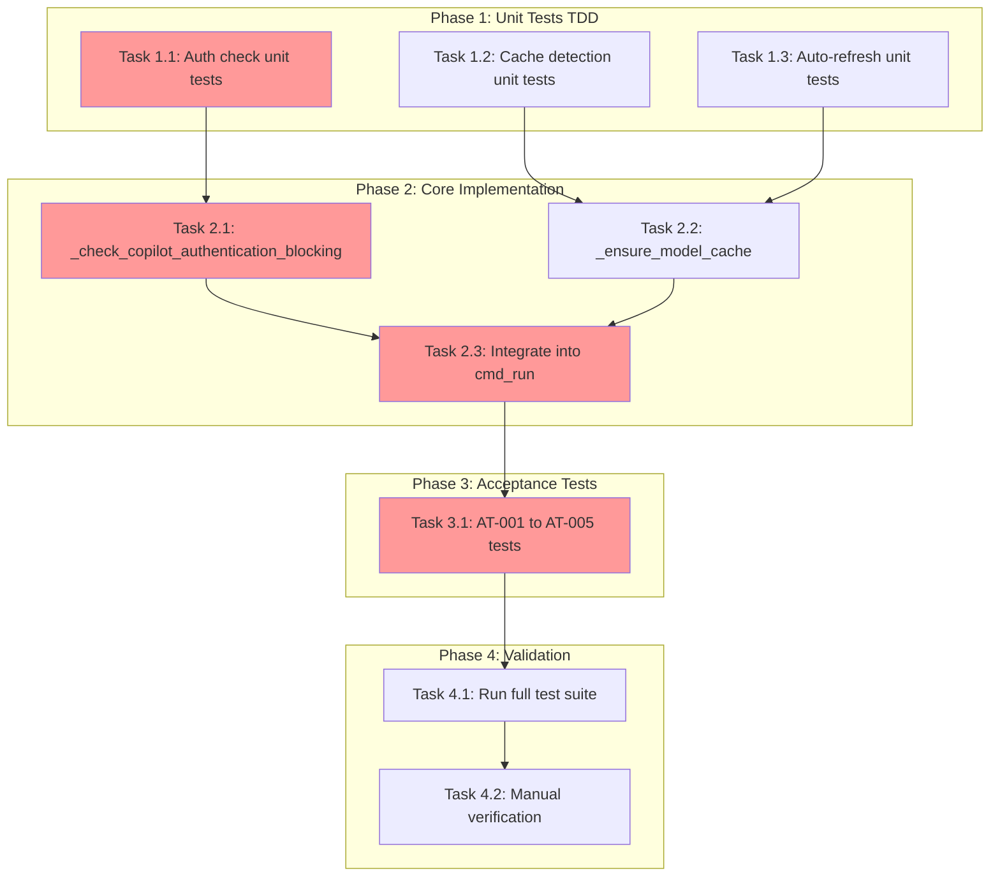

<!-- markdownlint-disable-file -->
# Task Checklist: Model Cache Auto-Setup and Login Validation

## Overview

Enable `teambot run` to automatically validate Copilot CLI authentication and refresh the model cache when missing, providing a seamless first-run experience.

## Objectives

* Add authentication check to `cmd_run()` that blocks execution if not authenticated
* Detect missing/empty model cache and auto-refresh before config loading
* Display clear status messages during cache refresh
* Handle failures gracefully with actionable error guidance
* Maintain backward compatibility - no behavior change when cache exists

## Research Summary

### Project Files
* `src/teambot/cli.py` - Contains `cmd_run()` (target), `_check_copilot_authentication()`, `_refresh_model_cache()`
* `src/teambot/config/model_cache.py` - Contains `load_cache()`, `is_cache_valid()`
* `src/teambot/config/loader.py` - `ConfigLoader.load()` validates models (triggers cache load)
* `src/teambot/config/schema.py` - `validate_model()` function

### External References
* .agent-tracking/research/20260219-model-cache-auto-setup-research.md - Complete analysis of implementation approach
* .teambot/model-cache-auto/artifacts/test_strategy.md - TDD approach with component breakdown

### Test References
* tests/test_cli.py - Existing CLI tests with async mocking patterns
* tests/test_init_model_config_acceptance.py - Acceptance test patterns (AT-xxx naming)

## Task Dependency Graph

**Critical Path**: T1.1 → T2.1 → T2.3 → T3.1 → T4.1
**Parallel Opportunities**: T1.1, T1.2, T1.3 can run in parallel; T2.1 and T2.2 can run in parallel after their tests

## Implementation Checklist

### [ ] Phase 1: Unit Tests (TDD)

**Phase Objective**: Create failing tests that define expected behavior before implementation

**Test Strategy**: TDD - See .teambot/model-cache-auto/artifacts/test_strategy.md

* [ ] Task 1.1: Create unit tests for blocking auth check
  * Details: .agent-tracking/details/20260219-model-cache-auto-setup-details.md (Lines 15-60)
  * Dependencies: None
  * Priority: CRITICAL
  * Coverage Target: 95%

* [ ] Task 1.2: Create unit tests for cache missing detection
  * Details: .agent-tracking/details/20260219-model-cache-auto-setup-details.md (Lines 62-95)
  * Dependencies: None
  * Priority: HIGH
  * Coverage Target: 90%

* [ ] Task 1.3: Create unit tests for auto-refresh flow
  * Details: .agent-tracking/details/20260219-model-cache-auto-setup-details.md (Lines 97-140)
  * Dependencies: None
  * Priority: CRITICAL
  * Coverage Target: 90%

### Phase Gate: Phase 1 Complete When
- [ ] All unit tests created in tests/test_cli.py
- [ ] Tests fail as expected (no implementation yet)
- [ ] Validation: `uv run pytest tests/test_cli.py -k "TestRunAuth or TestRunModelCache" -v` shows failures

**Cannot Proceed If**: Tests don't compile or have syntax errors

---

### [ ] Phase 2: Core Implementation

**Phase Objective**: Implement helper functions and integrate into cmd_run()

* [ ] Task 2.1: Implement `_check_copilot_authentication_blocking()` function
  * Details: .agent-tracking/details/20260219-model-cache-auto-setup-details.md (Lines 145-185)
  * Dependencies: Task 1.1 (tests exist)
  * Priority: CRITICAL

* [ ] Task 2.2: Implement `_ensure_model_cache()` function
  * Details: .agent-tracking/details/20260219-model-cache-auto-setup-details.md (Lines 187-230)
  * Dependencies: Task 1.2, Task 1.3 (tests exist)
  * Priority: CRITICAL

* [ ] Task 2.3: Integrate auth check and cache ensure into `cmd_run()`
  * Details: .agent-tracking/details/20260219-model-cache-auto-setup-details.md (Lines 232-275)
  * Dependencies: Task 2.1, Task 2.2
  * Priority: CRITICAL

### Phase Gate: Phase 2 Complete When
- [ ] All Phase 1 unit tests pass
- [ ] `_check_copilot_authentication_blocking()` implemented
- [ ] `_ensure_model_cache()` implemented
- [ ] `cmd_run()` calls both functions before config loading
- [ ] Validation: `uv run pytest tests/test_cli.py -k "TestRunAuth or TestRunModelCache" -v` all pass
- [ ] Artifacts: Modified src/teambot/cli.py

**Cannot Proceed If**: Unit tests failing, ruff check fails

---

### [ ] Phase 3: Acceptance Tests

**Phase Objective**: Validate end-to-end scenarios defined in feature spec

* [ ] Task 3.1: Create acceptance test file with AT-001 to AT-005 scenarios
  * Details: .agent-tracking/details/20260219-model-cache-auto-setup-details.md (Lines 280-365)
  * Dependencies: Phase 2 completion
  * Priority: HIGH
  * Test Framework: pytest with pytest-mock

### Phase Gate: Phase 3 Complete When
- [ ] tests/test_model_cache_auto_acceptance.py created
- [ ] All 5 acceptance scenarios implemented (AT-001 through AT-005)
- [ ] Validation: `uv run pytest tests/test_model_cache_auto_acceptance.py -v` all pass
- [ ] Artifacts: New test file

**Cannot Proceed If**: Any acceptance test fails

---

### [ ] Phase 4: Validation & Cleanup

**Phase Objective**: Ensure all tests pass and code quality standards met

* [ ] Task 4.1: Run full test suite and verify no regressions
  * Details: .agent-tracking/details/20260219-model-cache-auto-setup-details.md (Lines 370-385)
  * Dependencies: Phase 3 completion
  * Priority: CRITICAL

* [ ] Task 4.2: Run linters and format code
  * Details: .agent-tracking/details/20260219-model-cache-auto-setup-details.md (Lines 387-400)
  * Dependencies: Task 4.1
  * Priority: HIGH

* [ ] Task 4.3: Manual verification of key scenarios
  * Details: .agent-tracking/details/20260219-model-cache-auto-setup-details.md (Lines 402-420)
  * Dependencies: Task 4.2
  * Priority: MEDIUM

### Phase Gate: Phase 4 Complete When
- [ ] `uv run pytest` passes (all tests)
- [ ] `uv run ruff check .` passes
- [ ] `uv run ruff format --check .` passes
- [ ] Manual verification completed

**Cannot Proceed If**: Any test failures or linting errors

---

## Effort Estimation

| Task | Estimated Effort | Complexity | Risk |
|------|-----------------|------------|------|
| T1.1: Auth unit tests | 30 min | LOW | LOW |
| T1.2: Cache detection tests | 20 min | LOW | LOW |
| T1.3: Auto-refresh tests | 30 min | MEDIUM | LOW |
| T2.1: Auth blocking impl | 20 min | LOW | LOW |
| T2.2: Ensure cache impl | 30 min | MEDIUM | MEDIUM |
| T2.3: cmd_run integration | 20 min | LOW | MEDIUM |
| T3.1: Acceptance tests | 45 min | MEDIUM | LOW |
| T4.1-4.3: Validation | 20 min | LOW | LOW |
| **Total** | ~3.5 hours | MEDIUM | LOW |

## Dependencies

* pytest >=7.4.0 (existing)
* pytest-mock (existing)
* pytest-asyncio (existing)
* pytest-cov (existing)
* ruff (existing)
* uv (existing)

## Success Criteria

* `teambot run` checks Copilot CLI authentication before proceeding
* Unauthenticated users see clear error: "Run 'copilot auth' first"
* Missing model cache triggers automatic refresh with status message
* Successful refresh allows workflow to continue
* Failed refresh shows clear error with network guidance
* Valid cache skips all checks - no startup delay
* All existing tests pass (no regressions)
* New unit test coverage ≥ 90% for new code
* All 5 acceptance tests pass
* ruff check and ruff format both pass
