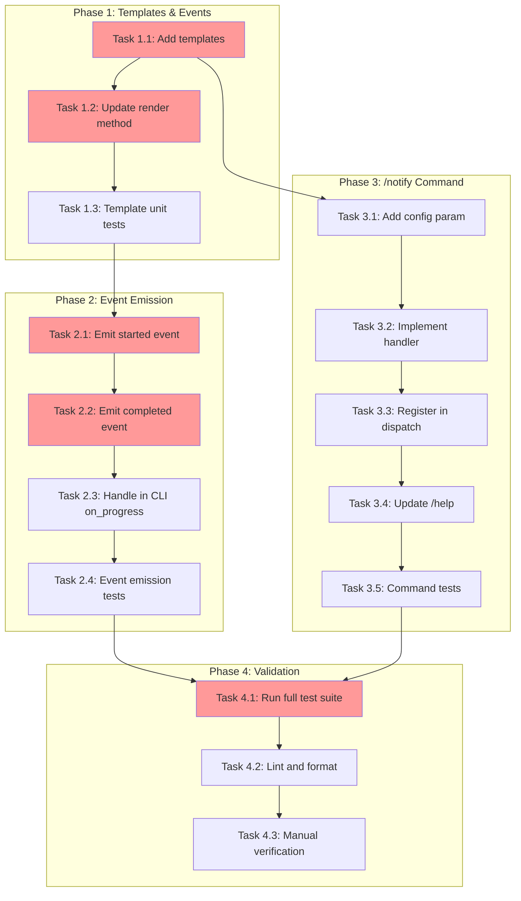

<!-- markdownlint-disable-file -->
# Implementation Plan: Notification UX Improvements

## Overview

Add header/footer notifications when starting and completing orchestration runs, and implement a `/notify <msg>` REPL command for testing notification configuration.

## Objectives

- Emit `orchestration_started` event at ExecutionLoop.run() entry
- Emit `orchestration_completed` event at ExecutionLoop.run() completion
- Add new templates for lifecycle and custom message events
- Implement `/notify <message>` REPL command
- Update `/help` to include `/notify`
- Achieve 100% test coverage on new code

## Research Summary

- **Research Document**: `.teambot/notification-ux-improvements/artifacts/research.md`
- **Test Strategy**: `.teambot/notification-ux-improvements/artifacts/test_strategy.md`
- **Feature Spec**: `.teambot/notification-ux-improvements/artifacts/feature_spec.md`

Key findings:
- EventBus uses `emit_sync()` for fire-and-forget notifications (Lines 127-161 of event_bus.py)
- SystemCommands.dispatch() registers handlers in handlers dict (Lines 673-696 of commands.py)
- MessageTemplates.TEMPLATES dict holds all template strings (Lines 24-43 of templates.py)
- ExecutionLoop.run() takes `on_progress` callback for event emission (Line 135 of execution_loop.py)

## Task Dependency Graph

**Critical Path**: T1.1 → T1.2 → T1.3 → T2.1 → T2.2 → T2.3 → T2.4 → T4.1 → T4.2 → T4.3

**Parallel Opportunities**: Phase 3 (T3.1-T3.5) can run in parallel with Phase 2 after T1.1 completes.

---

## Implementation Checklist

### Phase 1: Templates & Events (TDD)
> **Approach**: TDD - Write tests before implementation
> **Details**: See details file Lines 25-90

- [ ] **Task 1.1**: Add new templates to TEMPLATES dict
  - File: `src/teambot/notifications/templates.py`
  - Details: Lines 25-45
  - Add `orchestration_started`, `orchestration_completed`, `custom_message` templates

- [ ] **Task 1.2**: Update render() method for new event types
  - File: `src/teambot/notifications/templates.py`
  - Details: Lines 47-75
  - Add fallback logic for missing objective_name
  - Add duration formatting for completed event

- [ ] **Task 1.3**: Add template unit tests
  - File: `tests/test_notifications/test_templates.py` (extend)
  - Details: Lines 77-90
  - Test all three new templates
  - Test fallback for missing objective_name
  - Test HTML escaping

### Phase Gate: Phase 1 Complete When
- [ ] All Phase 1 tasks marked complete
- [ ] `uv run pytest tests/test_notifications/test_templates.py -v` passes
- [ ] Artifacts: New templates rendering correctly

**Cannot Proceed If**: Template tests failing or missing fallback logic

---

### Phase 2: Event Emission (TDD)
> **Approach**: TDD - Write tests before implementation
> **Details**: See details file Lines 92-165

- [ ] **Task 2.1**: Emit orchestration_started event at run() entry
  - File: `src/teambot/orchestration/execution_loop.py`
  - Details: Lines 92-115
  - Emit after `time_manager.start()` (around Line 151)

- [ ] **Task 2.2**: Emit orchestration_completed event at run() exit
  - File: `src/teambot/orchestration/execution_loop.py`
  - Details: Lines 117-145
  - Emit before `_save_state(ExecutionResult.COMPLETE)` (around Line 220)
  - Handle all exit paths (COMPLETE, CANCELLED, TIMEOUT, ERROR)

- [ ] **Task 2.3**: Handle new events in CLI on_progress callback
  - File: `src/teambot/cli.py`
  - Details: Lines 147-165
  - Add console display for started/completed events

- [ ] **Task 2.4**: Add event emission tests
  - File: `tests/test_orchestration/test_execution_loop.py` (extend)
  - Details: Lines 167-185
  - Test started event emitted at run entry
  - Test completed event emitted at run exit
  - Test events include correct data fields

### Phase Gate: Phase 2 Complete When
- [ ] All Phase 2 tasks marked complete
- [ ] `uv run pytest tests/test_orchestration/test_execution_loop.py -v` passes
- [ ] Artifacts: Events emitted with correct data

**Cannot Proceed If**: Event emission tests failing or missing objective context

---

### Phase 3: /notify Command (Code-First)
> **Approach**: Code-First - Implement then write tests
> **Details**: See details file Lines 187-280

- [ ] **Task 3.1**: Add config parameter to SystemCommands
  - File: `src/teambot/repl/commands.py`
  - Details: Lines 187-210
  - Add `config: dict | None = None` to __init__
  - Wire config in `src/teambot/repl/loop.py`

- [ ] **Task 3.2**: Implement notify() handler method
  - File: `src/teambot/repl/commands.py`
  - Details: Lines 212-250
  - Check for missing config/disabled notifications
  - Create EventBus and emit custom_message event

- [ ] **Task 3.3**: Register notify in dispatch handlers
  - File: `src/teambot/repl/commands.py`
  - Details: Lines 252-260
  - Add `"notify": self.notify` to handlers dict

- [ ] **Task 3.4**: Update /help output
  - File: `src/teambot/repl/commands.py`
  - Details: Lines 262-270
  - Add `/notify <message>` to help text

- [ ] **Task 3.5**: Add command unit tests
  - File: `tests/test_repl/test_commands.py` (extend or new file)
  - Details: Lines 272-280
  - Test notify with valid message
  - Test notify without args
  - Test notify with missing/disabled config

### Phase Gate: Phase 3 Complete When
- [ ] All Phase 3 tasks marked complete
- [ ] `uv run pytest tests/test_repl/test_commands.py -v` passes
- [ ] Artifacts: /notify command functional

**Cannot Proceed If**: Command handler tests failing

---

### Phase 4: Validation
> **Details**: See details file Lines 282-310

- [ ] **Task 4.1**: Run full test suite
  - Command: `uv run pytest --cov=src/teambot --cov-report=term-missing`
  - Verify no regressions
  - Verify coverage targets met (100% on new code)

- [ ] **Task 4.2**: Lint and format code
  - Command: `uv run ruff format . && uv run ruff check . --fix`
  - Fix any linting issues

- [ ] **Task 4.3**: Manual verification
  - Start REPL: `uv run teambot`
  - Run `/help` - verify /notify listed
  - Run `/notify Test message` - verify feedback
  - Run orchestration with objective - verify header/footer

### Phase Gate: Phase 4 Complete When
- [ ] All tests pass
- [ ] Linting clean
- [ ] Manual verification successful
- [ ] Artifacts: All functionality working

---

## Dependencies

| Dependency | Type | Status |
|------------|------|--------|
| EventBus (event_bus.py) | Internal | Stable |
| MessageTemplates (templates.py) | Internal | Stable |
| SystemCommands (commands.py) | Internal | Stable |
| ExecutionLoop (execution_loop.py) | Internal | Stable |
| pytest, pytest-mock | Dev | Available |

## Success Criteria

- [ ] `orchestration_started` event emitted at run start with objective info
- [ ] `orchestration_completed` event emitted at run completion with duration
- [ ] Header/footer messages appear in terminal UI and notifications
- [ ] `/notify <message>` sends to all configured channels
- [ ] `/notify` without args shows usage help
- [ ] `/notify` shows helpful error when notifications not configured
- [ ] `/help` includes `/notify` command
- [ ] All new code has 100% test coverage
- [ ] All existing tests continue to pass

## Effort Estimation

| Task | Estimated Effort | Complexity | Risk |
|------|-----------------|------------|------|
| T1.1-T1.3 | 45 min | LOW | LOW |
| T2.1-T2.4 | 1.5 hours | MEDIUM | LOW |
| T3.1-T3.5 | 1 hour | LOW | LOW |
| T4.1-T4.3 | 30 min | LOW | LOW |
| **Total** | ~4 hours | MEDIUM | LOW |

## References

| Ref ID | Type | Source |
|--------|------|--------|
| REF-001 | Research | `.teambot/notification-ux-improvements/artifacts/research.md` |
| REF-002 | Test Strategy | `.teambot/notification-ux-improvements/artifacts/test_strategy.md` |
| REF-003 | Feature Spec | `.teambot/notification-ux-improvements/artifacts/feature_spec.md` |
