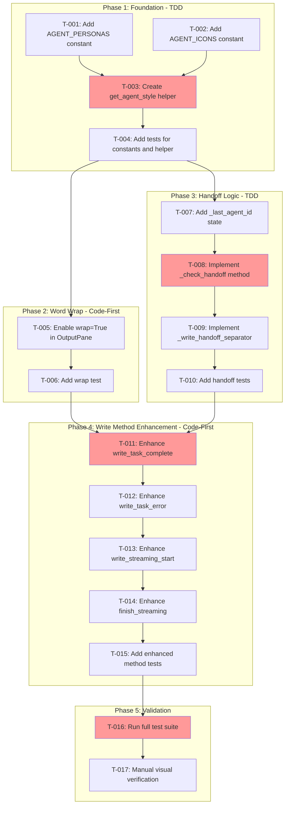

<!-- markdownlint-disable-file -->
# Implementation Plan: Output Pane Enhancement

**Date**: 2026-02-05  
**Feature**: Output Pane Enhancement for Multi-Agent Identification  
**Research Reference**: `.agent-tracking/research/20260205-output-pane-enhancement-research.md`  
**Test Strategy Reference**: `.agent-tracking/test-strategies/20260205-output-pane-enhancement-test-strategy.md`

---

## Overview

Enhance the OutputPane widget to provide clear visual identification of agent output through persona-specific colors, icons, word wrap, and handoff indicators.

## Objectives

- [x] Enable word wrap to eliminate horizontal scrolling (P0)
- [ ] Add agent color coding using persona-specific colors (P0)
- [ ] Add agent persona icons for visual identification (P0)
- [ ] Implement handoff indicator when agents switch (P1)
- [ ] Ensure no degradation of existing terminal experience (P0)

---

## Research Summary

| Finding | Source | Implication |
|---------|--------|-------------|
| `PERSONA_COLORS` exists but unused in OutputPane | Research Lines 83-97 | Reuse existing color definitions |
| `RichLog` has `wrap` parameter (currently `False`) | Research Lines 99-116 | Simple fix: set `wrap=True` |
| 6 agent IDs need persona mapping | Research Lines 206-237 | Create `AGENT_PERSONAS` and `AGENT_ICONS` constants |
| 17 existing tests use mock pattern | Research Lines 429-455 | Follow same test pattern |
| Test strategy: Hybrid (TDD core, Code-First mods) | Test Strategy Lines 14-23 | TDD for new functions, Code-First for write methods |

---

## Task Dependency Graph

**Critical Path**: T-001 → T-003 → T-004 → T-007 → T-008 → T-011 → T-016  
**Parallel Opportunities**: T-001 and T-002 can run in parallel; Phase 2 can run parallel to Phase 3

---

## Implementation Checklist

### Phase 1: Foundation (TDD Approach)
*Establish agent styling infrastructure*

- [ ] **T-001**: Add `AGENT_PERSONAS` constant to `console.py` (Details Lines 15-35)
- [ ] **T-002**: Add `AGENT_ICONS` constant to `console.py` (Details Lines 37-57)
- [ ] **T-003**: Create `get_agent_style()` helper function (Details Lines 59-89)
- [ ] **T-004**: Add unit tests for constants and helper (Details Lines 91-125)

### Phase Gate: Phase 1 Complete When
- [ ] All Phase 1 tasks marked complete
- [ ] `uv run pytest tests/test_visualization/test_console.py -v` passes
- [ ] Artifacts: `AGENT_PERSONAS`, `AGENT_ICONS`, `get_agent_style()` in console.py

**Cannot Proceed If**: Tests fail or constants missing agents

---

### Phase 2: Word Wrap (Code-First Approach)
*Enable word wrap to eliminate horizontal scrolling*

- [ ] **T-005**: Enable `wrap=True` in OutputPane `__init__` (Details Lines 127-147)
- [ ] **T-006**: Add test verifying wrap is enabled (Details Lines 149-165)

### Phase Gate: Phase 2 Complete When
- [ ] All Phase 2 tasks marked complete
- [ ] `uv run pytest tests/test_ui/test_output_pane.py -v` passes
- [ ] Artifacts: Modified OutputPane with wrap enabled

**Cannot Proceed If**: Existing tests fail after wrap change

---

### Phase 3: Handoff Logic (TDD Approach)
*Implement agent handoff detection and visualization*

- [ ] **T-007**: Add `_last_agent_id` state variable to OutputPane (Details Lines 167-183)
- [ ] **T-008**: Implement `_check_handoff()` method (Details Lines 185-215)
- [ ] **T-009**: Implement `_write_handoff_separator()` method (Details Lines 217-247)
- [ ] **T-010**: Add handoff detection tests (Details Lines 249-285)

### Phase Gate: Phase 3 Complete When
- [ ] All Phase 3 tasks marked complete
- [ ] `uv run pytest tests/test_ui/test_output_pane.py::TestHandoffDetection -v` passes
- [ ] Artifacts: `_check_handoff()`, `_write_handoff_separator()` methods

**Cannot Proceed If**: Handoff logic tests fail

---

### Phase 4: Write Method Enhancement (Code-First Approach)
*Apply persona styling to all output methods*

- [ ] **T-011**: Enhance `write_task_complete()` with persona styling (Details Lines 287-325)
- [ ] **T-012**: Enhance `write_task_error()` with persona styling (Details Lines 327-355)
- [ ] **T-013**: Enhance `write_streaming_start()` with persona styling (Details Lines 357-385)
- [ ] **T-014**: Enhance `finish_streaming()` with persona styling (Details Lines 387-425)
- [ ] **T-015**: Add tests for enhanced methods (Details Lines 427-475)

### Phase Gate: Phase 4 Complete When
- [ ] All Phase 4 tasks marked complete
- [ ] All existing tests still pass
- [ ] New styling tests pass
- [ ] Artifacts: Enhanced write methods with color and icon support

**Cannot Proceed If**: Any write method regression

---

### Phase 5: Validation
*Verify complete implementation*

- [ ] **T-016**: Run full test suite with coverage (Details Lines 477-495)
- [ ] **T-017**: Manual visual verification in terminal (Details Lines 497-515)

### Phase Gate: Phase 5 Complete When
- [ ] All tests pass
- [ ] Coverage ≥85%
- [ ] Visual confirmation of agent colors, icons, wrap, and handoff

---

## Dependencies

| Dependency | Status | Notes |
|------------|--------|-------|
| Rich ≥13.0.0 | ✅ Installed | Already in pyproject.toml |
| Textual ≥0.47.0 | ✅ Installed | Already in pyproject.toml |
| pytest ≥7.4.0 | ✅ Installed | Dev dependency |
| PERSONA_COLORS | ✅ Exists | Lines 24-31 in console.py |
| Existing OutputPane tests | ✅ 17 tests | Baseline for regression detection |

---

## Success Criteria

| Criterion | Verification Method |
|-----------|---------------------|
| Agent output has persona-specific color | Test assertion: `[blue]` in PM output |
| Agent output has persona icon | Test assertion: `📋` in PM output |
| No horizontal scrolling | `wrap=True` verified in init |
| Handoff indicator appears | Test assertion: separator on agent change |
| No regression in existing tests | All 17 existing tests pass |
| Coverage target met | `pytest --cov` reports ≥85% |

---

## Files Affected

| File | Change Type | Purpose |
|------|-------------|---------|
| `src/teambot/visualization/console.py` | Modify | Add constants and helper |
| `src/teambot/ui/widgets/output_pane.py` | Modify | Enable wrap, add handoff, enhance write methods |
| `tests/test_visualization/test_console.py` | Create/Modify | Tests for new constants and helper |
| `tests/test_ui/test_output_pane.py` | Modify | Tests for new functionality |

---

## Effort Estimation

| Task | Estimated Effort | Complexity | Risk |
|------|-----------------|------------|------|
| Phase 1 (Foundation) | 45 min | LOW | LOW |
| Phase 2 (Word Wrap) | 15 min | LOW | LOW |
| Phase 3 (Handoff) | 30 min | MEDIUM | LOW |
| Phase 4 (Write Methods) | 60 min | MEDIUM | MEDIUM |
| Phase 5 (Validation) | 20 min | LOW | LOW |
| **Total** | **~2.5 hours** | - | - |

---

## Next Steps

After plan approval, proceed to **Step 6** (`sdd.6-review-plan.prompt.md`) for plan validation before implementation.
