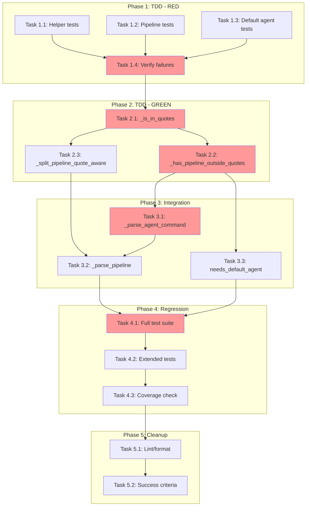

<!-- markdownlint-disable-file -->
# Task Checklist: Fix Pipeline Parse Error in REPL Parser

## Overview

Fix the REPL parser to correctly distinguish between pipeline operator syntax (`-> @agent`) and casual mentions of `->` in quoted strings by implementing quote-aware parsing.

## Objectives

* Implement quote-aware helper functions that track single/double quote state
* Update pipeline detection to ignore `-> @` patterns inside quotes
* Update pipeline splitting to only split on unquoted operators
* Maintain 100% backward compatibility with existing valid pipeline syntax
* Achieve 95%+ test coverage with TDD approach

## Research Summary

### Project Files
* `src/teambot/repl/parser.py` - Parser module containing `PIPELINE_PATTERN`, `_parse_agent_command()`, `_parse_pipeline()`, `needs_default_agent_for_pipeline()`
* `tests/test_repl/test_parser.py` - Existing parser tests (73+ tests)
* `tests/test_repl/test_parser_extended.py` - Extended syntax tests including pipeline

### External References
* .agent-tracking/research/20260303-pipeline-parse-error-research.md - Complete research with code examples and implementation patterns
* .teambot/pipeline-parse-error/artifacts/test_strategy.md - TDD strategy with 10 unit test cases defined

## Implementation Checklist

### [x] Phase 1: Test Implementation (TDD - RED Phase)

**Phase Objective**: Create failing tests that define expected quote-aware behavior

**Test Strategy**: TDD - Tests BEFORE implementation per test strategy document

* [x] Task 1.1: Create test class for quote-aware helper functions
  * Details: .agent-tracking/details/20260303-pipeline-parse-error-details.md (Lines 15-50)
  * Dependencies: None
  * Priority: CRITICAL

* [x] Task 1.2: Create test class for quoted pipeline handling
  * Details: .agent-tracking/details/20260303-pipeline-parse-error-details.md (Lines 52-95)
  * Dependencies: None
  * Priority: CRITICAL

* [x] Task 1.3: Create test class for default agent pipeline with quotes
  * Details: .agent-tracking/details/20260303-pipeline-parse-error-details.md (Lines 97-120)
  * Dependencies: None
  * Priority: HIGH

* [x] Task 1.4: Verify all new tests fail (confirming bug exists)
  * Details: .agent-tracking/details/20260303-pipeline-parse-error-details.md (Lines 122-130)
  * Dependencies: Tasks 1.1, 1.2, 1.3
  * Priority: HIGH

#### Phase Gate: Phase 1 Complete When
- [x] All new test classes created in `tests/test_repl/test_parser.py`
- [x] 10+ new test functions covering UT-001 through UT-010
- [x] All new tests fail when run (confirms bug detection)
- [x] Validation: `uv run pytest tests/test_repl/test_parser.py::TestQuoteAwareHelpers -v` shows failures
- [x] Artifacts: New test code in test_parser.py

**Cannot Proceed If**: New tests pass (means tests don't detect the bug)

### [x] Phase 2: Core Implementation (TDD - GREEN Phase)

**Phase Objective**: Implement quote-aware helper functions to make tests pass

* [x] Task 2.1: Implement `_is_in_quotes()` helper function
  * Details: .agent-tracking/details/20260303-pipeline-parse-error-details.md (Lines 135-165)
  * Dependencies: Phase 1 completion
  * Priority: CRITICAL

* [x] Task 2.2: Implement `_has_pipeline_outside_quotes()` helper function
  * Details: .agent-tracking/details/20260303-pipeline-parse-error-details.md (Lines 167-205)
  * Dependencies: Task 2.1
  * Priority: CRITICAL

* [x] Task 2.3: Implement `_split_pipeline_quote_aware()` helper function
  * Details: .agent-tracking/details/20260303-pipeline-parse-error-details.md (Lines 207-255)
  * Dependencies: Task 2.1
  * Priority: CRITICAL

#### Phase Gate: Phase 2 Complete When
- [x] All three helper functions implemented
- [x] Helper function tests pass
- [x] Validation: `uv run pytest tests/test_repl/test_parser.py::TestQuoteAwareHelpers -v` passes
- [x] Artifacts: Helper functions in parser.py

**Cannot Proceed If**: Helper function tests fail

### [x] Phase 3: Parser Integration

**Phase Objective**: Integrate helper functions into existing parser functions

* [x] Task 3.1: Update `_parse_agent_command()` to use `_has_pipeline_outside_quotes()`
  * Details: .agent-tracking/details/20260303-pipeline-parse-error-details.md (Lines 260-280)
  * Dependencies: Phase 2 completion
  * Priority: CRITICAL

* [x] Task 3.2: Update `_parse_pipeline()` to use `_split_pipeline_quote_aware()`
  * Details: .agent-tracking/details/20260303-pipeline-parse-error-details.md (Lines 282-305)
  * Dependencies: Task 3.1
  * Priority: CRITICAL

* [x] Task 3.3: Update `needs_default_agent_for_pipeline()` to use quote-aware detection
  * Details: .agent-tracking/details/20260303-pipeline-parse-error-details.md (Lines 307-330)
  * Dependencies: Phase 2 completion
  * Priority: HIGH

#### Phase Gate: Phase 3 Complete When
- [x] All parser functions updated
- [x] Quoted pipeline tests pass
- [x] Validation: `uv run pytest tests/test_repl/test_parser.py::TestQuotedPipelineHandling -v` passes
- [x] Artifacts: Modified parser.py functions

**Cannot Proceed If**: Integration tests fail

### [x] Phase 4: Regression Verification

**Phase Objective**: Ensure all existing functionality remains intact

* [x] Task 4.1: Run full parser test suite
  * Details: .agent-tracking/details/20260303-pipeline-parse-error-details.md (Lines 335-350)
  * Dependencies: Phase 3 completion
  * Priority: CRITICAL

* [x] Task 4.2: Run extended parser tests
  * Details: .agent-tracking/details/20260303-pipeline-parse-error-details.md (Lines 352-365)
  * Dependencies: Task 4.1
  * Priority: HIGH

* [x] Task 4.3: Verify coverage meets 95% target
  * Details: .agent-tracking/details/20260303-pipeline-parse-error-details.md (Lines 367-380)
  * Dependencies: Task 4.2
  * Priority: HIGH

#### Phase Gate: Phase 4 Complete When
- [x] All 73+ existing parser tests pass
- [x] All extended parser tests pass
- [x] Coverage >= 95% for parser module
- [x] Validation: `uv run pytest tests/test_repl/ --cov=src/teambot/repl/parser --cov-report=term-missing`
- [x] Artifacts: Test results showing 100% pass rate

**Cannot Proceed If**: Any regression test fails

### [x] Phase 5: Final Validation and Cleanup

**Phase Objective**: Ensure code quality and document completion

* [x] Task 5.1: Run linting and formatting
  * Details: .agent-tracking/details/20260303-pipeline-parse-error-details.md (Lines 385-395)
  * Dependencies: Phase 4 completion
  * Priority: HIGH

* [x] Task 5.2: Verify all success criteria met
  * Details: .agent-tracking/details/20260303-pipeline-parse-error-details.md (Lines 397-420)
  * Dependencies: Task 5.1
  * Priority: HIGH

## Task Dependency Graph

**Critical Path**: T1.4 → T2.1 → T2.2 → T3.1 → T4.1
**Parallel Opportunities**: T1.1, T1.2, T1.3 can run in parallel; T2.2 and T2.3 can run after T2.1; T3.1 and T3.3 can run in parallel after T2.2

## Effort Estimation

| Task | Estimated Effort | Complexity | Risk |
|------|-----------------|------------|------|
| T1.1-1.3 | 30 min | LOW | LOW |
| T2.1 | 15 min | LOW | LOW |
| T2.2 | 20 min | MEDIUM | LOW |
| T2.3 | 25 min | MEDIUM | MEDIUM |
| T3.1-3.3 | 20 min | LOW | LOW |
| T4.1-4.3 | 15 min | LOW | LOW |
| T5.1-5.2 | 10 min | LOW | LOW |
| **Total** | ~2 hours | MEDIUM | LOW |

## Dependencies

* Python 3.9+
* pytest 7.4.0+
* pytest-cov for coverage reporting
* ruff for linting and formatting

## Success Criteria

* `-> @agent` patterns inside single or double quotes are not parsed as pipelines
* Nested quotes are handled correctly (e.g., `"the '->' operator"`)
* Multiple `->` in one message are handled correctly when some are quoted and some are not
* Valid pipeline syntax (`@pm task -> @builder implement`) continues to work correctly
* Parser returns appropriate error messages for genuinely malformed pipelines
* All existing parser tests pass (73+)
* New test cases cover the 10 edge cases from spec (UT-001 through UT-010)
* Coverage >= 95% for parser module
* Code passes ruff linting and formatting checks
