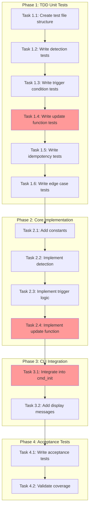

<!-- markdownlint-disable-file -->
# Task Checklist: AGENTS.md Objective Template Reference Update

## Overview

Enhance `teambot init` to update existing AGENTS.md files with a reference to the SDD objective template when the template is copied, ensuring idempotent and content-preserving behavior.

## Objectives

* Detect when AGENTS.md exists but was skipped AND sdd-objective-template.md was copied
* Append "Objective Template" section to existing AGENTS.md without duplicating
* Preserve all existing AGENTS.md content exactly
* Display appropriate user feedback messages
* Achieve 95% test coverage for core update function

## Research Summary

### Project Files
* `src/teambot/cli.py` (Lines 386-457) - `cmd_init()` function, integration point after scaffold loop
* `src/teambot/scaffolds.py` (Lines 11-17) - `CopyResult` namedtuple definition
* `tests/test_scaffolds.py` - Existing scaffold test patterns with `tmp_path` fixtures
* `tests/test_init_scaffolds_acceptance.py` - Acceptance test patterns

### External References
* `.teambot/pseudocode/artifacts/research.md` - Full implementation guidance with code examples
* `.teambot/pseudocode/artifacts/test_strategy.md` - TDD approach with test patterns

## Task Dependency Graph

**Critical Path**: T1.1 → T1.4 → T2.4 → T3.1 → T4.2

## Implementation Checklist

### [ ] Phase 1: TDD Unit Tests (Test-First per Strategy)

**Phase Objective**: Create failing tests that define expected behavior before implementation

**Test Strategy**: TDD - See `.teambot/pseudocode/artifacts/test_strategy.md`

* [ ] Task 1.1: Create unit test file structure
  * Details: .agent-tracking/details/20260223-agents-md-update-details.md (Lines 18-35)
  * Dependencies: None
  * Priority: CRITICAL

* [ ] Task 1.2: Write `_agents_md_has_template_reference()` tests
  * Details: .agent-tracking/details/20260223-agents-md-update-details.md (Lines 37-60)
  * Dependencies: Task 1.1
  * Priority: CRITICAL

* [ ] Task 1.3: Write `_should_update_agents_md()` tests
  * Details: .agent-tracking/details/20260223-agents-md-update-details.md (Lines 62-88)
  * Dependencies: Task 1.2
  * Priority: HIGH

* [ ] Task 1.4: Write `_update_agents_md_with_template_reference()` tests
  * Details: .agent-tracking/details/20260223-agents-md-update-details.md (Lines 90-125)
  * Dependencies: Task 1.3
  * Priority: CRITICAL

* [ ] Task 1.5: Write idempotency tests
  * Details: .agent-tracking/details/20260223-agents-md-update-details.md (Lines 127-145)
  * Dependencies: Task 1.4
  * Priority: CRITICAL

* [ ] Task 1.6: Write edge case tests
  * Details: .agent-tracking/details/20260223-agents-md-update-details.md (Lines 147-175)
  * Dependencies: Task 1.5
  * Priority: MEDIUM

### Phase Gate: Phase 1 Complete When
- [ ] All Phase 1 tasks marked complete
- [ ] Test file exists at `tests/test_agents_md_update.py`
- [ ] All tests fail (no implementation yet)
- [ ] Validation: `uv run pytest tests/test_agents_md_update.py` runs without errors (tests fail is expected)

**Cannot Proceed If**: Test file doesn't exist or has syntax errors

---

### [ ] Phase 2: Core Implementation

**Phase Objective**: Implement helper functions to pass all unit tests

* [ ] Task 2.1: Add constants for section content and marker
  * Details: .agent-tracking/details/20260223-agents-md-update-details.md (Lines 180-205)
  * Dependencies: Phase 1 completion
  * Priority: HIGH

* [ ] Task 2.2: Implement `_agents_md_has_template_reference()` function
  * Details: .agent-tracking/details/20260223-agents-md-update-details.md (Lines 207-230)
  * Dependencies: Task 2.1
  * Priority: CRITICAL

* [ ] Task 2.3: Implement `_should_update_agents_md()` function
  * Details: .agent-tracking/details/20260223-agents-md-update-details.md (Lines 232-265)
  * Dependencies: Task 2.2
  * Priority: HIGH

* [ ] Task 2.4: Implement `_update_agents_md_with_template_reference()` function
  * Details: .agent-tracking/details/20260223-agents-md-update-details.md (Lines 267-310)
  * Dependencies: Task 2.3
  * Priority: CRITICAL

### Phase Gate: Phase 2 Complete When
- [ ] All Phase 2 tasks marked complete
- [ ] All unit tests pass: `uv run pytest tests/test_agents_md_update.py -v`
- [ ] Coverage meets target: `uv run pytest tests/test_agents_md_update.py --cov=src/teambot/cli --cov-report=term-missing`

**Cannot Proceed If**: Any unit test failing

---

### [ ] Phase 3: CLI Integration

**Phase Objective**: Integrate update function into `cmd_init()` with user feedback

* [ ] Task 3.1: Integrate `_update_agents_md_with_template_reference()` into `cmd_init()`
  * Details: .agent-tracking/details/20260223-agents-md-update-details.md (Lines 315-345)
  * Dependencies: Phase 2 completion
  * Priority: HIGH

* [ ] Task 3.2: Add display messages for update/skip scenarios
  * Details: .agent-tracking/details/20260223-agents-md-update-details.md (Lines 347-375)
  * Dependencies: Task 3.1
  * Priority: MEDIUM

### Phase Gate: Phase 3 Complete When
- [ ] All Phase 3 tasks marked complete
- [ ] `cmd_init()` calls update function after scaffold loop
- [ ] Existing tests still pass: `uv run pytest tests/test_cli.py -v`

**Cannot Proceed If**: Existing CLI tests fail

---

### [ ] Phase 4: Acceptance Tests and Validation

**Phase Objective**: Validate end-to-end behavior with acceptance tests

* [ ] Task 4.1: Write acceptance tests for AGENTS.md update scenarios
  * Details: .agent-tracking/details/20260223-agents-md-update-details.md (Lines 380-430)
  * Dependencies: Phase 3 completion
  * Priority: HIGH
  * Test Approach: Code-First (integration validation)
  * Coverage Target: 90%

* [ ] Task 4.2: Validate overall test coverage and quality
  * Details: .agent-tracking/details/20260223-agents-md-update-details.md (Lines 432-455)
  * Dependencies: Task 4.1
  * Priority: HIGH

### Phase Gate: Phase 4 Complete When
- [ ] All Phase 4 tasks marked complete
- [ ] All tests pass: `uv run pytest -v`
- [ ] Coverage target met: 95% for new code
- [ ] Lint passes: `uv run ruff check . && uv run ruff format --check .`

**Cannot Proceed If**: Coverage below 95% for new functions

---

## Effort Estimation

| Task | Estimated Effort | Complexity | Risk |
|------|-----------------|------------|------|
| Phase 1: TDD Tests | 45 min | MEDIUM | LOW |
| Phase 2: Implementation | 30 min | LOW | MEDIUM |
| Phase 3: Integration | 20 min | LOW | LOW |
| Phase 4: Acceptance | 25 min | LOW | LOW |
| **Total** | ~2 hours | | |

## Dependencies

* pytest 7.4.0+ (existing)
* pytest-cov (existing)
* pytest-mock (existing)
* `tmp_path` pytest fixture for isolated file tests

## Success Criteria

* `teambot init` updates existing AGENTS.md with template reference when conditions met
* No duplicate sections on re-runs (idempotent)
* Existing AGENTS.md content preserved exactly
* All existing tests continue passing
* New code has 95%+ coverage
* Lint checks pass
