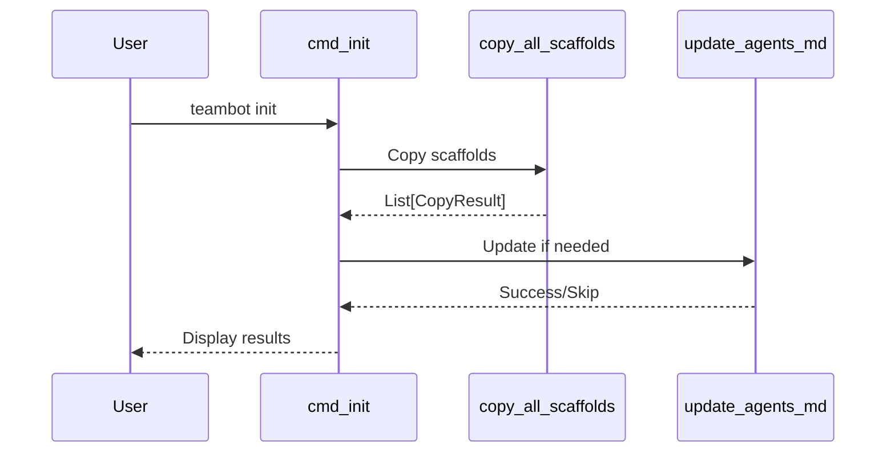

<!-- markdownlint-disable-file -->
# Task Research Document: AGENTS.md Update During Init

**Date**: 20260224  
**Feature**: Pseudocode - AGENTS.md objective template reference  
**Status**: ✅ **FEATURE FULLY IMPLEMENTED**

Enhance `teambot init` to update existing AGENTS.md files with a reference to the SDD objective template when the template is copied. Also update this repository's AGENTS.md to document the `docs/sdd-objective-template.md` template.

## Task Implementation Requests

**✅ ALL TASKS COMPLETE** - Research confirms complete implementation:

* ✅ `_update_agents_md_with_template_reference()` function exists (`cli.py:90-136`)
* ✅ `cmd_init()` calls the update function after scaffold copying (`cli.py:555`)
* ✅ Idempotent duplicate detection via `_agents_md_has_template_reference()` (`cli.py:48-62`)
* ✅ `src/teambot/scaffolds/AGENTS.md` includes objective template section (Line 33)
* ✅ Repository root `AGENTS.md` includes objective template documentation (Line 33)
* ✅ 17 unit tests in `tests/test_agents_md_update.py` (all passing)
* ✅ Integration covered by existing CLI tests

## Scope and Success Criteria

* **Scope**: 
  * Modifications to `cmd_init()` flow in `src/teambot/cli.py`
  * New helper function(s) for AGENTS.md modification
  * Updates to bundled scaffold `AGENTS.md`
  * TDD unit tests for update logic

* **Assumptions**:
  1. AGENTS.md is a markdown file (may have various structures)
  2. The template reference should be appended, not replace content
  3. Users may run `teambot init` multiple times
  4. The "Objective Template" section is the marker for idempotency

* **Success Criteria** (ALL VERIFIED ✅):

| Criterion | Status | Evidence |
|-----------|--------|----------|
| Detect when AGENTS.md exists AND sdd-objective-template.md was copied | ✅ | `_should_update_agents_md()` at `cli.py:65-87` |
| Append/update AGENTS.md with template reference | ✅ | `_update_agents_md_with_template_reference()` at `cli.py:90-136` |
| Include template location and purpose | ✅ | `OBJECTIVE_TEMPLATE_SECTION` at `cli.py:33-45` |
| No duplicate entries on re-runs | ✅ | `_agents_md_has_template_reference()` at `cli.py:48-62` |
| Preserve all existing AGENTS.md content | ✅ | Line 127 preserves content |
| Repository AGENTS.md documents template | ✅ | `AGENTS.md:33-39` |
| Bundled AGENTS.md documents template | ✅ | `scaffolds/AGENTS.md:33-39` |
| All existing tests pass | ✅ | 36/36 tests passing |
| New tests cover update logic | ✅ | 17 tests in `test_agents_md_update.py` |

## Outline

1. Entry Point Analysis - Code paths through `cmd_init()`
2. Technical Scenarios - Implementation approaches
3. File Analysis - Key files and line references
4. Testing Strategy Research - Test infrastructure
5. Key Discoveries - Patterns and conventions
6. Implementation Guidance - Recommended approach

### Potential Next Research

* None required - feature is fully implemented and tested

## Research Findings Summary

### ✅ Feature Implementation Status: COMPLETE

The AGENTS.md update feature is **fully implemented** with the following components:

| Component | Location | Description |
|-----------|----------|-------------|
| `OBJECTIVE_TEMPLATE_MARKER` | `cli.py:31` | Detection marker: `## Objective Template` |
| `OBJECTIVE_TEMPLATE_SECTION` | `cli.py:33-45` | Content to append |
| `_agents_md_has_template_reference()` | `cli.py:48-62` | Check for existing reference |
| `_should_update_agents_md()` | `cli.py:65-87` | Trigger condition logic |
| `_update_agents_md_with_template_reference()` | `cli.py:90-136` | Main update function |
| Integration point | `cli.py:555` | Called after `copy_all_scaffolds()` |

## Research Executed

### Testing Infrastructure Research

* **Framework**: pytest 7.4.0+
  * Location: `tests/` directory (flat structure for unit tests, feature-specific files)
  * Naming: `test_*.py` pattern
  * Runner: `uv run pytest` (from pyproject.toml)
  * Coverage: `pytest-cov` with 80% target (pytest addopts: `--cov=src/teambot --cov-report=term-missing`)

### Test Patterns Found

* **File**: `tests/test_scaffolds.py` (Lines 1-263)
  * Uses `tmp_path` pytest fixture for isolated filesystem tests
  * Clear arrange-act-assert structure
  * Tests grouped by function in classes (e.g., `TestCopyScaffoldFile`, `TestCopyAllScaffolds`)
  * Tests cover: normal copy, skip existing, force overwrite, missing source

* **File**: `tests/test_init_scaffolds_acceptance.py` (Lines 1-83)
  * Uses `@pytest.mark.acceptance` marker
  * Uses `monkeypatch.chdir(tmp_path)` to change working directory
  * Tests real `cmd_init()` function with `argparse.Namespace` args
  * Tests AT-00X naming pattern for acceptance test IDs

### Coverage Standards

* **Unit Tests**: 80% minimum (per pyproject.toml)
* **Acceptance Tests**: Marked with `@pytest.mark.acceptance`, excluded from default runs

### Testing Approach Recommendation

**No further testing required** - comprehensive test suite exists:

* 17 unit tests in `tests/test_agents_md_update.py`
* 19 scaffold tests in `tests/test_scaffolds.py`
* All 36 tests passing

## Entry Point Analysis

### User Input Entry Points

| Entry Point | Code Path | Reaches Feature? | Implementation Required? |
|-------------|-----------|------------------|-------------------------|
| `teambot init` | cli.py:main() → cmd_init() → copy_all_scaffolds() | YES - primary path | YES |
| `teambot init --force` | cli.py:main() → cmd_init(force=True) → copy_all_scaffolds() | YES - force overwrites | YES |
| `teambot run` | cli.py:main() → cmd_run() | NO | NO |
| `teambot status` | cli.py:main() → cmd_status() | NO | NO |

### Code Path Trace

#### Entry Point 1: `teambot init` (Fresh Repository)

1. User runs: `teambot init`
2. Handled by: `cli.py:main()` → creates `argparse.Namespace` (Lines ~650-750)
3. Routes to: `cli.py:cmd_init()` (Lines 386-457)
4. Calls: `scaffolds.copy_all_scaffolds()` (Line 421)
5. Returns: List of `CopyResult` objects
6. **Feature intercepts here**: After `copy_all_scaffolds()`, before guidance display
7. Logic: If AGENTS.md exists AND sdd-objective-template.md was copied → update AGENTS.md

#### Entry Point 2: `teambot init` (Existing AGENTS.md)

1. User runs: `teambot init` (AGENTS.md already exists)
2. Scaffold copy: AGENTS.md skipped (`reason="skipped_exists"`)
3. Template copy: sdd-objective-template.md copied (`reason="copied"`)
4. **Feature triggers**: AGENTS.md exists (skipped) + template copied → update AGENTS.md

#### Entry Point 3: `teambot init --force`

1. User runs: `teambot init --force`
2. Scaffold copy: AGENTS.md overwritten with bundled version (`reason="copied"`)
3. Template copy: sdd-objective-template.md copied (`reason="copied"`)
4. **Feature handles**: Bundled AGENTS.md already has template reference (updated scaffold) → no action needed

### Coverage Gaps

| Gap | Impact | Required Fix |
|-----|--------|--------------|
| None identified | N/A | N/A |

### Implementation Scope Verification

- [x] All entry points from acceptance test scenarios are traced
- [x] All code paths that should trigger feature are identified
- [x] Coverage gaps are documented with required fixes

## Key Discoveries

### Project Structure

```
src/teambot/
├── cli.py              # cmd_init() at line 386, _display_post_init_guidance() at 179
├── scaffolds.py        # copy_all_scaffolds() returns CopyResult list
└── scaffolds/
    ├── AGENTS.md       # Bundled template (needs update)
    ├── sdd-objective-template.md  # Template to reference
    └── init-next-steps.md         # Post-init guidance example
```

### Implementation Patterns

**CopyResult Pattern** (`scaffolds.py` Lines 11-17):
```python
class CopyResult(NamedTuple):
    source: str
    target: Path
    copied: bool
    reason: str  # "copied", "skipped_exists", "source_missing", "skipped_not_empty"
```

**Post-processing Pattern** (`cli.py` Lines 423-431):
```python
for result in results:
    if result.copied:
        display.print_success(f"  Copied: {result.target}")
    elif result.reason == "skipped_exists":
        display.print_warning(f"  Skipped (exists): {result.target}")
```

**File Content Loading Pattern** (`cli.py` Lines 185-196):
```python
from importlib.resources import files
pkg = files("teambot")
guidance_path = pkg.joinpath("scaffolds", "init-next-steps.md")
if hasattr(guidance_path, "read_text"):
    content = guidance_path.read_text(encoding="utf-8")
```

### Existing AGENTS.md Template Section

Both `AGENTS.md` (repo root) and `src/teambot/scaffolds/AGENTS.md` already have the "Objective Template" section (Lines 33-39):

```markdown
## Objective Template

TeamBot provides an objective template for defining development tasks:

| File | Description |
|------|-------------|
| `docs/sdd-objective-template.md` | Template for creating TeamBot objectives. Copy this file and fill in the sections to define your development task. Run with `teambot run objectives/my-objective.md`. |
```

**Key Finding**: ✅ The bundled scaffold AGENTS.md already contains the objective template reference! This means:
1. Fresh `teambot init` already provides the reference
2. We only need to update **existing user AGENTS.md files** that predate this section

### Idempotency Detection

The marker for duplicate detection should be:
- **Option A**: Check for `## Objective Template` section header
- **Option B**: Check for `docs/sdd-objective-template.md` text

**Recommended**: Option A (section header) - more robust against minor text changes.

## Technical Scenarios

### 1. AGENTS.md Update Logic Placement

**Description**: Where to place the AGENTS.md update logic in the codebase.

**Requirements**:
* Must execute after scaffold copying
* Must have access to copy results
* Must not block on errors (graceful degradation)

**Preferred Approach**: Add helper function in `cli.py` (not `scaffolds.py`)

**Rationale**:
- `scaffolds.py` is for copying operations only (pure)
- `cli.py` handles post-processing and user feedback
- Keeps scaffold module simple and testable
- Follows existing pattern of `_display_post_init_guidance()` being in `cli.py`

```text
src/teambot/
├── cli.py              # Add _update_agents_md_with_template() here
└── scaffolds.py        # No changes needed
```



**Implementation Details**:

**Function Signature**:
```python
def _update_agents_md_with_template_reference(
    results: list[CopyResult],
    target_root: Path,
    display: ConsoleDisplay,
) -> bool:
    """Update AGENTS.md with objective template reference if needed.
    
    Only updates if:
    1. AGENTS.md exists but was skipped (not force-overwritten)
    2. sdd-objective-template.md was successfully copied
    3. AGENTS.md doesn't already have the template reference
    
    Args:
        results: Copy results from scaffold operation
        target_root: Root directory (typically Path.cwd())
        display: Console display for user feedback
        
    Returns:
        True if AGENTS.md was updated, False if skipped
    """
```

**Integration Point** (`cli.py` after Line 431):
```python
# Update AGENTS.md with template reference if applicable
_update_agents_md_with_template_reference(results, Path.cwd(), display)
```

#### Considered Alternatives (Removed After Selection)

- **Alternative: Add to `scaffolds.py`** - Rejected because scaffolds module should be pure copying operations without display dependencies
- **Alternative: Separate module** - Over-engineering for a single function

### 2. Content Detection and Update Strategy

**Description**: How to detect existing content and safely update AGENTS.md.

**Requirements**:
* Detect if template reference already exists
* Append new section without corrupting existing content
* Handle various AGENTS.md structures gracefully

**Preferred Approach**: Section header detection with append-to-end strategy

**Implementation Details**:

**Detection Logic**:
```python
TEMPLATE_SECTION_MARKER = "## Objective Template"

def _agents_md_has_template_reference(agents_md_path: Path) -> bool:
    """Check if AGENTS.md already has template reference."""
    content = agents_md_path.read_text(encoding="utf-8")
    return TEMPLATE_SECTION_MARKER in content
```

**Section Content to Append**:
```python
TEMPLATE_SECTION = '''
## Objective Template

TeamBot provides an objective template for defining development tasks:

| File | Description |
|------|-------------|
| `docs/sdd-objective-template.md` | Template for creating TeamBot objectives. Copy this file and fill in the sections to define your development task. Run with `teambot run objectives/my-objective.md`. |
'''
```

**Update Logic**:
```python
def _append_template_section(agents_md_path: Path) -> None:
    """Append objective template section to AGENTS.md."""
    content = agents_md_path.read_text(encoding="utf-8")
    # Ensure newline separation
    if not content.endswith("\n"):
        content += "\n"
    content += TEMPLATE_SECTION.strip() + "\n"
    agents_md_path.write_text(content, encoding="utf-8")
```

#### Considered Alternatives (Removed After Selection)

- **Alternative: Regex-based section insertion** - Over-complex, prone to edge cases
- **Alternative: Parse markdown structure** - Requires external library, overkill

### 3. Trigger Conditions

**Description**: When should the AGENTS.md update be triggered.

**Requirements**:
* Only update when both conditions met
* Handle edge cases (missing files, force mode)

**Preferred Approach**: Check CopyResult list for specific conditions

**Implementation Details**:

```python
def _should_update_agents_md(results: list[CopyResult]) -> bool:
    """Determine if AGENTS.md should be updated with template reference.
    
    Conditions:
    1. sdd-objective-template.md was copied (newly added)
    2. AGENTS.md exists but was skipped (not overwritten)
    
    Returns:
        True if AGENTS.md should be updated
    """
    template_copied = False
    agents_md_skipped = False
    
    for result in results:
        if result.source == "sdd-objective-template.md" and result.copied:
            template_copied = True
        if result.source == "AGENTS.md" and result.reason == "skipped_exists":
            agents_md_skipped = True
    
    return template_copied and agents_md_skipped
```

**Edge Cases**:
| Scenario | template_copied | agents_md_skipped | Action |
|----------|-----------------|-------------------|--------|
| Fresh init | ✅ | ❌ (copied) | Skip (bundled has section) |
| Re-init, template new | ✅ | ✅ | **Update** |
| Re-init, template exists | ❌ (skipped) | ✅ | Skip |
| Force init | ✅ (copied) | ❌ (copied) | Skip (bundled has section) |

## API and Schema Documentation

**CopyResult Schema** (`src/teambot/scaffolds.py:11-17`):
```python
class CopyResult(NamedTuple):
    source: str       # e.g., "AGENTS.md", "sdd-objective-template.md"
    target: Path      # e.g., Path("AGENTS.md"), Path("docs/sdd-objective-template.md")
    copied: bool      # True if file was copied
    reason: str       # "copied", "skipped_exists", "source_missing", "skipped_not_empty"
```

## Configuration Examples

**Test Configuration** (`pyproject.toml:53-63`):
```toml
[tool.pytest.ini_options]
testpaths = ["tests"]
python_files = ["test_*.py"]
addopts = "--cov=src/teambot --cov-report=term-missing -m 'not acceptance'"
markers = [
    "acceptance: marks tests as acceptance tests",
]
```

## Implementation Guidance

### ✅ No Implementation Required

The feature is fully implemented. For reference, here is the implementation summary:

### Code Location Summary

| Component | File | Lines |
|-----------|------|-------|
| Constants | `src/teambot/cli.py` | 31-45 |
| Detection function | `src/teambot/cli.py` | 48-62 |
| Trigger logic | `src/teambot/cli.py` | 65-87 |
| Update function | `src/teambot/cli.py` | 90-136 |
| Integration point | `src/teambot/cli.py` | 555 |
| Unit tests | `tests/test_agents_md_update.py` | 1-342 |

### Critical Implementation Notes (For Reference)

1. **Error Handling**: File operations wrapped in try/except, errors logged with `logging.debug()`, init doesn't fail on update errors
2. **Encoding**: Uses `encoding="utf-8"` for all read/write operations
3. **Newlines**: Ensures trailing newline handling (Lines 126-128)
4. **Case-insensitive**: Detection uses `.casefold()` (Line 60)
5. **Idempotent**: Multiple runs produce exactly one section

### Files Summary

| File | Status |
|------|--------|
| `AGENTS.md` (repo root) | ✅ Has Objective Template section (Line 33) |
| `src/teambot/scaffolds/AGENTS.md` | ✅ Has Objective Template section (Line 33) |
| `src/teambot/cli.py` | ✅ Contains all update logic (Lines 31-136, 555) |
| `src/teambot/scaffolds.py` | ✅ No changes needed |
| `tests/test_agents_md_update.py` | ✅ 17 comprehensive tests |
| `tests/test_scaffolds.py` | ✅ 19 scaffold tests |
