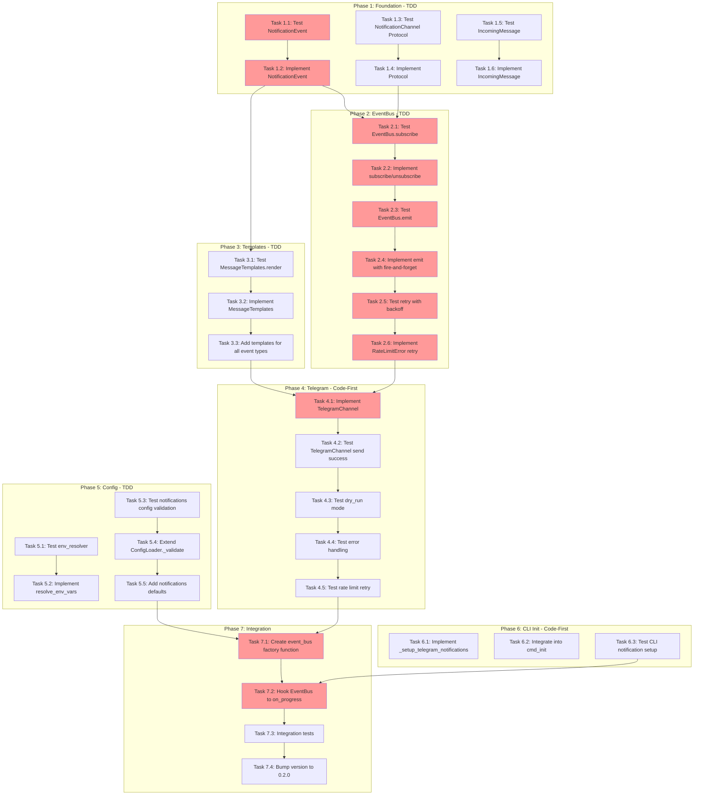

<!-- markdownlint-disable-file -->
# Implementation Plan: Real-Time Notification System

**Date**: 2026-02-11  
**Feature**: Real-Time Notifications via Telegram  
**Version**: 0.1.0 → 0.2.0  
**Research Reference**: [.agent-tracking/research/20260211-realtime-notifications-research.md](../../../.agent-tracking/research/20260211-realtime-notifications-research.md)  
**Test Strategy Reference**: [.agent-tracking/test-strategies/20260211-realtime-notifications-test-strategy.md](../../../.agent-tracking/test-strategies/20260211-realtime-notifications-test-strategy.md)

---

## Overview

Implement a pluggable notification system that sends rich-text formatted messages to Telegram when workflow stages complete, agents finish tasks, or errors occur. The system uses an `EventBus` to decouple orchestration events from notification delivery, supporting future channel additions without modifying core code.

---

## Objectives

1. Define `NotificationChannel` protocol with `send()`, `format()`, `supports_event()`, `poll()` methods
2. Implement `EventBus` with subscribe/unsubscribe semantics and non-blocking emit
3. Create `TelegramChannel` with outbound-only HTTP, graceful failure handling, exponential backoff
4. Add rich-text message templates for 11+ event types
5. Extend `teambot.json` schema with `notifications` section and env var substitution
6. Enhance `teambot init` with optional Telegram setup flow
7. Achieve 90%+ test coverage for new code using Hybrid TDD/Code-First approach

---

## Task Dependency Graph



**Critical Path**: T1.1 → T1.2 → T2.1 → T2.2 → T2.3 → T2.4 → T2.5 → T2.6 → T4.1 → T7.1 → T7.2

**Parallel Opportunities**:
- Phase 3 (Templates) can run parallel to Phase 2 (EventBus) after T1.2 completes
- Phase 5 (Config) can run independently of Phases 2-4
- Phase 6 (CLI Init) can run in parallel with Phase 4 and Phase 5

---

## Implementation Checklist

### Phase 1: Foundation - Protocol & Data Structures (TDD)

> **Approach**: TDD - Write tests first, then implement minimal code to pass

- [ ] **Task 1.1**: Write tests for `NotificationEvent` dataclass
  - [ ] Test creating event with required fields (event_type, data)
  - [ ] Test optional fields (stage, agent, duration, success, artifacts, summary)
  - [ ] Test default timestamp generation
  - [ ] See details: Phase 1, Task 1.1 (Lines 1-30 of details)

- [ ] **Task 1.2**: Implement `NotificationEvent` dataclass
  - [ ] Create `src/teambot/notifications/__init__.py`
  - [ ] Create `src/teambot/notifications/events.py`
  - [ ] Define dataclass with all fields from research (Lines 231-254)
  - [ ] Verify all tests pass

- [ ] **Task 1.3**: Write tests for `NotificationChannel` protocol
  - [ ] Test that mock class satisfies Protocol with `isinstance()`
  - [ ] Test `@runtime_checkable` decorator works
  - [ ] Test partial implementation fails isinstance check
  - [ ] See details: Phase 1, Task 1.3 (Lines 31-60 of details)

- [ ] **Task 1.4**: Implement `NotificationChannel` protocol
  - [ ] Create `src/teambot/notifications/protocol.py`
  - [ ] Define Protocol with properties: `name`, `enabled`
  - [ ] Define methods: `send()`, `format()`, `supports_event()`, `poll()`
  - [ ] Add `@runtime_checkable` decorator
  - [ ] Research reference: Lines 192-229

- [ ] **Task 1.5**: Write tests for `IncomingMessage` dataclass
  - [ ] Test creating message with required fields
  - [ ] Test optional metadata field

- [ ] **Task 1.6**: Implement `IncomingMessage` dataclass
  - [ ] Add to `src/teambot/notifications/events.py`
  - [ ] Research reference: Lines 256-265

### Phase Gate: Phase 1 Complete When
- [ ] All Phase 1 tasks marked complete
- [ ] All 6+ unit tests pass
- [ ] No blocking dependencies for Phase 2
- [ ] Validation: `uv run pytest tests/test_notifications/test_events.py tests/test_notifications/test_protocol.py -v`
- [ ] Artifacts: `events.py`, `protocol.py`, test files

**Cannot Proceed If**: Protocol tests fail or dataclass structure doesn't match research specification

---

### Phase 2: EventBus Implementation (TDD)

> **Approach**: TDD - Write tests first for each behavior

- [ ] **Task 2.1**: Write tests for `EventBus.subscribe()` and `unsubscribe()`
  - [ ] Test subscribe adds channel to internal list
  - [ ] Test unsubscribe removes channel by name
  - [ ] Test subscribing same channel twice
  - [ ] See details: Phase 2, Task 2.1 (Lines 61-90 of details)

- [ ] **Task 2.2**: Implement `subscribe()` and `unsubscribe()`
  - [ ] Create `src/teambot/notifications/event_bus.py`
  - [ ] Implement methods per research (Lines 306-322)

- [ ] **Task 2.3**: Write tests for `EventBus.emit()`
  - [ ] Test emit calls `channel.send()` on subscribed channels
  - [ ] Test emit skips disabled channels
  - [ ] Test emit skips channels that don't support event type
  - [ ] Test emit returns immediately (non-blocking)
  - [ ] See details: Phase 2, Task 2.3 (Lines 91-130 of details)

- [ ] **Task 2.4**: Implement `emit()` with fire-and-forget
  - [ ] Use `asyncio.create_task()` for non-blocking sends
  - [ ] Gather results and log failures
  - [ ] Research reference: Lines 324-340

- [ ] **Task 2.5**: Write tests for retry with exponential backoff
  - [ ] Test RateLimitError triggers retry
  - [ ] Test delay doubles each attempt (1s, 2s, 4s)
  - [ ] Test max retries exceeded logs error, returns False
  - [ ] See details: Phase 2, Task 2.5 (Lines 131-170 of details)

- [ ] **Task 2.6**: Implement `RateLimitError` and retry logic
  - [ ] Create `RateLimitError` exception class
  - [ ] Implement `_send_with_retry()` with exponential backoff
  - [ ] Research reference: Lines 342-365

### Phase Gate: Phase 2 Complete When
- [ ] All Phase 2 tasks marked complete
- [ ] EventBus.emit() is confirmed non-blocking (<1ms return)
- [ ] Retry logic tested with mock delays
- [ ] Validation: `uv run pytest tests/test_notifications/test_event_bus.py -v`
- [ ] Artifacts: `event_bus.py`, test files

**Cannot Proceed If**: emit() blocks on channel.send() or retry logic fails

---

### Phase 3: Message Templates (TDD)

> **Approach**: TDD - Test-driven template rendering

- [ ] **Task 3.1**: Write tests for `MessageTemplates.render()`
  - [ ] Test render stage_changed template with data substitution
  - [ ] Test fallback for unknown event type
  - [ ] Test emoji conditional logic (success/failure indicators)
  - [ ] Test missing data key uses fallback template
  - [ ] See details: Phase 3, Task 3.1 (Lines 171-210 of details)

- [ ] **Task 3.2**: Implement `MessageTemplates` class
  - [ ] Create `src/teambot/notifications/templates.py`
  - [ ] Define `TEMPLATES` dict with HTML templates
  - [ ] Implement `render()` method with context building
  - [ ] Research reference: Lines 560-638

- [ ] **Task 3.3**: Add templates for all 11 notification event types
  - [ ] stage_changed, agent_complete, agent_failed
  - [ ] parallel_stage_start, parallel_stage_complete, parallel_stage_failed
  - [ ] parallel_group_complete, review_progress
  - [ ] acceptance_test_stage_complete, acceptance_test_max_iterations_reached
  - [ ] Default fallback template

### Phase Gate: Phase 3 Complete When
- [ ] All Phase 3 tasks marked complete
- [ ] All 11 event types have templates
- [ ] Emoji logic works for success/failure states
- [ ] Validation: `uv run pytest tests/test_notifications/test_templates.py -v`
- [ ] Artifacts: `templates.py`, test files

**Cannot Proceed If**: Template rendering fails or produces malformed HTML

---

### Phase 4: Telegram Channel (Code-First)

> **Approach**: Code-First - Implement then add tests with mocked httpx

- [ ] **Task 4.1**: Implement `TelegramChannel` class
  - [ ] Create `src/teambot/notifications/channels/__init__.py`
  - [ ] Create `src/teambot/notifications/channels/telegram.py`
  - [ ] Implement properties: `name`, `enabled`
  - [ ] Implement `supports_event()`, `format()`, `poll()`
  - [ ] Implement `send()` with httpx.AsyncClient
  - [ ] Research reference: Lines 439-556

- [ ] **Task 4.2**: Write tests for successful send
  - [ ] Mock httpx.AsyncClient.post to return success response
  - [ ] Verify correct API URL and payload
  - [ ] Verify returns True on success
  - [ ] See details: Phase 4, Task 4.2 (Lines 211-240 of details)

- [ ] **Task 4.3**: Write tests for dry_run mode
  - [ ] Test dry_run=True logs message without HTTP call
  - [ ] Verify no httpx requests made
  - [ ] Verify returns True

- [ ] **Task 4.4**: Write tests for error handling
  - [ ] Test HTTP 401 Unauthorized logs critical, returns False
  - [ ] Test HTTP 403 Forbidden logs warning, returns False
  - [ ] Test HTTP 500+ logs error, returns False
  - [ ] Test network timeout logs error, returns False
  - [ ] Test missing credentials returns False without sending

- [ ] **Task 4.5**: Write tests for rate limit handling
  - [ ] Test HTTP 429 raises RateLimitError
  - [ ] Test retry_after extracted from response
  - [ ] Verify RateLimitError message includes retry_after

### Phase Gate: Phase 4 Complete When
- [ ] All Phase 4 tasks marked complete
- [ ] TelegramChannel passes all tests with mocked HTTP
- [ ] dry_run mode fully functional
- [ ] All error responses handled gracefully
- [ ] Validation: `uv run pytest tests/test_notifications/test_telegram.py -v`
- [ ] Artifacts: `channels/telegram.py`, test files

**Cannot Proceed If**: TelegramChannel raises unhandled exceptions or blocks on network errors

---

### Phase 5: Configuration (TDD)

> **Approach**: TDD - Follows existing ConfigLoader pattern

- [ ] **Task 5.1**: Write tests for `resolve_env_vars()`
  - [ ] Test single env var: `${VAR}` → value
  - [ ] Test multiple env vars in one string
  - [ ] Test missing env var resolves to empty string
  - [ ] Test non-string values pass through unchanged
  - [ ] Test nested dict/list resolution
  - [ ] See details: Phase 5, Task 5.1 (Lines 241-280 of details)

- [ ] **Task 5.2**: Implement `resolve_env_vars()` and `resolve_config_secrets()`
  - [ ] Create `src/teambot/config/env_resolver.py`
  - [ ] Implement regex pattern `\$\{([A-Z_][A-Z0-9_]*)\}`
  - [ ] Implement recursive resolution for dicts/lists
  - [ ] Research reference: Lines 669-704

- [ ] **Task 5.3**: Write tests for notifications config validation
  - [ ] Test valid notifications config loads successfully
  - [ ] Test missing `type` field raises ConfigError
  - [ ] Test invalid channel type raises ConfigError
  - [ ] Test invalid events list raises ConfigError
  - [ ] Test dry_run must be boolean
  - [ ] See details: Phase 5, Task 5.3 (Lines 281-320 of details)

- [ ] **Task 5.4**: Extend `ConfigLoader._validate()` for notifications
  - [ ] Add `_validate_notifications()` method
  - [ ] Add `_validate_notification_channel()` method
  - [ ] Call from `_validate()` if 'notifications' in config
  - [ ] Research reference: Lines 706-736

- [ ] **Task 5.5**: Add notifications defaults in `_apply_defaults()`
  - [ ] Default notifications.enabled to false if not present
  - [ ] Default channel.events to full event list
  - [ ] Default channel.dry_run to false

### Phase Gate: Phase 5 Complete When
- [ ] All Phase 5 tasks marked complete
- [ ] Env var resolution works with monkeypatched os.environ in tests
- [ ] Config validation follows existing patterns
- [ ] Validation: `uv run pytest tests/test_config/test_loader.py tests/test_config/test_env_resolver.py -v`
- [ ] Artifacts: `env_resolver.py`, updated `loader.py`, test files

**Cannot Proceed If**: Config validation rejects valid notification configs or accepts invalid ones

---

### Phase 6: CLI Init Enhancement (Code-First)

> **Approach**: Code-First - Interactive I/O is harder to test

- [ ] **Task 6.1**: Implement `_setup_telegram_notifications()` helper
  - [ ] Add to `src/teambot/cli.py` (or new `cli_helpers.py`)
  - [ ] Display setup instructions for @BotFather
  - [ ] Prompt for bot token and chat ID
  - [ ] Add `notifications` section to config dict
  - [ ] Display env var export instructions
  - [ ] Research reference: Lines 740-816

- [ ] **Task 6.2**: Integrate into `cmd_init()`
  - [ ] Add `_should_setup_notifications()` prompt after directory creation
  - [ ] Call `_setup_telegram_notifications()` if user accepts
  - [ ] Ensure config is saved after notification setup

- [ ] **Task 6.3**: Write tests for CLI notification setup
  - [ ] Mock input() to return "n" → no notifications config
  - [ ] Mock input() to return token and chat_id → config written
  - [ ] Verify config structure matches expected schema
  - [ ] See details: Phase 6, Task 6.3 (Lines 321-350 of details)

### Phase Gate: Phase 6 Complete When
- [ ] All Phase 6 tasks marked complete
- [ ] `teambot init` offers notification setup option
- [ ] Skipping setup doesn't add notifications to config
- [ ] Completing setup adds properly formatted config with env var references
- [ ] Validation: `uv run pytest tests/test_cli/test_init_notifications.py -v`
- [ ] Artifacts: Updated `cli.py`, test files

**Cannot Proceed If**: Init flow crashes or writes invalid config

---

### Phase 7: Integration & Finalization

> **Approach**: Integration testing and version bump

- [ ] **Task 7.1**: Create `create_event_bus_from_config()` factory
  - [ ] Create `src/teambot/notifications/factory.py`
  - [ ] Load config, resolve env vars, instantiate channels
  - [ ] Return configured EventBus (or None if notifications disabled)

- [ ] **Task 7.2**: Hook EventBus to `on_progress` callback
  - [ ] Modify `_run_orchestration_async()` in cli.py
  - [ ] Create wrapper callback that emits to EventBus
  - [ ] Ensure emit is non-blocking (create_task)
  - [ ] Handle case where notifications are disabled

- [ ] **Task 7.3**: Write integration tests
  - [ ] Test full flow: config → EventBus → TelegramChannel (mocked)
  - [ ] Test notification failures don't block workflow
  - [ ] Test disabled notifications produce no HTTP requests

- [ ] **Task 7.4**: Version bump and documentation
  - [ ] Update version in `src/teambot/__init__.py`: `0.1.0` → `0.2.0`
  - [ ] Update version in `pyproject.toml` if present
  - [ ] Add `httpx` to dependencies in `pyproject.toml`
  - [ ] Update README with notifications documentation (optional)

### Phase Gate: Phase 7 Complete When
- [ ] All Phase 7 tasks marked complete
- [ ] Full integration test passes
- [ ] Notifications don't block or crash workflows
- [ ] Version bumped to 0.2.0
- [ ] httpx added as dependency
- [ ] Validation: `uv run pytest tests/ -v --cov=src/teambot/notifications --cov-report=term-missing`
- [ ] Artifacts: `factory.py`, updated `cli.py`, updated `__init__.py`, updated `pyproject.toml`

**Cannot Proceed If**: Integration tests fail or coverage below 90% for notifications module

---

## Dependencies

### External Dependencies
| Dependency | Version | Purpose |
|------------|---------|---------|
| httpx | >=0.24.0 | Async HTTP client for Telegram API |

### Internal Dependencies
| Component | Depends On | Required Before |
|-----------|------------|-----------------|
| EventBus | NotificationChannel Protocol, NotificationEvent | Phase 2 |
| TelegramChannel | EventBus (RateLimitError), MessageTemplates, NotificationEvent | Phase 4 |
| CLI Init | Config validation | Phase 6 |
| Integration | All above components | Phase 7 |

---

## File Operations Summary

### Files to Create
| File | Phase |
|------|-------|
| `src/teambot/notifications/__init__.py` | 1 |
| `src/teambot/notifications/events.py` | 1 |
| `src/teambot/notifications/protocol.py` | 1 |
| `src/teambot/notifications/event_bus.py` | 2 |
| `src/teambot/notifications/templates.py` | 3 |
| `src/teambot/notifications/channels/__init__.py` | 4 |
| `src/teambot/notifications/channels/telegram.py` | 4 |
| `src/teambot/config/env_resolver.py` | 5 |
| `src/teambot/notifications/factory.py` | 7 |
| `tests/test_notifications/__init__.py` | 1 |
| `tests/test_notifications/conftest.py` | 1 |
| `tests/test_notifications/test_events.py` | 1 |
| `tests/test_notifications/test_protocol.py` | 1 |
| `tests/test_notifications/test_event_bus.py` | 2 |
| `tests/test_notifications/test_templates.py` | 3 |
| `tests/test_notifications/test_telegram.py` | 4 |
| `tests/test_config/test_env_resolver.py` | 5 |

### Files to Modify
| File | Phase | Changes |
|------|-------|---------|
| `src/teambot/config/loader.py` | 5 | Add `_validate_notifications()` |
| `src/teambot/cli.py` | 6, 7 | Add notification setup, hook EventBus |
| `src/teambot/__init__.py` | 7 | Version bump 0.1.0 → 0.2.0 |
| `pyproject.toml` | 7 | Add httpx dependency, bump version |

---

## Effort Estimation

| Phase | Tasks | Estimated Effort | Complexity | Risk |
|-------|-------|-----------------|------------|------|
| Phase 1: Foundation | 6 | 1-2 hours | LOW | LOW |
| Phase 2: EventBus | 6 | 2-3 hours | MEDIUM | MEDIUM |
| Phase 3: Templates | 3 | 1-2 hours | LOW | LOW |
| Phase 4: Telegram | 5 | 2-3 hours | MEDIUM | MEDIUM |
| Phase 5: Config | 5 | 1-2 hours | LOW | LOW |
| Phase 6: CLI Init | 3 | 1-2 hours | LOW | LOW |
| Phase 7: Integration | 4 | 2-3 hours | MEDIUM | MEDIUM |
| **Total** | **32** | **10-17 hours** | | |

---

## Success Criteria

### Functional Requirements
- [ ] Notifications fire on all 11 specified event types
- [ ] Rich-text formatted messages with emoji, bold, code formatting
- [ ] Telegram API called via outbound HTTP only (no webhooks/polling)
- [ ] Secrets resolved from environment variables, never stored in config files
- [ ] `teambot init` offers optional notification setup
- [ ] dry_run mode logs without sending

### Non-Functional Requirements
- [ ] Notification failures do not block workflow execution
- [ ] Rate limit errors retry with exponential backoff (up to 3 attempts)
- [ ] EventBus.emit() returns in <1ms (non-blocking)
- [ ] 90%+ test coverage for `src/teambot/notifications/`
- [ ] No ports exposed, no inbound connections

### Compatibility Requirements
- [ ] Existing workflow execution unchanged
- [ ] Existing REPL and UI functionality unchanged
- [ ] Existing tests continue to pass

---

## Validation Commands

```bash
# Run all new notification tests
uv run pytest tests/test_notifications/ -v

# Run with coverage
uv run pytest tests/test_notifications/ --cov=src/teambot/notifications --cov-report=term-missing

# Run full test suite to verify no regressions
uv run pytest tests/ -v

# Lint new code
uv run ruff check src/teambot/notifications/ src/teambot/config/env_resolver.py
uv run ruff format src/teambot/notifications/ src/teambot/config/env_resolver.py
```

---

## Risk Mitigation

| Risk | Impact | Mitigation |
|------|--------|------------|
| httpx breaks existing code | HIGH | Add as new dependency, no replacement of existing HTTP clients |
| Telegram API changes | LOW | Well-established API, wrap in channel abstraction |
| Async complexity | MEDIUM | TDD ensures correct behavior, existing async patterns in codebase |
| Credential exposure | HIGH | Never log tokens, resolve at runtime only, use env vars |
| Blocking workflow | CRITICAL | Fire-and-forget emit, all errors caught and logged |

---

## References

- **Research Document**: `.agent-tracking/research/20260211-realtime-notifications-research.md`
- **Test Strategy**: `.agent-tracking/test-strategies/20260211-realtime-notifications-test-strategy.md`
- **Telegram Bot API**: https://core.telegram.org/bots/api
- **httpx Documentation**: https://www.python-httpx.org/
- **Existing Test Patterns**: `tests/test_orchestration/test_progress.py`, `tests/test_config/test_loader.py`
